# AST → Mermaid Flowcharts

## Package Dependencies (overview)

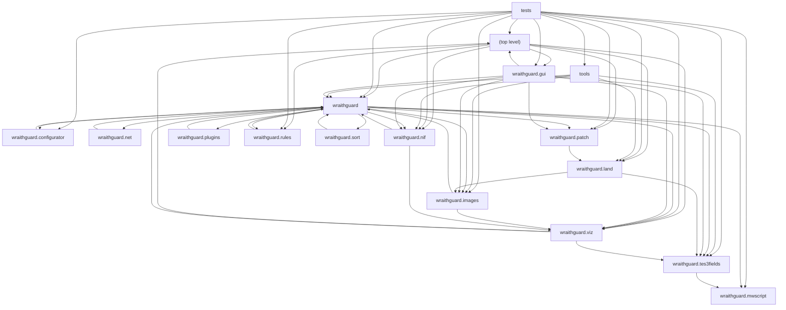

## Module Dependencies — (top level)

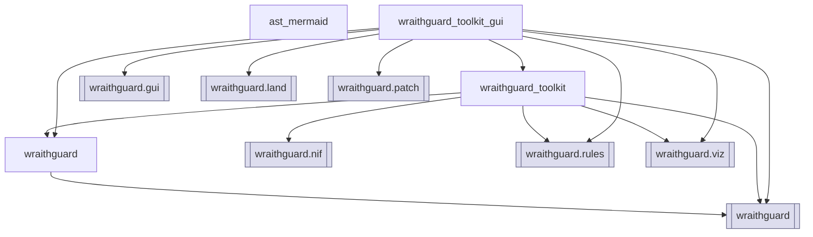

## Module Dependencies — tests


## Module Dependencies — tools

```mermaid
flowchart TD
  n_tools_build_merged_lands["build_merged_lands"]
  n_tools_check_against_tes3["check_against_tes3"]
  n_tools_check_bc7["check_bc7"]
  n_tools_check_bsa["check_bsa"]
  n_tools_check_images["check_images"]
  n_tools_check_nif_layouts["check_nif_layouts"]
  n_tools_check_nif_layouts_collect["check_nif_layouts_collect"]
  n_tools_check_placeholders["check_placeholders"]
  n_tools_check_plugin_roundtrip["check_plugin_roundtrip"]
  n_tools_check_textures["check_textures"]
  n_tools_check_undefined["check_undefined"]
  n_tools_diff_roundtrip_json["diff_roundtrip_json"]
  n_tools_gen_merged_lands_table["gen_merged_lands_table"]
  n_tools_gen_opcodes["gen_opcodes"]
  n_tools_gen_tes3_schema["gen_tes3_schema"]
  n_tools_make_pot["make_pot"]
  n_tools_survey_landscape["survey_landscape"]
  n_PKG_wraithguard_land[["wraithguard.land"]]:::pkglink
  n_tools_build_merged_lands --> n_PKG_wraithguard_land
  n_PKG_wraithguard_tes3fields[["wraithguard.tes3fields"]]:::pkglink
  n_tools_build_merged_lands --> n_PKG_wraithguard_tes3fields
  n_tools_build_merged_lands --> n_tools_check_plugin_roundtrip
  n_tools_build_merged_lands --> n_tools_survey_landscape
  n_PKG_wraithguard_nif[["wraithguard.nif"]]:::pkglink
  n_tools_check_against_tes3 --> n_PKG_wraithguard_nif
  n_PKG_wraithguard[["wraithguard"]]:::pkglink
  n_tools_check_bc7 --> n_PKG_wraithguard
  n_PKG_wraithguard_images[["wraithguard.images"]]:::pkglink
  n_tools_check_bc7 --> n_PKG_wraithguard_images
  n_tools_check_bsa --> n_PKG_wraithguard_nif
  n_tools_check_images --> n_PKG_wraithguard
  n_tools_check_images --> n_PKG_wraithguard_images
  n_tools_check_nif_layouts --> n_PKG_wraithguard
  n_tools_check_nif_layouts --> n_PKG_wraithguard_nif
  n_tools_check_nif_layouts_collect --> n_PKG_wraithguard
  n_tools_check_nif_layouts_collect --> n_PKG_wraithguard_nif
  n_tools_check_textures --> n_PKG_wraithguard
  n_tools_check_textures --> n_PKG_wraithguard_images
  n_tools_check_textures --> n_PKG_wraithguard_nif
  n_tools_diff_roundtrip_json --> n_tools_check_plugin_roundtrip
  n_tools_survey_landscape --> n_PKG_wraithguard_land
  n_tools_survey_landscape --> n_tools_check_plugin_roundtrip
  classDef pkglink fill:#dde,stroke:#668
```

## Module Dependencies — wraithguard

```mermaid
flowchart TD
  n_wraithguard_configurator["configurator"]
  n_wraithguard_gui["gui"]
  n_wraithguard_i18n["i18n"]
  n_wraithguard_images["images"]
  n_wraithguard_land["land"]
  n_wraithguard_logging_setup["logging_setup"]
  n_wraithguard_momw["momw"]
  n_wraithguard_mwscript["mwscript"]
  n_wraithguard_net["net"]
  n_wraithguard_nif["nif"]
  n_wraithguard_patch["patch"]
  n_wraithguard_plugins["plugins"]
  n_wraithguard_rules["rules"]
  n_wraithguard_sort["sort"]
  n_wraithguard_tes3fields["tes3fields"]
  n_wraithguard_tracing["tracing"]
  n_wraithguard_versions["versions"]
  n_wraithguard_viz["viz"]
  n_PKG_wraithguard_configurator[["wraithguard.configurator"]]:::pkglink
  n_wraithguard_configurator --> n_PKG_wraithguard_configurator
  n_wraithguard_gui --> n_wraithguard_tracing
  n_PKG_wraithguard_images[["wraithguard.images"]]:::pkglink
  n_wraithguard_images --> n_PKG_wraithguard_images
  n_PKG_wraithguard_mwscript[["wraithguard.mwscript"]]:::pkglink
  n_wraithguard_mwscript --> n_PKG_wraithguard_mwscript
  n_PKG_wraithguard_net[["wraithguard.net"]]:::pkglink
  n_wraithguard_net --> n_PKG_wraithguard_net
  n_PKG_wraithguard_nif[["wraithguard.nif"]]:::pkglink
  n_wraithguard_nif --> n_PKG_wraithguard_nif
  n_PKG_wraithguard_patch[["wraithguard.patch"]]:::pkglink
  n_wraithguard_patch --> n_PKG_wraithguard_patch
  n_PKG_wraithguard_plugins[["wraithguard.plugins"]]:::pkglink
  n_wraithguard_plugins --> n_PKG_wraithguard_plugins
  n_PKG_wraithguard_rules[["wraithguard.rules"]]:::pkglink
  n_wraithguard_rules --> n_PKG_wraithguard_rules
  n_PKG_wraithguard_sort[["wraithguard.sort"]]:::pkglink
  n_wraithguard_sort --> n_PKG_wraithguard_sort
  n_PKG_wraithguard_tes3fields[["wraithguard.tes3fields"]]:::pkglink
  n_wraithguard_tes3fields --> n_PKG_wraithguard_tes3fields
  n_PKG_wraithguard_viz[["wraithguard.viz"]]:::pkglink
  n_wraithguard_viz --> n_PKG_wraithguard_viz
  classDef pkglink fill:#dde,stroke:#668
```

## Module Dependencies — wraithguard.configurator

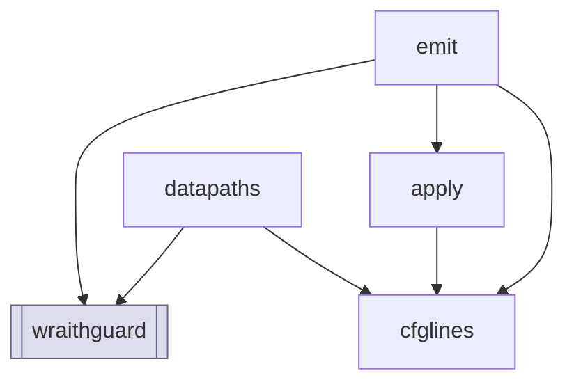

## Module Dependencies — wraithguard.gui

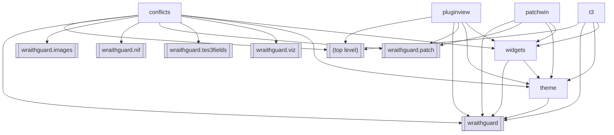

## Module Dependencies — wraithguard.images

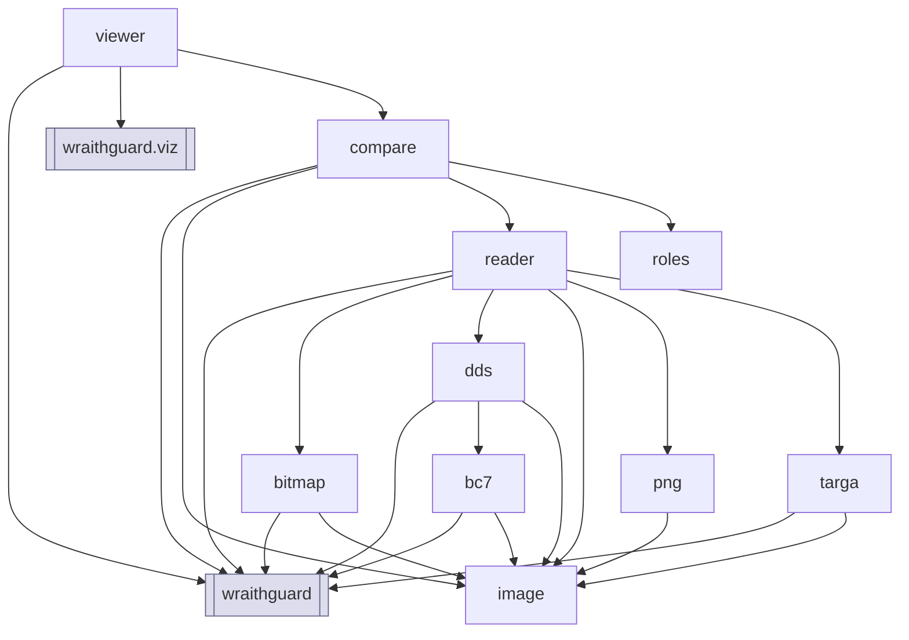

## Module Dependencies — wraithguard.land

```mermaid
flowchart TD
  n_wraithguard_land_cells["cells"]
  n_wraithguard_land_cleaning["cleaning"]
  n_wraithguard_land_conflict_image["conflict_image"]
  n_wraithguard_land_curvature["curvature"]
  n_wraithguard_land_debug_colors["debug_colors"]
  n_wraithguard_land_diff["diff"]
  n_wraithguard_land_emit["emit"]
  n_wraithguard_land_heights["heights"]
  n_wraithguard_land_landmass["landmass"]
  n_wraithguard_land_merge["merge"]
  n_wraithguard_land_meta["meta"]
  n_wraithguard_land_native["native"]
  n_wraithguard_land_pipeline["pipeline"]
  n_wraithguard_land_seams["seams"]
  n_wraithguard_land_service["service"]
  n_wraithguard_land_slope["slope"]
  n_wraithguard_land_textures["textures"]
  n_PKG_wraithguard_images[["wraithguard.images"]]:::pkglink
  n_wraithguard_land_conflict_image --> n_PKG_wraithguard_images
  n_PKG_wraithguard_tes3fields[["wraithguard.tes3fields"]]:::pkglink
  n_wraithguard_land_conflict_image --> n_PKG_wraithguard_tes3fields
  n_wraithguard_land_conflict_image --> n_wraithguard_land_debug_colors
  n_wraithguard_land_conflict_image --> n_wraithguard_land_diff
  n_wraithguard_land_conflict_image --> n_wraithguard_land_merge
  n_wraithguard_land_curvature --> n_PKG_wraithguard_tes3fields
  n_wraithguard_land_debug_colors --> n_PKG_wraithguard_tes3fields
  n_wraithguard_land_debug_colors --> n_wraithguard_land_diff
  n_wraithguard_land_debug_colors --> n_wraithguard_land_merge
  n_wraithguard_land_diff --> n_PKG_wraithguard_tes3fields
  n_wraithguard_land_emit --> n_PKG_wraithguard_tes3fields
  n_wraithguard_land_emit --> n_wraithguard_land_heights
  n_wraithguard_land_emit --> n_wraithguard_land_textures
  n_wraithguard_land_heights --> n_PKG_wraithguard_tes3fields
  n_wraithguard_land_landmass --> n_wraithguard_land_diff
  n_wraithguard_land_landmass --> n_wraithguard_land_textures
  n_wraithguard_land_merge --> n_wraithguard_land_curvature
  n_wraithguard_land_merge --> n_wraithguard_land_diff
  n_wraithguard_land_meta --> n_wraithguard_land_diff
  n_wraithguard_land_meta --> n_wraithguard_land_merge
  n_wraithguard_land_pipeline --> n_PKG_wraithguard_tes3fields
  n_wraithguard_land_pipeline --> n_wraithguard_land_cleaning
  n_wraithguard_land_pipeline --> n_wraithguard_land_diff
  n_wraithguard_land_pipeline --> n_wraithguard_land_heights
  n_wraithguard_land_pipeline --> n_wraithguard_land_landmass
  n_wraithguard_land_pipeline --> n_wraithguard_land_merge
  n_wraithguard_land_pipeline --> n_wraithguard_land_meta
  n_wraithguard_land_pipeline --> n_wraithguard_land_seams
  n_wraithguard_land_pipeline --> n_wraithguard_land_slope
  n_wraithguard_land_pipeline --> n_wraithguard_land_textures
  n_wraithguard_land_seams --> n_PKG_wraithguard_tes3fields
  n_wraithguard_land_service --> n_PKG_wraithguard_tes3fields
  n_wraithguard_land_service --> n_wraithguard_land_cells
  n_wraithguard_land_service --> n_wraithguard_land_emit
  n_wraithguard_land_service --> n_wraithguard_land_landmass
  n_wraithguard_land_service --> n_wraithguard_land_merge
  n_wraithguard_land_service --> n_wraithguard_land_meta
  n_wraithguard_land_service --> n_wraithguard_land_native
  n_wraithguard_land_service --> n_wraithguard_land_pipeline
  n_wraithguard_land_service --> n_wraithguard_land_textures
  n_wraithguard_land_slope --> n_PKG_wraithguard_tes3fields
  n_wraithguard_land_slope --> n_wraithguard_land_curvature
  n_wraithguard_land_textures --> n_wraithguard_land_diff
  classDef pkglink fill:#dde,stroke:#668
```

## Module Dependencies — wraithguard.mwscript

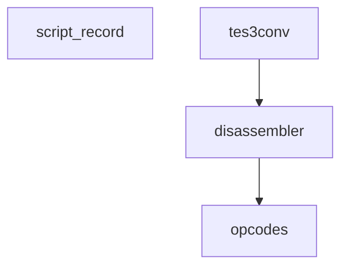

## Module Dependencies — wraithguard.net

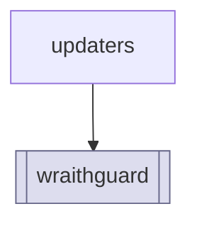

## Module Dependencies — wraithguard.nif

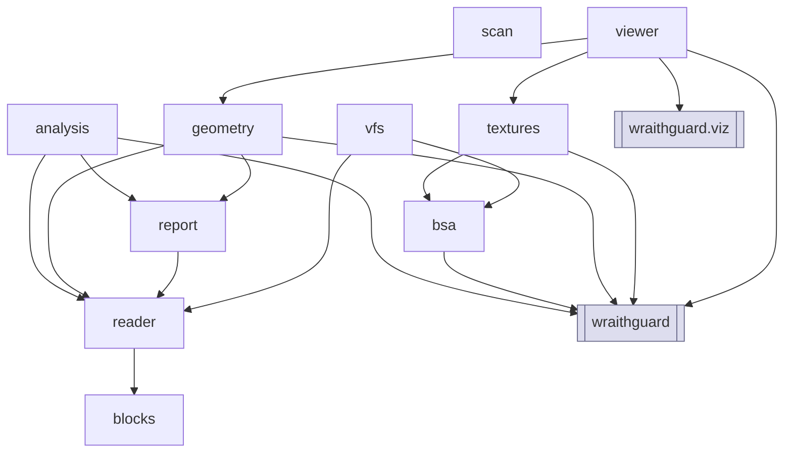

## Module Dependencies — wraithguard.patch

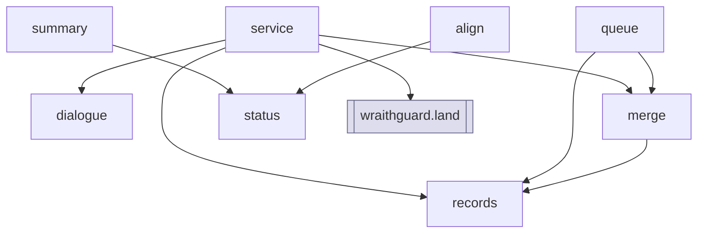

## Module Dependencies — wraithguard.plugins

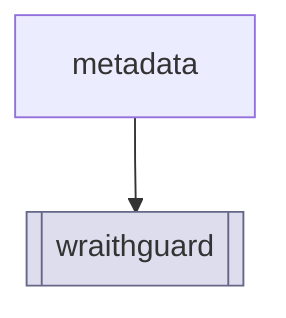

## Module Dependencies — wraithguard.rules

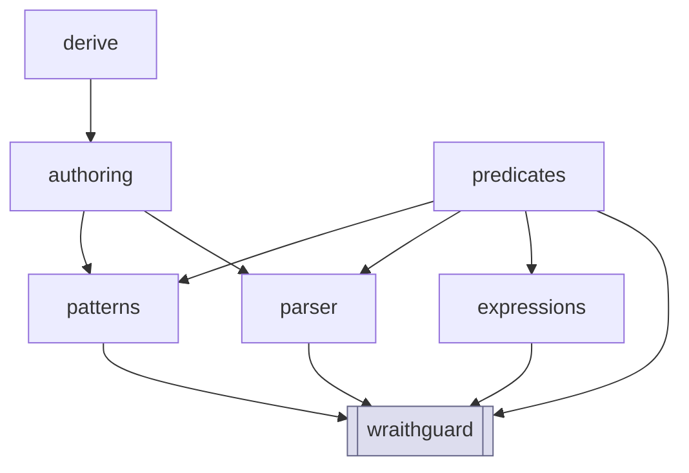

## Module Dependencies — wraithguard.sort

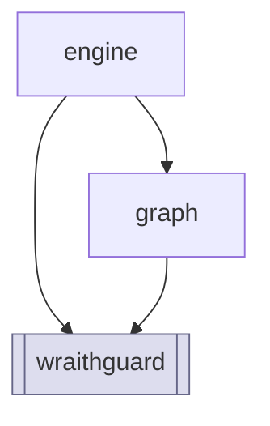

## Module Dependencies — wraithguard.tes3fields

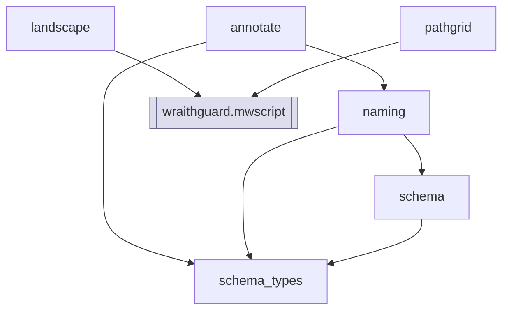

## Module Dependencies — wraithguard.viz

```mermaid
flowchart TD
  n_wraithguard_viz_cellmap["cellmap"]
  n_wraithguard_viz_cellmap_js["cellmap_js"]
  n_wraithguard_viz_conflictmap["conflictmap"]
  n_wraithguard_viz_docs["docs"]
  n_wraithguard_viz_geometry["geometry"]
  n_wraithguard_viz_heightdelta["heightdelta"]
  n_wraithguard_viz_housekeeping["housekeeping"]
  n_wraithguard_viz_html["html"]
  n_wraithguard_viz_library["library"]
  n_wraithguard_viz_palette["palette"]
  n_wraithguard_viz_pathgrid["pathgrid"]
  n_wraithguard_viz_serve["serve"]
  n_wraithguard_viz_terrain3d["terrain3d"]
  n_wraithguard_viz_cellmap --> n_wraithguard_viz_cellmap_js
  n_wraithguard_viz_cellmap --> n_wraithguard_viz_palette
  n_PKG__top_level_[["(top level)"]]:::pkglink
  n_wraithguard_viz_conflictmap --> n_PKG__top_level_
  n_PKG_wraithguard[["wraithguard"]]:::pkglink
  n_wraithguard_viz_conflictmap --> n_PKG_wraithguard
  n_wraithguard_viz_conflictmap --> n_wraithguard_viz_geometry
  n_wraithguard_viz_conflictmap --> n_wraithguard_viz_html
  n_wraithguard_viz_conflictmap --> n_wraithguard_viz_palette
  n_wraithguard_viz_docs --> n_PKG__top_level_
  n_wraithguard_viz_heightdelta --> n_PKG__top_level_
  n_wraithguard_viz_heightdelta --> n_PKG_wraithguard
  n_PKG_wraithguard_tes3fields[["wraithguard.tes3fields"]]:::pkglink
  n_wraithguard_viz_heightdelta --> n_PKG_wraithguard_tes3fields
  n_wraithguard_viz_heightdelta --> n_wraithguard_viz_html
  n_wraithguard_viz_heightdelta --> n_wraithguard_viz_palette
  n_wraithguard_viz_html --> n_PKG__top_level_
  n_wraithguard_viz_library --> n_PKG_wraithguard
  n_wraithguard_viz_pathgrid --> n_PKG__top_level_
  n_wraithguard_viz_pathgrid --> n_PKG_wraithguard
  n_wraithguard_viz_pathgrid --> n_PKG_wraithguard_tes3fields
  n_wraithguard_viz_pathgrid --> n_wraithguard_viz_html
  n_wraithguard_viz_serve --> n_PKG_wraithguard
  n_wraithguard_viz_terrain3d --> n_PKG__top_level_
  n_wraithguard_viz_terrain3d --> n_PKG_wraithguard
  n_wraithguard_viz_terrain3d --> n_PKG_wraithguard_tes3fields
  n_wraithguard_viz_terrain3d --> n_wraithguard_viz_html
  n_wraithguard_viz_terrain3d --> n_wraithguard_viz_palette
  classDef pkglink fill:#dde,stroke:#668
```

## Class Hierarchy — (top level)

```mermaid
flowchart TD
  n_ast_mermaid_CFGBuilder["CFGBuilder"]
  n_ast_mermaid_CallGraphVisitor["CallGraphVisitor"]
  n_wraithguard_toolkit_Tes3ConvSession["Tes3ConvSession"]
  n_wraithguard_toolkit__CellFacts["_CellFacts"]
  n_wraithguard_toolkit_gui_App["App"]
  n_wraithguard_toolkit_gui_DataPathOrderPanel["DataPathOrderPanel"]
  n_wraithguard_toolkit_gui_PluginOrderPanel["PluginOrderPanel"]
  n_wraithguard_toolkit_gui_ReorderPanel["ReorderPanel"]
  n_wraithguard_toolkit_gui_RuleFilesPanel["RuleFilesPanel"]
  n_EXTBASE_ast_NodeVisitor("ast.NodeVisitor"):::external
  n_ast_mermaid_CallGraphVisitor -.->|extends| n_EXTBASE_ast_NodeVisitor
  n_EXTBASE_NamedTuple("NamedTuple"):::external
  n_wraithguard_toolkit__CellFacts -.->|extends| n_EXTBASE_NamedTuple
  n_wraithguard_toolkit_gui_PluginOrderPanel -->|extends| n_wraithguard_toolkit_gui_ReorderPanel
  n_wraithguard_toolkit_gui_DataPathOrderPanel -->|extends| n_wraithguard_toolkit_gui_ReorderPanel
  n_PKGCLS_wraithguard_gui_t3_Tes3cmdMixin[["Tes3cmdMixin (wraithguard.gui.t3)"]]:::pkglink
  n_wraithguard_toolkit_gui_App -.->|extends| n_PKGCLS_wraithguard_gui_t3_Tes3cmdMixin
  n_PKGCLS_wraithguard_gui_conflicts_ConflictWindowsMixin[["ConflictWindowsMixin (wraithguard.gui.conflicts)"]]:::pkglink
  n_wraithguard_toolkit_gui_App -.->|extends| n_PKGCLS_wraithguard_gui_conflicts_ConflictWindowsMixin
  n_PKGCLS_wraithguard_gui_patchwin_PatchBuilderMixin[["PatchBuilderMixin (wraithguard.gui.patchwin)"]]:::pkglink
  n_wraithguard_toolkit_gui_App -.->|extends| n_PKGCLS_wraithguard_gui_patchwin_PatchBuilderMixin
  n_PKGCLS_wraithguard_gui_pluginview_PluginViewMixin[["PluginViewMixin (wraithguard.gui.pluginview)"]]:::pkglink
  n_wraithguard_toolkit_gui_App -.->|extends| n_PKGCLS_wraithguard_gui_pluginview_PluginViewMixin
  classDef external fill:#eee,stroke:#999,stroke-dasharray: 3 3
  classDef pkglink fill:#dde,stroke:#668
```

## Class Hierarchy — tests

```mermaid
flowchart TD
  n_tests_test_batch_fields_Counting["Counting"]
  n_tests_test_batch_fields_Session["Session"]
  n_tests_test_batch_fields_TestEachPluginIsReadOnce["TestEachPluginIsReadOnce"]
  n_tests_test_batch_fields_TestHashingInsteadOfHolding["TestHashingInsteadOfHolding"]
  n_tests_test_batch_fields_TestItAgreesWithTheOneAtATimeReader["TestItAgreesWithTheOneAtATimeReader"]
  n_tests_test_batch_fields_TestProgress["TestProgress"]
  n_tests_test_batch_fields_TestTheLockIsHeldPerPluginNotPerCall["TestTheLockIsHeldPerPluginNotPerCall"]
  n_tests_test_batch_fields_TestWhatItDoesWithGaps["TestWhatItDoesWithGaps"]
  n_tests_test_configurator_TestAmbiguityIsFatal["TestAmbiguityIsFatal"]
  n_tests_test_configurator_TestAppendRouting["TestAppendRouting"]
  n_tests_test_configurator_TestDisableCoversDataPathsToo["TestDisableCoversDataPathsToo"]
  n_tests_test_configurator_TestDisableOnlyRemovesWhatWeDoNotOwn["TestDisableOnlyRemovesWhatWeDoNotOwn"]
  n_tests_test_configurator_TestEmitterHygiene["TestEmitterHygiene"]
  n_tests_test_configurator_TestInsertSemantics["TestInsertSemantics"]
  n_tests_test_configurator_TestRemovalSemantics["TestRemovalSemantics"]
  n_tests_test_configurator_TestRoundTrip["TestRoundTrip"]
  n_tests_test_docs_render_TestBlocks["TestBlocks"]
  n_tests_test_docs_render_TestHelpMenuMatchesWhatShips["TestHelpMenuMatchesWhatShips"]
  n_tests_test_docs_render_TestInline["TestInline"]
  n_tests_test_docs_render_TestPage["TestPage"]
  n_tests_test_docs_render_TestProjectDocuments["TestProjectDocuments"]
  n_tests_test_foundation_Collector["Collector"]
  n_tests_test_foundation_TestConsoleOutput["TestConsoleOutput"]
  n_tests_test_foundation_TestExtraHandlers["TestExtraHandlers"]
  n_tests_test_foundation_TestFileOutput["TestFileOutput"]
  n_tests_test_foundation_TestLogLevels["TestLogLevels"]
  n_tests_test_foundation_TestLoggerNaming["TestLoggerNaming"]
  n_tests_test_foundation_TestTranslation["TestTranslation"]
  n_tests_test_generated_js_TestTheMeshViewerParses["TestTheMeshViewerParses"]
  n_tests_test_generated_js_TestTheTextureComparisonParses["TestTheTextureComparisonParses"]
  n_tests_test_gui_smoke_Refuses["Refuses"]
  n_tests_test_gui_smoke_TestActionButtons["TestActionButtons"]
  n_tests_test_gui_smoke_TestApplicationBuilds["TestApplicationBuilds"]
  n_tests_test_gui_smoke_TestBackupsWindow["TestBackupsWindow"]
  n_tests_test_gui_smoke_TestControlsLayout["TestControlsLayout"]
  n_tests_test_gui_smoke_TestDragAndDropIsOptional["TestDragAndDropIsOptional"]
  n_tests_test_gui_smoke_TestFormatReferenceCoversTheSchema["TestFormatReferenceCoversTheSchema"]
  n_tests_test_gui_smoke_TestHelpMenu["TestHelpMenu"]
  n_tests_test_gui_smoke_TestLogThemes["TestLogThemes"]
  n_tests_test_gui_smoke_TestOptionFields["TestOptionFields"]
  n_tests_test_gui_smoke_TestPacedRecolour["TestPacedRecolour"]
  n_tests_test_gui_smoke_TestResourceWindowMeshDetail["TestResourceWindowMeshDetail"]
  n_tests_test_gui_smoke_TestResourceWindowShowsFindingsWithoutClicking["TestResourceWindowShowsFindingsWithoutClicking"]
  n_tests_test_gui_smoke_TestRuleMakerWindow["TestRuleMakerWindow"]
  n_tests_test_gui_smoke_TestSecondaryWindows["TestSecondaryWindows"]
  n_tests_test_gui_smoke_TestSettingsRoundTrip["TestSettingsRoundTrip"]
  n_tests_test_gui_smoke_TestTheViewerChainUnderstandsUrls["TestTheViewerChainUnderstandsUrls"]
  n_tests_test_gui_smoke_TestThreeDButtonsAreReachable["TestThreeDButtonsAreReachable"]
  n_tests_test_gui_smoke__Tk["_Tk"]
  n_tests_test_hardening_TestBinaryReadersTolerateGarbage["TestBinaryReadersTolerateGarbage"]
  n_tests_test_hardening_TestCfgEncodingRoundTrip["TestCfgEncodingRoundTrip"]
  n_tests_test_hardening_TestCustomizationTypeSafety["TestCustomizationTypeSafety"]
  n_tests_test_hardening_TestDeclaringYourOwnGroundcover["TestDeclaringYourOwnGroundcover"]
  n_tests_test_hardening_TestGroundcoverIsNeverContent["TestGroundcoverIsNeverContent"]
  n_tests_test_hardening_TestPatternMatchingEdgeCases["TestPatternMatchingEdgeCases"]
  n_tests_test_hardening_TestResourceConflictsCompareContents["TestResourceConflictsCompareContents"]
  n_tests_test_hardening_TestResyncNeverCorrupts["TestResyncNeverCorrupts"]
  n_tests_test_hardening_TestScannersTolerateGarbage["TestScannersTolerateGarbage"]
  n_tests_test_hardening_TestSortDegenerateInputs["TestSortDegenerateInputs"]
  n_tests_test_hardening_TestTomlValueEscaping["TestTomlValueEscaping"]
  n_tests_test_i18n_placeholders_TestNegativeControls["TestNegativeControls"]
  n_tests_test_i18n_placeholders_TestPlaceholderParsing["TestPlaceholderParsing"]
  n_tests_test_i18n_placeholders_TestShippedSourcesGate["TestShippedSourcesGate"]
  n_tests_test_i18n_placeholders_TestUserFacingStringsAreMarked["TestUserFacingStringsAreMarked"]
  n_tests_test_image_compare_TestDifferentSizesAreAnAnswer["TestDifferentSizesAreAnAnswer"]
  n_tests_test_image_compare_TestRolesAreCheckedBeforePixels["TestRolesAreCheckedBeforePixels"]
  n_tests_test_image_compare_TestTheCheapAnswersComeFirst["TestTheCheapAnswersComeFirst"]
  n_tests_test_image_compare_TestTheComparisonPage["TestTheComparisonPage"]
  n_tests_test_image_compare_TestTheDifferenceImage["TestTheDifferenceImage"]
  n_tests_test_image_compare_TestTheLitMaterialView["TestTheLitMaterialView"]
  n_tests_test_image_compare_TestTheMetricsAnswerDifferentQuestions["TestTheMetricsAnswerDifferentQuestions"]
  n_tests_test_images_TestBc1["TestBc1"]
  n_tests_test_images_TestBc2AndBc3Alpha["TestBc2AndBc3Alpha"]
  n_tests_test_images_TestBc4AndBc5["TestBc4AndBc5"]
  n_tests_test_images_TestBc7["TestBc7"]
  n_tests_test_images_TestBitmap["TestBitmap"]
  n_tests_test_images_TestBrowserImage["TestBrowserImage"]
  n_tests_test_images_TestFormatDetection["TestFormatDetection"]
  n_tests_test_images_TestPartialBlocks["TestPartialBlocks"]
  n_tests_test_images_TestPng["TestPng"]
  n_tests_test_images_TestRefusalsAreFindings["TestRefusalsAreFindings"]
  n_tests_test_images_TestRemainingRefusals["TestRemainingRefusals"]
  n_tests_test_images_TestTarga["TestTarga"]
  n_tests_test_images_TestTextureRoles["TestTextureRoles"]
  n_tests_test_images_TestTheImageTypeItself["TestTheImageTypeItself"]
  n_tests_test_images_TestUncompressed["TestUncompressed"]
  n_tests_test_integration_TestExpandPattern["TestExpandPattern"]
  n_tests_test_integration_TestGroundcoverOnRealData["TestGroundcoverOnRealData"]
  n_tests_test_integration_TestPathHelpers["TestPathHelpers"]
  n_tests_test_integration_TestRealLoadOrder["TestRealLoadOrder"]
  n_tests_test_land_diff_TestDiffAgainstReference["TestDiffAgainstReference"]
  n_tests_test_land_diff_TestLandscapeDiffSummary["TestLandscapeDiffSummary"]
  n_tests_test_land_diff_TestLandscapeLayersFromRecord["TestLandscapeLayersFromRecord"]
  n_tests_test_land_diff_TestParseFlags["TestParseFlags"]
  n_tests_test_land_diff_TestRelativeGrid["TestRelativeGrid"]
  n_tests_test_land_emit_TestAttachTextures["TestAttachTextures"]
  n_tests_test_land_emit_TestCompaction["TestCompaction"]
  n_tests_test_land_emit_TestEncodeField["TestEncodeField"]
  n_tests_test_land_emit_TestHeader["TestHeader"]
  n_tests_test_land_emit_TestLandscapeRecord["TestLandscapeRecord"]
  n_tests_test_land_emit_TestPackTextures["TestPackTextures"]
  n_tests_test_land_emit_TestPlugin["TestPlugin"]
  n_tests_test_land_emit_TestTextureRecords["TestTextureRecords"]
  n_tests_test_land_fidelity_TestBorrowedCellsAreNotMoved["TestBorrowedCellsAreNotMoved"]
  n_tests_test_land_fidelity_TestCleaningJudgesEveryLayer["TestCleaningJudgesEveryLayer"]
  n_tests_test_land_fidelity_TestMastersCombinePerLayer["TestMastersCombinePerLayer"]
  n_tests_test_land_fidelity_TestNoTornBorders["TestNoTornBorders"]
  n_tests_test_land_fidelity_TestNormalsFollowTheHeights["TestNormalsFollowTheHeights"]
  n_tests_test_land_fidelity_TestNothingTearsAtTheEnd["TestNothingTearsAtTheEnd"]
  n_tests_test_land_fidelity_TestTheCheckDoesNotInventTears["TestTheCheckDoesNotInventTears"]
  n_tests_test_land_fidelity_TestUnchangedLayersSurvive["TestUnchangedLayersSurvive"]
  n_tests_test_land_fidelity_TestUndeclaredLayersAreIgnored["TestUndeclaredLayersAreIgnored"]
  n_tests_test_land_fidelity_TestVanillaSeamsAreNotOurs["TestVanillaSeamsAreNotOurs"]
  n_tests_test_land_heights_TestDeltaDecoder["TestDeltaDecoder"]
  n_tests_test_land_heights_TestEncodeShape["TestEncodeShape"]
  n_tests_test_land_heights_TestGradientLimits["TestGradientLimits"]
  n_tests_test_land_heights_TestPackNormals["TestPackNormals"]
  n_tests_test_land_heights_TestRoundTrip["TestRoundTrip"]
  n_tests_test_land_heights_TestVertexNormals["TestVertexNormals"]
  n_tests_test_land_landmass_TestCellContention["TestCellContention"]
  n_tests_test_land_landmass_TestIndexConversion["TestIndexConversion"]
  n_tests_test_land_landmass_TestKnownTextures["TestKnownTextures"]
  n_tests_test_land_landmass_TestLandmass["TestLandmass"]
  n_tests_test_land_landmass_TestPluginDifferences["TestPluginDifferences"]
  n_tests_test_land_landmass_TestSurvey["TestSurvey"]
  n_tests_test_land_landmass_TestTranslateIndices["TestTranslateIndices"]
  n_tests_test_land_merge_TestAutoStrategy["TestAutoStrategy"]
  n_tests_test_land_merge_TestAverageDelta["TestAverageDelta"]
  n_tests_test_land_merge_TestCurvatureStrategy["TestCurvatureStrategy"]
  n_tests_test_land_merge_TestMultiComponent["TestMultiComponent"]
  n_tests_test_land_merge_TestReport["TestReport"]
  n_tests_test_land_merge_TestShapeValidation["TestShapeValidation"]
  n_tests_test_land_merge_TestStrategies["TestStrategies"]
  n_tests_test_land_merge_TestUncontestedVertices["TestUncontestedVertices"]
  n_tests_test_land_merge_TestWeightedDelta["TestWeightedDelta"]
  n_tests_test_land_native_TestForeignFormatsAreRefused["TestForeignFormatsAreRefused"]
  n_tests_test_land_native_TestLandscapeFlags["TestLandscapeFlags"]
  n_tests_test_land_native_TestRecordsMatchWhatTheMergeExpects["TestRecordsMatchWhatTheMergeExpects"]
  n_tests_test_land_native_TestTheBytePrescan["TestTheBytePrescan"]
  n_tests_test_land_native_TestTheSidecarDecidesWhatToOpen["TestTheSidecarDecidesWhatToOpen"]
  n_tests_test_land_native_TestUnknownRecordsAreSkipped["TestUnknownRecordsAreSkipped"]
  n_tests_test_land_service_TestDeclaredMasters["TestDeclaredMasters"]
  n_tests_test_land_service_TestMasterFailuresAreExplained["TestMasterFailuresAreExplained"]
  n_tests_test_land_service_TestNonPluginsAreNotMerged["TestNonPluginsAreNotMerged"]
  n_tests_test_land_service_TestRecordsViaReportsWhy["TestRecordsViaReportsWhy"]
  n_tests_test_land_service_TestResolvePlugin["TestResolvePlugin"]
  n_tests_test_land_service_TestSplitOrder["TestSplitOrder"]
  n_tests_test_land_service_TestTheOutputIsMarkedAsGenerated["TestTheOutputIsMarkedAsGenerated"]
  n_tests_test_merged_lands_coverage_TestTheCoverageMapIsComplete["TestTheCoverageMapIsComplete"]
  n_tests_test_merged_lands_coverage_TestTheDocumentMatchesTheMap["TestTheDocumentMatchesTheMap"]
  n_tests_test_merged_lands_coverage_TestTheReverseDirection["TestTheReverseDirection"]
  n_tests_test_mesh_conflicts_TestCsvBlanksMeanNotEstablished["TestCsvBlanksMeanNotEstablished"]
  n_tests_test_mesh_conflicts_TestOnDemandDetail["TestOnDemandDetail"]
  n_tests_test_mesh_conflicts_TestOnlyContestedMeshesAreOpened["TestOnlyContestedMeshesAreOpened"]
  n_tests_test_mesh_conflicts_TestTheGuiWorkerRunsTheAnalysis["TestTheGuiWorkerRunsTheAnalysis"]
  n_tests_test_mesh_conflicts_TestTheReportNeverOverstates["TestTheReportNeverOverstates"]
  n_tests_test_mesh_conflicts_TestTheWinnerIsTakenFromTheEntryNotThePosition["TestTheWinnerIsTakenFromTheEntryNotThePosition"]
  n_tests_test_mesh_from_archive_TestTheArchiveIsTried["TestTheArchiveIsTried"]
  n_tests_test_mwscript_TestDecoding["TestDecoding"]
  n_tests_test_mwscript_TestInternalOpcodes["TestInternalOpcodes"]
  n_tests_test_mwscript_TestLengthPrefix["TestLengthPrefix"]
  n_tests_test_mwscript_TestListingForBytecodeField["TestListingForBytecodeField"]
  n_tests_test_mwscript_TestListingReporting["TestListingReporting"]
  n_tests_test_mwscript_TestMalformedInput["TestMalformedInput"]
  n_tests_test_mwscript_TestNeverInvents["TestNeverInvents"]
  n_tests_test_mwscript_TestOpcodeTable["TestOpcodeTable"]
  n_tests_test_mwscript_TestScriptRecordReader["TestScriptRecordReader"]
  n_tests_test_mwscript_TestTes3convBytecodeField["TestTes3convBytecodeField"]
  n_tests_test_mwscript_TestVariablesField["TestVariablesField"]
  n_tests_test_nif_TestAnimationBlocks["TestAnimationBlocks"]
  n_tests_test_nif_TestBillboardNodeHasNoModeField["TestBillboardNodeHasNoModeField"]
  n_tests_test_nif_TestBlockWalking["TestBlockWalking"]
  n_tests_test_nif_TestBoundingBoxIsTyped["TestBoundingBoxIsTyped"]
  n_tests_test_nif_TestCensusLoading["TestCensusLoading"]
  n_tests_test_nif_TestComparingTwoMeshes["TestComparingTwoMeshes"]
  n_tests_test_nif_TestDesynchronisationIsNotAMissingType["TestDesynchronisationIsNotAMissingType"]
  n_tests_test_nif_TestEffectsAndImages["TestEffectsAndImages"]
  n_tests_test_nif_TestFirstDivergence["TestFirstDivergence"]
  n_tests_test_nif_TestGeomMorpherControllerLength["TestGeomMorpherControllerLength"]
  n_tests_test_nif_TestHeader["TestHeader"]
  n_tests_test_nif_TestHostileInput["TestHostileInput"]
  n_tests_test_nif_TestLayoutFreeScan["TestLayoutFreeScan"]
  n_tests_test_nif_TestMorphData["TestMorphData"]
  n_tests_test_nif_TestOptionalArraysUseTheirOwnFlag["TestOptionalArraysUseTheirOwnFlag"]
  n_tests_test_nif_TestParticles["TestParticles"]
  n_tests_test_nif_TestSkinning["TestSkinning"]
  n_tests_test_nif_TestStructureReport["TestStructureReport"]
  n_tests_test_nif_TestSwitchAndLodNodes["TestSwitchAndLodNodes"]
  n_tests_test_nif_TestTextureIdentityIgnoresTheExtension["TestTextureIdentityIgnoresTheExtension"]
  n_tests_test_nif_TestTextureReferences["TestTextureReferences"]
  n_tests_test_nif_TestTexturingPropertyDecals["TestTexturingPropertyDecals"]
  n_tests_test_nif_TestUnknownBlocksStopTheRead["TestUnknownBlocksStopTheRead"]
  n_tests_test_nif_TestUvSetsGate["TestUvSetsGate"]
  n_tests_test_nif_analysis_TestAbsenceIsNeverProvenByAPartialRead["TestAbsenceIsNeverProvenByAPartialRead"]
  n_tests_test_nif_analysis_TestCachingIsByContent["TestCachingIsByContent"]
  n_tests_test_nif_analysis_TestDigestReuse["TestDigestReuse"]
  n_tests_test_nif_analysis_TestGracefulDegradation["TestGracefulDegradation"]
  n_tests_test_nif_analysis_TestReadErrorsAreNotParseErrors["TestReadErrorsAreNotParseErrors"]
  n_tests_test_nif_geometry_TestAlphaIsTwoIndependentQuestions["TestAlphaIsTwoIndependentQuestions"]
  n_tests_test_nif_geometry_TestBlockTree["TestBlockTree"]
  n_tests_test_nif_geometry_TestBounds["TestBounds"]
  n_tests_test_nif_geometry_TestMaterialsComeFromTheFile["TestMaterialsComeFromTheFile"]
  n_tests_test_nif_geometry_TestRetentionAddsWithoutChanging["TestRetentionAddsWithoutChanging"]
  n_tests_test_nif_geometry_TestTransformCompositionIsNotAddition["TestTransformCompositionIsNotAddition"]
  n_tests_test_nif_geometry_TestVertexColoursSurviveTheReader["TestVertexColoursSurviveTheReader"]
  n_tests_test_nif_geometry_TestWorldPlacement["TestWorldPlacement"]
  n_tests_test_nif_serve_TestItRefusesEverythingElse["TestItRefusesEverythingElse"]
  n_tests_test_nif_serve_TestItServesWhatWasRegistered["TestItServesWhatWasRegistered"]
  n_tests_test_nif_serve_TestItStaysOnLoopback["TestItStaysOnLoopback"]
  n_tests_test_nif_serve_TestLifecycle["TestLifecycle"]
  n_tests_test_nif_serve_TestPayloadBundle["TestPayloadBundle"]
  n_tests_test_nif_textures_TestArchivesAreSearchedAfterLooseFiles["TestArchivesAreSearchedAfterLooseFiles"]
  n_tests_test_nif_textures_TestMissingAndMalformed["TestMissingAndMalformed"]
  n_tests_test_nif_textures_TestOpenMwAuxiliaryMaps["TestOpenMwAuxiliaryMaps"]
  n_tests_test_nif_textures_TestReferencesAreNotPaths["TestReferencesAreNotPaths"]
  n_tests_test_nif_textures_TestTheVirtualFileSystem["TestTheVirtualFileSystem"]
  n_tests_test_nif_viewer_TestFramingOrder["TestFramingOrder"]
  n_tests_test_nif_viewer_TestGeometryReachesThePage["TestGeometryReachesThePage"]
  n_tests_test_nif_viewer_TestMaterialsReachThePage["TestMaterialsReachThePage"]
  n_tests_test_nif_viewer_TestMissingLibraryIsReported["TestMissingLibraryIsReported"]
  n_tests_test_nif_viewer_TestOneViewportWithToggles["TestOneViewportWithToggles"]
  n_tests_test_nif_viewer_TestServedAndStandaloneShareOneBuilder["TestServedAndStandaloneShareOneBuilder"]
  n_tests_test_nif_viewer_TestTexturesReachThePage["TestTexturesReachThePage"]
  n_tests_test_nif_viewer_TestTheCompositeOrderIsPinned["TestTheCompositeOrderIsPinned"]
  n_tests_test_nif_viewer_TestTheLibraryIsThere["TestTheLibraryIsThere"]
  n_tests_test_nif_viewer_TestThePageIsSelfContained["TestThePageIsSelfContained"]
  n_tests_test_nif_viewer_TestThePerShapeList["TestThePerShapeList"]
  n_tests_test_nif_viewer_TestUntrustedTextCannotBreakOut["TestUntrustedTextCannotBreakOut"]
  n_tests_test_patch_align_TestEditsWithinAnEntry["TestEditsWithinAnEntry"]
  n_tests_test_patch_align_TestOrderingAcrossSeveralPlugins["TestOrderingAcrossSeveralPlugins"]
  n_tests_test_patch_align_TestTheInsertionThatBreaksOrdinalDiffs["TestTheInsertionThatBreaksOrdinalDiffs"]
  n_tests_test_patch_align_TestTheOrderMergeIsLinear["TestTheOrderMergeIsLinear"]
  n_tests_test_patch_align_TestWhatIdentifiesAnEntry["TestWhatIdentifiesAnEntry"]
  n_tests_test_patch_align_TestWhatIsNotAligned["TestWhatIsNotAligned"]
  n_tests_test_patch_dialogue_TestABrokenChainGoesLast["TestABrokenChainGoesLast"]
  n_tests_test_patch_dialogue_TestBuildingTheOrder["TestBuildingTheOrder"]
  n_tests_test_patch_dialogue_TestGroupingResponsesUnderTheirTopics["TestGroupingResponsesUnderTheirTopics"]
  n_tests_test_patch_dialogue_TestOverridesFromLaterPlugins["TestOverridesFromLaterPlugins"]
  n_tests_test_patch_dialogue_TestSayingHowFarSomethingMoved["TestSayingHowFarSomethingMoved"]
  n_tests_test_patch_dialogue_TestWhatAPatchMovesAcrossAWholeLoadOrder["TestWhatAPatchMovesAcrossAWholeLoadOrder"]
  n_tests_test_patch_merge_TestDescribing["TestDescribing"]
  n_tests_test_patch_merge_TestMergingFields["TestMergingFields"]
  n_tests_test_patch_merge_TestReadingAndWritingPaths["TestReadingAndWritingPaths"]
  n_tests_test_patch_merge_TestReferencesFollowTheirOwnSource["TestReferencesFollowTheirOwnSource"]
  n_tests_test_patch_merge_TestWhatIsRefused["TestWhatIsRefused"]
  n_tests_test_patch_merge_TestWholeAndMergedAreExclusive["TestWholeAndMergedAreExclusive"]
  n_tests_test_patch_queue_TestChangingYourMind["TestChangingYourMind"]
  n_tests_test_patch_queue_TestCounting["TestCounting"]
  n_tests_test_patch_queue_TestTakingThingsBackOut["TestTakingThingsBackOut"]
  n_tests_test_patch_queue_TestTheBaseIsWhatCurrentlyWins["TestTheBaseIsWhatCurrentlyWins"]
  n_tests_test_patch_queue_TestWholeAndMergedAreExclusive["TestWholeAndMergedAreExclusive"]
  n_tests_test_patch_records_TestCollecting["TestCollecting"]
  n_tests_test_patch_records_TestDialoguePositionIsReported["TestDialoguePositionIsReported"]
  n_tests_test_patch_records_TestDialogueResponsesCarryTheirTopic["TestDialogueResponsesCarryTheirTopic"]
  n_tests_test_patch_records_TestGreetingsAreCalledOutSeparately["TestGreetingsAreCalledOutSeparately"]
  n_tests_test_patch_records_TestIndexMapping["TestIndexMapping"]
  n_tests_test_patch_records_TestPositionAnchorsAreFound["TestPositionAnchorsAreFound"]
  n_tests_test_patch_records_TestRecordIdentity["TestRecordIdentity"]
  n_tests_test_patch_records_TestReferencesAreRewritten["TestReferencesAreRewritten"]
  n_tests_test_patch_records_TestReplacingAChoice["TestReplacingAChoice"]
  n_tests_test_patch_records_TestRequiredMasters["TestRequiredMasters"]
  n_tests_test_patch_records_TestTheMasterListIsRead["TestTheMasterListIsRead"]
  n_tests_test_patch_status_TestAbsenceIsNotEmptiness["TestAbsenceIsNotEmptiness"]
  n_tests_test_patch_status_TestRollingUp["TestRollingUp"]
  n_tests_test_patch_status_TestWhatEachFileIsDoing["TestWhatEachFileIsDoing"]
  n_tests_test_patch_status_TestWhatHappensToTheRecord["TestWhatHappensToTheRecord"]
  n_tests_test_patch_summary_TestAbsentFields["TestAbsentFields"]
  n_tests_test_patch_summary_TestGroupingByPlugin["TestGroupingByPlugin"]
  n_tests_test_patch_summary_TestJudgingEachField["TestJudgingEachField"]
  n_tests_test_patch_summary_TestRollingUpARecord["TestRollingUpARecord"]
  n_tests_test_patch_summary_TestRowTagUpdates["TestRowTagUpdates"]
  n_tests_test_patch_summary_TestSurveyingAWholeScan["TestSurveyingAWholeScan"]
  n_tests_test_patch_summary_TestTallyingAcrossRecords["TestTallyingAcrossRecords"]
  n_tests_test_patch_summary_TestTheDisplayContract["TestTheDisplayContract"]
  n_tests_test_plugins_TestBackupScanner["TestBackupScanner"]
  n_tests_test_plugins_TestLintChecks["TestLintChecks"]
  n_tests_test_plugins_TestMasterCheck["TestMasterCheck"]
  n_tests_test_plugins_TestMasterReading["TestMasterReading"]
  n_tests_test_plugins_TestMasterSizeResync["TestMasterSizeResync"]
  n_tests_test_plugins_TestSavegameCheck["TestSavegameCheck"]
  n_tests_test_record_subset_TestEdges["TestEdges"]
  n_tests_test_record_subset_TestFallbackWithoutIjson["TestFallbackWithoutIjson"]
  n_tests_test_record_subset_TestItMatchesTheWholeFileReader["TestItMatchesTheWholeFileReader"]
  n_tests_test_replace_notes_TestItSaysWhereMloxWantsIt["TestItSaysWhereMloxWantsIt"]
  n_tests_test_replace_notes_TestItSaysWhoseBlockItIs["TestItSaysWhoseBlockItIs"]
  n_tests_test_replace_notes_TestItStaysQuietWhenItHasNothingToSay["TestItStaysQuietWhenItHasNothingToSay"]
  n_tests_test_replace_notes_TestMatchingIsCaseInsensitive["TestMatchingIsCaseInsensitive"]
  n_tests_test_rule_authoring_TestAuditFindings["TestAuditFindings"]
  n_tests_test_rule_authoring_TestBooleanGroups["TestBooleanGroups"]
  n_tests_test_rule_authoring_TestCitations["TestCitations"]
  n_tests_test_rule_authoring_TestEveryRenderedRuleWorksInTheEngine["TestEveryRenderedRuleWorksInTheEngine"]
  n_tests_test_rule_authoring_TestFilenameExpansion["TestFilenameExpansion"]
  n_tests_test_rule_authoring_TestMessagesAndHighlighting["TestMessagesAndHighlighting"]
  n_tests_test_rule_authoring_TestNamesCannotCarryRuleSyntax["TestNamesCannotCarryRuleSyntax"]
  n_tests_test_rule_authoring_TestOrderingRules["TestOrderingRules"]
  n_tests_test_rule_authoring_TestPatchCannotExpressNot["TestPatchCannotExpressNot"]
  n_tests_test_rule_authoring_TestPredicates["TestPredicates"]
  n_tests_test_rule_authoring_TestProblemReporting["TestProblemReporting"]
  n_tests_test_rule_authoring_TestSectionsAndComments["TestSectionsAndComments"]
  n_tests_test_rule_authoring_TestValidatorEdges["TestValidatorEdges"]
  n_tests_test_rule_authoring_TestWarningRules["TestWarningRules"]
  n_tests_test_rule_derive_TestCandidatesFromConflicts["TestCandidatesFromConflicts"]
  n_tests_test_rule_derive_TestCitations["TestCitations"]
  n_tests_test_rule_derive_TestEveryProposalIsWritableAndWorks["TestEveryProposalIsWritableAndWorks"]
  n_tests_test_rule_derive_TestFactsFromMasters["TestFactsFromMasters"]
  n_tests_test_rule_derive_TestMalformedScannerRecords["TestMalformedScannerRecords"]
  n_tests_test_rule_derive_TestOrdering["TestOrdering"]
  n_tests_test_rule_derive_TestPatchCandidates["TestPatchCandidates"]
  n_tests_test_rule_derive_TestProposalShape["TestProposalShape"]
  n_tests_test_rule_maker_TestFrozenOrderConflictDetection["TestFrozenOrderConflictDetection"]
  n_tests_test_rule_maker_TestValidation["TestValidation"]
  n_tests_test_rule_parser_TestBlockDelimiting["TestBlockDelimiting"]
  n_tests_test_rule_parser_TestOrderBlocks["TestOrderBlocks"]
  n_tests_test_rule_parser_TestPatchRulesAreEvaluated["TestPatchRulesAreEvaluated"]
  n_tests_test_rule_parser_TestPredicateMessageSplitting["TestPredicateMessageSplitting"]
  n_tests_test_rule_parser_TestRulePriority["TestRulePriority"]
  n_tests_test_rule_parser_TestSizeAndDescAgainstMissingPlugins["TestSizeAndDescAgainstMissingPlugins"]
  n_tests_test_sort_TestAnchorReporting["TestAnchorReporting"]
  n_tests_test_sort_TestAnchoring["TestAnchoring"]
  n_tests_test_sort_TestCaseInsensitivity["TestCaseInsensitivity"]
  n_tests_test_sort_TestCuratedOrderIsFrozen["TestCuratedOrderIsFrozen"]
  n_tests_test_sort_TestCyclesAndPriority["TestCyclesAndPriority"]
  n_tests_test_sort_TestDeclarationOrder["TestDeclarationOrder"]
  n_tests_test_sort_TestDeterminism["TestDeterminism"]
  n_tests_test_sort_TestNearHints["TestNearHints"]
  n_tests_test_standards_TestNoReExportShim["TestNoReExportShim"]
  n_tests_test_survey_landscape_TestApplyOrder["TestApplyOrder"]
  n_tests_test_survey_landscape_TestMentionsLandscape["TestMentionsLandscape"]
  n_tests_test_survey_landscape_TestReadJsonRecords["TestReadJsonRecords"]
  n_tests_test_survey_landscape_TestReadOrder["TestReadOrder"]
  n_tests_test_tes3_schema_TestAnnotation["TestAnnotation"]
  n_tests_test_tes3_schema_TestGenerator["TestGenerator"]
  n_tests_test_tes3_schema_TestLayoutsAddUp["TestLayoutsAddUp"]
  n_tests_test_tes3_schema_TestNaming["TestNaming"]
  n_tests_test_tes3_schema_TestSchemaIsSane["TestSchemaIsSane"]
  n_tests_test_tes3_schema_TestSchemaTypes["TestSchemaTypes"]
  n_tests_test_tes3fields_TestOtherLandscapeGrids["TestOtherLandscapeGrids"]
  n_tests_test_tes3fields_TestPathGridConnections["TestPathGridConnections"]
  n_tests_test_tes3fields_TestTotality["TestTotality"]
  n_tests_test_tes3fields_TestVertexHeights["TestVertexHeights"]
  n_tests_test_toml_equivalence_TestAnchorSelection["TestAnchorSelection"]
  n_tests_test_toml_equivalence_TestManyInsertsOnOneFixedAnchor["TestManyInsertsOnOneFixedAnchor"]
  n_tests_test_toml_equivalence_TestRunGrouping["TestRunGrouping"]
  n_tests_test_toml_equivalence_TestTheDataEmitterEndToEnd["TestTheDataEmitterEndToEnd"]
  n_tests_test_toml_equivalence_TestTheTwoFormsAgree["TestTheTwoFormsAgree"]
  n_tests_test_toml_equivalence_TestWhyTheBlockFormIsSafer["TestWhyTheBlockFormIsSafer"]
  n_tests_test_toml_equivalence_TestWideningAnAmbiguousAnchor["TestWideningAnAmbiguousAnchor"]
  n_tests_test_unreached_api_TestABlankColourGrid["TestABlankColourGrid"]
  n_tests_test_unreached_api_TestCurvatureOverAWholeGrid["TestCurvatureOverAWholeGrid"]
  n_tests_test_unreached_api_TestTheLandSizePredicate["TestTheLandSizePredicate"]
  n_tests_test_unreached_api_TestTracePathAccessors["TestTracePathAccessors"]
  n_tests_test_updaters_Handler["Handler"]
  n_tests_test_updaters_TestDownloadLimits["TestDownloadLimits"]
  n_tests_test_updaters_TestPluginOrderUpdater["TestPluginOrderUpdater"]
  n_tests_test_updaters_TestRulesUpdater["TestRulesUpdater"]
  n_tests_test_updaters_TestUrlSchemeAllowList["TestUrlSchemeAllowList"]
  n_tests_test_viz_TestConflictMap["TestConflictMap"]
  n_tests_test_viz_TestConflictMapScale["TestConflictMapScale"]
  n_tests_test_viz_TestGeometry["TestGeometry"]
  n_tests_test_viz_TestHeightDelta["TestHeightDelta"]
  n_tests_test_viz_TestHtmlEscaping["TestHtmlEscaping"]
  n_tests_test_viz_TestPalette["TestPalette"]
  n_tests_test_viz_TestPathGrid["TestPathGrid"]
  n_tests_test_viz_TestTerrain3D["TestTerrain3D"]
  n_tests_test_viz_TestTerrain3DIsDrawnToScale["TestTerrain3DIsDrawnToScale"]
  n_tests_test_viz_TestTerrainShading["TestTerrainShading"]
  n_tests_test_viz_pages_TestAnchor["TestAnchor"]
  n_tests_test_viz_pages_TestCellMapPage["TestCellMapPage"]
  n_tests_test_viz_pages_TestClientAssets["TestClientAssets"]
  n_tests_test_viz_pages_TestCoverageBands["TestCoverageBands"]
  n_tests_test_viz_pages_TestCoverageLegend["TestCoverageLegend"]
  n_tests_test_viz_pages_TestCoverageRamp["TestCoverageRamp"]
  n_tests_test_viz_pages_TestDescribe["TestDescribe"]
  n_tests_test_viz_pages_TestFindGenerated["TestFindGenerated"]
  n_tests_test_viz_pages_TestFocusOptions["TestFocusOptions"]
  n_tests_test_viz_pages_TestModFilterToken["TestModFilterToken"]
  n_tests_test_viz_pages_TestOutOfRangeCells["TestOutOfRangeCells"]
  n_tests_test_viz_pages_TestPrune["TestPrune"]
  n_tests_test_viz_pages_TestPruneFailurePaths["TestPruneFailurePaths"]
  n_tests_test_viz_pages_TestRampEdges["TestRampEdges"]
  n_tests_test_viz_pages_TestSeverityBandTable["TestSeverityBandTable"]
  n_tests_test_viz_pages_TestSidecarFolder["TestSidecarFolder"]
  n_tests_test_viz_pages_TestTableNeverLosesRows["TestTableNeverLosesRows"]
  n_tests_test_viz_pages_TestUntrustedNames["TestUntrustedNames"]
  n_EXTBASE_logging_Handler("logging.Handler"):::external
  n_tests_test_foundation_Collector -.->|extends| n_EXTBASE_logging_Handler
  n_EXTBASE_http_server_BaseHTTPRequestHandler("http.server.BaseHTTPRequestHandler"):::external
  n_tests_test_updaters_Handler -.->|extends| n_EXTBASE_http_server_BaseHTTPRequestHandler
  classDef external fill:#eee,stroke:#999,stroke-dasharray: 3 3
```

## Class Hierarchy — tools

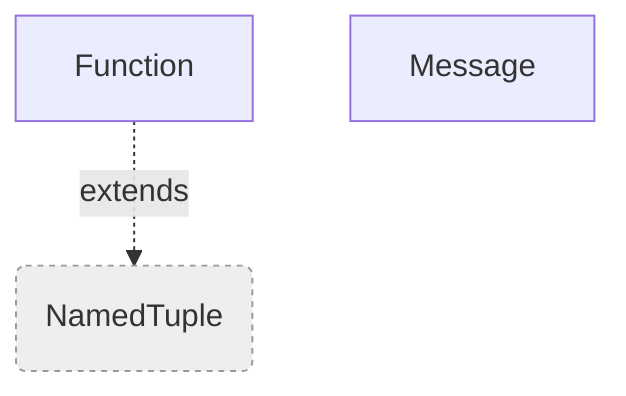

## Class Hierarchy — wraithguard

```mermaid
flowchart TD
  n_wraithguard_logging_setup_LogLevel["LogLevel"]
  n_wraithguard_momw_PluginOrderEntry["PluginOrderEntry"]
  n_wraithguard_momw__PartialEntry["_PartialEntry"]
  n_EXTBASE_IntEnum("IntEnum"):::external
  n_wraithguard_logging_setup_LogLevel -.->|extends| n_EXTBASE_IntEnum
  n_EXTBASE_TypedDict("TypedDict"):::external
  n_wraithguard_momw_PluginOrderEntry -.->|extends| n_EXTBASE_TypedDict
  n_wraithguard_momw__PartialEntry -.->|extends| n_EXTBASE_TypedDict
  classDef external fill:#eee,stroke:#999,stroke-dasharray: 3 3
```

## Class Hierarchy — wraithguard.gui

```mermaid
flowchart TD
  n_wraithguard_gui_conflicts_ConflictWindowsMixin["ConflictWindowsMixin"]
  n_wraithguard_gui_patchwin_PatchBuilderMixin["PatchBuilderMixin"]
  n_wraithguard_gui_pluginview_PluginViewMixin["PluginViewMixin"]
  n_wraithguard_gui_t3_Tes3cmdMixin["Tes3cmdMixin"]
  n_wraithguard_gui_widgets_DragReorderListbox["DragReorderListbox"]
  n_wraithguard_gui_widgets_PathField["PathField"]
  n_wraithguard_gui_widgets_QueueWriter["QueueWriter"]
  n_wraithguard_gui_widgets_Tooltip["Tooltip"]
  n_EXTBASE_io_TextIOBase("io.TextIOBase"):::external
  n_wraithguard_gui_widgets_QueueWriter -.->|extends| n_EXTBASE_io_TextIOBase
  n_EXTBASE_tk_Listbox("tk.Listbox"):::external
  n_wraithguard_gui_widgets_DragReorderListbox -.->|extends| n_EXTBASE_tk_Listbox
  classDef external fill:#eee,stroke:#999,stroke-dasharray: 3 3
```

## Class Hierarchy — wraithguard.images

```mermaid
flowchart TD
  n_wraithguard_images_bc7__Bits["_Bits"]
  n_wraithguard_images_bitmap_BitmapError["BitmapError"]
  n_wraithguard_images_compare_Comparison["Comparison"]
  n_wraithguard_images_compare_Verdict["Verdict"]
  n_wraithguard_images_dds_DdsError["DdsError"]
  n_wraithguard_images_image_Image["Image"]
  n_wraithguard_images_image_ImageError["ImageError"]
  n_wraithguard_images_reader_ImageFormat["ImageFormat"]
  n_wraithguard_images_roles_TextureRole["TextureRole"]
  n_wraithguard_images_targa_TargaError["TargaError"]
  n_wraithguard_images_bitmap_BitmapError -->|extends| n_wraithguard_images_image_ImageError
  n_EXTBASE_Enum("Enum"):::external
  n_wraithguard_images_compare_Verdict -.->|extends| n_EXTBASE_Enum
  n_wraithguard_images_dds_DdsError -->|extends| n_wraithguard_images_image_ImageError
  n_EXTBASE_Exception("Exception"):::external
  n_wraithguard_images_image_ImageError -.->|extends| n_EXTBASE_Exception
  n_wraithguard_images_reader_ImageFormat -.->|extends| n_EXTBASE_Enum
  n_wraithguard_images_roles_TextureRole -.->|extends| n_EXTBASE_Enum
  n_wraithguard_images_targa_TargaError -->|extends| n_wraithguard_images_image_ImageError
  classDef external fill:#eee,stroke:#999,stroke-dasharray: 3 3
```

## Class Hierarchy — wraithguard.land

```mermaid
flowchart TD
  n_wraithguard_land_cells_MergedCellRecord["MergedCellRecord"]
  n_wraithguard_land_cleaning_CellDigest["CellDigest"]
  n_wraithguard_land_cleaning_CleaningReport["CleaningReport"]
  n_wraithguard_land_diff_LandData["LandData"]
  n_wraithguard_land_diff_LandscapeDiff["LandscapeDiff"]
  n_wraithguard_land_diff_LandscapeLayers["LandscapeLayers"]
  n_wraithguard_land_diff_RelativeGrid["RelativeGrid"]
  n_wraithguard_land_emit_EmitError["EmitError"]
  n_wraithguard_land_heights_HeightEncodeError["HeightEncodeError"]
  n_wraithguard_land_landmass_CellContention["CellContention"]
  n_wraithguard_land_landmass_Landmass["Landmass"]
  n_wraithguard_land_landmass_PluginRecords["PluginRecords"]
  n_wraithguard_land_merge_ConflictParams["ConflictParams"]
  n_wraithguard_land_merge_ConflictStrategy["ConflictStrategy"]
  n_wraithguard_land_merge_MergeReport["MergeReport"]
  n_wraithguard_land_merge_Severity["Severity"]
  n_wraithguard_land_meta_MergeSettings["MergeSettings"]
  n_wraithguard_land_meta_MetaError["MetaError"]
  n_wraithguard_land_meta_PluginMeta["PluginMeta"]
  n_wraithguard_land_native_NativeReadError["NativeReadError"]
  n_wraithguard_land_pipeline_MergeOutcome["MergeOutcome"]
  n_wraithguard_land_pipeline_MergedCell["MergedCell"]
  n_wraithguard_land_seams_SeamReport["SeamReport"]
  n_wraithguard_land_seams_Tear["Tear"]
  n_wraithguard_land_service_MergeResult["MergeResult"]
  n_wraithguard_land_service_MergeServiceError["MergeServiceError"]
  n_wraithguard_land_slope_SlopeReport["SlopeReport"]
  n_wraithguard_land_textures_KnownTexture["KnownTexture"]
  n_wraithguard_land_textures_KnownTextures["KnownTextures"]
  n_wraithguard_land_textures_TranslationResult["TranslationResult"]
  n_EXTBASE_IntFlag("IntFlag"):::external
  n_wraithguard_land_diff_LandData -.->|extends| n_EXTBASE_IntFlag
  n_EXTBASE_Exception("Exception"):::external
  n_wraithguard_land_emit_EmitError -.->|extends| n_EXTBASE_Exception
  n_wraithguard_land_heights_HeightEncodeError -.->|extends| n_EXTBASE_Exception
  n_EXTBASE_Enum("Enum"):::external
  n_wraithguard_land_merge_ConflictStrategy -.->|extends| n_EXTBASE_Enum
  n_wraithguard_land_merge_Severity -.->|extends| n_EXTBASE_Enum
  n_wraithguard_land_meta_MetaError -.->|extends| n_EXTBASE_Exception
  n_wraithguard_land_native_NativeReadError -.->|extends| n_EXTBASE_Exception
  n_wraithguard_land_service_MergeServiceError -.->|extends| n_EXTBASE_Exception
  classDef external fill:#eee,stroke:#999,stroke-dasharray: 3 3
```

## Class Hierarchy — wraithguard.mwscript

```mermaid
flowchart TD
  n_wraithguard_mwscript_disassembler_Instruction["Instruction"]
  n_wraithguard_mwscript_disassembler_Listing["Listing"]
  n_wraithguard_mwscript_disassembler_RawBytes["RawBytes"]
  n_wraithguard_mwscript_script_record_ScriptRecord["ScriptRecord"]
  n_wraithguard_mwscript_tes3conv_BytecodeDecodeError["BytecodeDecodeError"]
  n_EXTBASE_Exception("Exception"):::external
  n_wraithguard_mwscript_tes3conv_BytecodeDecodeError -.->|extends| n_EXTBASE_Exception
  classDef external fill:#eee,stroke:#999,stroke-dasharray: 3 3
```

## Class Hierarchy — wraithguard.nif

```mermaid
flowchart TD
  n_wraithguard_nif_analysis_MeshAnalyser["MeshAnalyser"]
  n_wraithguard_nif_analysis_MeshFinding["MeshFinding"]
  n_wraithguard_nif_bsa_BsaArchive["BsaArchive"]
  n_wraithguard_nif_bsa_BsaEntry["BsaEntry"]
  n_wraithguard_nif_bsa_BsaError["BsaError"]
  n_wraithguard_nif_geometry_Mesh["Mesh"]
  n_wraithguard_nif_geometry_Transform["Transform"]
  n_wraithguard_nif_geometry_TreeNode["TreeNode"]
  n_wraithguard_nif_reader_Block["Block"]
  n_wraithguard_nif_reader_NifFile["NifFile"]
  n_wraithguard_nif_reader_NifParseError["NifParseError"]
  n_wraithguard_nif_reader__Cursor["_Cursor"]
  n_wraithguard_nif_report_Difference["Difference"]
  n_wraithguard_nif_report_Shape["Shape"]
  n_wraithguard_nif_report_Structure["Structure"]
  n_wraithguard_nif_scan_ScanResult["ScanResult"]
  n_wraithguard_nif_textures_Resolved["Resolved"]
  n_wraithguard_nif_textures_TextureResolver["TextureResolver"]
  n_EXTBASE_Exception("Exception"):::external
  n_wraithguard_nif_bsa_BsaError -.->|extends| n_EXTBASE_Exception
  n_wraithguard_nif_reader_NifParseError -.->|extends| n_EXTBASE_Exception
  classDef external fill:#eee,stroke:#999,stroke-dasharray: 3 3
```

## Class Hierarchy — wraithguard.patch

```mermaid
flowchart TD
  n_wraithguard_patch_align_Row["Row"]
  n_wraithguard_patch_dialogue_Placed["Placed"]
  n_wraithguard_patch_dialogue_Response["Response"]
  n_wraithguard_patch_merge_FieldChoice["FieldChoice"]
  n_wraithguard_patch_merge_Merge["Merge"]
  n_wraithguard_patch_queue_PatchQueue["PatchQueue"]
  n_wraithguard_patch_records_PatchError["PatchError"]
  n_wraithguard_patch_records_Selection["Selection"]
  n_wraithguard_patch_service_PatchResult["PatchResult"]
  n_wraithguard_patch_service_PatchServiceError["PatchServiceError"]
  n_wraithguard_patch_status_ConflictAll["ConflictAll"]
  n_wraithguard_patch_status_ConflictThis["ConflictThis"]
  n_wraithguard_patch_status__Absent["_Absent"]
  n_wraithguard_patch_summary_Branch["Branch"]
  n_wraithguard_patch_summary_FieldStatus["FieldStatus"]
  n_wraithguard_patch_summary_PluginTally["PluginTally"]
  n_wraithguard_patch_summary_Survey["Survey"]
  n_EXTBASE_Exception("Exception"):::external
  n_wraithguard_patch_records_PatchError -.->|extends| n_EXTBASE_Exception
  n_wraithguard_patch_service_PatchServiceError -.->|extends| n_EXTBASE_Exception
  n_EXTBASE_enum_IntEnum("enum.IntEnum"):::external
  n_wraithguard_patch_status_ConflictAll -.->|extends| n_EXTBASE_enum_IntEnum
  n_EXTBASE_enum_Enum("enum.Enum"):::external
  n_wraithguard_patch_status_ConflictThis -.->|extends| n_EXTBASE_enum_Enum
  classDef external fill:#eee,stroke:#999,stroke-dasharray: 3 3
```

## Class Hierarchy — wraithguard.plugins

```mermaid
flowchart TD
  n_wraithguard_plugins_metadata_PluginFileIndex["PluginFileIndex"]
```

## Class Hierarchy — wraithguard.rules

```mermaid
flowchart TD
  n_wraithguard_rules_authoring_Desc["Desc"]
  n_wraithguard_rules_authoring_Expr["Expr"]
  n_wraithguard_rules_authoring_Group["Group"]
  n_wraithguard_rules_authoring_Plugin["Plugin"]
  n_wraithguard_rules_authoring_Problem["Problem"]
  n_wraithguard_rules_authoring_Rule["Rule"]
  n_wraithguard_rules_authoring_Size["Size"]
  n_wraithguard_rules_authoring_Ver["Ver"]
  n_wraithguard_rules_derive_Proposal["Proposal"]
  n_wraithguard_rules_authoring_Plugin -->|extends| n_wraithguard_rules_authoring_Expr
  n_wraithguard_rules_authoring_Desc -->|extends| n_wraithguard_rules_authoring_Expr
  n_wraithguard_rules_authoring_Size -->|extends| n_wraithguard_rules_authoring_Expr
  n_wraithguard_rules_authoring_Ver -->|extends| n_wraithguard_rules_authoring_Expr
  n_wraithguard_rules_authoring_Group -->|extends| n_wraithguard_rules_authoring_Expr
```

## Class Hierarchy — wraithguard.tes3fields

```mermaid
flowchart TD
  n_wraithguard_tes3fields_landscape_LandscapeDecodeError["LandscapeDecodeError"]
  n_wraithguard_tes3fields_pathgrid_PathGridDecodeError["PathGridDecodeError"]
  n_wraithguard_tes3fields_schema_types_Member["Member"]
  n_wraithguard_tes3fields_schema_types_Record["Record"]
  n_wraithguard_tes3fields_schema_types_Subrecord["Subrecord"]
  n_EXTBASE_Exception("Exception"):::external
  n_wraithguard_tes3fields_landscape_LandscapeDecodeError -.->|extends| n_EXTBASE_Exception
  n_wraithguard_tes3fields_pathgrid_PathGridDecodeError -.->|extends| n_EXTBASE_Exception
  classDef external fill:#eee,stroke:#999,stroke-dasharray: 3 3
```

## Class Hierarchy — wraithguard.viz

```mermaid
flowchart TD
  n_wraithguard_viz_docs__Renderer["_Renderer"]
  n_wraithguard_viz_geometry_Cell["Cell"]
  n_wraithguard_viz_geometry_CellConflicts["CellConflicts"]
  n_wraithguard_viz_heightdelta_HeightDeltaError["HeightDeltaError"]
  n_wraithguard_viz_library_ViewerError["ViewerError"]
  n_wraithguard_viz_serve_Handler["Handler"]
  n_wraithguard_viz_serve_Payload["Payload"]
  n_wraithguard_viz_serve_PublishSession["PublishSession"]
  n_wraithguard_viz_serve_ViewerServer["ViewerServer"]
  n_wraithguard_viz_terrain3d_Terrain3DError["Terrain3DError"]
  n_EXTBASE_NamedTuple("NamedTuple"):::external
  n_wraithguard_viz_geometry_Cell -.->|extends| n_EXTBASE_NamedTuple
  n_wraithguard_viz_geometry_CellConflicts -.->|extends| n_EXTBASE_NamedTuple
  n_EXTBASE_Exception("Exception"):::external
  n_wraithguard_viz_heightdelta_HeightDeltaError -.->|extends| n_EXTBASE_Exception
  n_wraithguard_viz_library_ViewerError -.->|extends| n_EXTBASE_Exception
  n_EXTBASE_BaseHTTPRequestHandler("BaseHTTPRequestHandler"):::external
  n_wraithguard_viz_serve_Handler -.->|extends| n_EXTBASE_BaseHTTPRequestHandler
  n_wraithguard_viz_terrain3d_Terrain3DError -.->|extends| n_EXTBASE_Exception
  classDef external fill:#eee,stroke:#999,stroke-dasharray: 3 3
```
