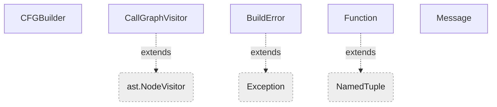
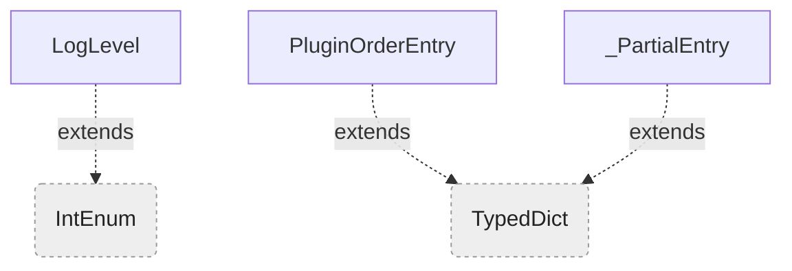
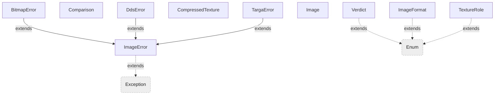
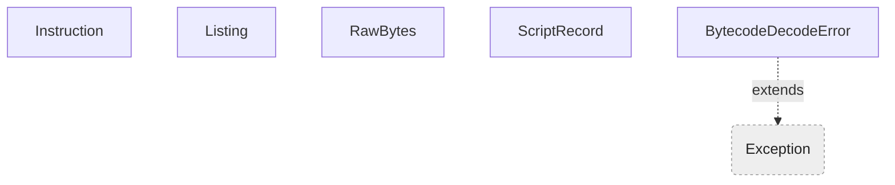
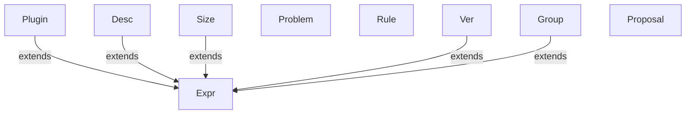
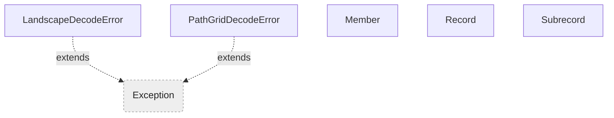

# AST -> Mermaid Flowcharts

## Module Dependencies

```mermaid
flowchart TD
  subgraph SG0["(top level)"]
    n_wraithguard["wraithguard"]
    n_wraithguard_toolkit["wraithguard_toolkit"]
    n_wraithguard_toolkit_gui["wraithguard_toolkit_gui"]
  end
  subgraph SG1["packaging"]
    n_packaging_pyi_rth_pywebview_qt["pyi_rth_pywebview_qt"]
  end
  subgraph SG2["tests"]
    n_tests__images_reference["_images_reference"]
    n_tests__lint_reference["_lint_reference"]
    n_tests_conftest["conftest"]
    n_tests_test_align_edges["test_align_edges"]
    n_tests_test_ast_mermaid["test_ast_mermaid"]
    n_tests_test_batch_fields["test_batch_fields"]
    n_tests_test_bc7_modes["test_bc7_modes"]
    n_tests_test_bitmap_uncommon_paths["test_bitmap_uncommon_paths"]
    n_tests_test_bsa_malformed["test_bsa_malformed"]
    n_tests_test_build_cell_coverage["test_build_cell_coverage"]
    n_tests_test_build_locale["test_build_locale"]
    n_tests_test_build_merged_lands["test_build_merged_lands"]
    n_tests_test_check_bc7["test_check_bc7"]
    n_tests_test_check_bsa["test_check_bsa"]
    n_tests_test_check_images["test_check_images"]
    n_tests_test_check_masters["test_check_masters"]
    n_tests_test_check_placeholders["test_check_placeholders"]
    n_tests_test_check_plugin_roundtrip["test_check_plugin_roundtrip"]
    n_tests_test_check_textures["test_check_textures"]
    n_tests_test_check_undefined["test_check_undefined"]
    n_tests_test_ci_filetypes["test_ci_filetypes"]
    n_tests_test_cli_entrypoint["test_cli_entrypoint"]
    n_tests_test_compute_plan_scans["test_compute_plan_scans"]
    n_tests_test_configurator["test_configurator"]
    n_tests_test_configurator_amp_escape["test_configurator_amp_escape"]
    n_tests_test_configurator_apply["test_configurator_apply"]
    n_tests_test_conflict_colors["test_conflict_colors"]
    n_tests_test_conflict_detection["test_conflict_detection"]
    n_tests_test_data_path_order_warnings["test_data_path_order_warnings"]
    n_tests_test_datapaths["test_datapaths"]
    n_tests_test_detect_resource_conflicts["test_detect_resource_conflicts"]
    n_tests_test_dialogue["test_dialogue"]
    n_tests_test_diff_record_fields["test_diff_record_fields"]
    n_tests_test_diff_roundtrip_json["test_diff_roundtrip_json"]
    n_tests_test_differential["test_differential"]
    n_tests_test_docs_render["test_docs_render"]
    n_tests_test_dump_tes3conv_json["test_dump_tes3conv_json"]
    n_tests_test_edge_guards["test_edge_guards"]
    n_tests_test_esp_armor_clothing["test_esp_armor_clothing"]
    n_tests_test_esp_cell["test_esp_cell"]
    n_tests_test_esp_creature["test_esp_creature"]
    n_tests_test_esp_data_records["test_esp_data_records"]
    n_tests_test_esp_dialogue["test_esp_dialogue"]
    n_tests_test_esp_faction_region["test_esp_faction_region"]
    n_tests_test_esp_info["test_esp_info"]
    n_tests_test_esp_ingredient_alchemy["test_esp_ingredient_alchemy"]
    n_tests_test_esp_items["test_esp_items"]
    n_tests_test_esp_items2["test_esp_items2"]
    n_tests_test_esp_json["test_esp_json"]
    n_tests_test_esp_json_edges["test_esp_json_edges"]
    n_tests_test_esp_landscape["test_esp_landscape"]
    n_tests_test_esp_leveled_mgef["test_esp_leveled_mgef"]
    n_tests_test_esp_magic_records["test_esp_magic_records"]
    n_tests_test_esp_masters["test_esp_masters"]
    n_tests_test_esp_misc_records["test_esp_misc_records"]
    n_tests_test_esp_nonfinite["test_esp_nonfinite"]
    n_tests_test_esp_npc["test_esp_npc"]
    n_tests_test_esp_race_header["test_esp_race_header"]
    n_tests_test_esp_read_header["test_esp_read_header"]
    n_tests_test_esp_script_pathgrid["test_esp_script_pathgrid"]
    n_tests_test_esp_weapon["test_esp_weapon"]
    n_tests_test_extract_subset_from_toml["test_extract_subset_from_toml"]
    n_tests_test_find_tes3_tools["test_find_tes3_tools"]
    n_tests_test_foundation["test_foundation"]
    n_tests_test_gen_esp_types["test_gen_esp_types"]
    n_tests_test_gen_merged_lands_table["test_gen_merged_lands_table"]
    n_tests_test_gen_opcodes["test_gen_opcodes"]
    n_tests_test_gen_tes3_enums["test_gen_tes3_enums"]
    n_tests_test_gen_tes3_fieldtypes["test_gen_tes3_fieldtypes"]
    n_tests_test_gen_tes3_schema["test_gen_tes3_schema"]
    n_tests_test_generated_js["test_generated_js"]
    n_tests_test_guard_clauses["test_guard_clauses"]
    n_tests_test_gui_icon["test_gui_icon"]
    n_tests_test_gui_smoke["test_gui_smoke"]
    n_tests_test_hardening["test_hardening"]
    n_tests_test_i18n_detection["test_i18n_detection"]
    n_tests_test_i18n_placeholders["test_i18n_placeholders"]
    n_tests_test_icon_frame["test_icon_frame"]
    n_tests_test_image_compare["test_image_compare"]
    n_tests_test_image_compare_edges["test_image_compare_edges"]
    n_tests_test_image_viewer["test_image_viewer"]
    n_tests_test_images["test_images"]
    n_tests_test_images_native_parity["test_images_native_parity"]
    n_tests_test_integration["test_integration"]
    n_tests_test_land_diff["test_land_diff"]
    n_tests_test_land_emit["test_land_emit"]
    n_tests_test_land_fidelity["test_land_fidelity"]
    n_tests_test_land_heights["test_land_heights"]
    n_tests_test_land_landmass["test_land_landmass"]
    n_tests_test_land_merge["test_land_merge"]
    n_tests_test_land_meta["test_land_meta"]
    n_tests_test_land_native["test_land_native"]
    n_tests_test_land_native_parity["test_land_native_parity"]
    n_tests_test_land_opt_in["test_land_opt_in"]
    n_tests_test_land_pipeline_edges["test_land_pipeline_edges"]
    n_tests_test_land_preview["test_land_preview"]
    n_tests_test_land_seams["test_land_seams"]
    n_tests_test_land_service["test_land_service"]
    n_tests_test_land_service_records["test_land_service_records"]
    n_tests_test_land_sidecar["test_land_sidecar"]
    n_tests_test_land_slope["test_land_slope"]
    n_tests_test_landscape_render["test_landscape_render"]
    n_tests_test_lint_and_resource_stages["test_lint_and_resource_stages"]
    n_tests_test_lint_helpers["test_lint_helpers"]
    n_tests_test_lint_native_parity["test_lint_native_parity"]
    n_tests_test_lint_plugins["test_lint_plugins"]
    n_tests_test_make_pot["test_make_pot"]
    n_tests_test_master_sizes["test_master_sizes"]
    n_tests_test_merge_golden["test_merge_golden"]
    n_tests_test_merge_unit["test_merge_unit"]
    n_tests_test_merged_lands_coverage["test_merged_lands_coverage"]
    n_tests_test_mesh_conflicts["test_mesh_conflicts"]
    n_tests_test_mesh_from_archive["test_mesh_from_archive"]
    n_tests_test_mesh_loose_case["test_mesh_loose_case"]
    n_tests_test_missing_masters["test_missing_masters"]
    n_tests_test_momw["test_momw"]
    n_tests_test_momw_datapaths["test_momw_datapaths"]
    n_tests_test_mwscript["test_mwscript"]
    n_tests_test_mwscript_operands["test_mwscript_operands"]
    n_tests_test_native_merge["test_native_merge"]
    n_tests_test_native_session["test_native_session"]
    n_tests_test_nif_analysis["test_nif_analysis"]
    n_tests_test_nif_inspect["test_nif_inspect"]
    n_tests_test_nif_report["test_nif_report"]
    n_tests_test_nif_serve["test_nif_serve"]
    n_tests_test_nif_textures["test_nif_textures"]
    n_tests_test_parse_tes3_records["test_parse_tes3_records"]
    n_tests_test_patch_align["test_patch_align"]
    n_tests_test_patch_bulk["test_patch_bulk"]
    n_tests_test_patch_dialogue["test_patch_dialogue"]
    n_tests_test_patch_enums["test_patch_enums"]
    n_tests_test_patch_fieldtypes["test_patch_fieldtypes"]
    n_tests_test_patch_journal["test_patch_journal"]
    n_tests_test_patch_journal_scripts["test_patch_journal_scripts"]
    n_tests_test_patch_merge["test_patch_merge"]
    n_tests_test_patch_queue["test_patch_queue"]
    n_tests_test_patch_records["test_patch_records"]
    n_tests_test_patch_service["test_patch_service"]
    n_tests_test_patch_status["test_patch_status"]
    n_tests_test_patch_summary["test_patch_summary"]
    n_tests_test_patch_values["test_patch_values"]
    n_tests_test_pathgrid_render["test_pathgrid_render"]
    n_tests_test_plugin_metadata["test_plugin_metadata"]
    n_tests_test_plugin_metadata_guards["test_plugin_metadata_guards"]
    n_tests_test_plugin_order_yml_stage["test_plugin_order_yml_stage"]
    n_tests_test_plugins["test_plugins"]
    n_tests_test_predicate_eval["test_predicate_eval"]
    n_tests_test_predicate_internals["test_predicate_internals"]
    n_tests_test_proc["test_proc"]
    n_tests_test_proc_no_window["test_proc_no_window"]
    n_tests_test_record_subset["test_record_subset"]
    n_tests_test_replace_notes["test_replace_notes"]
    n_tests_test_resource_conflict_helpers["test_resource_conflict_helpers"]
    n_tests_test_rtl["test_rtl"]
    n_tests_test_rtl_tk["test_rtl_tk"]
    n_tests_test_rule_authoring["test_rule_authoring"]
    n_tests_test_rule_derive["test_rule_derive"]
    n_tests_test_rule_expressions["test_rule_expressions"]
    n_tests_test_rule_maker["test_rule_maker"]
    n_tests_test_rule_parser["test_rule_parser"]
    n_tests_test_savegame_and_backups["test_savegame_and_backups"]
    n_tests_test_scan_mod_directories["test_scan_mod_directories"]
    n_tests_test_seams_helpers["test_seams_helpers"]
    n_tests_test_service_full_merge["test_service_full_merge"]
    n_tests_test_service_merge["test_service_merge"]
    n_tests_test_service_native["test_service_native"]
    n_tests_test_sign_release["test_sign_release"]
    n_tests_test_sort["test_sort"]
    n_tests_test_stage_for_tes3cmd["test_stage_for_tes3cmd"]
    n_tests_test_staleness_watchdog["test_staleness_watchdog"]
    n_tests_test_standards["test_standards"]
    n_tests_test_subset_from_cfg["test_subset_from_cfg"]
    n_tests_test_subset_inputs["test_subset_inputs"]
    n_tests_test_subset_line_classification["test_subset_line_classification"]
    n_tests_test_subset_toml_file["test_subset_toml_file"]
    n_tests_test_survey_landscape["test_survey_landscape"]
    n_tests_test_targa_uncommon_paths["test_targa_uncommon_paths"]
    n_tests_test_tes3_schema["test_tes3_schema"]
    n_tests_test_tes3conv_backends["test_tes3conv_backends"]
    n_tests_test_tes3conv_record_key["test_tes3conv_record_key"]
    n_tests_test_tes3conv_session["test_tes3conv_session"]
    n_tests_test_tes3fields["test_tes3fields"]
    n_tests_test_toml_equivalence["test_toml_equivalence"]
    n_tests_test_tool_discovery["test_tool_discovery"]
    n_tests_test_tracing["test_tracing"]
    n_tests_test_unreached_api["test_unreached_api"]
    n_tests_test_updaters["test_updaters"]
    n_tests_test_updaters_edges["test_updaters_edges"]
    n_tests_test_updaters_ssl_context["test_updaters_ssl_context"]
    n_tests_test_vfs_archive_errors["test_vfs_archive_errors"]
    n_tests_test_viewer_launch["test_viewer_launch"]
    n_tests_test_viewer_setup["test_viewer_setup"]
    n_tests_test_viz["test_viz"]
    n_tests_test_viz_library["test_viz_library"]
    n_tests_test_viz_pages["test_viz_pages"]
    n_tests_test_write_plan["test_write_plan"]
    n_tests_test_yml_post_sort_warnings["test_yml_post_sort_warnings"]
  end
  subgraph SG3["tools"]
    n_tools_ast_mermaid["ast_mermaid"]
    n_tools_build_locale["build_locale"]
    n_tools_build_merged_lands["build_merged_lands"]
    n_tools_build_three_cjs["build_three_cjs"]
    n_tools_check_bc7["check_bc7"]
    n_tools_check_bsa["check_bsa"]
    n_tools_check_images["check_images"]
    n_tools_check_placeholders["check_placeholders"]
    n_tools_check_plugin_roundtrip["check_plugin_roundtrip"]
    n_tools_check_textures["check_textures"]
    n_tools_check_undefined["check_undefined"]
    n_tools_diff_roundtrip_json["diff_roundtrip_json"]
    n_tools_gen_esp_types["gen_esp_types"]
    n_tools_gen_merged_lands_table["gen_merged_lands_table"]
    n_tools_gen_opcodes["gen_opcodes"]
    n_tools_gen_tes3_enums["gen_tes3_enums"]
    n_tools_gen_tes3_fieldtypes["gen_tes3_fieldtypes"]
    n_tools_gen_tes3_schema["gen_tes3_schema"]
    n_tools_make_pot["make_pot"]
    n_tools_sign_release["sign_release"]
    n_tools_survey_landscape["survey_landscape"]
  end
  subgraph SG4["wraithguard"]
    n_wraithguard_configurator["configurator"]
    n_wraithguard_esp["esp"]
    n_wraithguard_gui["gui"]
    n_wraithguard_i18n["i18n"]
    n_wraithguard_images["images"]
    n_wraithguard_land["land"]
    n_wraithguard_logging_setup["logging_setup"]
    n_wraithguard_merge["merge"]
    n_wraithguard_momw["momw"]
    n_wraithguard_momw_datapaths["momw_datapaths"]
    n_wraithguard_mwscript["mwscript"]
    n_wraithguard_net["net"]
    n_wraithguard_nif["nif"]
    n_wraithguard_patch["patch"]
    n_wraithguard_plugins["plugins"]
    n_wraithguard_proc["proc"]
    n_wraithguard_rtl["rtl"]
    n_wraithguard_rules["rules"]
    n_wraithguard_sort["sort"]
    n_wraithguard_tes3fields["tes3fields"]
    n_wraithguard_tracing["tracing"]
    n_wraithguard_versions["versions"]
    n_wraithguard_viewer_launch["viewer_launch"]
    n_wraithguard_viz["viz"]
  end
  subgraph SG5["wraithguard.configurator"]
    n_wraithguard_configurator_apply["apply"]
    n_wraithguard_configurator_cfglines["cfglines"]
    n_wraithguard_configurator_datapaths["datapaths"]
    n_wraithguard_configurator_emit["emit"]
  end
  subgraph SG6["wraithguard.esp"]
    n_wraithguard_esp_enums["enums"]
    n_wraithguard_esp_flags["flags"]
    n_wraithguard_esp_io["io"]
    n_wraithguard_esp_json["json"]
    n_wraithguard_esp_masters["masters"]
    n_wraithguard_esp_plugin["plugin"]
    n_wraithguard_esp_record["record"]
    n_wraithguard_esp_records["records"]
  end
  subgraph SG7["wraithguard.esp.records"]
    n_wraithguard_esp_records__ai["_ai"]
    n_wraithguard_esp_records_activator["activator"]
    n_wraithguard_esp_records_alchemy["alchemy"]
    n_wraithguard_esp_records_apparatus["apparatus"]
    n_wraithguard_esp_records_armor["armor"]
    n_wraithguard_esp_records_bipedobject["bipedobject"]
    n_wraithguard_esp_records_birthsign["birthsign"]
    n_wraithguard_esp_records_bodypart["bodypart"]
    n_wraithguard_esp_records_book["book"]
    n_wraithguard_esp_records_cell["cell"]
    n_wraithguard_esp_records_class_["class_"]
    n_wraithguard_esp_records_clothing["clothing"]
    n_wraithguard_esp_records_container["container"]
    n_wraithguard_esp_records_creature["creature"]
    n_wraithguard_esp_records_dialogue["dialogue"]
    n_wraithguard_esp_records_dialogueinfo["dialogueinfo"]
    n_wraithguard_esp_records_door["door"]
    n_wraithguard_esp_records_effect["effect"]
    n_wraithguard_esp_records_enchanting["enchanting"]
    n_wraithguard_esp_records_faction["faction"]
    n_wraithguard_esp_records_gamesetting["gamesetting"]
    n_wraithguard_esp_records_globalvariable["globalvariable"]
    n_wraithguard_esp_records_header["header"]
    n_wraithguard_esp_records_ingredient["ingredient"]
    n_wraithguard_esp_records_landscape["landscape"]
    n_wraithguard_esp_records_landscapetexture["landscapetexture"]
    n_wraithguard_esp_records_leveledcreature["leveledcreature"]
    n_wraithguard_esp_records_leveleditem["leveleditem"]
    n_wraithguard_esp_records_light["light"]
    n_wraithguard_esp_records_lockpick["lockpick"]
    n_wraithguard_esp_records_magiceffect["magiceffect"]
    n_wraithguard_esp_records_miscitem["miscitem"]
    n_wraithguard_esp_records_npc["npc"]
    n_wraithguard_esp_records_pathgrid["pathgrid"]
    n_wraithguard_esp_records_probe["probe"]
    n_wraithguard_esp_records_race["race"]
    n_wraithguard_esp_records_reference["reference"]
    n_wraithguard_esp_records_region["region"]
    n_wraithguard_esp_records_repairitem["repairitem"]
    n_wraithguard_esp_records_script["script"]
    n_wraithguard_esp_records_skill["skill"]
    n_wraithguard_esp_records_sound["sound"]
    n_wraithguard_esp_records_soundgen["soundgen"]
    n_wraithguard_esp_records_spell["spell"]
    n_wraithguard_esp_records_startscript["startscript"]
    n_wraithguard_esp_records_static_["static_"]
    n_wraithguard_esp_records_weapon["weapon"]
  end
  subgraph SG8["wraithguard.gui"]
    n_wraithguard_gui_cellpreview["cellpreview"]
    n_wraithguard_gui_conflict_colors["conflict_colors"]
    n_wraithguard_gui_conflicts["conflicts"]
    n_wraithguard_gui_journalview["journalview"]
    n_wraithguard_gui_patchwin["patchwin"]
    n_wraithguard_gui_pluginview["pluginview"]
    n_wraithguard_gui_removemaster["removemaster"]
    n_wraithguard_gui_rtl["rtl"]
    n_wraithguard_gui_t3["t3"]
    n_wraithguard_gui_theme["theme"]
    n_wraithguard_gui_widgets["widgets"]
  end
  subgraph SG9["wraithguard.images"]
    n_wraithguard_images_bc7["bc7"]
    n_wraithguard_images_bitmap["bitmap"]
    n_wraithguard_images_compare["compare"]
    n_wraithguard_images_dds["dds"]
    n_wraithguard_images_ico["ico"]
    n_wraithguard_images_image["image"]
    n_wraithguard_images_png["png"]
    n_wraithguard_images_reader["reader"]
    n_wraithguard_images_roles["roles"]
    n_wraithguard_images_targa["targa"]
    n_wraithguard_images_viewer["viewer"]
  end
  subgraph SG10["wraithguard.land"]
    n_wraithguard_land_cells["cells"]
    n_wraithguard_land_cleaning["cleaning"]
    n_wraithguard_land_conflict_image["conflict_image"]
    n_wraithguard_land_curvature["curvature"]
    n_wraithguard_land_debug_colors["debug_colors"]
    n_wraithguard_land_diff["diff"]
    n_wraithguard_land_emit["emit"]
    n_wraithguard_land_heights["heights"]
    n_wraithguard_land_landmass["landmass"]
    n_wraithguard_land_merge["merge"]
    n_wraithguard_land_meta["meta"]
    n_wraithguard_land_native["native"]
    n_wraithguard_land_pipeline["pipeline"]
    n_wraithguard_land_preview["preview"]
    n_wraithguard_land_seams["seams"]
    n_wraithguard_land_service["service"]
    n_wraithguard_land_slope["slope"]
    n_wraithguard_land_textures["textures"]
  end
  subgraph SG11["wraithguard.merge"]
    n_wraithguard_merge_api["api"]
    n_wraithguard_merge_combine["combine"]
    n_wraithguard_merge_deletions["deletions"]
    n_wraithguard_merge_dialogue["dialogue"]
    n_wraithguard_merge_ignored["ignored"]
    n_wraithguard_merge_masters["masters"]
    n_wraithguard_merge_model["model"]
    n_wraithguard_merge_textures["textures"]
  end
  subgraph SG12["wraithguard.mwscript"]
    n_wraithguard_mwscript_disassembler["disassembler"]
    n_wraithguard_mwscript_opcodes["opcodes"]
    n_wraithguard_mwscript_script_record["script_record"]
    n_wraithguard_mwscript_tes3conv["tes3conv"]
  end
  subgraph SG13["wraithguard.net"]
    n_wraithguard_net_updaters["updaters"]
  end
  subgraph SG14["wraithguard.nif"]
    n_wraithguard_nif_analysis["analysis"]
    n_wraithguard_nif_bsa["bsa"]
    n_wraithguard_nif_edit["edit"]
    n_wraithguard_nif_inspect["inspect"]
    n_wraithguard_nif_report["report"]
    n_wraithguard_nif_textures["textures"]
    n_wraithguard_nif_vfs["vfs"]
  end
  subgraph SG15["wraithguard.patch"]
    n_wraithguard_patch_align["align"]
    n_wraithguard_patch_bulk["bulk"]
    n_wraithguard_patch_dialogue["dialogue"]
    n_wraithguard_patch_enum_data["enum_data"]
    n_wraithguard_patch_enums["enums"]
    n_wraithguard_patch_field_types["field_types"]
    n_wraithguard_patch_fieldtypes["fieldtypes"]
    n_wraithguard_patch_journal["journal"]
    n_wraithguard_patch_journal_scripts["journal_scripts"]
    n_wraithguard_patch_merge["merge"]
    n_wraithguard_patch_queue["queue"]
    n_wraithguard_patch_records["records"]
    n_wraithguard_patch_service["service"]
    n_wraithguard_patch_status["status"]
    n_wraithguard_patch_summary["summary"]
    n_wraithguard_patch_values["values"]
  end
  subgraph SG16["wraithguard.plugins"]
    n_wraithguard_plugins_metadata["metadata"]
  end
  subgraph SG17["wraithguard.rules"]
    n_wraithguard_rules_authoring["authoring"]
    n_wraithguard_rules_derive["derive"]
    n_wraithguard_rules_expressions["expressions"]
    n_wraithguard_rules_parser["parser"]
    n_wraithguard_rules_patterns["patterns"]
    n_wraithguard_rules_predicates["predicates"]
  end
  subgraph SG18["wraithguard.sort"]
    n_wraithguard_sort_engine["engine"]
    n_wraithguard_sort_graph["graph"]
  end
  subgraph SG19["wraithguard.tes3fields"]
    n_wraithguard_tes3fields_annotate["annotate"]
    n_wraithguard_tes3fields_dialogue["dialogue"]
    n_wraithguard_tes3fields_landscape["landscape"]
    n_wraithguard_tes3fields_naming["naming"]
    n_wraithguard_tes3fields_pathgrid["pathgrid"]
    n_wraithguard_tes3fields_schema["schema"]
    n_wraithguard_tes3fields_schema_types["schema_types"]
  end
  subgraph SG20["wraithguard.viz"]
    n_wraithguard_viz_cellmap["cellmap"]
    n_wraithguard_viz_cellmap_js["cellmap_js"]
    n_wraithguard_viz_conflictmap["conflictmap"]
    n_wraithguard_viz_docs["docs"]
    n_wraithguard_viz_geometry["geometry"]
    n_wraithguard_viz_heightdelta["heightdelta"]
    n_wraithguard_viz_housekeeping["housekeeping"]
    n_wraithguard_viz_html["html"]
    n_wraithguard_viz_library["library"]
    n_wraithguard_viz_palette["palette"]
    n_wraithguard_viz_pathgrid["pathgrid"]
    n_wraithguard_viz_serve["serve"]
    n_wraithguard_viz_terrain3d["terrain3d"]
  end
  n_tests__lint_reference --> n_wraithguard_toolkit
  n_tests_test_align_edges --> n_wraithguard_patch_align
  n_tests_test_batch_fields --> n_wraithguard_patch_status
  n_tests_test_batch_fields --> n_wraithguard_patch_summary
  n_tests_test_batch_fields --> n_wraithguard_toolkit
  n_tests_test_bc7_modes --> n_wraithguard_images_bc7
  n_tests_test_bc7_modes --> n_wraithguard_images_image
  n_tests_test_bitmap_uncommon_paths --> n_wraithguard_images
  n_tests_test_bsa_malformed --> n_wraithguard_nif_bsa
  n_tests_test_build_cell_coverage --> n_wraithguard_plugins
  n_tests_test_build_cell_coverage --> n_wraithguard_toolkit
  n_tests_test_build_merged_lands --> n_tools_build_merged_lands
  n_tests_test_build_merged_lands --> n_wraithguard
  n_tests_test_build_merged_lands --> n_wraithguard_esp
  n_tests_test_build_merged_lands --> n_wraithguard_land_diff
  n_tests_test_build_merged_lands --> n_wraithguard_land_emit
  n_tests_test_build_merged_lands --> n_wraithguard_land_merge
  n_tests_test_build_merged_lands --> n_wraithguard_tes3fields_landscape
  n_tests_test_check_bc7 --> n_tools_check_bc7
  n_tests_test_check_bsa --> n_tests_test_mesh_from_archive
  n_tests_test_check_bsa --> n_tools_check_bsa
  n_tests_test_check_images --> n_tools_check_images
  n_tests_test_check_masters --> n_wraithguard_toolkit
  n_tests_test_check_placeholders --> n_tools_check_placeholders
  n_tests_test_check_plugin_roundtrip --> n_tools_check_plugin_roundtrip
  n_tests_test_check_textures --> n_tests_test_images
  n_tests_test_check_textures --> n_tests_test_mesh_from_archive
  n_tests_test_check_textures --> n_tools_check_textures
  n_tests_test_check_textures --> n_wraithguard_nif_textures
  n_tests_test_check_undefined --> n_tools_check_undefined
  n_tests_test_ci_filetypes --> n_wraithguard_gui
  n_tests_test_cli_entrypoint --> n_wraithguard_toolkit
  n_tests_test_compute_plan_scans --> n_wraithguard_toolkit
  n_tests_test_configurator --> n_wraithguard_configurator
  n_tests_test_configurator --> n_wraithguard_sort
  n_tests_test_configurator_amp_escape --> n_wraithguard_configurator_cfglines
  n_tests_test_configurator_amp_escape --> n_wraithguard_configurator_datapaths
  n_tests_test_configurator_apply --> n_wraithguard_configurator_apply
  n_tests_test_configurator_apply --> n_wraithguard_configurator_cfglines
  n_tests_test_conflict_colors --> n_wraithguard_gui_conflict_colors
  n_tests_test_conflict_colors --> n_wraithguard_patch_status
  n_tests_test_conflict_colors --> n_wraithguard_patch_summary
  n_tests_test_conflict_detection --> n_wraithguard_plugins
  n_tests_test_conflict_detection --> n_wraithguard_toolkit
  n_tests_test_data_path_order_warnings --> n_wraithguard_toolkit
  n_tests_test_datapaths --> n_wraithguard_configurator_datapaths
  n_tests_test_detect_resource_conflicts --> n_wraithguard_toolkit
  n_tests_test_dialogue --> n_wraithguard_tes3fields_dialogue
  n_tests_test_diff_record_fields --> n_wraithguard_toolkit
  n_tests_test_diff_roundtrip_json --> n_tools_diff_roundtrip_json
  n_tests_test_differential --> n_tests_test_integration
  n_tests_test_differential --> n_wraithguard_configurator
  n_tests_test_differential --> n_wraithguard_momw
  n_tests_test_differential --> n_wraithguard_net
  n_tests_test_differential --> n_wraithguard_rules
  n_tests_test_differential --> n_wraithguard_sort
  n_tests_test_differential --> n_wraithguard_versions
  n_tests_test_docs_render --> n_wraithguard_gui
  n_tests_test_docs_render --> n_wraithguard_viz_docs
  n_tests_test_dump_tes3conv_json --> n_wraithguard_toolkit
  n_tests_test_edge_guards --> n_wraithguard_configurator_cfglines
  n_tests_test_edge_guards --> n_wraithguard_land_cells
  n_tests_test_edge_guards --> n_wraithguard_land_cleaning
  n_tests_test_edge_guards --> n_wraithguard_land_curvature
  n_tests_test_edge_guards --> n_wraithguard_land_diff
  n_tests_test_edge_guards --> n_wraithguard_land_textures
  n_tests_test_edge_guards --> n_wraithguard_nif_report
  n_tests_test_edge_guards --> n_wraithguard_patch_status
  n_tests_test_edge_guards --> n_wraithguard_sort_graph
  n_tests_test_edge_guards --> n_wraithguard_tes3fields_naming
  n_tests_test_edge_guards --> n_wraithguard_viz_geometry
  n_tests_test_edge_guards --> n_wraithguard_viz_housekeeping
  n_tests_test_edge_guards --> n_wraithguard_viz_terrain3d
  n_tests_test_esp_armor_clothing --> n_wraithguard_esp
  n_tests_test_esp_armor_clothing --> n_wraithguard_esp_enums
  n_tests_test_esp_armor_clothing --> n_wraithguard_esp_flags
  n_tests_test_esp_cell --> n_wraithguard_esp
  n_tests_test_esp_cell --> n_wraithguard_esp_flags
  n_tests_test_esp_cell --> n_wraithguard_esp_io
  n_tests_test_esp_creature --> n_wraithguard_esp
  n_tests_test_esp_creature --> n_wraithguard_esp_enums
  n_tests_test_esp_creature --> n_wraithguard_esp_flags
  n_tests_test_esp_data_records --> n_wraithguard_esp
  n_tests_test_esp_data_records --> n_wraithguard_esp_enums
  n_tests_test_esp_data_records --> n_wraithguard_esp_flags
  n_tests_test_esp_dialogue --> n_wraithguard_esp
  n_tests_test_esp_dialogue --> n_wraithguard_esp_enums
  n_tests_test_esp_dialogue --> n_wraithguard_esp_flags
  n_tests_test_esp_faction_region --> n_wraithguard_esp
  n_tests_test_esp_faction_region --> n_wraithguard_esp_enums
  n_tests_test_esp_faction_region --> n_wraithguard_esp_flags
  n_tests_test_esp_info --> n_wraithguard_esp
  n_tests_test_esp_info --> n_wraithguard_esp_enums
  n_tests_test_esp_info --> n_wraithguard_esp_flags
  n_tests_test_esp_ingredient_alchemy --> n_wraithguard_esp
  n_tests_test_esp_ingredient_alchemy --> n_wraithguard_esp_enums
  n_tests_test_esp_ingredient_alchemy --> n_wraithguard_esp_flags
  n_tests_test_esp_items --> n_wraithguard_esp
  n_tests_test_esp_items --> n_wraithguard_esp_enums
  n_tests_test_esp_items --> n_wraithguard_esp_flags
  n_tests_test_esp_items2 --> n_wraithguard_esp
  n_tests_test_esp_items2 --> n_wraithguard_esp_enums
  n_tests_test_esp_items2 --> n_wraithguard_esp_flags
  n_tests_test_esp_json --> n_wraithguard_esp
  n_tests_test_esp_json --> n_wraithguard_esp_enums
  n_tests_test_esp_json --> n_wraithguard_esp_flags
  n_tests_test_esp_json --> n_wraithguard_esp_records__ai
  n_tests_test_esp_json --> n_wraithguard_esp_records_dialogueinfo
  n_tests_test_esp_json_edges --> n_wraithguard_esp_json
  n_tests_test_esp_landscape --> n_wraithguard_esp
  n_tests_test_esp_landscape --> n_wraithguard_esp_flags
  n_tests_test_esp_leveled_mgef --> n_wraithguard_esp
  n_tests_test_esp_leveled_mgef --> n_wraithguard_esp_enums
  n_tests_test_esp_leveled_mgef --> n_wraithguard_esp_flags
  n_tests_test_esp_magic_records --> n_wraithguard_esp
  n_tests_test_esp_magic_records --> n_wraithguard_esp_enums
  n_tests_test_esp_magic_records --> n_wraithguard_esp_flags
  n_tests_test_esp_masters --> n_wraithguard_esp
  n_tests_test_esp_masters --> n_wraithguard_esp_flags
  n_tests_test_esp_masters --> n_wraithguard_esp_records_cell
  n_tests_test_esp_masters --> n_wraithguard_esp_records_header
  n_tests_test_esp_masters --> n_wraithguard_esp_records_reference
  n_tests_test_esp_masters --> n_wraithguard_esp_records_static_
  n_tests_test_esp_misc_records --> n_wraithguard_esp
  n_tests_test_esp_misc_records --> n_wraithguard_esp_enums
  n_tests_test_esp_misc_records --> n_wraithguard_esp_flags
  n_tests_test_esp_nonfinite --> n_wraithguard_esp_plugin
  n_tests_test_esp_npc --> n_wraithguard_esp
  n_tests_test_esp_npc --> n_wraithguard_esp_flags
  n_tests_test_esp_race_header --> n_wraithguard_esp
  n_tests_test_esp_race_header --> n_wraithguard_esp_enums
  n_tests_test_esp_race_header --> n_wraithguard_esp_flags
  n_tests_test_esp_read_header --> n_wraithguard_esp
  n_tests_test_esp_read_header --> n_wraithguard_plugins_metadata
  n_tests_test_esp_read_header --> n_wraithguard_toolkit
  n_tests_test_esp_script_pathgrid --> n_wraithguard_esp
  n_tests_test_esp_script_pathgrid --> n_wraithguard_esp_flags
  n_tests_test_esp_weapon --> n_wraithguard_esp
  n_tests_test_esp_weapon --> n_wraithguard_esp_enums
  n_tests_test_esp_weapon --> n_wraithguard_esp_flags
  n_tests_test_extract_subset_from_toml --> n_wraithguard_toolkit
  n_tests_test_find_tes3_tools --> n_wraithguard_toolkit
  n_tests_test_foundation --> n_wraithguard
  n_tests_test_foundation --> n_wraithguard_i18n
  n_tests_test_foundation --> n_wraithguard_logging_setup
  n_tests_test_gen_esp_types --> n_tools_gen_esp_types
  n_tests_test_gen_merged_lands_table --> n_tools_gen_merged_lands_table
  n_tests_test_gen_opcodes --> n_tools_gen_opcodes
  n_tests_test_gen_tes3_enums --> n_tools_gen_tes3_enums
  n_tests_test_gen_tes3_fieldtypes --> n_tools_gen_tes3_fieldtypes
  n_tests_test_gen_tes3_schema --> n_tools_gen_tes3_schema
  n_tests_test_generated_js --> n_wraithguard_images
  n_tests_test_generated_js --> n_wraithguard_images_viewer
  n_tests_test_guard_clauses --> n_wraithguard_configurator_cfglines
  n_tests_test_guard_clauses --> n_wraithguard_images_bitmap
  n_tests_test_guard_clauses --> n_wraithguard_viz_palette
  n_tests_test_gui_icon --> n_wraithguard_gui
  n_tests_test_gui_icon --> n_wraithguard_toolkit_gui
  n_tests_test_gui_smoke --> n_wraithguard_gui
  n_tests_test_gui_smoke --> n_wraithguard_gui_cellpreview
  n_tests_test_gui_smoke --> n_wraithguard_gui_conflicts
  n_tests_test_gui_smoke --> n_wraithguard_gui_pluginview
  n_tests_test_gui_smoke --> n_wraithguard_gui_theme
  n_tests_test_gui_smoke --> n_wraithguard_gui_widgets
  n_tests_test_gui_smoke --> n_wraithguard_i18n
  n_tests_test_gui_smoke --> n_wraithguard_land_emit
  n_tests_test_gui_smoke --> n_wraithguard_land_heights
  n_tests_test_gui_smoke --> n_wraithguard_land_merge
  n_tests_test_gui_smoke --> n_wraithguard_land_meta
  n_tests_test_gui_smoke --> n_wraithguard_nif_analysis
  n_tests_test_gui_smoke --> n_wraithguard_nif_report
  n_tests_test_gui_smoke --> n_wraithguard_patch_status
  n_tests_test_gui_smoke --> n_wraithguard_patch_summary
  n_tests_test_gui_smoke --> n_wraithguard_rules_authoring
  n_tests_test_gui_smoke --> n_wraithguard_viz_housekeeping
  n_tests_test_gui_smoke --> n_wraithguard_toolkit_gui
  n_tests_test_hardening --> n_wraithguard_configurator
  n_tests_test_hardening --> n_wraithguard_plugins
  n_tests_test_hardening --> n_wraithguard_sort
  n_tests_test_hardening --> n_wraithguard_toolkit
  n_tests_test_i18n_detection --> n_wraithguard
  n_tests_test_i18n_detection --> n_wraithguard_i18n
  n_tests_test_icon_frame --> n_wraithguard_images_ico
  n_tests_test_image_compare --> n_wraithguard_images
  n_tests_test_image_compare --> n_wraithguard_images_viewer
  n_tests_test_image_compare_edges --> n_wraithguard_images
  n_tests_test_image_compare_edges --> n_wraithguard_images_compare
  n_tests_test_image_compare_edges --> n_wraithguard_images_image
  n_tests_test_image_viewer --> n_wraithguard_images
  n_tests_test_image_viewer --> n_wraithguard_images_compare
  n_tests_test_image_viewer --> n_wraithguard_images_roles
  n_tests_test_image_viewer --> n_wraithguard_images_viewer
  n_tests_test_image_viewer --> n_wraithguard_viz_library
  n_tests_test_images --> n_wraithguard_images
  n_tests_test_images --> n_wraithguard_images_reader
  n_tests_test_images --> n_wraithguard_images_roles
  n_tests_test_images_native_parity --> n_tests__images_reference
  n_tests_test_images_native_parity --> n_wraithguard_images
  n_tests_test_images_native_parity --> n_wraithguard_images_bc7
  n_tests_test_images_native_parity --> n_wraithguard_images_compare
  n_tests_test_images_native_parity --> n_wraithguard_images_dds
  n_tests_test_images_native_parity --> n_wraithguard_images_image
  n_tests_test_images_native_parity --> n_wraithguard_images_targa
  n_tests_test_integration --> n_wraithguard_configurator
  n_tests_test_integration --> n_wraithguard_rules
  n_tests_test_integration --> n_wraithguard_sort
  n_tests_test_land_diff --> n_wraithguard_land_diff
  n_tests_test_land_emit --> n_wraithguard_land_emit
  n_tests_test_land_emit --> n_wraithguard_land_heights
  n_tests_test_land_emit --> n_wraithguard_land_textures
  n_tests_test_land_emit --> n_wraithguard_tes3fields_landscape
  n_tests_test_land_fidelity --> n_wraithguard_land_cleaning
  n_tests_test_land_fidelity --> n_wraithguard_land_diff
  n_tests_test_land_fidelity --> n_wraithguard_land_landmass
  n_tests_test_land_fidelity --> n_wraithguard_land_pipeline
  n_tests_test_land_fidelity --> n_wraithguard_land_seams
  n_tests_test_land_fidelity --> n_wraithguard_land_slope
  n_tests_test_land_fidelity --> n_wraithguard_land_textures
  n_tests_test_land_fidelity --> n_wraithguard_tes3fields_landscape
  n_tests_test_land_heights --> n_wraithguard_land_heights
  n_tests_test_land_heights --> n_wraithguard_tes3fields_landscape
  n_tests_test_land_landmass --> n_wraithguard_land_diff
  n_tests_test_land_landmass --> n_wraithguard_land_landmass
  n_tests_test_land_landmass --> n_wraithguard_land_meta
  n_tests_test_land_landmass --> n_wraithguard_land_textures
  n_tests_test_land_merge --> n_wraithguard_land_diff
  n_tests_test_land_merge --> n_wraithguard_land_merge
  n_tests_test_land_meta --> n_wraithguard_land_merge
  n_tests_test_land_meta --> n_wraithguard_land_meta
  n_tests_test_land_native --> n_wraithguard_land_diff
  n_tests_test_land_native --> n_wraithguard_land_native
  n_tests_test_land_native --> n_wraithguard_tes3fields_landscape
  n_tests_test_land_native_parity --> n_wraithguard_land_diff
  n_tests_test_land_native_parity --> n_wraithguard_land_heights
  n_tests_test_land_native_parity --> n_wraithguard_land_merge
  n_tests_test_land_native_parity --> n_wraithguard_land_slope
  n_tests_test_land_opt_in --> n_wraithguard_land_cells
  n_tests_test_land_opt_in --> n_wraithguard_land_conflict_image
  n_tests_test_land_opt_in --> n_wraithguard_land_debug_colors
  n_tests_test_land_opt_in --> n_wraithguard_land_diff
  n_tests_test_land_opt_in --> n_wraithguard_land_heights
  n_tests_test_land_pipeline_edges --> n_wraithguard_land_landmass
  n_tests_test_land_pipeline_edges --> n_wraithguard_land_merge
  n_tests_test_land_pipeline_edges --> n_wraithguard_land_meta
  n_tests_test_land_pipeline_edges --> n_wraithguard_land_pipeline
  n_tests_test_land_pipeline_edges --> n_wraithguard_tes3fields_landscape
  n_tests_test_land_preview --> n_wraithguard_land_merge
  n_tests_test_land_preview --> n_wraithguard_land_preview
  n_tests_test_land_preview --> n_wraithguard_tes3fields_landscape
  n_tests_test_land_preview --> n_wraithguard_viz_terrain3d
  n_tests_test_land_seams --> n_wraithguard_land_seams
  n_tests_test_land_seams --> n_wraithguard_tes3fields_landscape
  n_tests_test_land_service --> n_wraithguard_land_diff
  n_tests_test_land_service --> n_wraithguard_land_emit
  n_tests_test_land_service --> n_wraithguard_land_landmass
  n_tests_test_land_service --> n_wraithguard_land_merge
  n_tests_test_land_service --> n_wraithguard_land_meta
  n_tests_test_land_service --> n_wraithguard_land_pipeline
  n_tests_test_land_service --> n_wraithguard_land_seams
  n_tests_test_land_service --> n_wraithguard_land_service
  n_tests_test_land_service --> n_wraithguard_land_textures
  n_tests_test_land_service --> n_wraithguard_tes3fields_landscape
  n_tests_test_land_service_records --> n_wraithguard_land
  n_tests_test_land_service_records --> n_wraithguard_land_native
  n_tests_test_land_service_records --> n_wraithguard_land_service
  n_tests_test_land_service_records --> n_wraithguard_tes3fields_landscape
  n_tests_test_land_sidecar --> n_wraithguard_land_native
  n_tests_test_land_sidecar --> n_wraithguard_toolkit
  n_tests_test_land_slope --> n_wraithguard_land_slope
  n_tests_test_land_slope --> n_wraithguard_tes3fields_landscape
  n_tests_test_landscape_render --> n_wraithguard_tes3fields
  n_tests_test_landscape_render --> n_wraithguard_tes3fields_landscape
  n_tests_test_lint_and_resource_stages --> n_wraithguard_toolkit
  n_tests_test_lint_helpers --> n_wraithguard_toolkit
  n_tests_test_lint_native_parity --> n_tests__lint_reference
  n_tests_test_lint_native_parity --> n_wraithguard_toolkit
  n_tests_test_lint_plugins --> n_wraithguard_plugins
  n_tests_test_lint_plugins --> n_wraithguard_toolkit
  n_tests_test_make_pot --> n_tools_make_pot
  n_tests_test_master_sizes --> n_wraithguard_plugins
  n_tests_test_master_sizes --> n_wraithguard_toolkit
  n_tests_test_merge_golden --> n_wraithguard_esp_plugin
  n_tests_test_merge_golden --> n_wraithguard_merge
  n_tests_test_merge_golden --> n_wraithguard_merge_masters
  n_tests_test_merge_golden --> n_wraithguard_merge_model
  n_tests_test_merge_unit --> n_wraithguard_esp_enums
  n_tests_test_merge_unit --> n_wraithguard_esp_flags
  n_tests_test_merge_unit --> n_wraithguard_esp_plugin
  n_tests_test_merge_unit --> n_wraithguard_esp_records__ai
  n_tests_test_merge_unit --> n_wraithguard_esp_records_activator
  n_tests_test_merge_unit --> n_wraithguard_esp_records_armor
  n_tests_test_merge_unit --> n_wraithguard_esp_records_bipedobject
  n_tests_test_merge_unit --> n_wraithguard_esp_records_birthsign
  n_tests_test_merge_unit --> n_wraithguard_esp_records_bodypart
  n_tests_test_merge_unit --> n_wraithguard_esp_records_cell
  n_tests_test_merge_unit --> n_wraithguard_esp_records_class_
  n_tests_test_merge_unit --> n_wraithguard_esp_records_container
  n_tests_test_merge_unit --> n_wraithguard_esp_records_creature
  n_tests_test_merge_unit --> n_wraithguard_esp_records_dialogue
  n_tests_test_merge_unit --> n_wraithguard_esp_records_dialogueinfo
  n_tests_test_merge_unit --> n_wraithguard_esp_records_door
  n_tests_test_merge_unit --> n_wraithguard_esp_records_enchanting
  n_tests_test_merge_unit --> n_wraithguard_esp_records_faction
  n_tests_test_merge_unit --> n_wraithguard_esp_records_header
  n_tests_test_merge_unit --> n_wraithguard_esp_records_landscape
  n_tests_test_merge_unit --> n_wraithguard_esp_records_landscapetexture
  n_tests_test_merge_unit --> n_wraithguard_esp_records_leveledcreature
  n_tests_test_merge_unit --> n_wraithguard_esp_records_leveleditem
  n_tests_test_merge_unit --> n_wraithguard_esp_records_magiceffect
  n_tests_test_merge_unit --> n_wraithguard_esp_records_npc
  n_tests_test_merge_unit --> n_wraithguard_esp_records_pathgrid
  n_tests_test_merge_unit --> n_wraithguard_esp_records_reference
  n_tests_test_merge_unit --> n_wraithguard_esp_records_region
  n_tests_test_merge_unit --> n_wraithguard_esp_records_script
  n_tests_test_merge_unit --> n_wraithguard_esp_records_skill
  n_tests_test_merge_unit --> n_wraithguard_esp_records_sound
  n_tests_test_merge_unit --> n_wraithguard_esp_records_spell
  n_tests_test_merge_unit --> n_wraithguard_esp_records_startscript
  n_tests_test_merge_unit --> n_wraithguard_esp_records_static_
  n_tests_test_merge_unit --> n_wraithguard_esp_records_weapon
  n_tests_test_merge_unit --> n_wraithguard_merge
  n_tests_test_merge_unit --> n_wraithguard_merge_deletions
  n_tests_test_merge_unit --> n_wraithguard_merge_ignored
  n_tests_test_merge_unit --> n_wraithguard_merge_masters
  n_tests_test_merge_unit --> n_wraithguard_merge_model
  n_tests_test_merge_unit --> n_wraithguard_merge_textures
  n_tests_test_mesh_conflicts --> n_wraithguard_nif_analysis
  n_tests_test_mesh_conflicts --> n_wraithguard_nif_report
  n_tests_test_mesh_conflicts --> n_wraithguard_toolkit
  n_tests_test_mesh_from_archive --> n_wraithguard_nif_bsa
  n_tests_test_mesh_from_archive --> n_wraithguard_nif_vfs
  n_tests_test_mesh_loose_case --> n_wraithguard_nif_vfs
  n_tests_test_missing_masters --> n_wraithguard_plugins
  n_tests_test_missing_masters --> n_wraithguard_toolkit
  n_tests_test_momw --> n_wraithguard_momw
  n_tests_test_momw_datapaths --> n_wraithguard_momw_datapaths
  n_tests_test_mwscript --> n_wraithguard_mwscript
  n_tests_test_mwscript --> n_wraithguard_mwscript_opcodes
  n_tests_test_mwscript --> n_wraithguard_mwscript_tes3conv
  n_tests_test_mwscript_operands --> n_wraithguard_mwscript_disassembler
  n_tests_test_native_merge --> n_wraithguard_esp
  n_tests_test_native_merge --> n_wraithguard_esp_flags
  n_tests_test_native_merge --> n_wraithguard_esp_records
  n_tests_test_native_merge --> n_wraithguard_land_emit
  n_tests_test_native_merge --> n_wraithguard_land_service
  n_tests_test_native_session --> n_wraithguard_esp
  n_tests_test_native_session --> n_wraithguard_esp_flags
  n_tests_test_native_session --> n_wraithguard_tes3fields_landscape
  n_tests_test_native_session --> n_wraithguard_toolkit
  n_tests_test_nif_analysis --> n_wraithguard_nif_analysis
  n_tests_test_nif_analysis --> n_wraithguard_nif_report
  n_tests_test_nif_inspect --> n_wraithguard_nif_edit
  n_tests_test_nif_inspect --> n_wraithguard_nif_inspect
  n_tests_test_nif_report --> n_wraithguard_nif
  n_tests_test_nif_report --> n_wraithguard_nif_report
  n_tests_test_nif_serve --> n_wraithguard_viz_serve
  n_tests_test_nif_textures --> n_wraithguard_nif_bsa
  n_tests_test_nif_textures --> n_wraithguard_nif_textures
  n_tests_test_parse_tes3_records --> n_wraithguard_toolkit
  n_tests_test_patch_align --> n_wraithguard_patch_align
  n_tests_test_patch_align --> n_wraithguard_patch_status
  n_tests_test_patch_bulk --> n_wraithguard_patch
  n_tests_test_patch_bulk --> n_wraithguard_patch_bulk
  n_tests_test_patch_dialogue --> n_wraithguard_patch_dialogue
  n_tests_test_patch_enums --> n_wraithguard_patch_enums
  n_tests_test_patch_fieldtypes --> n_wraithguard_patch_fieldtypes
  n_tests_test_patch_journal --> n_wraithguard_patch_journal
  n_tests_test_patch_journal_scripts --> n_wraithguard_patch
  n_tests_test_patch_journal_scripts --> n_wraithguard_patch_journal
  n_tests_test_patch_journal_scripts --> n_wraithguard_patch_journal_scripts
  n_tests_test_patch_merge --> n_wraithguard_patch
  n_tests_test_patch_merge --> n_wraithguard_patch_merge
  n_tests_test_patch_merge --> n_wraithguard_patch_service
  n_tests_test_patch_queue --> n_wraithguard_patch
  n_tests_test_patch_queue --> n_wraithguard_patch_queue
  n_tests_test_patch_records --> n_wraithguard_patch
  n_tests_test_patch_records --> n_wraithguard_patch_records
  n_tests_test_patch_service --> n_wraithguard_esp
  n_tests_test_patch_service --> n_wraithguard_patch
  n_tests_test_patch_service --> n_wraithguard_patch_service
  n_tests_test_patch_status --> n_wraithguard_patch_status
  n_tests_test_patch_summary --> n_wraithguard_patch_status
  n_tests_test_patch_summary --> n_wraithguard_patch_summary
  n_tests_test_patch_values --> n_wraithguard_patch
  n_tests_test_pathgrid_render --> n_wraithguard_tes3fields_pathgrid
  n_tests_test_plugin_metadata --> n_wraithguard_plugins_metadata
  n_tests_test_plugin_metadata --> n_wraithguard_versions
  n_tests_test_plugin_metadata_guards --> n_wraithguard_plugins_metadata
  n_tests_test_plugin_order_yml_stage --> n_wraithguard_toolkit
  n_tests_test_plugins --> n_wraithguard_plugins
  n_tests_test_predicate_eval --> n_wraithguard_plugins
  n_tests_test_predicate_eval --> n_wraithguard_rules_predicates
  n_tests_test_predicate_eval --> n_wraithguard_versions
  n_tests_test_predicate_internals --> n_wraithguard_rules
  n_tests_test_predicate_internals --> n_wraithguard_rules_predicates
  n_tests_test_proc --> n_wraithguard
  n_tests_test_proc --> n_wraithguard_proc
  n_tests_test_proc_no_window --> n_wraithguard_proc
  n_tests_test_record_subset --> n_wraithguard_toolkit
  n_tests_test_replace_notes --> n_wraithguard_configurator_emit
  n_tests_test_resource_conflict_helpers --> n_wraithguard_nif_analysis
  n_tests_test_resource_conflict_helpers --> n_wraithguard_nif_report
  n_tests_test_resource_conflict_helpers --> n_wraithguard_toolkit
  n_tests_test_rtl --> n_wraithguard
  n_tests_test_rtl --> n_wraithguard_rtl
  n_tests_test_rtl_tk --> n_wraithguard
  n_tests_test_rtl_tk --> n_wraithguard_gui
  n_tests_test_rtl_tk --> n_wraithguard_gui_rtl
  n_tests_test_rule_authoring --> n_wraithguard_rules
  n_tests_test_rule_authoring --> n_wraithguard_rules_authoring
  n_tests_test_rule_derive --> n_wraithguard_rules
  n_tests_test_rule_derive --> n_wraithguard_rules_authoring
  n_tests_test_rule_derive --> n_wraithguard_rules_derive
  n_tests_test_rule_expressions --> n_wraithguard_rules_expressions
  n_tests_test_rule_maker --> n_wraithguard_rules
  n_tests_test_rule_maker --> n_wraithguard_sort
  n_tests_test_rule_parser --> n_wraithguard_plugins
  n_tests_test_rule_parser --> n_wraithguard_rules
  n_tests_test_rule_parser --> n_wraithguard_rules_parser
  n_tests_test_rule_parser --> n_wraithguard_rules_predicates
  n_tests_test_savegame_and_backups --> n_wraithguard_toolkit
  n_tests_test_scan_mod_directories --> n_wraithguard_toolkit
  n_tests_test_seams_helpers --> n_wraithguard_land_seams
  n_tests_test_service_full_merge --> n_wraithguard_land_emit
  n_tests_test_service_full_merge --> n_wraithguard_land_service
  n_tests_test_service_full_merge --> n_wraithguard_tes3fields_landscape
  n_tests_test_service_full_merge --> n_wraithguard_toolkit
  n_tests_test_service_merge --> n_wraithguard_land_service
  n_tests_test_service_native --> n_wraithguard_land_service
  n_tests_test_sort --> n_wraithguard_sort
  n_tests_test_stage_for_tes3cmd --> n_wraithguard_plugins
  n_tests_test_staleness_watchdog --> n_wraithguard_toolkit
  n_tests_test_standards --> n_wraithguard
  n_tests_test_subset_from_cfg --> n_wraithguard_configurator
  n_tests_test_subset_from_cfg --> n_wraithguard_toolkit
  n_tests_test_subset_inputs --> n_wraithguard_toolkit
  n_tests_test_subset_line_classification --> n_wraithguard_toolkit
  n_tests_test_subset_toml_file --> n_wraithguard_toolkit
  n_tests_test_survey_landscape --> n_tools_survey_landscape
  n_tests_test_survey_landscape --> n_wraithguard_land_emit
  n_tests_test_targa_uncommon_paths --> n_wraithguard_images
  n_tests_test_tes3_schema --> n_wraithguard_tes3fields_annotate
  n_tests_test_tes3_schema --> n_wraithguard_tes3fields_naming
  n_tests_test_tes3_schema --> n_wraithguard_tes3fields_schema
  n_tests_test_tes3_schema --> n_wraithguard_tes3fields_schema_types
  n_tests_test_tes3conv_backends --> n_wraithguard_mwscript
  n_tests_test_tes3conv_backends --> n_wraithguard_mwscript_tes3conv
  n_tests_test_tes3conv_record_key --> n_wraithguard_toolkit
  n_tests_test_tes3conv_session --> n_wraithguard_toolkit
  n_tests_test_tes3fields --> n_wraithguard
  n_tests_test_tes3fields --> n_wraithguard_tes3fields
  n_tests_test_tes3fields --> n_wraithguard_tes3fields_landscape
  n_tests_test_tes3fields --> n_wraithguard_tes3fields_pathgrid
  n_tests_test_toml_equivalence --> n_wraithguard_configurator
  n_tests_test_toml_equivalence --> n_wraithguard_configurator_emit
  n_tests_test_tool_discovery --> n_wraithguard_toolkit
  n_tests_test_tracing --> n_wraithguard_tracing
  n_tests_test_unreached_api --> n_wraithguard_land_curvature
  n_tests_test_unreached_api --> n_wraithguard_land_debug_colors
  n_tests_test_unreached_api --> n_wraithguard_land_heights
  n_tests_test_unreached_api --> n_wraithguard_tracing
  n_tests_test_updaters --> n_wraithguard_net
  n_tests_test_updaters_edges --> n_wraithguard_net
  n_tests_test_updaters_edges --> n_wraithguard_net_updaters
  n_tests_test_updaters_ssl_context --> n_wraithguard_net_updaters
  n_tests_test_vfs_archive_errors --> n_wraithguard_nif
  n_tests_test_vfs_archive_errors --> n_wraithguard_nif_bsa
  n_tests_test_vfs_archive_errors --> n_wraithguard_nif_vfs
  n_tests_test_viewer_launch --> n_wraithguard
  n_tests_test_viewer_launch --> n_wraithguard_viewer_launch
  n_tests_test_viewer_setup --> n_wraithguard_toolkit
  n_tests_test_viz --> n_wraithguard_tes3fields_landscape
  n_tests_test_viz --> n_wraithguard_viz
  n_tests_test_viz --> n_wraithguard_viz_geometry
  n_tests_test_viz --> n_wraithguard_viz_heightdelta
  n_tests_test_viz --> n_wraithguard_viz_html
  n_tests_test_viz --> n_wraithguard_viz_palette
  n_tests_test_viz --> n_wraithguard_viz_pathgrid
  n_tests_test_viz --> n_wraithguard_viz_terrain3d
  n_tests_test_viz_library --> n_wraithguard_viz_library
  n_tests_test_viz_pages --> n_wraithguard_viz_cellmap
  n_tests_test_viz_pages --> n_wraithguard_viz_cellmap_js
  n_tests_test_viz_pages --> n_wraithguard_viz_housekeeping
  n_tests_test_viz_pages --> n_wraithguard_viz_html
  n_tests_test_viz_pages --> n_wraithguard_viz_palette
  n_tests_test_write_plan --> n_wraithguard_toolkit
  n_tests_test_yml_post_sort_warnings --> n_wraithguard_toolkit
  n_tools_build_merged_lands --> n_tools_check_plugin_roundtrip
  n_tools_build_merged_lands --> n_tools_survey_landscape
  n_tools_build_merged_lands --> n_wraithguard_esp
  n_tools_build_merged_lands --> n_wraithguard_land_cells
  n_tools_build_merged_lands --> n_wraithguard_land_conflict_image
  n_tools_build_merged_lands --> n_wraithguard_land_diff
  n_tools_build_merged_lands --> n_wraithguard_land_emit
  n_tools_build_merged_lands --> n_wraithguard_land_landmass
  n_tools_build_merged_lands --> n_wraithguard_land_merge
  n_tools_build_merged_lands --> n_wraithguard_land_meta
  n_tools_build_merged_lands --> n_wraithguard_land_pipeline
  n_tools_build_merged_lands --> n_wraithguard_land_textures
  n_tools_build_merged_lands --> n_wraithguard_tes3fields_landscape
  n_tools_check_bc7 --> n_wraithguard_images
  n_tools_check_bc7 --> n_wraithguard_images_bc7
  n_tools_check_bsa --> n_wraithguard_nif_bsa
  n_tools_check_images --> n_wraithguard_images
  n_tools_check_images --> n_wraithguard_images_dds
  n_tools_check_textures --> n_wraithguard_images
  n_tools_check_textures --> n_wraithguard_images_roles
  n_tools_check_textures --> n_wraithguard_nif_bsa
  n_tools_check_textures --> n_wraithguard_nif_report
  n_tools_check_textures --> n_wraithguard_nif_textures
  n_tools_diff_roundtrip_json --> n_tools_check_plugin_roundtrip
  n_tools_survey_landscape --> n_tools_check_plugin_roundtrip
  n_tools_survey_landscape --> n_wraithguard_land_landmass
  n_wraithguard --> n_wraithguard_i18n
  n_wraithguard --> n_wraithguard_logging_setup
  n_wraithguard_configurator --> n_wraithguard_configurator_apply
  n_wraithguard_configurator --> n_wraithguard_configurator_cfglines
  n_wraithguard_configurator --> n_wraithguard_configurator_datapaths
  n_wraithguard_configurator --> n_wraithguard_configurator_emit
  n_wraithguard_configurator_apply --> n_wraithguard_configurator_cfglines
  n_wraithguard_configurator_datapaths --> n_wraithguard_configurator_cfglines
  n_wraithguard_configurator_datapaths --> n_wraithguard_i18n
  n_wraithguard_configurator_datapaths --> n_wraithguard_plugins
  n_wraithguard_configurator_emit --> n_wraithguard_configurator_apply
  n_wraithguard_configurator_emit --> n_wraithguard_configurator_cfglines
  n_wraithguard_configurator_emit --> n_wraithguard_i18n
  n_wraithguard_esp --> n_wraithguard_esp_io
  n_wraithguard_esp --> n_wraithguard_esp_json
  n_wraithguard_esp --> n_wraithguard_esp_masters
  n_wraithguard_esp --> n_wraithguard_esp_plugin
  n_wraithguard_esp --> n_wraithguard_esp_record
  n_wraithguard_esp --> n_wraithguard_esp_records
  n_wraithguard_esp_json --> n_wraithguard_esp_enums
  n_wraithguard_esp_json --> n_wraithguard_esp_record
  n_wraithguard_esp_json --> n_wraithguard_esp_records
  n_wraithguard_esp_json --> n_wraithguard_esp_records__ai
  n_wraithguard_esp_masters --> n_wraithguard_esp_plugin
  n_wraithguard_esp_masters --> n_wraithguard_esp_record
  n_wraithguard_esp_masters --> n_wraithguard_esp_records_cell
  n_wraithguard_esp_masters --> n_wraithguard_esp_records_header
  n_wraithguard_esp_plugin --> n_wraithguard_esp_flags
  n_wraithguard_esp_plugin --> n_wraithguard_esp_io
  n_wraithguard_esp_plugin --> n_wraithguard_esp_json
  n_wraithguard_esp_plugin --> n_wraithguard_esp_record
  n_wraithguard_esp_plugin --> n_wraithguard_esp_records
  n_wraithguard_esp_plugin --> n_wraithguard_nif_bsa
  n_wraithguard_esp_record --> n_wraithguard_esp_flags
  n_wraithguard_esp_records --> n_wraithguard_esp_records_activator
  n_wraithguard_esp_records --> n_wraithguard_esp_records_alchemy
  n_wraithguard_esp_records --> n_wraithguard_esp_records_apparatus
  n_wraithguard_esp_records --> n_wraithguard_esp_records_armor
  n_wraithguard_esp_records --> n_wraithguard_esp_records_bipedobject
  n_wraithguard_esp_records --> n_wraithguard_esp_records_birthsign
  n_wraithguard_esp_records --> n_wraithguard_esp_records_bodypart
  n_wraithguard_esp_records --> n_wraithguard_esp_records_book
  n_wraithguard_esp_records --> n_wraithguard_esp_records_cell
  n_wraithguard_esp_records --> n_wraithguard_esp_records_class_
  n_wraithguard_esp_records --> n_wraithguard_esp_records_clothing
  n_wraithguard_esp_records --> n_wraithguard_esp_records_container
  n_wraithguard_esp_records --> n_wraithguard_esp_records_creature
  n_wraithguard_esp_records --> n_wraithguard_esp_records_dialogue
  n_wraithguard_esp_records --> n_wraithguard_esp_records_dialogueinfo
  n_wraithguard_esp_records --> n_wraithguard_esp_records_door
  n_wraithguard_esp_records --> n_wraithguard_esp_records_effect
  n_wraithguard_esp_records --> n_wraithguard_esp_records_enchanting
  n_wraithguard_esp_records --> n_wraithguard_esp_records_faction
  n_wraithguard_esp_records --> n_wraithguard_esp_records_gamesetting
  n_wraithguard_esp_records --> n_wraithguard_esp_records_globalvariable
  n_wraithguard_esp_records --> n_wraithguard_esp_records_header
  n_wraithguard_esp_records --> n_wraithguard_esp_records_ingredient
  n_wraithguard_esp_records --> n_wraithguard_esp_records_landscape
  n_wraithguard_esp_records --> n_wraithguard_esp_records_landscapetexture
  n_wraithguard_esp_records --> n_wraithguard_esp_records_leveledcreature
  n_wraithguard_esp_records --> n_wraithguard_esp_records_leveleditem
  n_wraithguard_esp_records --> n_wraithguard_esp_records_light
  n_wraithguard_esp_records --> n_wraithguard_esp_records_lockpick
  n_wraithguard_esp_records --> n_wraithguard_esp_records_magiceffect
  n_wraithguard_esp_records --> n_wraithguard_esp_records_miscitem
  n_wraithguard_esp_records --> n_wraithguard_esp_records_npc
  n_wraithguard_esp_records --> n_wraithguard_esp_records_pathgrid
  n_wraithguard_esp_records --> n_wraithguard_esp_records_probe
  n_wraithguard_esp_records --> n_wraithguard_esp_records_race
  n_wraithguard_esp_records --> n_wraithguard_esp_records_reference
  n_wraithguard_esp_records --> n_wraithguard_esp_records_region
  n_wraithguard_esp_records --> n_wraithguard_esp_records_repairitem
  n_wraithguard_esp_records --> n_wraithguard_esp_records_script
  n_wraithguard_esp_records --> n_wraithguard_esp_records_skill
  n_wraithguard_esp_records --> n_wraithguard_esp_records_sound
  n_wraithguard_esp_records --> n_wraithguard_esp_records_soundgen
  n_wraithguard_esp_records --> n_wraithguard_esp_records_spell
  n_wraithguard_esp_records --> n_wraithguard_esp_records_startscript
  n_wraithguard_esp_records --> n_wraithguard_esp_records_static_
  n_wraithguard_esp_records --> n_wraithguard_esp_records_weapon
  n_wraithguard_esp_records__ai --> n_wraithguard_esp_flags
  n_wraithguard_esp_records_activator --> n_wraithguard_esp_flags
  n_wraithguard_esp_records_activator --> n_wraithguard_esp_record
  n_wraithguard_esp_records_alchemy --> n_wraithguard_esp_flags
  n_wraithguard_esp_records_alchemy --> n_wraithguard_esp_record
  n_wraithguard_esp_records_alchemy --> n_wraithguard_esp_records_effect
  n_wraithguard_esp_records_apparatus --> n_wraithguard_esp_enums
  n_wraithguard_esp_records_apparatus --> n_wraithguard_esp_flags
  n_wraithguard_esp_records_apparatus --> n_wraithguard_esp_record
  n_wraithguard_esp_records_armor --> n_wraithguard_esp_enums
  n_wraithguard_esp_records_armor --> n_wraithguard_esp_flags
  n_wraithguard_esp_records_armor --> n_wraithguard_esp_record
  n_wraithguard_esp_records_armor --> n_wraithguard_esp_records_bipedobject
  n_wraithguard_esp_records_bipedobject --> n_wraithguard_esp_enums
  n_wraithguard_esp_records_birthsign --> n_wraithguard_esp_flags
  n_wraithguard_esp_records_birthsign --> n_wraithguard_esp_record
  n_wraithguard_esp_records_bodypart --> n_wraithguard_esp_enums
  n_wraithguard_esp_records_bodypart --> n_wraithguard_esp_flags
  n_wraithguard_esp_records_bodypart --> n_wraithguard_esp_record
  n_wraithguard_esp_records_book --> n_wraithguard_esp_enums
  n_wraithguard_esp_records_book --> n_wraithguard_esp_flags
  n_wraithguard_esp_records_book --> n_wraithguard_esp_record
  n_wraithguard_esp_records_cell --> n_wraithguard_esp_flags
  n_wraithguard_esp_records_cell --> n_wraithguard_esp_record
  n_wraithguard_esp_records_cell --> n_wraithguard_esp_records_reference
  n_wraithguard_esp_records_class_ --> n_wraithguard_esp_enums
  n_wraithguard_esp_records_class_ --> n_wraithguard_esp_flags
  n_wraithguard_esp_records_class_ --> n_wraithguard_esp_record
  n_wraithguard_esp_records_clothing --> n_wraithguard_esp_enums
  n_wraithguard_esp_records_clothing --> n_wraithguard_esp_flags
  n_wraithguard_esp_records_clothing --> n_wraithguard_esp_record
  n_wraithguard_esp_records_clothing --> n_wraithguard_esp_records_bipedobject
  n_wraithguard_esp_records_container --> n_wraithguard_esp_flags
  n_wraithguard_esp_records_container --> n_wraithguard_esp_record
  n_wraithguard_esp_records_creature --> n_wraithguard_esp_enums
  n_wraithguard_esp_records_creature --> n_wraithguard_esp_flags
  n_wraithguard_esp_records_creature --> n_wraithguard_esp_record
  n_wraithguard_esp_records_creature --> n_wraithguard_esp_records__ai
  n_wraithguard_esp_records_dialogue --> n_wraithguard_esp_enums
  n_wraithguard_esp_records_dialogue --> n_wraithguard_esp_flags
  n_wraithguard_esp_records_dialogue --> n_wraithguard_esp_record
  n_wraithguard_esp_records_dialogueinfo --> n_wraithguard_esp_enums
  n_wraithguard_esp_records_dialogueinfo --> n_wraithguard_esp_flags
  n_wraithguard_esp_records_dialogueinfo --> n_wraithguard_esp_io
  n_wraithguard_esp_records_dialogueinfo --> n_wraithguard_esp_record
  n_wraithguard_esp_records_door --> n_wraithguard_esp_flags
  n_wraithguard_esp_records_door --> n_wraithguard_esp_record
  n_wraithguard_esp_records_effect --> n_wraithguard_esp_enums
  n_wraithguard_esp_records_enchanting --> n_wraithguard_esp_enums
  n_wraithguard_esp_records_enchanting --> n_wraithguard_esp_flags
  n_wraithguard_esp_records_enchanting --> n_wraithguard_esp_record
  n_wraithguard_esp_records_enchanting --> n_wraithguard_esp_records_effect
  n_wraithguard_esp_records_faction --> n_wraithguard_esp_enums
  n_wraithguard_esp_records_faction --> n_wraithguard_esp_flags
  n_wraithguard_esp_records_faction --> n_wraithguard_esp_record
  n_wraithguard_esp_records_gamesetting --> n_wraithguard_esp_flags
  n_wraithguard_esp_records_gamesetting --> n_wraithguard_esp_record
  n_wraithguard_esp_records_globalvariable --> n_wraithguard_esp_enums
  n_wraithguard_esp_records_globalvariable --> n_wraithguard_esp_flags
  n_wraithguard_esp_records_globalvariable --> n_wraithguard_esp_record
  n_wraithguard_esp_records_header --> n_wraithguard_esp_enums
  n_wraithguard_esp_records_header --> n_wraithguard_esp_flags
  n_wraithguard_esp_records_header --> n_wraithguard_esp_record
  n_wraithguard_esp_records_ingredient --> n_wraithguard_esp_enums
  n_wraithguard_esp_records_ingredient --> n_wraithguard_esp_flags
  n_wraithguard_esp_records_ingredient --> n_wraithguard_esp_record
  n_wraithguard_esp_records_landscape --> n_wraithguard_esp_flags
  n_wraithguard_esp_records_landscape --> n_wraithguard_esp_record
  n_wraithguard_esp_records_landscapetexture --> n_wraithguard_esp_flags
  n_wraithguard_esp_records_landscapetexture --> n_wraithguard_esp_record
  n_wraithguard_esp_records_leveledcreature --> n_wraithguard_esp_flags
  n_wraithguard_esp_records_leveledcreature --> n_wraithguard_esp_record
  n_wraithguard_esp_records_leveleditem --> n_wraithguard_esp_flags
  n_wraithguard_esp_records_leveleditem --> n_wraithguard_esp_record
  n_wraithguard_esp_records_light --> n_wraithguard_esp_flags
  n_wraithguard_esp_records_light --> n_wraithguard_esp_record
  n_wraithguard_esp_records_lockpick --> n_wraithguard_esp_flags
  n_wraithguard_esp_records_lockpick --> n_wraithguard_esp_record
  n_wraithguard_esp_records_magiceffect --> n_wraithguard_esp_enums
  n_wraithguard_esp_records_magiceffect --> n_wraithguard_esp_flags
  n_wraithguard_esp_records_magiceffect --> n_wraithguard_esp_record
  n_wraithguard_esp_records_miscitem --> n_wraithguard_esp_flags
  n_wraithguard_esp_records_miscitem --> n_wraithguard_esp_record
  n_wraithguard_esp_records_npc --> n_wraithguard_esp_flags
  n_wraithguard_esp_records_npc --> n_wraithguard_esp_record
  n_wraithguard_esp_records_npc --> n_wraithguard_esp_records__ai
  n_wraithguard_esp_records_pathgrid --> n_wraithguard_esp_flags
  n_wraithguard_esp_records_pathgrid --> n_wraithguard_esp_record
  n_wraithguard_esp_records_probe --> n_wraithguard_esp_flags
  n_wraithguard_esp_records_probe --> n_wraithguard_esp_record
  n_wraithguard_esp_records_race --> n_wraithguard_esp_enums
  n_wraithguard_esp_records_race --> n_wraithguard_esp_flags
  n_wraithguard_esp_records_race --> n_wraithguard_esp_record
  n_wraithguard_esp_records_reference --> n_wraithguard_esp_records__ai
  n_wraithguard_esp_records_region --> n_wraithguard_esp_flags
  n_wraithguard_esp_records_region --> n_wraithguard_esp_record
  n_wraithguard_esp_records_repairitem --> n_wraithguard_esp_flags
  n_wraithguard_esp_records_repairitem --> n_wraithguard_esp_record
  n_wraithguard_esp_records_script --> n_wraithguard_esp_flags
  n_wraithguard_esp_records_script --> n_wraithguard_esp_record
  n_wraithguard_esp_records_skill --> n_wraithguard_esp_enums
  n_wraithguard_esp_records_skill --> n_wraithguard_esp_flags
  n_wraithguard_esp_records_skill --> n_wraithguard_esp_record
  n_wraithguard_esp_records_sound --> n_wraithguard_esp_flags
  n_wraithguard_esp_records_sound --> n_wraithguard_esp_record
  n_wraithguard_esp_records_soundgen --> n_wraithguard_esp_enums
  n_wraithguard_esp_records_soundgen --> n_wraithguard_esp_flags
  n_wraithguard_esp_records_soundgen --> n_wraithguard_esp_record
  n_wraithguard_esp_records_spell --> n_wraithguard_esp_enums
  n_wraithguard_esp_records_spell --> n_wraithguard_esp_flags
  n_wraithguard_esp_records_spell --> n_wraithguard_esp_record
  n_wraithguard_esp_records_spell --> n_wraithguard_esp_records_effect
  n_wraithguard_esp_records_startscript --> n_wraithguard_esp_flags
  n_wraithguard_esp_records_startscript --> n_wraithguard_esp_record
  n_wraithguard_esp_records_static_ --> n_wraithguard_esp_flags
  n_wraithguard_esp_records_static_ --> n_wraithguard_esp_record
  n_wraithguard_esp_records_weapon --> n_wraithguard_esp_enums
  n_wraithguard_esp_records_weapon --> n_wraithguard_esp_flags
  n_wraithguard_esp_records_weapon --> n_wraithguard_esp_record
  n_wraithguard_gui --> n_wraithguard_tracing
  n_wraithguard_gui_cellpreview --> n_wraithguard_gui
  n_wraithguard_gui_cellpreview --> n_wraithguard_gui_theme
  n_wraithguard_gui_cellpreview --> n_wraithguard_i18n
  n_wraithguard_gui_cellpreview --> n_wraithguard_viewer_launch
  n_wraithguard_gui_cellpreview --> n_wraithguard_viz_serve
  n_wraithguard_gui_cellpreview --> n_wraithguard_toolkit
  n_wraithguard_gui_conflict_colors --> n_wraithguard_patch_status
  n_wraithguard_gui_conflict_colors --> n_wraithguard_patch_summary
  n_wraithguard_gui_conflicts --> n_wraithguard_gui
  n_wraithguard_gui_conflicts --> n_wraithguard_gui_conflict_colors
  n_wraithguard_gui_conflicts --> n_wraithguard_gui_rtl
  n_wraithguard_gui_conflicts --> n_wraithguard_gui_theme
  n_wraithguard_gui_conflicts --> n_wraithguard_gui_widgets
  n_wraithguard_gui_conflicts --> n_wraithguard_i18n
  n_wraithguard_gui_conflicts --> n_wraithguard_images_compare
  n_wraithguard_gui_conflicts --> n_wraithguard_images_image
  n_wraithguard_gui_conflicts --> n_wraithguard_images_png
  n_wraithguard_gui_conflicts --> n_wraithguard_images_reader
  n_wraithguard_gui_conflicts --> n_wraithguard_images_viewer
  n_wraithguard_gui_conflicts --> n_wraithguard_land_meta
  n_wraithguard_gui_conflicts --> n_wraithguard_land_preview
  n_wraithguard_gui_conflicts --> n_wraithguard_logging_setup
  n_wraithguard_gui_conflicts --> n_wraithguard_mwscript
  n_wraithguard_gui_conflicts --> n_wraithguard_nif
  n_wraithguard_gui_conflicts --> n_wraithguard_nif_bsa
  n_wraithguard_gui_conflicts --> n_wraithguard_nif_edit
  n_wraithguard_gui_conflicts --> n_wraithguard_nif_inspect
  n_wraithguard_gui_conflicts --> n_wraithguard_nif_textures
  n_wraithguard_gui_conflicts --> n_wraithguard_nif_vfs
  n_wraithguard_gui_conflicts --> n_wraithguard_patch
  n_wraithguard_gui_conflicts --> n_wraithguard_patch_enums
  n_wraithguard_gui_conflicts --> n_wraithguard_patch_fieldtypes
  n_wraithguard_gui_conflicts --> n_wraithguard_patch_status
  n_wraithguard_gui_conflicts --> n_wraithguard_patch_summary
  n_wraithguard_gui_conflicts --> n_wraithguard_plugins
  n_wraithguard_gui_conflicts --> n_wraithguard_tes3fields
  n_wraithguard_gui_conflicts --> n_wraithguard_tes3fields_annotate
  n_wraithguard_gui_conflicts --> n_wraithguard_tes3fields_dialogue
  n_wraithguard_gui_conflicts --> n_wraithguard_tes3fields_landscape
  n_wraithguard_gui_conflicts --> n_wraithguard_viz
  n_wraithguard_gui_conflicts --> n_wraithguard_viz_conflictmap
  n_wraithguard_gui_conflicts --> n_wraithguard_viz_library
  n_wraithguard_gui_conflicts --> n_wraithguard_viz_serve
  n_wraithguard_gui_conflicts --> n_wraithguard_toolkit
  n_wraithguard_gui_journalview --> n_wraithguard_gui
  n_wraithguard_gui_journalview --> n_wraithguard_gui_rtl
  n_wraithguard_gui_journalview --> n_wraithguard_gui_theme
  n_wraithguard_gui_journalview --> n_wraithguard_i18n
  n_wraithguard_gui_journalview --> n_wraithguard_logging_setup
  n_wraithguard_gui_journalview --> n_wraithguard_patch_journal
  n_wraithguard_gui_journalview --> n_wraithguard_patch_journal_scripts
  n_wraithguard_gui_journalview --> n_wraithguard_tes3fields_dialogue
  n_wraithguard_gui_patchwin --> n_wraithguard_gui
  n_wraithguard_gui_patchwin --> n_wraithguard_gui_rtl
  n_wraithguard_gui_patchwin --> n_wraithguard_gui_theme
  n_wraithguard_gui_patchwin --> n_wraithguard_gui_widgets
  n_wraithguard_gui_patchwin --> n_wraithguard_i18n
  n_wraithguard_gui_patchwin --> n_wraithguard_logging_setup
  n_wraithguard_gui_patchwin --> n_wraithguard_patch
  n_wraithguard_gui_patchwin --> n_wraithguard_patch_merge
  n_wraithguard_gui_patchwin --> n_wraithguard_patch_queue
  n_wraithguard_gui_patchwin --> n_wraithguard_patch_service
  n_wraithguard_gui_pluginview --> n_wraithguard_gui
  n_wraithguard_gui_pluginview --> n_wraithguard_gui_conflict_colors
  n_wraithguard_gui_pluginview --> n_wraithguard_gui_rtl
  n_wraithguard_gui_pluginview --> n_wraithguard_gui_theme
  n_wraithguard_gui_pluginview --> n_wraithguard_gui_widgets
  n_wraithguard_gui_pluginview --> n_wraithguard_i18n
  n_wraithguard_gui_pluginview --> n_wraithguard_logging_setup
  n_wraithguard_gui_pluginview --> n_wraithguard_patch_align
  n_wraithguard_gui_pluginview --> n_wraithguard_patch_bulk
  n_wraithguard_gui_pluginview --> n_wraithguard_patch_status
  n_wraithguard_gui_pluginview --> n_wraithguard_patch_summary
  n_wraithguard_gui_pluginview --> n_wraithguard_toolkit
  n_wraithguard_gui_removemaster --> n_wraithguard_esp
  n_wraithguard_gui_removemaster --> n_wraithguard_gui
  n_wraithguard_gui_removemaster --> n_wraithguard_gui_theme
  n_wraithguard_gui_removemaster --> n_wraithguard_gui_widgets
  n_wraithguard_gui_removemaster --> n_wraithguard_i18n
  n_wraithguard_gui_rtl --> n_wraithguard_rtl
  n_wraithguard_gui_rtl --> n_wraithguard_tracing
  n_wraithguard_gui_t3 --> n_wraithguard_gui
  n_wraithguard_gui_t3 --> n_wraithguard_gui_theme
  n_wraithguard_gui_t3 --> n_wraithguard_gui_widgets
  n_wraithguard_gui_t3 --> n_wraithguard_i18n
  n_wraithguard_gui_t3 --> n_wraithguard_momw
  n_wraithguard_gui_t3 --> n_wraithguard_plugins
  n_wraithguard_gui_t3 --> n_wraithguard_tracing
  n_wraithguard_gui_t3 --> n_wraithguard_toolkit
  n_wraithguard_gui_theme --> n_wraithguard_gui_rtl
  n_wraithguard_gui_theme --> n_wraithguard_tracing
  n_wraithguard_gui_widgets --> n_wraithguard_gui
  n_wraithguard_gui_widgets --> n_wraithguard_gui_rtl
  n_wraithguard_gui_widgets --> n_wraithguard_gui_theme
  n_wraithguard_gui_widgets --> n_wraithguard_i18n
  n_wraithguard_gui_widgets --> n_wraithguard_tracing
  n_wraithguard_images --> n_wraithguard_images_bitmap
  n_wraithguard_images --> n_wraithguard_images_compare
  n_wraithguard_images --> n_wraithguard_images_dds
  n_wraithguard_images --> n_wraithguard_images_image
  n_wraithguard_images --> n_wraithguard_images_png
  n_wraithguard_images --> n_wraithguard_images_reader
  n_wraithguard_images --> n_wraithguard_images_roles
  n_wraithguard_images --> n_wraithguard_images_targa
  n_wraithguard_images_bc7 --> n_wraithguard_images_image
  n_wraithguard_images_bc7 --> n_wraithguard_logging_setup
  n_wraithguard_images_bitmap --> n_wraithguard_images_image
  n_wraithguard_images_bitmap --> n_wraithguard_logging_setup
  n_wraithguard_images_compare --> n_wraithguard_images_image
  n_wraithguard_images_compare --> n_wraithguard_images_reader
  n_wraithguard_images_compare --> n_wraithguard_images_roles
  n_wraithguard_images_compare --> n_wraithguard_logging_setup
  n_wraithguard_images_dds --> n_wraithguard_images_image
  n_wraithguard_images_dds --> n_wraithguard_logging_setup
  n_wraithguard_images_png --> n_wraithguard_images_image
  n_wraithguard_images_reader --> n_wraithguard_images_bitmap
  n_wraithguard_images_reader --> n_wraithguard_images_dds
  n_wraithguard_images_reader --> n_wraithguard_images_image
  n_wraithguard_images_reader --> n_wraithguard_images_png
  n_wraithguard_images_reader --> n_wraithguard_images_targa
  n_wraithguard_images_reader --> n_wraithguard_logging_setup
  n_wraithguard_images_targa --> n_wraithguard_images_image
  n_wraithguard_images_viewer --> n_wraithguard_images_compare
  n_wraithguard_images_viewer --> n_wraithguard_logging_setup
  n_wraithguard_images_viewer --> n_wraithguard_viz_library
  n_wraithguard_land_conflict_image --> n_wraithguard_images_image
  n_wraithguard_land_conflict_image --> n_wraithguard_images_png
  n_wraithguard_land_conflict_image --> n_wraithguard_land_debug_colors
  n_wraithguard_land_conflict_image --> n_wraithguard_land_diff
  n_wraithguard_land_conflict_image --> n_wraithguard_land_merge
  n_wraithguard_land_conflict_image --> n_wraithguard_tes3fields_landscape
  n_wraithguard_land_curvature --> n_wraithguard_tes3fields_landscape
  n_wraithguard_land_debug_colors --> n_wraithguard_land_diff
  n_wraithguard_land_debug_colors --> n_wraithguard_land_merge
  n_wraithguard_land_debug_colors --> n_wraithguard_tes3fields_landscape
  n_wraithguard_land_diff --> n_wraithguard_tes3fields_landscape
  n_wraithguard_land_emit --> n_wraithguard_land_heights
  n_wraithguard_land_emit --> n_wraithguard_land_textures
  n_wraithguard_land_emit --> n_wraithguard_tes3fields_landscape
  n_wraithguard_land_heights --> n_wraithguard_tes3fields_landscape
  n_wraithguard_land_landmass --> n_wraithguard_land_diff
  n_wraithguard_land_landmass --> n_wraithguard_land_meta
  n_wraithguard_land_landmass --> n_wraithguard_land_textures
  n_wraithguard_land_merge --> n_wraithguard_land_diff
  n_wraithguard_land_meta --> n_wraithguard_land_diff
  n_wraithguard_land_meta --> n_wraithguard_land_merge
  n_wraithguard_land_pipeline --> n_wraithguard_land_cleaning
  n_wraithguard_land_pipeline --> n_wraithguard_land_diff
  n_wraithguard_land_pipeline --> n_wraithguard_land_landmass
  n_wraithguard_land_pipeline --> n_wraithguard_land_merge
  n_wraithguard_land_pipeline --> n_wraithguard_land_meta
  n_wraithguard_land_pipeline --> n_wraithguard_land_seams
  n_wraithguard_land_pipeline --> n_wraithguard_land_slope
  n_wraithguard_land_pipeline --> n_wraithguard_land_textures
  n_wraithguard_land_pipeline --> n_wraithguard_tes3fields_landscape
  n_wraithguard_land_preview --> n_wraithguard_land_diff
  n_wraithguard_land_preview --> n_wraithguard_land_merge
  n_wraithguard_land_preview --> n_wraithguard_tes3fields_landscape
  n_wraithguard_land_seams --> n_wraithguard_tes3fields_landscape
  n_wraithguard_land_service --> n_wraithguard_esp
  n_wraithguard_land_service --> n_wraithguard_land_cells
  n_wraithguard_land_service --> n_wraithguard_land_emit
  n_wraithguard_land_service --> n_wraithguard_land_landmass
  n_wraithguard_land_service --> n_wraithguard_land_merge
  n_wraithguard_land_service --> n_wraithguard_land_meta
  n_wraithguard_land_service --> n_wraithguard_land_native
  n_wraithguard_land_service --> n_wraithguard_land_pipeline
  n_wraithguard_land_service --> n_wraithguard_land_textures
  n_wraithguard_land_service --> n_wraithguard_proc
  n_wraithguard_land_service --> n_wraithguard_tes3fields_landscape
  n_wraithguard_land_slope --> n_wraithguard_land_curvature
  n_wraithguard_land_slope --> n_wraithguard_tes3fields_landscape
  n_wraithguard_land_textures --> n_wraithguard_land_diff
  n_wraithguard_merge --> n_wraithguard_merge_api
  n_wraithguard_merge --> n_wraithguard_merge_combine
  n_wraithguard_merge --> n_wraithguard_merge_model
  n_wraithguard_merge_api --> n_wraithguard_esp_enums
  n_wraithguard_merge_api --> n_wraithguard_esp_plugin
  n_wraithguard_merge_api --> n_wraithguard_esp_records_cell
  n_wraithguard_merge_api --> n_wraithguard_esp_records_header
  n_wraithguard_merge_api --> n_wraithguard_esp_records_reference
  n_wraithguard_merge_api --> n_wraithguard_merge_combine
  n_wraithguard_merge_api --> n_wraithguard_merge_deletions
  n_wraithguard_merge_api --> n_wraithguard_merge_ignored
  n_wraithguard_merge_api --> n_wraithguard_merge_masters
  n_wraithguard_merge_api --> n_wraithguard_merge_model
  n_wraithguard_merge_api --> n_wraithguard_merge_textures
  n_wraithguard_merge_combine --> n_wraithguard_esp_records_cell
  n_wraithguard_merge_combine --> n_wraithguard_merge_dialogue
  n_wraithguard_merge_combine --> n_wraithguard_merge_model
  n_wraithguard_merge_deletions --> n_wraithguard_esp_record
  n_wraithguard_merge_deletions --> n_wraithguard_esp_records__ai
  n_wraithguard_merge_deletions --> n_wraithguard_esp_records_activator
  n_wraithguard_merge_deletions --> n_wraithguard_esp_records_alchemy
  n_wraithguard_merge_deletions --> n_wraithguard_esp_records_apparatus
  n_wraithguard_merge_deletions --> n_wraithguard_esp_records_armor
  n_wraithguard_merge_deletions --> n_wraithguard_esp_records_birthsign
  n_wraithguard_merge_deletions --> n_wraithguard_esp_records_book
  n_wraithguard_merge_deletions --> n_wraithguard_esp_records_cell
  n_wraithguard_merge_deletions --> n_wraithguard_esp_records_clothing
  n_wraithguard_merge_deletions --> n_wraithguard_esp_records_container
  n_wraithguard_merge_deletions --> n_wraithguard_esp_records_creature
  n_wraithguard_merge_deletions --> n_wraithguard_esp_records_door
  n_wraithguard_merge_deletions --> n_wraithguard_esp_records_ingredient
  n_wraithguard_merge_deletions --> n_wraithguard_esp_records_leveledcreature
  n_wraithguard_merge_deletions --> n_wraithguard_esp_records_leveleditem
  n_wraithguard_merge_deletions --> n_wraithguard_esp_records_light
  n_wraithguard_merge_deletions --> n_wraithguard_esp_records_lockpick
  n_wraithguard_merge_deletions --> n_wraithguard_esp_records_magiceffect
  n_wraithguard_merge_deletions --> n_wraithguard_esp_records_miscitem
  n_wraithguard_merge_deletions --> n_wraithguard_esp_records_npc
  n_wraithguard_merge_deletions --> n_wraithguard_esp_records_probe
  n_wraithguard_merge_deletions --> n_wraithguard_esp_records_race
  n_wraithguard_merge_deletions --> n_wraithguard_esp_records_region
  n_wraithguard_merge_deletions --> n_wraithguard_esp_records_repairitem
  n_wraithguard_merge_deletions --> n_wraithguard_esp_records_soundgen
  n_wraithguard_merge_deletions --> n_wraithguard_esp_records_startscript
  n_wraithguard_merge_deletions --> n_wraithguard_esp_records_weapon
  n_wraithguard_merge_deletions --> n_wraithguard_merge_model
  n_wraithguard_merge_dialogue --> n_wraithguard_esp_records_dialogue
  n_wraithguard_merge_dialogue --> n_wraithguard_esp_records_dialogueinfo
  n_wraithguard_merge_ignored --> n_wraithguard_merge_model
  n_wraithguard_merge_masters --> n_wraithguard_merge_model
  n_wraithguard_merge_model --> n_wraithguard_esp_enums
  n_wraithguard_merge_model --> n_wraithguard_esp_flags
  n_wraithguard_merge_model --> n_wraithguard_esp_record
  n_wraithguard_merge_model --> n_wraithguard_esp_records_cell
  n_wraithguard_merge_model --> n_wraithguard_esp_records_dialogue
  n_wraithguard_merge_model --> n_wraithguard_esp_records_dialogueinfo
  n_wraithguard_merge_model --> n_wraithguard_esp_records_header
  n_wraithguard_merge_model --> n_wraithguard_esp_records_landscape
  n_wraithguard_merge_model --> n_wraithguard_esp_records_magiceffect
  n_wraithguard_merge_model --> n_wraithguard_esp_records_pathgrid
  n_wraithguard_merge_model --> n_wraithguard_esp_records_reference
  n_wraithguard_merge_model --> n_wraithguard_esp_records_skill
  n_wraithguard_merge_model --> n_wraithguard_merge_combine
  n_wraithguard_merge_model --> n_wraithguard_merge_dialogue
  n_wraithguard_merge_textures --> n_wraithguard_esp_records_landscapetexture
  n_wraithguard_merge_textures --> n_wraithguard_merge_model
  n_wraithguard_momw_datapaths --> n_wraithguard_configurator_cfglines
  n_wraithguard_mwscript --> n_wraithguard_mwscript_disassembler
  n_wraithguard_mwscript --> n_wraithguard_mwscript_opcodes
  n_wraithguard_mwscript --> n_wraithguard_mwscript_script_record
  n_wraithguard_mwscript --> n_wraithguard_mwscript_tes3conv
  n_wraithguard_mwscript_disassembler --> n_wraithguard_mwscript_opcodes
  n_wraithguard_mwscript_tes3conv --> n_wraithguard_mwscript_disassembler
  n_wraithguard_net --> n_wraithguard_net_updaters
  n_wraithguard_net_updaters --> n_wraithguard_momw
  n_wraithguard_net_updaters --> n_wraithguard_momw_datapaths
  n_wraithguard_nif --> n_wraithguard_nif_analysis
  n_wraithguard_nif --> n_wraithguard_nif_edit
  n_wraithguard_nif --> n_wraithguard_nif_inspect
  n_wraithguard_nif --> n_wraithguard_nif_report
  n_wraithguard_nif_analysis --> n_wraithguard_logging_setup
  n_wraithguard_nif_analysis --> n_wraithguard_nif_report
  n_wraithguard_nif_bsa --> n_wraithguard_logging_setup
  n_wraithguard_nif_edit --> n_wraithguard_nif_bsa
  n_wraithguard_nif_inspect --> n_wraithguard_nif_bsa
  n_wraithguard_nif_report --> n_wraithguard_nif_bsa
  n_wraithguard_nif_textures --> n_wraithguard_logging_setup
  n_wraithguard_nif_textures --> n_wraithguard_nif_bsa
  n_wraithguard_nif_vfs --> n_wraithguard_nif_bsa
  n_wraithguard_patch --> n_wraithguard_patch_align
  n_wraithguard_patch --> n_wraithguard_patch_bulk
  n_wraithguard_patch --> n_wraithguard_patch_dialogue
  n_wraithguard_patch --> n_wraithguard_patch_journal
  n_wraithguard_patch --> n_wraithguard_patch_journal_scripts
  n_wraithguard_patch --> n_wraithguard_patch_merge
  n_wraithguard_patch --> n_wraithguard_patch_records
  n_wraithguard_patch --> n_wraithguard_patch_status
  n_wraithguard_patch --> n_wraithguard_patch_values
  n_wraithguard_patch_align --> n_wraithguard_patch_status
  n_wraithguard_patch_bulk --> n_wraithguard_patch_merge
  n_wraithguard_patch_enums --> n_wraithguard_patch_enum_data
  n_wraithguard_patch_fieldtypes --> n_wraithguard_patch_field_types
  n_wraithguard_patch_journal --> n_wraithguard_patch_records
  n_wraithguard_patch_journal_scripts --> n_wraithguard_mwscript_disassembler
  n_wraithguard_patch_journal_scripts --> n_wraithguard_mwscript_tes3conv
  n_wraithguard_patch_journal_scripts --> n_wraithguard_patch_journal
  n_wraithguard_patch_journal_scripts --> n_wraithguard_tes3fields_dialogue
  n_wraithguard_patch_merge --> n_wraithguard_patch_records
  n_wraithguard_patch_queue --> n_wraithguard_patch_merge
  n_wraithguard_patch_queue --> n_wraithguard_patch_records
  n_wraithguard_patch_service --> n_wraithguard_esp
  n_wraithguard_patch_service --> n_wraithguard_land_emit
  n_wraithguard_patch_service --> n_wraithguard_patch_dialogue
  n_wraithguard_patch_service --> n_wraithguard_patch_merge
  n_wraithguard_patch_service --> n_wraithguard_patch_records
  n_wraithguard_patch_service --> n_wraithguard_proc
  n_wraithguard_patch_summary --> n_wraithguard_patch_status
  n_wraithguard_patch_values --> n_wraithguard_patch_records
  n_wraithguard_plugins --> n_wraithguard_plugins_metadata
  n_wraithguard_plugins_metadata --> n_wraithguard_esp
  n_wraithguard_plugins_metadata --> n_wraithguard_versions
  n_wraithguard_rtl --> n_wraithguard_i18n
  n_wraithguard_rules --> n_wraithguard_rules_expressions
  n_wraithguard_rules --> n_wraithguard_rules_parser
  n_wraithguard_rules --> n_wraithguard_rules_patterns
  n_wraithguard_rules --> n_wraithguard_rules_predicates
  n_wraithguard_rules_authoring --> n_wraithguard_rules_parser
  n_wraithguard_rules_authoring --> n_wraithguard_rules_patterns
  n_wraithguard_rules_derive --> n_wraithguard_rules_authoring
  n_wraithguard_rules_expressions --> n_wraithguard_i18n
  n_wraithguard_rules_expressions --> n_wraithguard_logging_setup
  n_wraithguard_rules_parser --> n_wraithguard_i18n
  n_wraithguard_rules_parser --> n_wraithguard_logging_setup
  n_wraithguard_rules_patterns --> n_wraithguard_versions
  n_wraithguard_rules_predicates --> n_wraithguard_plugins
  n_wraithguard_rules_predicates --> n_wraithguard_rules_expressions
  n_wraithguard_rules_predicates --> n_wraithguard_rules_parser
  n_wraithguard_rules_predicates --> n_wraithguard_rules_patterns
  n_wraithguard_rules_predicates --> n_wraithguard_versions
  n_wraithguard_sort --> n_wraithguard_sort_engine
  n_wraithguard_sort --> n_wraithguard_sort_graph
  n_wraithguard_sort_engine --> n_wraithguard_i18n
  n_wraithguard_sort_engine --> n_wraithguard_sort_graph
  n_wraithguard_sort_engine --> n_wraithguard_tracing
  n_wraithguard_sort_graph --> n_wraithguard_rules
  n_wraithguard_tes3fields --> n_wraithguard_tes3fields_landscape
  n_wraithguard_tes3fields --> n_wraithguard_tes3fields_pathgrid
  n_wraithguard_tes3fields_annotate --> n_wraithguard_tes3fields_naming
  n_wraithguard_tes3fields_annotate --> n_wraithguard_tes3fields_schema_types
  n_wraithguard_tes3fields_landscape --> n_wraithguard_mwscript_tes3conv
  n_wraithguard_tes3fields_naming --> n_wraithguard_tes3fields_schema
  n_wraithguard_tes3fields_naming --> n_wraithguard_tes3fields_schema_types
  n_wraithguard_tes3fields_pathgrid --> n_wraithguard_mwscript_tes3conv
  n_wraithguard_tes3fields_schema --> n_wraithguard_tes3fields_schema_types
  n_wraithguard_viz --> n_wraithguard_viz_conflictmap
  n_wraithguard_viz --> n_wraithguard_viz_heightdelta
  n_wraithguard_viz --> n_wraithguard_viz_library
  n_wraithguard_viz --> n_wraithguard_viz_pathgrid
  n_wraithguard_viz --> n_wraithguard_viz_serve
  n_wraithguard_viz --> n_wraithguard_viz_terrain3d
  n_wraithguard_viz_cellmap --> n_wraithguard_viz_cellmap_js
  n_wraithguard_viz_cellmap --> n_wraithguard_viz_palette
  n_wraithguard_viz_conflictmap --> n_wraithguard
  n_wraithguard_viz_conflictmap --> n_wraithguard_viz
  n_wraithguard_viz_conflictmap --> n_wraithguard_viz_geometry
  n_wraithguard_viz_conflictmap --> n_wraithguard_viz_html
  n_wraithguard_viz_conflictmap --> n_wraithguard_viz_palette
  n_wraithguard_viz_docs --> n_wraithguard
  n_wraithguard_viz_heightdelta --> n_wraithguard
  n_wraithguard_viz_heightdelta --> n_wraithguard_tes3fields_landscape
  n_wraithguard_viz_heightdelta --> n_wraithguard_viz
  n_wraithguard_viz_heightdelta --> n_wraithguard_viz_html
  n_wraithguard_viz_heightdelta --> n_wraithguard_viz_palette
  n_wraithguard_viz_html --> n_wraithguard
  n_wraithguard_viz_library --> n_wraithguard_logging_setup
  n_wraithguard_viz_pathgrid --> n_wraithguard
  n_wraithguard_viz_pathgrid --> n_wraithguard_tes3fields_pathgrid
  n_wraithguard_viz_pathgrid --> n_wraithguard_viz
  n_wraithguard_viz_pathgrid --> n_wraithguard_viz_html
  n_wraithguard_viz_serve --> n_wraithguard_logging_setup
  n_wraithguard_viz_terrain3d --> n_wraithguard
  n_wraithguard_viz_terrain3d --> n_wraithguard_tes3fields_landscape
  n_wraithguard_viz_terrain3d --> n_wraithguard_viz
  n_wraithguard_viz_terrain3d --> n_wraithguard_viz_html
  n_wraithguard_viz_terrain3d --> n_wraithguard_viz_palette
  n_wraithguard_toolkit --> n_wraithguard
  n_wraithguard_toolkit --> n_wraithguard_configurator
  n_wraithguard_toolkit --> n_wraithguard_esp
  n_wraithguard_toolkit --> n_wraithguard_esp_json
  n_wraithguard_toolkit --> n_wraithguard_esp_record
  n_wraithguard_toolkit --> n_wraithguard_esp_records
  n_wraithguard_toolkit --> n_wraithguard_momw
  n_wraithguard_toolkit --> n_wraithguard_momw_datapaths
  n_wraithguard_toolkit --> n_wraithguard_nif_analysis
  n_wraithguard_toolkit --> n_wraithguard_nif_report
  n_wraithguard_toolkit --> n_wraithguard_plugins
  n_wraithguard_toolkit --> n_wraithguard_proc
  n_wraithguard_toolkit --> n_wraithguard_rules
  n_wraithguard_toolkit --> n_wraithguard_rules_authoring
  n_wraithguard_toolkit --> n_wraithguard_sort
  n_wraithguard_toolkit --> n_wraithguard_tracing
  n_wraithguard_toolkit --> n_wraithguard_viz_cellmap
  n_wraithguard_toolkit_gui --> n_wraithguard
  n_wraithguard_toolkit_gui --> n_wraithguard_configurator
  n_wraithguard_toolkit_gui --> n_wraithguard_gui
  n_wraithguard_toolkit_gui --> n_wraithguard_gui_cellpreview
  n_wraithguard_toolkit_gui --> n_wraithguard_gui_conflicts
  n_wraithguard_toolkit_gui --> n_wraithguard_gui_journalview
  n_wraithguard_toolkit_gui --> n_wraithguard_gui_patchwin
  n_wraithguard_toolkit_gui --> n_wraithguard_gui_pluginview
  n_wraithguard_toolkit_gui --> n_wraithguard_gui_removemaster
  n_wraithguard_toolkit_gui --> n_wraithguard_gui_rtl
  n_wraithguard_toolkit_gui --> n_wraithguard_gui_t3
  n_wraithguard_toolkit_gui --> n_wraithguard_gui_theme
  n_wraithguard_toolkit_gui --> n_wraithguard_gui_widgets
  n_wraithguard_toolkit_gui --> n_wraithguard_images_ico
  n_wraithguard_toolkit_gui --> n_wraithguard_land
  n_wraithguard_toolkit_gui --> n_wraithguard_land_meta
  n_wraithguard_toolkit_gui --> n_wraithguard_land_service
  n_wraithguard_toolkit_gui --> n_wraithguard_logging_setup
  n_wraithguard_toolkit_gui --> n_wraithguard_mwscript
  n_wraithguard_toolkit_gui --> n_wraithguard_net
  n_wraithguard_toolkit_gui --> n_wraithguard_patch_summary
  n_wraithguard_toolkit_gui --> n_wraithguard_plugins
  n_wraithguard_toolkit_gui --> n_wraithguard_rules
  n_wraithguard_toolkit_gui --> n_wraithguard_rules_authoring
  n_wraithguard_toolkit_gui --> n_wraithguard_tracing
  n_wraithguard_toolkit_gui --> n_wraithguard_viewer_launch
  n_wraithguard_toolkit_gui --> n_wraithguard_viz
  n_wraithguard_toolkit_gui --> n_wraithguard_viz_docs
  n_wraithguard_toolkit_gui --> n_wraithguard_viz_housekeeping
  n_wraithguard_toolkit_gui --> n_wraithguard_viz_serve
  n_wraithguard_toolkit_gui --> n_wraithguard_toolkit
```

## Class Hierarchy - (top level)

```mermaid
flowchart TD
  n_wraithguard_toolkit_NativeEspSession["NativeEspSession"]
  n_wraithguard_toolkit_Tes3ConvSession["Tes3ConvSession"]
  n_wraithguard_toolkit_gui_App["App"]
  n_wraithguard_toolkit_gui_DataPathOrderPanel["DataPathOrderPanel"]
  n_wraithguard_toolkit_gui_PluginOrderPanel["PluginOrderPanel"]
  n_wraithguard_toolkit_gui_ReorderPanel["ReorderPanel"]
  n_wraithguard_toolkit_gui_RuleFilesPanel["RuleFilesPanel"]
  n_wraithguard_toolkit_NativeEspSession -->|extends| n_wraithguard_toolkit_Tes3ConvSession
  n_wraithguard_toolkit_gui_PluginOrderPanel -->|extends| n_wraithguard_toolkit_gui_ReorderPanel
  n_wraithguard_toolkit_gui_DataPathOrderPanel -->|extends| n_wraithguard_toolkit_gui_ReorderPanel
  n_PKGCLS_wraithguard_gui_t3_Tes3cmdMixin[["Tes3cmdMixin (wraithguard.gui.t3)"]]:::pkglink
  n_wraithguard_toolkit_gui_App -.->|extends| n_PKGCLS_wraithguard_gui_t3_Tes3cmdMixin
  n_PKGCLS_wraithguard_gui_removemaster_RemoveMasterMixin[["RemoveMasterMixin (wraithguard.gui.removemaster)"]]:::pkglink
  n_wraithguard_toolkit_gui_App -.->|extends| n_PKGCLS_wraithguard_gui_removemaster_RemoveMasterMixin
  n_PKGCLS_wraithguard_gui_conflicts_ConflictWindowsMixin[["ConflictWindowsMixin (wraithguard.gui.conflicts)"]]:::pkglink
  n_wraithguard_toolkit_gui_App -.->|extends| n_PKGCLS_wraithguard_gui_conflicts_ConflictWindowsMixin
  n_PKGCLS_wraithguard_gui_journalview_JournalViewMixin[["JournalViewMixin (wraithguard.gui.journalview)"]]:::pkglink
  n_wraithguard_toolkit_gui_App -.->|extends| n_PKGCLS_wraithguard_gui_journalview_JournalViewMixin
  n_PKGCLS_wraithguard_gui_patchwin_PatchBuilderMixin[["PatchBuilderMixin (wraithguard.gui.patchwin)"]]:::pkglink
  n_wraithguard_toolkit_gui_App -.->|extends| n_PKGCLS_wraithguard_gui_patchwin_PatchBuilderMixin
  n_PKGCLS_wraithguard_gui_pluginview_PluginViewMixin[["PluginViewMixin (wraithguard.gui.pluginview)"]]:::pkglink
  n_wraithguard_toolkit_gui_App -.->|extends| n_PKGCLS_wraithguard_gui_pluginview_PluginViewMixin
  n_PKGCLS_wraithguard_gui_cellpreview_CellPreviewMixin[["CellPreviewMixin (wraithguard.gui.cellpreview)"]]:::pkglink
  n_wraithguard_toolkit_gui_App -.->|extends| n_PKGCLS_wraithguard_gui_cellpreview_CellPreviewMixin
  classDef pkglink fill:#dde,stroke:#668,color:#222
```



## Class Hierarchy - tests

```mermaid
flowchart TD
  n_tests__images_reference__Bits["_Bits"]
  n_tests__lint_reference__CellFacts["_CellFacts"]
  n_tests_test_align_edges_TestIdentityFallbacks["TestIdentityFallbacks"]
  n_tests_test_align_edges_TestMergedOrderWithRepeats["TestMergedOrderWithRepeats"]
  n_tests_test_ast_mermaid_TestBuilders["TestBuilders"]
  n_tests_test_ast_mermaid_TestCFG["TestCFG"]
  n_tests_test_ast_mermaid_TestCallGraphVisitor["TestCallGraphVisitor"]
  n_tests_test_ast_mermaid_TestDiscoveryAndNaming["TestDiscoveryAndNaming"]
  n_tests_test_ast_mermaid_TestMain["TestMain"]
  n_tests_test_ast_mermaid_TestOutput["TestOutput"]
  n_tests_test_ast_mermaid_TestParsingHelpers["TestParsingHelpers"]
  n_tests_test_ast_mermaid_TestResolvers["TestResolvers"]
  n_tests_test_ast_mermaid_TestStringHelpers["TestStringHelpers"]
  n_tests_test_batch_fields_Counting["Counting"]
  n_tests_test_batch_fields_Session["Session"]
  n_tests_test_batch_fields_TestEachPluginIsReadOnce["TestEachPluginIsReadOnce"]
  n_tests_test_batch_fields_TestHashingInsteadOfHolding["TestHashingInsteadOfHolding"]
  n_tests_test_batch_fields_TestItAgreesWithTheOneAtATimeReader["TestItAgreesWithTheOneAtATimeReader"]
  n_tests_test_batch_fields_TestProgress["TestProgress"]
  n_tests_test_batch_fields_TestTheLockIsHeldPerPluginNotPerCall["TestTheLockIsHeldPerPluginNotPerCall"]
  n_tests_test_batch_fields_TestWhatItDoesWithGaps["TestWhatItDoesWithGaps"]
  n_tests_test_bc7_modes_TestModePaths["TestModePaths"]
  n_tests_test_bitmap_uncommon_paths_Test16Bit["Test16Bit"]
  n_tests_test_bitmap_uncommon_paths_TestCoreHeader["TestCoreHeader"]
  n_tests_test_bitmap_uncommon_paths_TestHeaderValidation["TestHeaderValidation"]
  n_tests_test_bitmap_uncommon_paths_TestPaletteAndPixelTruncation["TestPaletteAndPixelTruncation"]
  n_tests_test_bitmap_uncommon_paths_TestReadMasksLayouts["TestReadMasksLayouts"]
  n_tests_test_build_cell_coverage_TestWithinPluginDedup["TestWithinPluginDedup"]
  n_tests_test_build_cell_coverage_TestWithoutASession["TestWithoutASession"]
  n_tests_test_build_locale_TestCollect["TestCollect"]
  n_tests_test_build_locale_TestMoRoundTrip["TestMoRoundTrip"]
  n_tests_test_build_locale_TestPlaceholders["TestPlaceholders"]
  n_tests_test_build_merged_lands_TestMainDryRun["TestMainDryRun"]
  n_tests_test_build_merged_lands_TestMainGuards["TestMainGuards"]
  n_tests_test_build_merged_lands_TestMainReporting["TestMainReporting"]
  n_tests_test_build_merged_lands_TestMainWrite["TestMainWrite"]
  n_tests_test_build_merged_lands_TestMasterSizes["TestMasterSizes"]
  n_tests_test_build_merged_lands_TestMergeCell["TestMergeCell"]
  n_tests_test_build_merged_lands_TestRowHelpers["TestRowHelpers"]
  n_tests_test_check_bc7_TestDx10Dds["TestDx10Dds"]
  n_tests_test_check_bc7_TestMain["TestMain"]
  n_tests_test_check_bc7_TestMakeBlock["TestMakeBlock"]
  n_tests_test_check_images_TestCheckBlockFormats["TestCheckBlockFormats"]
  n_tests_test_check_images_TestCheckCorpus["TestCheckCorpus"]
  n_tests_test_check_images_TestCheckUncompressed["TestCheckUncompressed"]
  n_tests_test_check_images_TestCompare["TestCompare"]
  n_tests_test_check_images_TestFourccDds["TestFourccDds"]
  n_tests_test_check_images_TestMain["TestMain"]
  n_tests_test_check_images_TestNormalReconstruction["TestNormalReconstruction"]
  n_tests_test_check_images__FakeImage["_FakeImage"]
  n_tests_test_check_images__Pil["_Pil"]
  n_tests_test_check_images__RefusingPil["_RefusingPil"]
  n_tests_test_check_images__Unwritable["_Unwritable"]
  n_tests_test_check_masters_TestCheckMasters["TestCheckMasters"]
  n_tests_test_check_placeholders_TestCheckFile["TestCheckFile"]
  n_tests_test_check_placeholders_TestDictKeys["TestDictKeys"]
  n_tests_test_check_placeholders_TestIterSourcesAndMain["TestIterSourcesAndMain"]
  n_tests_test_check_placeholders_TestMarkerStrings["TestMarkerStrings"]
  n_tests_test_check_placeholders_TestPlaceholderKeys["TestPlaceholderKeys"]
  n_tests_test_check_placeholders_TestPositionalPlaceholders["TestPositionalPlaceholders"]
  n_tests_test_check_plugin_roundtrip_TestCheckOne["TestCheckOne"]
  n_tests_test_check_plugin_roundtrip_TestConvert["TestConvert"]
  n_tests_test_check_plugin_roundtrip_TestFindTes3conv["TestFindTes3conv"]
  n_tests_test_check_plugin_roundtrip_TestMain["TestMain"]
  n_tests_test_check_plugin_roundtrip_TestRecordCount["TestRecordCount"]
  n_tests_test_check_textures_TestDescribeFolders["TestDescribeFolders"]
  n_tests_test_check_textures_TestMain["TestMain"]
  n_tests_test_check_textures_TestTrace["TestTrace"]
  n_tests_test_check_textures__Fake["_Fake"]
  n_tests_test_check_textures__Unreadable["_Unreadable"]
  n_tests_test_ci_filetypes_TestCaseInsensitiveFiletypes["TestCaseInsensitiveFiletypes"]
  n_tests_test_ci_filetypes_TestCiPattern["TestCiPattern"]
  n_tests_test_cli_entrypoint_TestMain["TestMain"]
  n_tests_test_cli_entrypoint_TestRunFromArgs["TestRunFromArgs"]
  n_tests_test_compute_plan_scans_TestAllowEmptySort["TestAllowEmptySort"]
  n_tests_test_compute_plan_scans_TestCellMapScan["TestCellMapScan"]
  n_tests_test_compute_plan_scans_TestCheckConflictsScan["TestCheckConflictsScan"]
  n_tests_test_compute_plan_scans_TestCustomizationsPath["TestCustomizationsPath"]
  n_tests_test_compute_plan_scans_TestHeaderMasterReadIsAdvisoryOnly["TestHeaderMasterReadIsAdvisoryOnly"]
  n_tests_test_compute_plan_scans_TestPredicateWarnings["TestPredicateWarnings"]
  n_tests_test_compute_plan_scans_TestSubsetLines["TestSubsetLines"]
  n_tests_test_configurator_TestAmbiguityIsFatal["TestAmbiguityIsFatal"]
  n_tests_test_configurator_TestAppendRouting["TestAppendRouting"]
  n_tests_test_configurator_TestDisableCoversDataPathsToo["TestDisableCoversDataPathsToo"]
  n_tests_test_configurator_TestDisableOnlyRemovesWhatWeDoNotOwn["TestDisableOnlyRemovesWhatWeDoNotOwn"]
  n_tests_test_configurator_TestEmitterHygiene["TestEmitterHygiene"]
  n_tests_test_configurator_TestEmitterVariety["TestEmitterVariety"]
  n_tests_test_configurator_TestInsertSemantics["TestInsertSemantics"]
  n_tests_test_configurator_TestRemovalSemantics["TestRemovalSemantics"]
  n_tests_test_configurator_TestRoundTrip["TestRoundTrip"]
  n_tests_test_configurator_TestUnsortedDataInsertPassthrough["TestUnsortedDataInsertPassthrough"]
  n_tests_test_configurator_amp_escape_TestDedup["TestDedup"]
  n_tests_test_configurator_amp_escape_TestEscaping["TestEscaping"]
  n_tests_test_configurator_amp_escape_TestQuotedFileGetsEscapedOutput["TestQuotedFileGetsEscapedOutput"]
  n_tests_test_configurator_amp_escape_TestReadWriteSymmetry["TestReadWriteSymmetry"]
  n_tests_test_configurator_apply_TestCustomizationStringList["TestCustomizationStringList"]
  n_tests_test_configurator_apply_TestPreviewResult["TestPreviewResult"]
  n_tests_test_configurator_apply_TestRemoveMatches["TestRemoveMatches"]
  n_tests_test_configurator_apply_TestSimulateInsertAndFilters["TestSimulateInsertAndFilters"]
  n_tests_test_configurator_apply_TestSimulateReplace["TestSimulateReplace"]
  n_tests_test_configurator_apply_TestTomlFallbacks["TestTomlFallbacks"]
  n_tests_test_conflict_colors_TestBackgroundPalette["TestBackgroundPalette"]
  n_tests_test_conflict_colors_TestForegroundPalettes["TestForegroundPalettes"]
  n_tests_test_conflict_colors_TestReadableOn["TestReadableOn"]
  n_tests_test_conflict_colors_TestTagMaps["TestTagMaps"]
  n_tests_test_conflict_detection_TestFormatConflictReport["TestFormatConflictReport"]
  n_tests_test_conflict_detection_TestListSingles["TestListSingles"]
  n_tests_test_conflict_detection_TestScanTouchBuiltin["TestScanTouchBuiltin"]
  n_tests_test_conflict_detection_TestScanTouchViaSession["TestScanTouchViaSession"]
  n_tests_test_conflict_detection_TestWriteConflictCsv["TestWriteConflictCsv"]
  n_tests_test_datapaths_TestInsertDataPaths["TestInsertDataPaths"]
  n_tests_test_detect_resource_conflicts_TestDataFolderItselfIsUnusable["TestDataFolderItselfIsUnusable"]
  n_tests_test_detect_resource_conflicts_TestDuplicateWithinOneFolder["TestDuplicateWithinOneFolder"]
  n_tests_test_detect_resource_conflicts_TestLooseFilesAreFilteredNotConflicted["TestLooseFilesAreFilteredNotConflicted"]
  n_tests_test_detect_resource_conflicts_TestWalkFailure["TestWalkFailure"]
  n_tests_test_dialogue_TestConditionLines["TestConditionLines"]
  n_tests_test_dialogue_TestDescribeDialogueAndRecord["TestDescribeDialogueAndRecord"]
  n_tests_test_dialogue_TestDescribeDispatch["TestDescribeDispatch"]
  n_tests_test_dialogue_TestDescribeFilter["TestDescribeFilter"]
  n_tests_test_dialogue_TestDescribeFilterVariableTypes["TestDescribeFilterVariableTypes"]
  n_tests_test_dialogue_TestDescribeInfo["TestDescribeInfo"]
  n_tests_test_dialogue_TestIsDialogueRecord["TestIsDialogueRecord"]
  n_tests_test_dialogue_TestScriptTokens["TestScriptTokens"]
  n_tests_test_diff_record_fields_TestAgreementAndDifference["TestAgreementAndDifference"]
  n_tests_test_diff_record_fields_TestFieldOrder["TestFieldOrder"]
  n_tests_test_diff_record_fields_TestMissingOrUnreadableSources["TestMissingOrUnreadableSources"]
  n_tests_test_diff_record_fields_TestNoSession["TestNoSession"]
  n_tests_test_diff_record_fields__FakeSession["_FakeSession"]
  n_tests_test_diff_roundtrip_json_TestAbbreviate["TestAbbreviate"]
  n_tests_test_diff_roundtrip_json_TestCompare["TestCompare"]
  n_tests_test_diff_roundtrip_json_TestKind["TestKind"]
  n_tests_test_diff_roundtrip_json_TestLoad["TestLoad"]
  n_tests_test_diff_roundtrip_json_TestMain["TestMain"]
  n_tests_test_diff_roundtrip_json_TestWalk["TestWalk"]
  n_tests_test_docs_render_TestBlocks["TestBlocks"]
  n_tests_test_docs_render_TestHelpMenuMatchesWhatShips["TestHelpMenuMatchesWhatShips"]
  n_tests_test_docs_render_TestInline["TestInline"]
  n_tests_test_docs_render_TestPage["TestPage"]
  n_tests_test_docs_render_TestProjectDocuments["TestProjectDocuments"]
  n_tests_test_dump_tes3conv_json_TestNoSession["TestNoSession"]
  n_tests_test_dump_tes3conv_json_TestWithSession["TestWithSession"]
  n_tests_test_esp_armor_clothing_TestArmor["TestArmor"]
  n_tests_test_esp_armor_clothing_TestBipedObjectDefaults["TestBipedObjectDefaults"]
  n_tests_test_esp_armor_clothing_TestClothing["TestClothing"]
  n_tests_test_esp_cell_TestCell["TestCell"]
  n_tests_test_esp_cell_TestReferenceEdges["TestReferenceEdges"]
  n_tests_test_esp_creature_TestCreature["TestCreature"]
  n_tests_test_esp_data_records_TestBodypart["TestBodypart"]
  n_tests_test_esp_data_records_TestGameSetting["TestGameSetting"]
  n_tests_test_esp_data_records_TestLandscapeTexture["TestLandscapeTexture"]
  n_tests_test_esp_data_records_TestSkill["TestSkill"]
  n_tests_test_esp_dialogue_TestDialogue["TestDialogue"]
  n_tests_test_esp_faction_region_TestContainer["TestContainer"]
  n_tests_test_esp_faction_region_TestFaction["TestFaction"]
  n_tests_test_esp_faction_region_TestRegion["TestRegion"]
  n_tests_test_esp_info_TestDialogueInfo["TestDialogueInfo"]
  n_tests_test_esp_ingredient_alchemy_TestAlchemy["TestAlchemy"]
  n_tests_test_esp_ingredient_alchemy_TestIngredient["TestIngredient"]
  n_tests_test_esp_items_TestActivatorAndDoor["TestActivatorAndDoor"]
  n_tests_test_esp_items_TestDataItems["TestDataItems"]
  n_tests_test_esp_items_TestStatic["TestStatic"]
  n_tests_test_esp_items2_TestBook["TestBook"]
  n_tests_test_esp_items2_TestGuardsAndDeletion["TestGuardsAndDeletion"]
  n_tests_test_esp_items2_TestLight["TestLight"]
  n_tests_test_esp_items2_TestMiscItem["TestMiscItem"]
  n_tests_test_esp_json_TestActorAndDialogueSpecials["TestActorAndDialogueSpecials"]
  n_tests_test_esp_json_TestAdjacentEnums["TestAdjacentEnums"]
  n_tests_test_esp_json_TestByteFields["TestByteFields"]
  n_tests_test_esp_json_TestEnumsAndFlags["TestEnumsAndFlags"]
  n_tests_test_esp_json_TestRoundTrip["TestRoundTrip"]
  n_tests_test_esp_json_TestStructuralSpecials["TestStructuralSpecials"]
  n_tests_test_esp_json_TestTagAndFields["TestTagAndFields"]
  n_tests_test_esp_json_edges_TestFromJsonValueShapes["TestFromJsonValueShapes"]
  n_tests_test_esp_json_edges_TestStructFromJsonAbsentSpecialFields["TestStructFromJsonAbsentSpecialFields"]
  n_tests_test_esp_json_edges__Flags["_Flags"]
  n_tests_test_esp_landscape_TestLandscape["TestLandscape"]
  n_tests_test_esp_leveled_mgef_TestLeveledCreature["TestLeveledCreature"]
  n_tests_test_esp_leveled_mgef_TestLeveledItem["TestLeveledItem"]
  n_tests_test_esp_leveled_mgef_TestMagicEffect["TestMagicEffect"]
  n_tests_test_esp_magic_records_TestBirthsign["TestBirthsign"]
  n_tests_test_esp_magic_records_TestClass["TestClass"]
  n_tests_test_esp_magic_records_TestEnchanting["TestEnchanting"]
  n_tests_test_esp_magic_records_TestSpell["TestSpell"]
  n_tests_test_esp_misc_records_TestGlobalVariable["TestGlobalVariable"]
  n_tests_test_esp_misc_records_TestSound["TestSound"]
  n_tests_test_esp_misc_records_TestSoundGen["TestSoundGen"]
  n_tests_test_esp_misc_records_TestStartScript["TestStartScript"]
  n_tests_test_esp_npc_TestNpc["TestNpc"]
  n_tests_test_esp_npc_TestNpcDataDefaults["TestNpcDataDefaults"]
  n_tests_test_esp_race_header_TestHeader["TestHeader"]
  n_tests_test_esp_race_header_TestRace["TestRace"]
  n_tests_test_esp_race_header_TestWholePlugin["TestWholePlugin"]
  n_tests_test_esp_read_header_TestProductionWiring["TestProductionWiring"]
  n_tests_test_esp_read_header_TestReadHeader["TestReadHeader"]
  n_tests_test_esp_script_pathgrid_TestPathGrid["TestPathGrid"]
  n_tests_test_esp_script_pathgrid_TestScript["TestScript"]
  n_tests_test_esp_weapon_TestUnknownRecord["TestUnknownRecord"]
  n_tests_test_esp_weapon_TestWeaponRecord["TestWeaponRecord"]
  n_tests_test_extract_subset_from_toml_TestAppend["TestAppend"]
  n_tests_test_extract_subset_from_toml_TestBlankOrNonStringInsertValues["TestBlankOrNonStringInsertValues"]
  n_tests_test_extract_subset_from_toml_TestDedupeAndOrdering["TestDedupeAndOrdering"]
  n_tests_test_extract_subset_from_toml_TestInsertBlock["TestInsertBlock"]
  n_tests_test_extract_subset_from_toml_TestNoTomlLibraryAvailable["TestNoTomlLibraryAvailable"]
  n_tests_test_extract_subset_from_toml_TestReplace["TestReplace"]
  n_tests_test_extract_subset_from_toml_TestSingleInsert["TestSingleInsert"]
  n_tests_test_find_tes3_tools_TestFindTes3cmd["TestFindTes3cmd"]
  n_tests_test_find_tes3_tools_TestFindTes3conv["TestFindTes3conv"]
  n_tests_test_find_tes3_tools_TestTes3cmdInvocation["TestTes3cmdInvocation"]
  n_tests_test_foundation_Collector["Collector"]
  n_tests_test_foundation_TestAddLogHandler["TestAddLogHandler"]
  n_tests_test_foundation_TestConsoleOutput["TestConsoleOutput"]
  n_tests_test_foundation_TestExtraHandlers["TestExtraHandlers"]
  n_tests_test_foundation_TestFileOutput["TestFileOutput"]
  n_tests_test_foundation_TestLogLevels["TestLogLevels"]
  n_tests_test_foundation_TestLoggerNaming["TestLoggerNaming"]
  n_tests_test_foundation_TestTranslation["TestTranslation"]
  n_tests_test_gen_esp_types_TestFindCrate["TestFindCrate"]
  n_tests_test_gen_esp_types_TestIdentAndInt["TestIdentAndInt"]
  n_tests_test_gen_esp_types_TestMain["TestMain"]
  n_tests_test_gen_esp_types_TestReadEnums["TestReadEnums"]
  n_tests_test_gen_esp_types_TestReadFlags["TestReadFlags"]
  n_tests_test_gen_esp_types_TestRender["TestRender"]
  n_tests_test_gen_merged_lands_table_TestCheck["TestCheck"]
  n_tests_test_gen_merged_lands_table_TestFunction["TestFunction"]
  n_tests_test_gen_merged_lands_table_TestMain["TestMain"]
  n_tests_test_gen_merged_lands_table_TestRender["TestRender"]
  n_tests_test_gen_merged_lands_table_TestScan["TestScan"]
  n_tests_test_gen_opcodes_TestFrozensetLiteral["TestFrozensetLiteral"]
  n_tests_test_gen_opcodes_TestMain["TestMain"]
  n_tests_test_gen_opcodes_TestMergeCustom["TestMergeCustom"]
  n_tests_test_gen_opcodes_TestParseCustomFunctions["TestParseCustomFunctions"]
  n_tests_test_gen_opcodes_TestParseFunctionsDat["TestParseFunctionsDat"]
  n_tests_test_gen_tes3_enums_TestCrateEnums["TestCrateEnums"]
  n_tests_test_gen_tes3_enums_TestEnums["TestEnums"]
  n_tests_test_gen_tes3_enums_TestFindCrate["TestFindCrate"]
  n_tests_test_gen_tes3_enums_TestHarvest["TestHarvest"]
  n_tests_test_gen_tes3_enums_TestMain["TestMain"]
  n_tests_test_gen_tes3_enums_TestRender["TestRender"]
  n_tests_test_gen_tes3_enums_TestWalk["TestWalk"]
  n_tests_test_gen_tes3_fieldtypes_TestFindCrate["TestFindCrate"]
  n_tests_test_gen_tes3_fieldtypes_TestKind["TestKind"]
  n_tests_test_gen_tes3_fieldtypes_TestMain["TestMain"]
  n_tests_test_gen_tes3_fieldtypes_TestRead["TestRead"]
  n_tests_test_gen_tes3_fieldtypes_TestRender["TestRender"]
  n_tests_test_gen_tes3_fieldtypes_TestUnwrap["TestUnwrap"]
  n_tests_test_gen_tes3_fieldtypes_TestWalk["TestWalk"]
  n_tests_test_gen_tes3_schema_TestEmit["TestEmit"]
  n_tests_test_gen_tes3_schema_TestMain["TestMain"]
  n_tests_test_gen_tes3_schema_TestParseCsv["TestParseCsv"]
  n_tests_test_gen_tes3_schema_TestParseLayout["TestParseLayout"]
  n_tests_test_gen_tes3_schema_TestSmallHelpers["TestSmallHelpers"]
  n_tests_test_generated_js_TestTheTextureComparisonParses["TestTheTextureComparisonParses"]
  n_tests_test_gui_icon_TestAppUsesIconphotoNotJustIconbitmap["TestAppUsesIconphotoNotJustIconbitmap"]
  n_tests_test_gui_icon_TestIconPhotoImage["TestIconPhotoImage"]
  n_tests_test_gui_smoke_Refuses["Refuses"]
  n_tests_test_gui_smoke_TestAccentPolish["TestAccentPolish"]
  n_tests_test_gui_smoke_TestActionButtons["TestActionButtons"]
  n_tests_test_gui_smoke_TestApplicationBuilds["TestApplicationBuilds"]
  n_tests_test_gui_smoke_TestBackupsWindow["TestBackupsWindow"]
  n_tests_test_gui_smoke_TestCellPreviewWiring["TestCellPreviewWiring"]
  n_tests_test_gui_smoke_TestClearScanMemory["TestClearScanMemory"]
  n_tests_test_gui_smoke_TestConflictListSearch["TestConflictListSearch"]
  n_tests_test_gui_smoke_TestConflictWindowAutoColours["TestConflictWindowAutoColours"]
  n_tests_test_gui_smoke_TestControlsFrameScrolls["TestControlsFrameScrolls"]
  n_tests_test_gui_smoke_TestControlsLayout["TestControlsLayout"]
  n_tests_test_gui_smoke_TestDragAndDropIsOptional["TestDragAndDropIsOptional"]
  n_tests_test_gui_smoke_TestDragListboxSelectionEscape["TestDragListboxSelectionEscape"]
  n_tests_test_gui_smoke_TestEmptySortReturnsTheList["TestEmptySortReturnsTheList"]
  n_tests_test_gui_smoke_TestFormatReferenceCoversTheSchema["TestFormatReferenceCoversTheSchema"]
  n_tests_test_gui_smoke_TestHelpMenu["TestHelpMenu"]
  n_tests_test_gui_smoke_TestJournalChainsWindow["TestJournalChainsWindow"]
  n_tests_test_gui_smoke_TestLogThemes["TestLogThemes"]
  n_tests_test_gui_smoke_TestManualSubsetAdditions["TestManualSubsetAdditions"]
  n_tests_test_gui_smoke_TestMergeSettingsEditor["TestMergeSettingsEditor"]
  n_tests_test_gui_smoke_TestOptionFields["TestOptionFields"]
  n_tests_test_gui_smoke_TestPacedRecolour["TestPacedRecolour"]
  n_tests_test_gui_smoke_TestRadioButton["TestRadioButton"]
  n_tests_test_gui_smoke_TestResourceWindowMeshDetail["TestResourceWindowMeshDetail"]
  n_tests_test_gui_smoke_TestResourceWindowShowsFindingsWithoutClicking["TestResourceWindowShowsFindingsWithoutClicking"]
  n_tests_test_gui_smoke_TestRuleMakerWindow["TestRuleMakerWindow"]
  n_tests_test_gui_smoke_TestSecondaryWindows["TestSecondaryWindows"]
  n_tests_test_gui_smoke_TestSettingsRoundTrip["TestSettingsRoundTrip"]
  n_tests_test_gui_smoke_TestTheViewerChainUnderstandsUrls["TestTheViewerChainUnderstandsUrls"]
  n_tests_test_gui_smoke_TestThreeDButtonsAreReachable["TestThreeDButtonsAreReachable"]
  n_tests_test_gui_smoke_TestToggleSwitch["TestToggleSwitch"]
  n_tests_test_gui_smoke__DeadOnArrival["_DeadOnArrival"]
  n_tests_test_gui_smoke__FakeSession["_FakeSession"]
  n_tests_test_gui_smoke__Tk["_Tk"]
  n_tests_test_hardening_TestBinaryReadersTolerateGarbage["TestBinaryReadersTolerateGarbage"]
  n_tests_test_hardening_TestCfgEncodingRoundTrip["TestCfgEncodingRoundTrip"]
  n_tests_test_hardening_TestCustomizationTypeSafety["TestCustomizationTypeSafety"]
  n_tests_test_hardening_TestDeclaringYourOwnGroundcover["TestDeclaringYourOwnGroundcover"]
  n_tests_test_hardening_TestGroundcoverIsNeverContent["TestGroundcoverIsNeverContent"]
  n_tests_test_hardening_TestPatternMatchingEdgeCases["TestPatternMatchingEdgeCases"]
  n_tests_test_hardening_TestResourceConflictsCompareContents["TestResourceConflictsCompareContents"]
  n_tests_test_hardening_TestResyncNeverCorrupts["TestResyncNeverCorrupts"]
  n_tests_test_hardening_TestScannersTolerateGarbage["TestScannersTolerateGarbage"]
  n_tests_test_hardening_TestSortDegenerateInputs["TestSortDegenerateInputs"]
  n_tests_test_hardening_TestTomlValueEscaping["TestTomlValueEscaping"]
  n_tests_test_i18n_placeholders_TestMainAndSourceDiscovery["TestMainAndSourceDiscovery"]
  n_tests_test_i18n_placeholders_TestNegativeControls["TestNegativeControls"]
  n_tests_test_i18n_placeholders_TestPlaceholderParsing["TestPlaceholderParsing"]
  n_tests_test_i18n_placeholders_TestShippedSourcesGate["TestShippedSourcesGate"]
  n_tests_test_i18n_placeholders_TestUserFacingStringsAreMarked["TestUserFacingStringsAreMarked"]
  n_tests_test_icon_frame_TestNoUsablePngFrameMeansNone["TestNoUsablePngFrameMeansNone"]
  n_tests_test_icon_frame_TestTheLargestPngFrameIsFound["TestTheLargestPngFrameIsFound"]
  n_tests_test_image_compare_TestDifferentSizesAreAnAnswer["TestDifferentSizesAreAnAnswer"]
  n_tests_test_image_compare_TestRolesAreCheckedBeforePixels["TestRolesAreCheckedBeforePixels"]
  n_tests_test_image_compare_TestTheCheapAnswersComeFirst["TestTheCheapAnswersComeFirst"]
  n_tests_test_image_compare_TestTheComparisonPage["TestTheComparisonPage"]
  n_tests_test_image_compare_TestTheDifferenceImage["TestTheDifferenceImage"]
  n_tests_test_image_compare_TestTheLitMaterialView["TestTheLitMaterialView"]
  n_tests_test_image_compare_TestTheMetricsAnswerDifferentQuestions["TestTheMetricsAnswerDifferentQuestions"]
  n_tests_test_image_compare_edges_TestDecodeFailuresAreAVerdict["TestDecodeFailuresAreAVerdict"]
  n_tests_test_image_viewer_TestWhyNoDifference["TestWhyNoDifference"]
  n_tests_test_images_TestBc1["TestBc1"]
  n_tests_test_images_TestBc2AndBc3Alpha["TestBc2AndBc3Alpha"]
  n_tests_test_images_TestBc4AndBc5["TestBc4AndBc5"]
  n_tests_test_images_TestBc7["TestBc7"]
  n_tests_test_images_TestBitmap["TestBitmap"]
  n_tests_test_images_TestBrowserImage["TestBrowserImage"]
  n_tests_test_images_TestDdsPassthrough["TestDdsPassthrough"]
  n_tests_test_images_TestFormatDetection["TestFormatDetection"]
  n_tests_test_images_TestMipmapDownscaling["TestMipmapDownscaling"]
  n_tests_test_images_TestPartialBlocks["TestPartialBlocks"]
  n_tests_test_images_TestPng["TestPng"]
  n_tests_test_images_TestReaderFormatDispatch["TestReaderFormatDispatch"]
  n_tests_test_images_TestRefusalsAreFindings["TestRefusalsAreFindings"]
  n_tests_test_images_TestRemainingRefusals["TestRemainingRefusals"]
  n_tests_test_images_TestTarga["TestTarga"]
  n_tests_test_images_TestTextureRoleClassification["TestTextureRoleClassification"]
  n_tests_test_images_TestTextureRoles["TestTextureRoles"]
  n_tests_test_images_TestTheImageTypeItself["TestTheImageTypeItself"]
  n_tests_test_images_TestUncompressed["TestUncompressed"]
  n_tests_test_integration_TestExpandPattern["TestExpandPattern"]
  n_tests_test_integration_TestGroundcoverOnRealData["TestGroundcoverOnRealData"]
  n_tests_test_integration_TestPathHelpers["TestPathHelpers"]
  n_tests_test_integration_TestRealLoadOrder["TestRealLoadOrder"]
  n_tests_test_land_diff_TestDiffAgainstReference["TestDiffAgainstReference"]
  n_tests_test_land_diff_TestLandscapeDiffSummary["TestLandscapeDiffSummary"]
  n_tests_test_land_diff_TestLandscapeLayersFromRecord["TestLandscapeLayersFromRecord"]
  n_tests_test_land_diff_TestParseFlags["TestParseFlags"]
  n_tests_test_land_diff_TestRelativeGrid["TestRelativeGrid"]
  n_tests_test_land_emit_TestAttachTextures["TestAttachTextures"]
  n_tests_test_land_emit_TestCompaction["TestCompaction"]
  n_tests_test_land_emit_TestEmitEdgeBranches["TestEmitEdgeBranches"]
  n_tests_test_land_emit_TestEncodeField["TestEncodeField"]
  n_tests_test_land_emit_TestHeader["TestHeader"]
  n_tests_test_land_emit_TestLandscapeRecord["TestLandscapeRecord"]
  n_tests_test_land_emit_TestPackTextures["TestPackTextures"]
  n_tests_test_land_emit_TestPackingSaturates["TestPackingSaturates"]
  n_tests_test_land_emit_TestPlugin["TestPlugin"]
  n_tests_test_land_emit_TestTextureRecords["TestTextureRecords"]
  n_tests_test_land_fidelity_TestBorrowedCellsAreNotMoved["TestBorrowedCellsAreNotMoved"]
  n_tests_test_land_fidelity_TestCleaningJudgesEveryLayer["TestCleaningJudgesEveryLayer"]
  n_tests_test_land_fidelity_TestMastersCombinePerLayer["TestMastersCombinePerLayer"]
  n_tests_test_land_fidelity_TestNoTornBorders["TestNoTornBorders"]
  n_tests_test_land_fidelity_TestNormalsFollowTheHeights["TestNormalsFollowTheHeights"]
  n_tests_test_land_fidelity_TestNothingTearsAtTheEnd["TestNothingTearsAtTheEnd"]
  n_tests_test_land_fidelity_TestTheCheckDoesNotInventTears["TestTheCheckDoesNotInventTears"]
  n_tests_test_land_fidelity_TestUnchangedLayersSurvive["TestUnchangedLayersSurvive"]
  n_tests_test_land_fidelity_TestUndeclaredLayersAreIgnored["TestUndeclaredLayersAreIgnored"]
  n_tests_test_land_fidelity_TestVanillaSeamsAreNotOurs["TestVanillaSeamsAreNotOurs"]
  n_tests_test_land_heights_TestDeltaDecoder["TestDeltaDecoder"]
  n_tests_test_land_heights_TestEncodeShape["TestEncodeShape"]
  n_tests_test_land_heights_TestGradientLimits["TestGradientLimits"]
  n_tests_test_land_heights_TestNonFiniteGuards["TestNonFiniteGuards"]
  n_tests_test_land_heights_TestPackNormals["TestPackNormals"]
  n_tests_test_land_heights_TestRoundTrip["TestRoundTrip"]
  n_tests_test_land_heights_TestVertexNormals["TestVertexNormals"]
  n_tests_test_land_landmass_TestCellContention["TestCellContention"]
  n_tests_test_land_landmass_TestIndexConversion["TestIndexConversion"]
  n_tests_test_land_landmass_TestKnownTextures["TestKnownTextures"]
  n_tests_test_land_landmass_TestLandmass["TestLandmass"]
  n_tests_test_land_landmass_TestLandscapeRecordFilter["TestLandscapeRecordFilter"]
  n_tests_test_land_landmass_TestMergeMasterLayers["TestMergeMasterLayers"]
  n_tests_test_land_landmass_TestPluginDifferences["TestPluginDifferences"]
  n_tests_test_land_landmass_TestSurvey["TestSurvey"]
  n_tests_test_land_landmass_TestTranslateIndices["TestTranslateIndices"]
  n_tests_test_land_landmass_TestUnknownTextureFallback["TestUnknownTextureFallback"]
  n_tests_test_land_merge_TestAutoStrategy["TestAutoStrategy"]
  n_tests_test_land_merge_TestAverageDelta["TestAverageDelta"]
  n_tests_test_land_merge_TestCurvatureStrategy["TestCurvatureStrategy"]
  n_tests_test_land_merge_TestMultiComponent["TestMultiComponent"]
  n_tests_test_land_merge_TestReport["TestReport"]
  n_tests_test_land_merge_TestShapeValidation["TestShapeValidation"]
  n_tests_test_land_merge_TestStrategies["TestStrategies"]
  n_tests_test_land_merge_TestUncontestedVertices["TestUncontestedVertices"]
  n_tests_test_land_merge_TestWeightedDelta["TestWeightedDelta"]
  n_tests_test_land_native_TestForeignFormatsAreRefused["TestForeignFormatsAreRefused"]
  n_tests_test_land_native_TestLandscapeFlags["TestLandscapeFlags"]
  n_tests_test_land_native_TestNativeSubrecordEdges["TestNativeSubrecordEdges"]
  n_tests_test_land_native_TestRecordsMatchWhatTheMergeExpects["TestRecordsMatchWhatTheMergeExpects"]
  n_tests_test_land_native_TestSidecarMalformed["TestSidecarMalformed"]
  n_tests_test_land_native_TestTheBytePrescan["TestTheBytePrescan"]
  n_tests_test_land_native_TestTheSidecarDecidesWhatToOpen["TestTheSidecarDecidesWhatToOpen"]
  n_tests_test_land_native_TestUnknownRecordsAreSkipped["TestUnknownRecordsAreSkipped"]
  n_tests_test_land_opt_in_TestCellsFor["TestCellsFor"]
  n_tests_test_land_opt_in_TestConflictImages["TestConflictImages"]
  n_tests_test_land_opt_in_TestGridOf["TestGridOf"]
  n_tests_test_land_opt_in_TestMergeCells["TestMergeCells"]
  n_tests_test_land_opt_in_TestPaintConflicts["TestPaintConflicts"]
  n_tests_test_land_opt_in_TestUnionFlags["TestUnionFlags"]
  n_tests_test_land_opt_in_TestWithoutReferences["TestWithoutReferences"]
  n_tests_test_land_preview_TestMergePreview["TestMergePreview"]
  n_tests_test_land_preview_TestTerrainViewAcceptsAGrid["TestTerrainViewAcceptsAGrid"]
  n_tests_test_land_seams_TestFeatherCorrections["TestFeatherCorrections"]
  n_tests_test_land_seams_TestMaskNormals["TestMaskNormals"]
  n_tests_test_land_seams_TestMean["TestMean"]
  n_tests_test_land_seams_TestRepairEdges["TestRepairEdges"]
  n_tests_test_land_service_TestBuildMergedLandsHappyPath["TestBuildMergedLandsHappyPath"]
  n_tests_test_land_service_TestBuildRecords["TestBuildRecords"]
  n_tests_test_land_service_TestDeclaredMasters["TestDeclaredMasters"]
  n_tests_test_land_service_TestFinishTextures["TestFinishTextures"]
  n_tests_test_land_service_TestMasterFailuresAreExplained["TestMasterFailuresAreExplained"]
  n_tests_test_land_service_TestNonPluginsAreNotMerged["TestNonPluginsAreNotMerged"]
  n_tests_test_land_service_TestRecordsViaReportsWhy["TestRecordsViaReportsWhy"]
  n_tests_test_land_service_TestResolvePlugin["TestResolvePlugin"]
  n_tests_test_land_service_TestSplitOrder["TestSplitOrder"]
  n_tests_test_land_service_TestTheOutputIsMarkedAsGenerated["TestTheOutputIsMarkedAsGenerated"]
  n_tests_test_land_service_TestWrite["TestWrite"]
  n_tests_test_land_service_TestWritingSidecars["TestWritingSidecars"]
  n_tests_test_land_service__Unstatable["_Unstatable"]
  n_tests_test_land_sidecar_TestParallelPrime["TestParallelPrime"]
  n_tests_test_land_sidecar_TestSessionBuildsTheSidecar["TestSessionBuildsTheSidecar"]
  n_tests_test_land_sidecar_TestTheMergeSideReader["TestTheMergeSideReader"]
  n_tests_test_land_slope_TestSplit["TestSplit"]
  n_tests_test_lint_and_resource_stages_TestLintStageGate["TestLintStageGate"]
  n_tests_test_lint_and_resource_stages_TestLintStageScanning["TestLintStageScanning"]
  n_tests_test_lint_and_resource_stages_TestResourceStageGate["TestResourceStageGate"]
  n_tests_test_lint_and_resource_stages_TestResourceStageScanning["TestResourceStageScanning"]
  n_tests_test_lint_helpers_TestFlattenDict["TestFlattenDict"]
  n_tests_test_lint_helpers_TestInteriorCellNames["TestInteriorCellNames"]
  n_tests_test_lint_helpers_TestLintCell["TestLintCell"]
  n_tests_test_lint_helpers_TestLintEvilGmst["TestLintEvilGmst"]
  n_tests_test_lint_helpers_TestLintInteriorPathgrid["TestLintInteriorPathgrid"]
  n_tests_test_lint_helpers_TestRecDeleted["TestRecDeleted"]
  n_tests_test_lint_helpers__Cell["_Cell"]
  n_tests_test_lint_plugins_TestEvilGmst["TestEvilGmst"]
  n_tests_test_lint_plugins_TestFogbugAndNoPathgrid["TestFogbugAndNoPathgrid"]
  n_tests_test_lint_plugins_TestHeaderGate["TestHeaderGate"]
  n_tests_test_lint_plugins_TestOriginTagging["TestOriginTagging"]
  n_tests_test_lint_plugins_TestSkippedBeforeEverOpened["TestSkippedBeforeEverOpened"]
  n_tests_test_make_pot_TestBuildPot["TestBuildPot"]
  n_tests_test_make_pot_TestEscapeAndFormat["TestEscapeAndFormat"]
  n_tests_test_make_pot_TestExtractFile["TestExtractFile"]
  n_tests_test_make_pot_TestHelpers["TestHelpers"]
  n_tests_test_make_pot_TestLiteralAndCallName["TestLiteralAndCallName"]
  n_tests_test_make_pot_TestMain["TestMain"]
  n_tests_test_master_sizes_TestReadPluginMasters["TestReadPluginMasters"]
  n_tests_test_master_sizes_TestReadPluginMastersWithSizes["TestReadPluginMastersWithSizes"]
  n_tests_test_master_sizes_TestSyncPluginMasterSizes["TestSyncPluginMasterSizes"]
  n_tests_test_merged_lands_coverage_TestCheck["TestCheck"]
  n_tests_test_merged_lands_coverage_TestMain["TestMain"]
  n_tests_test_merged_lands_coverage_TestRender["TestRender"]
  n_tests_test_merged_lands_coverage_TestScan["TestScan"]
  n_tests_test_merged_lands_coverage_TestTheCoverageMapIsComplete["TestTheCoverageMapIsComplete"]
  n_tests_test_merged_lands_coverage_TestTheDocumentMatchesTheMap["TestTheDocumentMatchesTheMap"]
  n_tests_test_merged_lands_coverage_TestTheReverseDirection["TestTheReverseDirection"]
  n_tests_test_mesh_conflicts_TestCsvBlanksMeanNotEstablished["TestCsvBlanksMeanNotEstablished"]
  n_tests_test_mesh_conflicts_TestOnDemandDetail["TestOnDemandDetail"]
  n_tests_test_mesh_conflicts_TestOnlyContestedMeshesAreOpened["TestOnlyContestedMeshesAreOpened"]
  n_tests_test_mesh_conflicts_TestTheGuiWorkerRunsTheAnalysis["TestTheGuiWorkerRunsTheAnalysis"]
  n_tests_test_mesh_conflicts_TestTheReportNeverOverstates["TestTheReportNeverOverstates"]
  n_tests_test_mesh_conflicts_TestTheWinnerIsTakenFromTheEntryNotThePosition["TestTheWinnerIsTakenFromTheEntryNotThePosition"]
  n_tests_test_mesh_from_archive_TestBsaIndexingEdges["TestBsaIndexingEdges"]
  n_tests_test_mesh_from_archive_TestReadMeshBytes["TestReadMeshBytes"]
  n_tests_test_mesh_from_archive_TestTheArchiveIsTried["TestTheArchiveIsTried"]
  n_tests_test_mesh_loose_case_TestALooseFileIsFoundRegardlessOfCase["TestALooseFileIsFoundRegardlessOfCase"]
  n_tests_test_mesh_loose_case_TestAnArchiveReadCanStillFailAfterBeingFound["TestAnArchiveReadCanStillFailAfterBeingFound"]
  n_tests_test_mesh_loose_case_TestArchivesInAbsorbsAListingError["TestArchivesInAbsorbsAListingError"]
  n_tests_test_mesh_loose_case_TestTheLooseIndexItself["TestTheLooseIndexItself"]
  n_tests_test_missing_masters_TestCleanLoadOrder["TestCleanLoadOrder"]
  n_tests_test_missing_masters_TestMasterOrder["TestMasterOrder"]
  n_tests_test_missing_masters_TestMasterSize["TestMasterSize"]
  n_tests_test_missing_masters_TestMissingMaster["TestMissingMaster"]
  n_tests_test_missing_masters_TestNonPluginEntriesAndUnresolvableMasters["TestNonPluginEntriesAndUnresolvableMasters"]
  n_tests_test_momw_TestBaseOrderMatchesYml["TestBaseOrderMatchesYml"]
  n_tests_test_momw_TestCuratedForList["TestCuratedForList"]
  n_tests_test_momw_TestNeedsCleaning["TestNeedsCleaning"]
  n_tests_test_momw_TestParsing["TestParsing"]
  n_tests_test_momw_datapaths_TestCompactAndTail["TestCompactAndTail"]
  n_tests_test_momw_datapaths_TestManagedSet["TestManagedSet"]
  n_tests_test_momw_datapaths_TestParseCache["TestParseCache"]
  n_tests_test_momw_datapaths_TestReconcile["TestReconcile"]
  n_tests_test_mwscript_TestDecoding["TestDecoding"]
  n_tests_test_mwscript_TestInternalOpcodes["TestInternalOpcodes"]
  n_tests_test_mwscript_TestLengthPrefix["TestLengthPrefix"]
  n_tests_test_mwscript_TestListingForBytecodeField["TestListingForBytecodeField"]
  n_tests_test_mwscript_TestListingReporting["TestListingReporting"]
  n_tests_test_mwscript_TestMalformedInput["TestMalformedInput"]
  n_tests_test_mwscript_TestNeverInvents["TestNeverInvents"]
  n_tests_test_mwscript_TestOpcodeTable["TestOpcodeTable"]
  n_tests_test_mwscript_TestScriptRecordReader["TestScriptRecordReader"]
  n_tests_test_mwscript_TestTes3convBytecodeField["TestTes3convBytecodeField"]
  n_tests_test_mwscript_TestVariablesField["TestVariablesField"]
  n_tests_test_mwscript_operands_TestPlausibleFloat["TestPlausibleFloat"]
  n_tests_test_mwscript_operands_TestPlausibleIdentifier["TestPlausibleIdentifier"]
  n_tests_test_mwscript_operands_TestReadOperandsDecodes["TestReadOperandsDecodes"]
  n_tests_test_mwscript_operands_TestReadOperandsHappyStops["TestReadOperandsHappyStops"]
  n_tests_test_mwscript_operands_TestReadOperandsRefusals["TestReadOperandsRefusals"]
  n_tests_test_native_merge_TestEmitHeightField["TestEmitHeightField"]
  n_tests_test_native_merge_TestNativeMerge["TestNativeMerge"]
  n_tests_test_native_session_TestNativeSession["TestNativeSession"]
  n_tests_test_nif_analysis_TestAbsenceIsNeverProvenByAPartialRead["TestAbsenceIsNeverProvenByAPartialRead"]
  n_tests_test_nif_analysis_TestCachingIsByContent["TestCachingIsByContent"]
  n_tests_test_nif_analysis_TestDigestReuse["TestDigestReuse"]
  n_tests_test_nif_analysis_TestGracefulDegradation["TestGracefulDegradation"]
  n_tests_test_nif_analysis_TestReadErrorsAreNotParseErrors["TestReadErrorsAreNotParseErrors"]
  n_tests_test_nif_report_TestComparingTwoMeshes["TestComparingTwoMeshes"]
  n_tests_test_nif_report_TestStructureReport["TestStructureReport"]
  n_tests_test_nif_report_TestTextureIdentityIgnoresTheExtension["TestTextureIdentityIgnoresTheExtension"]
  n_tests_test_nif_report_TestTextureReferences["TestTextureReferences"]
  n_tests_test_nif_serve_TestItRefusesEverythingElse["TestItRefusesEverythingElse"]
  n_tests_test_nif_serve_TestItServesWhatWasRegistered["TestItServesWhatWasRegistered"]
  n_tests_test_nif_serve_TestItStaysOnLoopback["TestItStaysOnLoopback"]
  n_tests_test_nif_serve_TestLazyPayloads["TestLazyPayloads"]
  n_tests_test_nif_serve_TestLifecycle["TestLifecycle"]
  n_tests_test_nif_serve_TestPayloadBundle["TestPayloadBundle"]
  n_tests_test_nif_serve_TestPostHandlers["TestPostHandlers"]
  n_tests_test_nif_serve_TestPostRequestGuards["TestPostRequestGuards"]
  n_tests_test_nif_serve_TestPrewarm["TestPrewarm"]
  n_tests_test_nif_serve_TestPublishHtmlFile["TestPublishHtmlFile"]
  n_tests_test_nif_serve_TestPublishHtmlFileFallbacks["TestPublishHtmlFileFallbacks"]
  n_tests_test_nif_serve_TestPublishRequiresARunningServer["TestPublishRequiresARunningServer"]
  n_tests_test_nif_textures_TestArchivesAreSearchedAfterLooseFiles["TestArchivesAreSearchedAfterLooseFiles"]
  n_tests_test_nif_textures_TestMissingAndMalformed["TestMissingAndMalformed"]
  n_tests_test_nif_textures_TestOpenMwAuxiliaryMaps["TestOpenMwAuxiliaryMaps"]
  n_tests_test_nif_textures_TestReadAndSiblings["TestReadAndSiblings"]
  n_tests_test_nif_textures_TestReferencesAreNotPaths["TestReferencesAreNotPaths"]
  n_tests_test_nif_textures_TestTextureResolverResilience["TestTextureResolverResilience"]
  n_tests_test_nif_textures_TestTheVirtualFileSystem["TestTheVirtualFileSystem"]
  n_tests_test_nif_textures__BrokenArchive["_BrokenArchive"]
  n_tests_test_nif_textures__MissingArchive["_MissingArchive"]
  n_tests_test_parse_tes3_records_TestParseOmwscripts["TestParseOmwscripts"]
  n_tests_test_parse_tes3_records_TestParsePluginRecordsDispatch["TestParsePluginRecordsDispatch"]
  n_tests_test_parse_tes3_records_TestParseTes3Records["TestParseTes3Records"]
  n_tests_test_patch_align_TestEditsWithinAnEntry["TestEditsWithinAnEntry"]
  n_tests_test_patch_align_TestOrderingAcrossSeveralPlugins["TestOrderingAcrossSeveralPlugins"]
  n_tests_test_patch_align_TestTheInsertionThatBreaksOrdinalDiffs["TestTheInsertionThatBreaksOrdinalDiffs"]
  n_tests_test_patch_align_TestTheOrderMergeIsLinear["TestTheOrderMergeIsLinear"]
  n_tests_test_patch_align_TestWhatIdentifiesAnEntry["TestWhatIdentifiesAnEntry"]
  n_tests_test_patch_align_TestWhatIsNotAligned["TestWhatIsNotAligned"]
  n_tests_test_patch_bulk_TestIdentityFields["TestIdentityFields"]
  n_tests_test_patch_bulk_TestListValues["TestListValues"]
  n_tests_test_patch_bulk_TestSkips["TestSkips"]
  n_tests_test_patch_bulk_TestTakesFromSource["TestTakesFromSource"]
  n_tests_test_patch_dialogue_TestABrokenChainGoesLast["TestABrokenChainGoesLast"]
  n_tests_test_patch_dialogue_TestBuildingTheOrder["TestBuildingTheOrder"]
  n_tests_test_patch_dialogue_TestDeletion["TestDeletion"]
  n_tests_test_patch_dialogue_TestGroupingResponsesUnderTheirTopics["TestGroupingResponsesUnderTheirTopics"]
  n_tests_test_patch_dialogue_TestOverridesFromLaterPlugins["TestOverridesFromLaterPlugins"]
  n_tests_test_patch_dialogue_TestSayingHowFarSomethingMoved["TestSayingHowFarSomethingMoved"]
  n_tests_test_patch_dialogue_TestWhatAPatchMovesAcrossAWholeLoadOrder["TestWhatAPatchMovesAcrossAWholeLoadOrder"]
  n_tests_test_patch_enums_TestEnumOptions["TestEnumOptions"]
  n_tests_test_patch_enums_TestValueOptions["TestValueOptions"]
  n_tests_test_patch_fieldtypes_TestFieldKind["TestFieldKind"]
  n_tests_test_patch_fieldtypes_TestFlagStrings["TestFlagStrings"]
  n_tests_test_patch_fieldtypes_TestKindHelpers["TestKindHelpers"]
  n_tests_test_patch_journal_TestResolvedFinished["TestResolvedFinished"]
  n_tests_test_patch_journal_TestResolvingAWholeLoadOrder["TestResolvingAWholeLoadOrder"]
  n_tests_test_patch_journal_TestResolvingOneQuest["TestResolvingOneQuest"]
  n_tests_test_patch_journal_TestStagesByQuest["TestStagesByQuest"]
  n_tests_test_patch_journal_scripts_TestAttach["TestAttach"]
  n_tests_test_patch_journal_scripts_TestBytecodeCalls["TestBytecodeCalls"]
  n_tests_test_patch_journal_scripts_TestCallsFromStages["TestCallsFromStages"]
  n_tests_test_patch_journal_scripts_TestCallsInText["TestCallsInText"]
  n_tests_test_patch_journal_scripts_TestCallsInTextWithContext["TestCallsInTextWithContext"]
  n_tests_test_patch_journal_scripts_TestEffectsFromDialogue["TestEffectsFromDialogue"]
  n_tests_test_patch_journal_scripts_TestEffectsFromScripts["TestEffectsFromScripts"]
  n_tests_test_patch_journal_scripts_TestEffectsFromStages["TestEffectsFromStages"]
  n_tests_test_patch_journal_scripts_TestOwnerRecordFiltering["TestOwnerRecordFiltering"]
  n_tests_test_patch_journal_scripts_TestParserEdgeCases["TestParserEdgeCases"]
  n_tests_test_patch_journal_scripts_TestStatementsInTextWithContext["TestStatementsInTextWithContext"]
  n_tests_test_patch_journal_scripts_TestWinningDialogueInfosAndCallsFromDialogue["TestWinningDialogueInfosAndCallsFromDialogue"]
  n_tests_test_patch_journal_scripts_TestWinningScriptsAndCallsFromScripts["TestWinningScriptsAndCallsFromScripts"]
  n_tests_test_patch_merge_TestARecordWithoutReferences["TestARecordWithoutReferences"]
  n_tests_test_patch_merge_TestDefinedValues["TestDefinedValues"]
  n_tests_test_patch_merge_TestDescribing["TestDescribing"]
  n_tests_test_patch_merge_TestMergingFields["TestMergingFields"]
  n_tests_test_patch_merge_TestReadingAndWritingPaths["TestReadingAndWritingPaths"]
  n_tests_test_patch_merge_TestReferencesFollowTheirOwnSource["TestReferencesFollowTheirOwnSource"]
  n_tests_test_patch_merge_TestWhatIsRefused["TestWhatIsRefused"]
  n_tests_test_patch_merge_TestWholeAndMergedAreExclusive["TestWholeAndMergedAreExclusive"]
  n_tests_test_patch_queue_TestChangingYourMind["TestChangingYourMind"]
  n_tests_test_patch_queue_TestCounting["TestCounting"]
  n_tests_test_patch_queue_TestTakingThingsBackOut["TestTakingThingsBackOut"]
  n_tests_test_patch_queue_TestTheBaseIsWhatCurrentlyWins["TestTheBaseIsWhatCurrentlyWins"]
  n_tests_test_patch_queue_TestWholeAndMergedAreExclusive["TestWholeAndMergedAreExclusive"]
  n_tests_test_patch_records_TestCarryingAnEarlierBuildForward["TestCarryingAnEarlierBuildForward"]
  n_tests_test_patch_records_TestCollecting["TestCollecting"]
  n_tests_test_patch_records_TestDialoguePositionIsReported["TestDialoguePositionIsReported"]
  n_tests_test_patch_records_TestDialogueResponsesCarryTheirTopic["TestDialogueResponsesCarryTheirTopic"]
  n_tests_test_patch_records_TestGreetingsAreCalledOutSeparately["TestGreetingsAreCalledOutSeparately"]
  n_tests_test_patch_records_TestIndexMapping["TestIndexMapping"]
  n_tests_test_patch_records_TestPositionAnchorsAreFound["TestPositionAnchorsAreFound"]
  n_tests_test_patch_records_TestRecordIdentity["TestRecordIdentity"]
  n_tests_test_patch_records_TestReferenceListEdges["TestReferenceListEdges"]
  n_tests_test_patch_records_TestReferencesAreRewritten["TestReferencesAreRewritten"]
  n_tests_test_patch_records_TestReplacingAChoice["TestReplacingAChoice"]
  n_tests_test_patch_records_TestRequiredMasters["TestRequiredMasters"]
  n_tests_test_patch_records_TestTheMasterListIsRead["TestTheMasterListIsRead"]
  n_tests_test_patch_service_TestAppendingToAnExistingPatch["TestAppendingToAnExistingPatch"]
  n_tests_test_patch_service_TestDialogueNotes["TestDialogueNotes"]
  n_tests_test_patch_service_TestDryRunVsRealWrite["TestDryRunVsRealWrite"]
  n_tests_test_patch_service_TestGuardRails["TestGuardRails"]
  n_tests_test_patch_service_TestProgressReporting["TestProgressReporting"]
  n_tests_test_patch_status_TestAbsenceIsNotEmptiness["TestAbsenceIsNotEmptiness"]
  n_tests_test_patch_status_TestRollingUp["TestRollingUp"]
  n_tests_test_patch_status_TestWhatEachFileIsDoing["TestWhatEachFileIsDoing"]
  n_tests_test_patch_status_TestWhatHappensToTheRecord["TestWhatHappensToTheRecord"]
  n_tests_test_patch_summary_TestAbsentFields["TestAbsentFields"]
  n_tests_test_patch_summary_TestGroupingByPlugin["TestGroupingByPlugin"]
  n_tests_test_patch_summary_TestJudgingEachField["TestJudgingEachField"]
  n_tests_test_patch_summary_TestRollingUpARecord["TestRollingUpARecord"]
  n_tests_test_patch_summary_TestRowTagUpdates["TestRowTagUpdates"]
  n_tests_test_patch_summary_TestSearchRows["TestSearchRows"]
  n_tests_test_patch_summary_TestSortConflicts["TestSortConflicts"]
  n_tests_test_patch_summary_TestSurveyingAWholeScan["TestSurveyingAWholeScan"]
  n_tests_test_patch_summary_TestTallyingAcrossRecords["TestTallyingAcrossRecords"]
  n_tests_test_patch_summary_TestTheDisplayContract["TestTheDisplayContract"]
  n_tests_test_patch_values_TestContainers["TestContainers"]
  n_tests_test_patch_values_TestRefusals["TestRefusals"]
  n_tests_test_patch_values_TestScalarTypes["TestScalarTypes"]
  n_tests_test_patch_values_TestTypedByKind["TestTypedByKind"]
  n_tests_test_plugin_metadata_TestListPluginsInDir["TestListPluginsInDir"]
  n_tests_test_plugin_metadata_TestPluginVersion["TestPluginVersion"]
  n_tests_test_plugin_metadata_TestReadPluginDescription["TestReadPluginDescription"]
  n_tests_test_plugin_order_yml_stage_TestNoYmlGiven["TestNoYmlGiven"]
  n_tests_test_plugin_order_yml_stage_TestUnreadableYml["TestUnreadableYml"]
  n_tests_test_plugin_order_yml_stage_TestYmlWithListName["TestYmlWithListName"]
  n_tests_test_plugin_order_yml_stage_TestYmlWithoutListName["TestYmlWithoutListName"]
  n_tests_test_plugins_TestBackupScanner["TestBackupScanner"]
  n_tests_test_plugins_TestLintChecks["TestLintChecks"]
  n_tests_test_plugins_TestMasterCheck["TestMasterCheck"]
  n_tests_test_plugins_TestMasterReading["TestMasterReading"]
  n_tests_test_plugins_TestMasterSizeResync["TestMasterSizeResync"]
  n_tests_test_plugins_TestPluginFileIndexResolution["TestPluginFileIndexResolution"]
  n_tests_test_plugins_TestPluginPaths["TestPluginPaths"]
  n_tests_test_plugins_TestSavegameCheck["TestSavegameCheck"]
  n_tests_test_predicate_eval_TestEvalDesc["TestEvalDesc"]
  n_tests_test_predicate_eval_TestEvalSize["TestEvalSize"]
  n_tests_test_predicate_eval_TestEvalVer["TestEvalVer"]
  n_tests_test_predicate_internals_TestCheckPredicateBlockParsing["TestCheckPredicateBlockParsing"]
  n_tests_test_predicate_internals_TestEvaluateNodeForms["TestEvaluateNodeForms"]
  n_tests_test_predicate_internals_TestFunctionTokens["TestFunctionTokens"]
  n_tests_test_predicate_internals_TestGetTriggeredPlugins["TestGetTriggeredPlugins"]
  n_tests_test_proc__FakeStartupInfo["_FakeStartupInfo"]
  n_tests_test_proc_no_window_TestNoWindowKwargs["TestNoWindowKwargs"]
  n_tests_test_record_subset_TestEdges["TestEdges"]
  n_tests_test_record_subset_TestFallbackWithoutIjson["TestFallbackWithoutIjson"]
  n_tests_test_record_subset_TestItMatchesTheWholeFileReader["TestItMatchesTheWholeFileReader"]
  n_tests_test_replace_notes_TestItSaysWhereMloxWantsIt["TestItSaysWhereMloxWantsIt"]
  n_tests_test_replace_notes_TestItSaysWhoseBlockItIs["TestItSaysWhoseBlockItIs"]
  n_tests_test_replace_notes_TestItStaysQuietWhenItHasNothingToSay["TestItStaysQuietWhenItHasNothingToSay"]
  n_tests_test_replace_notes_TestMatchingIsCaseInsensitive["TestMatchingIsCaseInsensitive"]
  n_tests_test_resource_conflict_helpers_TestDescribeMeshFinding["TestDescribeMeshFinding"]
  n_tests_test_resource_conflict_helpers_TestHtmlEscape["TestHtmlEscape"]
  n_tests_test_resource_conflict_helpers_TestMeshNote["TestMeshNote"]
  n_tests_test_resource_conflict_helpers_TestProvidersAreIdentical["TestProvidersAreIdentical"]
  n_tests_test_rule_authoring_TestAuditFindings["TestAuditFindings"]
  n_tests_test_rule_authoring_TestBooleanGroups["TestBooleanGroups"]
  n_tests_test_rule_authoring_TestCitations["TestCitations"]
  n_tests_test_rule_authoring_TestEveryRenderedRuleWorksInTheEngine["TestEveryRenderedRuleWorksInTheEngine"]
  n_tests_test_rule_authoring_TestExpressionValidationEdges["TestExpressionValidationEdges"]
  n_tests_test_rule_authoring_TestFilenameExpansion["TestFilenameExpansion"]
  n_tests_test_rule_authoring_TestMessagesAndHighlighting["TestMessagesAndHighlighting"]
  n_tests_test_rule_authoring_TestNamesCannotCarryRuleSyntax["TestNamesCannotCarryRuleSyntax"]
  n_tests_test_rule_authoring_TestOrderingRules["TestOrderingRules"]
  n_tests_test_rule_authoring_TestPatchCannotExpressNot["TestPatchCannotExpressNot"]
  n_tests_test_rule_authoring_TestPredicates["TestPredicates"]
  n_tests_test_rule_authoring_TestProblemReporting["TestProblemReporting"]
  n_tests_test_rule_authoring_TestSectionsAndComments["TestSectionsAndComments"]
  n_tests_test_rule_authoring_TestValidatorEdges["TestValidatorEdges"]
  n_tests_test_rule_authoring_TestWarningRules["TestWarningRules"]
  n_tests_test_rule_derive_TestCandidatesFromConflicts["TestCandidatesFromConflicts"]
  n_tests_test_rule_derive_TestCitations["TestCitations"]
  n_tests_test_rule_derive_TestEveryProposalIsWritableAndWorks["TestEveryProposalIsWritableAndWorks"]
  n_tests_test_rule_derive_TestFactsFromMasters["TestFactsFromMasters"]
  n_tests_test_rule_derive_TestMalformedScannerRecords["TestMalformedScannerRecords"]
  n_tests_test_rule_derive_TestOrdering["TestOrdering"]
  n_tests_test_rule_derive_TestPatchCandidates["TestPatchCandidates"]
  n_tests_test_rule_derive_TestProposalShape["TestProposalShape"]
  n_tests_test_rule_maker_TestFrozenOrderConflictDetection["TestFrozenOrderConflictDetection"]
  n_tests_test_rule_maker_TestValidation["TestValidation"]
  n_tests_test_rule_parser_TestBlockDelimiting["TestBlockDelimiting"]
  n_tests_test_rule_parser_TestOrderBlocks["TestOrderBlocks"]
  n_tests_test_rule_parser_TestParserResilience["TestParserResilience"]
  n_tests_test_rule_parser_TestPatchRulesAreEvaluated["TestPatchRulesAreEvaluated"]
  n_tests_test_rule_parser_TestPredicateMessageSplitting["TestPredicateMessageSplitting"]
  n_tests_test_rule_parser_TestRulePriority["TestRulePriority"]
  n_tests_test_rule_parser_TestSizeAndDescAgainstMissingPlugins["TestSizeAndDescAgainstMissingPlugins"]
  n_tests_test_savegame_and_backups_TestCheckSavegameAgainstOrder["TestCheckSavegameAgainstOrder"]
  n_tests_test_savegame_and_backups_TestReadSavegameContentFiles["TestReadSavegameContentFiles"]
  n_tests_test_savegame_and_backups_TestScanBackups["TestScanBackups"]
  n_tests_test_scan_mod_directories_TestMatchingRules["TestMatchingRules"]
  n_tests_test_scan_mod_directories_TestOutputFormatting["TestOutputFormatting"]
  n_tests_test_scan_mod_directories_TestPruning["TestPruning"]
  n_tests_test_seams_helpers_TestIsPinned["TestIsPinned"]
  n_tests_test_seams_helpers_TestMaskNormals["TestMaskNormals"]
  n_tests_test_seams_helpers_TestSharedCells["TestSharedCells"]
  n_tests_test_service_full_merge_TestFullMergeWritesRecords["TestFullMergeWritesRecords"]
  n_tests_test_service_merge_TestEmptyMergeDrivesTheOrchestration["TestEmptyMergeDrivesTheOrchestration"]
  n_tests_test_service_merge_TestMergeErrorBranches["TestMergeErrorBranches"]
  n_tests_test_service_merge_TestRecordsVia["TestRecordsVia"]
  n_tests_test_sign_release_TestMain["TestMain"]
  n_tests_test_sign_release_TestSign["TestSign"]
  n_tests_test_sort_TestAnchorReporting["TestAnchorReporting"]
  n_tests_test_sort_TestAnchoring["TestAnchoring"]
  n_tests_test_sort_TestCaseInsensitivity["TestCaseInsensitivity"]
  n_tests_test_sort_TestCuratedOrderIsFrozen["TestCuratedOrderIsFrozen"]
  n_tests_test_sort_TestCyclesAndPriority["TestCyclesAndPriority"]
  n_tests_test_sort_TestDeclarationOrder["TestDeclarationOrder"]
  n_tests_test_sort_TestDeterminism["TestDeterminism"]
  n_tests_test_sort_TestNearAnchorsAreRecorded["TestNearAnchorsAreRecorded"]
  n_tests_test_sort_TestNearHints["TestNearHints"]
  n_tests_test_sort_TestRuleEdgeCorners["TestRuleEdgeCorners"]
  n_tests_test_stage_for_tes3cmd_TestHappyPath["TestHappyPath"]
  n_tests_test_stage_for_tes3cmd_TestHardlinkFallback["TestHardlinkFallback"]
  n_tests_test_stage_for_tes3cmd_TestMasterCaching["TestMasterCaching"]
  n_tests_test_stage_for_tes3cmd_TestMissingMasters["TestMissingMasters"]
  n_tests_test_stage_for_tes3cmd_TestPluginCopyFailureIsNotCaught["TestPluginCopyFailureIsNotCaught"]
  n_tests_test_stage_for_tes3cmd_TestStagingFailureIsCaughtAndReported["TestStagingFailureIsCaughtAndReported"]
  n_tests_test_stage_for_tes3cmd_TestThePluginItselfIsNeverCachedOrLinked["TestThePluginItselfIsNeverCachedOrLinked"]
  n_tests_test_staleness_watchdog_TestFailureModesAreAdvisoryOnly["TestFailureModesAreAdvisoryOnly"]
  n_tests_test_staleness_watchdog_TestNoStaleness["TestNoStaleness"]
  n_tests_test_staleness_watchdog_TestStaleness["TestStaleness"]
  n_tests_test_standards_TestNoReExportShim["TestNoReExportShim"]
  n_tests_test_subset_from_cfg_TestComputePlanCleanPrefix["TestComputePlanCleanPrefix"]
  n_tests_test_subset_from_cfg_TestComputePlanIntegration["TestComputePlanIntegration"]
  n_tests_test_subset_from_cfg_TestCuratedCovers["TestCuratedCovers"]
  n_tests_test_subset_from_cfg_TestIsBaseDataPath["TestIsBaseDataPath"]
  n_tests_test_subset_from_cfg_TestOrphanCfgEntries["TestOrphanCfgEntries"]
  n_tests_test_subset_from_cfg_TestPullCfgOrphans["TestPullCfgOrphans"]
  n_tests_test_subset_inputs_TestDeclaredGroundcover["TestDeclaredGroundcover"]
  n_tests_test_subset_inputs_TestReadSubsetInputsDataPathNotes["TestReadSubsetInputsDataPathNotes"]
  n_tests_test_subset_inputs_TestReadSubsetInputsGuards["TestReadSubsetInputsGuards"]
  n_tests_test_subset_inputs_TestReadSubsetInputsOrigins["TestReadSubsetInputsOrigins"]
  n_tests_test_subset_line_classification_TestClassifySubsetEntry["TestClassifySubsetEntry"]
  n_tests_test_subset_line_classification_TestExtractGroundcoverDeclarations["TestExtractGroundcoverDeclarations"]
  n_tests_test_subset_line_classification_TestExtractSubsetFromSubsetFileTomlFallback["TestExtractSubsetFromSubsetFileTomlFallback"]
  n_tests_test_subset_line_classification_TestStripLineComment["TestStripLineComment"]
  n_tests_test_survey_landscape_TestApplyOrder["TestApplyOrder"]
  n_tests_test_survey_landscape_TestFromDump["TestFromDump"]
  n_tests_test_survey_landscape_TestFromPlugins["TestFromPlugins"]
  n_tests_test_survey_landscape_TestMain["TestMain"]
  n_tests_test_survey_landscape_TestMentionsLandscape["TestMentionsLandscape"]
  n_tests_test_survey_landscape_TestReadJsonRecords["TestReadJsonRecords"]
  n_tests_test_survey_landscape_TestReadOrder["TestReadOrder"]
  n_tests_test_survey_landscape_TestToRecords["TestToRecords"]
  n_tests_test_targa_uncommon_paths_TestColorMapped["TestColorMapped"]
  n_tests_test_targa_uncommon_paths_TestHeaderValidation["TestHeaderValidation"]
  n_tests_test_targa_uncommon_paths_TestPixelDepths["TestPixelDepths"]
  n_tests_test_targa_uncommon_paths_TestPlainTruncation["TestPlainTruncation"]
  n_tests_test_targa_uncommon_paths_TestRightToLeftOrigin["TestRightToLeftOrigin"]
  n_tests_test_targa_uncommon_paths_TestRleLiteralTruncation["TestRleLiteralTruncation"]
  n_tests_test_tes3_schema_TestAnnotation["TestAnnotation"]
  n_tests_test_tes3_schema_TestEmit["TestEmit"]
  n_tests_test_tes3_schema_TestGenerator["TestGenerator"]
  n_tests_test_tes3_schema_TestLayoutsAddUp["TestLayoutsAddUp"]
  n_tests_test_tes3_schema_TestMain["TestMain"]
  n_tests_test_tes3_schema_TestNaming["TestNaming"]
  n_tests_test_tes3_schema_TestParseCsv["TestParseCsv"]
  n_tests_test_tes3_schema_TestSchemaIsSane["TestSchemaIsSane"]
  n_tests_test_tes3_schema_TestSchemaTypes["TestSchemaTypes"]
  n_tests_test_tes3conv_backends_ZstdError["ZstdError"]
  n_tests_test_tes3conv_record_key_TestCellScopedRecordsWithInteriorCellsProvided["TestCellScopedRecordsWithInteriorCellsProvided"]
  n_tests_test_tes3conv_record_key_TestCellScopedRecordsWithoutInteriorCells["TestCellScopedRecordsWithoutInteriorCells"]
  n_tests_test_tes3conv_record_key_TestGridFallback["TestGridFallback"]
  n_tests_test_tes3conv_record_key_TestIdAndName["TestIdAndName"]
  n_tests_test_tes3conv_record_key_TestNoUsableKey["TestNoUsableKey"]
  n_tests_test_tes3conv_session_TestBuildSidecarsWriteFailure["TestBuildSidecarsWriteFailure"]
  n_tests_test_tes3conv_session_TestDumpDirCreationFailure["TestDumpDirCreationFailure"]
  n_tests_test_tes3conv_session_TestDumpedDirAndCleanup["TestDumpedDirAndCleanup"]
  n_tests_test_tes3conv_session_TestExteriorCellRegexFallback["TestExteriorCellRegexFallback"]
  n_tests_test_tes3conv_session_TestJsonForMockedConversion["TestJsonForMockedConversion"]
  n_tests_test_tes3conv_session_TestJsonForRealConversion["TestJsonForRealConversion"]
  n_tests_test_tes3conv_session_TestLandscapeRecordsSidecarCacheHit["TestLandscapeRecordsSidecarCacheHit"]
  n_tests_test_tes3conv_session_TestLuaScriptExtraction["TestLuaScriptExtraction"]
  n_tests_test_tes3conv_session_TestPrimeSerialPath["TestPrimeSerialPath"]
  n_tests_test_tes3conv_session_TestRecordKeysNeverCalledElsewhere["TestRecordKeysNeverCalledElsewhere"]
  n_tests_test_tes3conv_session_TestRecordSubsetStreamingBranch["TestRecordSubsetStreamingBranch"]
  n_tests_test_tes3conv_session_TestRecordsWrapper["TestRecordsWrapper"]
  n_tests_test_tes3fields_TestOtherLandscapeGrids["TestOtherLandscapeGrids"]
  n_tests_test_tes3fields_TestPathGridConnections["TestPathGridConnections"]
  n_tests_test_tes3fields_TestTotality["TestTotality"]
  n_tests_test_tes3fields_TestVertexHeights["TestVertexHeights"]
  n_tests_test_toml_equivalence_TestAnchorSelection["TestAnchorSelection"]
  n_tests_test_toml_equivalence_TestManyInsertsOnOneFixedAnchor["TestManyInsertsOnOneFixedAnchor"]
  n_tests_test_toml_equivalence_TestMultipleSourceBlocks["TestMultipleSourceBlocks"]
  n_tests_test_toml_equivalence_TestRunGrouping["TestRunGrouping"]
  n_tests_test_toml_equivalence_TestTheDataEmitterEndToEnd["TestTheDataEmitterEndToEnd"]
  n_tests_test_toml_equivalence_TestTheTwoFormsAgree["TestTheTwoFormsAgree"]
  n_tests_test_toml_equivalence_TestWhyTheBlockFormIsSafer["TestWhyTheBlockFormIsSafer"]
  n_tests_test_toml_equivalence_TestWideningAnAmbiguousAnchor["TestWideningAnAmbiguousAnchor"]
  n_tests_test_tool_discovery_TestFindTes3cmd["TestFindTes3cmd"]
  n_tests_test_tool_discovery_TestFindTes3conv["TestFindTes3conv"]
  n_tests_test_tool_discovery_TestTes3cmdInvocation["TestTes3cmdInvocation"]
  n_tests_test_tracing_TestMainTrace["TestMainTrace"]
  n_tests_test_tracing_TestSortTrace["TestSortTrace"]
  n_tests_test_tracing_TestTraceIoFailuresAreSwallowed["TestTraceIoFailuresAreSwallowed"]
  n_tests_test_tracing__BrokenWriter["_BrokenWriter"]
  n_tests_test_tracing__Stubborn["_Stubborn"]
  n_tests_test_unreached_api_TestABlankColourGrid["TestABlankColourGrid"]
  n_tests_test_unreached_api_TestCurvatureOverAWholeGrid["TestCurvatureOverAWholeGrid"]
  n_tests_test_unreached_api_TestTheLandSizePredicate["TestTheLandSizePredicate"]
  n_tests_test_unreached_api_TestTracePathAccessors["TestTracePathAccessors"]
  n_tests_test_updaters_Handler["Handler"]
  n_tests_test_updaters_TestDownloadLimits["TestDownloadLimits"]
  n_tests_test_updaters_TestFetchListDataPaths["TestFetchListDataPaths"]
  n_tests_test_updaters_TestPluginOrderUpdater["TestPluginOrderUpdater"]
  n_tests_test_updaters_TestRulesUpdater["TestRulesUpdater"]
  n_tests_test_updaters_TestUrlSchemeAllowList["TestUrlSchemeAllowList"]
  n_tests_test_updaters_ssl_context_Handler["Handler"]
  n_tests_test_updaters_ssl_context_TestVerificationStaysActive["TestVerificationStaysActive"]
  n_tests_test_updaters_ssl_context_TestVerifyContext["TestVerifyContext"]
  n_tests_test_updaters_ssl_context__FakeResponse["_FakeResponse"]
  n_tests_test_vfs_archive_errors__EmptyArchive["_EmptyArchive"]
  n_tests_test_vfs_archive_errors__HoldingArchive["_HoldingArchive"]
  n_tests_test_vfs_archive_errors__RaisingArchive["_RaisingArchive"]
  n_tests_test_viz_TestConflictMap["TestConflictMap"]
  n_tests_test_viz_TestConflictMapScale["TestConflictMapScale"]
  n_tests_test_viz_TestGeometry["TestGeometry"]
  n_tests_test_viz_TestHeightDelta["TestHeightDelta"]
  n_tests_test_viz_TestHtmlEscaping["TestHtmlEscaping"]
  n_tests_test_viz_TestPalette["TestPalette"]
  n_tests_test_viz_TestPathGrid["TestPathGrid"]
  n_tests_test_viz_TestPathgridProjection["TestPathgridProjection"]
  n_tests_test_viz_TestTerrain3D["TestTerrain3D"]
  n_tests_test_viz_TestTerrain3DIsDrawnToScale["TestTerrain3DIsDrawnToScale"]
  n_tests_test_viz_TestTerrainShading["TestTerrainShading"]
  n_tests_test_viz_pages_TestAnchor["TestAnchor"]
  n_tests_test_viz_pages_TestCellMapPage["TestCellMapPage"]
  n_tests_test_viz_pages_TestClientAssets["TestClientAssets"]
  n_tests_test_viz_pages_TestCoverageBands["TestCoverageBands"]
  n_tests_test_viz_pages_TestCoverageLegend["TestCoverageLegend"]
  n_tests_test_viz_pages_TestCoverageRamp["TestCoverageRamp"]
  n_tests_test_viz_pages_TestDescribe["TestDescribe"]
  n_tests_test_viz_pages_TestFindGenerated["TestFindGenerated"]
  n_tests_test_viz_pages_TestFocusOptions["TestFocusOptions"]
  n_tests_test_viz_pages_TestModFilterToken["TestModFilterToken"]
  n_tests_test_viz_pages_TestOutOfRangeCells["TestOutOfRangeCells"]
  n_tests_test_viz_pages_TestPrune["TestPrune"]
  n_tests_test_viz_pages_TestPruneFailurePaths["TestPruneFailurePaths"]
  n_tests_test_viz_pages_TestRampEdges["TestRampEdges"]
  n_tests_test_viz_pages_TestSeverityBandTable["TestSeverityBandTable"]
  n_tests_test_viz_pages_TestSidecarFolder["TestSidecarFolder"]
  n_tests_test_viz_pages_TestTableNeverLosesRows["TestTableNeverLosesRows"]
  n_tests_test_viz_pages_TestUntrustedNames["TestUntrustedNames"]
  n_tests_test_write_plan_TestEmitToml["TestEmitToml"]
  n_tests_test_write_plan_TestManualDataReordering["TestManualDataReordering"]
  n_tests_test_write_plan_TestManualReordering["TestManualReordering"]
  n_tests_test_write_plan_TestNewGroundcoverAppending["TestNewGroundcoverAppending"]
  n_tests_test_write_plan_TestNothingWritten["TestNothingWritten"]
  n_tests_test_write_plan_TestOptedOutRemovals["TestOptedOutRemovals"]
  n_tests_test_write_plan_TestSubsetFromCfgCapturesOrphanData["TestSubsetFromCfgCapturesOrphanData"]
  n_tests_test_write_plan_TestSummaryCounts["TestSummaryCounts"]
  n_tests_test_write_plan_TestWriteCfgFlag["TestWriteCfgFlag"]
  n_tests_test_write_plan_TestWriteCfgNoExistingAnchorLines["TestWriteCfgNoExistingAnchorLines"]
  n_tests_test_yml_post_sort_warnings_TestNeedsCleaning["TestNeedsCleaning"]
  n_tests_test_yml_post_sort_warnings_TestNoYmlEntries["TestNoYmlEntries"]
  n_tests_test_yml_post_sort_warnings_TestOrderDrift["TestOrderDrift"]
  n_tests_test_yml_post_sort_warnings_TestOrphanDetection["TestOrphanDetection"]
  n_tests_test_yml_post_sort_warnings_TestReporting["TestReporting"]
  n_EXTBASE_NamedTuple("NamedTuple"):::external
  n_tests__lint_reference__CellFacts -.->|extends| n_EXTBASE_NamedTuple
  n_EXTBASE_enum_IntFlag("enum.IntFlag"):::external
  n_tests_test_esp_json_edges__Flags -.->|extends| n_EXTBASE_enum_IntFlag
  n_EXTBASE_logging_Handler("logging.Handler"):::external
  n_tests_test_foundation_Collector -.->|extends| n_EXTBASE_logging_Handler
  n_tests_test_lint_helpers__Cell -.->|extends| n_EXTBASE_NamedTuple
  n_EXTBASE_Exception("Exception"):::external
  n_tests_test_tes3conv_backends_ZstdError -.->|extends| n_EXTBASE_Exception
  n_EXTBASE_http_server_BaseHTTPRequestHandler("http.server.BaseHTTPRequestHandler"):::external
  n_tests_test_updaters_Handler -.->|extends| n_EXTBASE_http_server_BaseHTTPRequestHandler
  n_tests_test_updaters_ssl_context_Handler -.->|extends| n_EXTBASE_http_server_BaseHTTPRequestHandler
  classDef external fill:#eee,stroke:#999,stroke-dasharray: 3 3,color:#222
```

## Class Hierarchy - tools



## Class Hierarchy - wraithguard



## Class Hierarchy - wraithguard.esp

```mermaid
flowchart TD
  n_wraithguard_esp_enums_ApparatusType["ApparatusType"]
  n_wraithguard_esp_enums_ArmorType["ArmorType"]
  n_wraithguard_esp_enums_AttributeId["AttributeId"]
  n_wraithguard_esp_enums_AttributeId2["AttributeId2"]
  n_wraithguard_esp_enums_BipedObjectType["BipedObjectType"]
  n_wraithguard_esp_enums_BodypartId["BodypartId"]
  n_wraithguard_esp_enums_BodypartType["BodypartType"]
  n_wraithguard_esp_enums_BookType["BookType"]
  n_wraithguard_esp_enums_ClothingType["ClothingType"]
  n_wraithguard_esp_enums_CreatureType["CreatureType"]
  n_wraithguard_esp_enums_DialogueType["DialogueType"]
  n_wraithguard_esp_enums_DialogueType2["DialogueType2"]
  n_wraithguard_esp_enums_EffectId["EffectId"]
  n_wraithguard_esp_enums_EffectId2["EffectId2"]
  n_wraithguard_esp_enums_EffectRange["EffectRange"]
  n_wraithguard_esp_enums_EffectSchool["EffectSchool"]
  n_wraithguard_esp_enums_EnchantType["EnchantType"]
  n_wraithguard_esp_enums_EspEnum["EspEnum"]
  n_wraithguard_esp_enums_FileType["FileType"]
  n_wraithguard_esp_enums_FilterComparison["FilterComparison"]
  n_wraithguard_esp_enums_FilterFunction["FilterFunction"]
  n_wraithguard_esp_enums_FilterType["FilterType"]
  n_wraithguard_esp_enums_GlobalType["GlobalType"]
  n_wraithguard_esp_enums_Sex["Sex"]
  n_wraithguard_esp_enums_SkillId["SkillId"]
  n_wraithguard_esp_enums_SkillId2["SkillId2"]
  n_wraithguard_esp_enums_SoundGenType["SoundGenType"]
  n_wraithguard_esp_enums_Specialization["Specialization"]
  n_wraithguard_esp_enums_SpellType["SpellType"]
  n_wraithguard_esp_enums_WeaponType["WeaponType"]
  n_wraithguard_esp_flags_AlchemyFlags["AlchemyFlags"]
  n_wraithguard_esp_flags_BodypartFlags["BodypartFlags"]
  n_wraithguard_esp_flags_CellFlags["CellFlags"]
  n_wraithguard_esp_flags_ClassFlags["ClassFlags"]
  n_wraithguard_esp_flags_ContainerFlags["ContainerFlags"]
  n_wraithguard_esp_flags_CreatureFlags["CreatureFlags"]
  n_wraithguard_esp_flags_EnchantingFlags["EnchantingFlags"]
  n_wraithguard_esp_flags_FactionFlags["FactionFlags"]
  n_wraithguard_esp_flags_LandscapeFlags["LandscapeFlags"]
  n_wraithguard_esp_flags_LeveledCreatureFlags["LeveledCreatureFlags"]
  n_wraithguard_esp_flags_LeveledItemFlags["LeveledItemFlags"]
  n_wraithguard_esp_flags_LightFlags["LightFlags"]
  n_wraithguard_esp_flags_MagicEffectFlags["MagicEffectFlags"]
  n_wraithguard_esp_flags_MiscItemFlags["MiscItemFlags"]
  n_wraithguard_esp_flags_NpcFlags["NpcFlags"]
  n_wraithguard_esp_flags_ObjectFlags["ObjectFlags"]
  n_wraithguard_esp_flags_RaceFlags["RaceFlags"]
  n_wraithguard_esp_flags_ServiceFlags["ServiceFlags"]
  n_wraithguard_esp_flags_SpellFlags["SpellFlags"]
  n_wraithguard_esp_flags_WeaponFlags["WeaponFlags"]
  n_wraithguard_esp_io_EspError["EspError"]
  n_wraithguard_esp_json_EspJsonError["EspJsonError"]
  n_wraithguard_esp_masters_RemoveMasterReport["RemoveMasterReport"]
  n_wraithguard_esp_masters_RenameMasterReport["RenameMasterReport"]
  n_wraithguard_esp_record_Record["Record"]
  n_wraithguard_esp_record_UnknownRecord["UnknownRecord"]
  n_EXTBASE_enum_IntEnum("enum.IntEnum"):::external
  n_wraithguard_esp_enums_EspEnum -.->|extends| n_EXTBASE_enum_IntEnum
  n_wraithguard_esp_enums_ApparatusType -->|extends| n_wraithguard_esp_enums_EspEnum
  n_wraithguard_esp_enums_ArmorType -->|extends| n_wraithguard_esp_enums_EspEnum
  n_wraithguard_esp_enums_AttributeId -->|extends| n_wraithguard_esp_enums_EspEnum
  n_wraithguard_esp_enums_AttributeId2 -->|extends| n_wraithguard_esp_enums_EspEnum
  n_wraithguard_esp_enums_BipedObjectType -->|extends| n_wraithguard_esp_enums_EspEnum
  n_wraithguard_esp_enums_BodypartId -->|extends| n_wraithguard_esp_enums_EspEnum
  n_wraithguard_esp_enums_BodypartType -->|extends| n_wraithguard_esp_enums_EspEnum
  n_wraithguard_esp_enums_BookType -->|extends| n_wraithguard_esp_enums_EspEnum
  n_wraithguard_esp_enums_ClothingType -->|extends| n_wraithguard_esp_enums_EspEnum
  n_wraithguard_esp_enums_CreatureType -->|extends| n_wraithguard_esp_enums_EspEnum
  n_wraithguard_esp_enums_DialogueType -->|extends| n_wraithguard_esp_enums_EspEnum
  n_wraithguard_esp_enums_DialogueType2 -->|extends| n_wraithguard_esp_enums_EspEnum
  n_wraithguard_esp_enums_EffectId -->|extends| n_wraithguard_esp_enums_EspEnum
  n_wraithguard_esp_enums_EffectId2 -->|extends| n_wraithguard_esp_enums_EspEnum
  n_wraithguard_esp_enums_EffectRange -->|extends| n_wraithguard_esp_enums_EspEnum
  n_wraithguard_esp_enums_EffectSchool -->|extends| n_wraithguard_esp_enums_EspEnum
  n_wraithguard_esp_enums_EnchantType -->|extends| n_wraithguard_esp_enums_EspEnum
  n_wraithguard_esp_enums_FileType -->|extends| n_wraithguard_esp_enums_EspEnum
  n_wraithguard_esp_enums_FilterComparison -->|extends| n_wraithguard_esp_enums_EspEnum
  n_wraithguard_esp_enums_FilterFunction -->|extends| n_wraithguard_esp_enums_EspEnum
  n_wraithguard_esp_enums_FilterType -->|extends| n_wraithguard_esp_enums_EspEnum
  n_wraithguard_esp_enums_GlobalType -->|extends| n_wraithguard_esp_enums_EspEnum
  n_wraithguard_esp_enums_Sex -->|extends| n_wraithguard_esp_enums_EspEnum
  n_wraithguard_esp_enums_SkillId -->|extends| n_wraithguard_esp_enums_EspEnum
  n_wraithguard_esp_enums_SkillId2 -->|extends| n_wraithguard_esp_enums_EspEnum
  n_wraithguard_esp_enums_SoundGenType -->|extends| n_wraithguard_esp_enums_EspEnum
  n_wraithguard_esp_enums_Specialization -->|extends| n_wraithguard_esp_enums_EspEnum
  n_wraithguard_esp_enums_SpellType -->|extends| n_wraithguard_esp_enums_EspEnum
  n_wraithguard_esp_enums_WeaponType -->|extends| n_wraithguard_esp_enums_EspEnum
  n_EXTBASE_enum_IntFlag("enum.IntFlag"):::external
  n_wraithguard_esp_flags_AlchemyFlags -.->|extends| n_EXTBASE_enum_IntFlag
  n_wraithguard_esp_flags_BodypartFlags -.->|extends| n_EXTBASE_enum_IntFlag
  n_wraithguard_esp_flags_CellFlags -.->|extends| n_EXTBASE_enum_IntFlag
  n_wraithguard_esp_flags_ClassFlags -.->|extends| n_EXTBASE_enum_IntFlag
  n_wraithguard_esp_flags_ContainerFlags -.->|extends| n_EXTBASE_enum_IntFlag
  n_wraithguard_esp_flags_CreatureFlags -.->|extends| n_EXTBASE_enum_IntFlag
  n_wraithguard_esp_flags_EnchantingFlags -.->|extends| n_EXTBASE_enum_IntFlag
  n_wraithguard_esp_flags_FactionFlags -.->|extends| n_EXTBASE_enum_IntFlag
  n_wraithguard_esp_flags_LandscapeFlags -.->|extends| n_EXTBASE_enum_IntFlag
  n_wraithguard_esp_flags_LeveledCreatureFlags -.->|extends| n_EXTBASE_enum_IntFlag
  n_wraithguard_esp_flags_LeveledItemFlags -.->|extends| n_EXTBASE_enum_IntFlag
  n_wraithguard_esp_flags_LightFlags -.->|extends| n_EXTBASE_enum_IntFlag
  n_wraithguard_esp_flags_MagicEffectFlags -.->|extends| n_EXTBASE_enum_IntFlag
  n_wraithguard_esp_flags_MiscItemFlags -.->|extends| n_EXTBASE_enum_IntFlag
  n_wraithguard_esp_flags_NpcFlags -.->|extends| n_EXTBASE_enum_IntFlag
  n_wraithguard_esp_flags_ObjectFlags -.->|extends| n_EXTBASE_enum_IntFlag
  n_wraithguard_esp_flags_RaceFlags -.->|extends| n_EXTBASE_enum_IntFlag
  n_wraithguard_esp_flags_ServiceFlags -.->|extends| n_EXTBASE_enum_IntFlag
  n_wraithguard_esp_flags_SpellFlags -.->|extends| n_EXTBASE_enum_IntFlag
  n_wraithguard_esp_flags_WeaponFlags -.->|extends| n_EXTBASE_enum_IntFlag
  n_EXTBASE_Exception("Exception"):::external
  n_wraithguard_esp_io_EspError -.->|extends| n_EXTBASE_Exception
  n_EXTBASE_ValueError("ValueError"):::external
  n_wraithguard_esp_json_EspJsonError -.->|extends| n_EXTBASE_ValueError
  n_EXTBASE_ABC("ABC"):::external
  n_wraithguard_esp_record_Record -.->|extends| n_EXTBASE_ABC
  n_EXTBASE_Record("Record"):::external
  n_wraithguard_esp_record_UnknownRecord -.->|extends| n_EXTBASE_Record
  classDef external fill:#eee,stroke:#999,stroke-dasharray: 3 3,color:#222
```



## Class Hierarchy - wraithguard.esp.records


## Class Hierarchy - wraithguard.gui


## Class Hierarchy - wraithguard.images



## Class Hierarchy - wraithguard.land


## Class Hierarchy - wraithguard.merge


## Class Hierarchy - wraithguard.mwscript



## Class Hierarchy - wraithguard.nif

```mermaid
flowchart TD
  n_wraithguard_nif_analysis_MeshAnalyser["MeshAnalyser"]
  n_wraithguard_nif_analysis_MeshFinding["MeshFinding"]
  n_wraithguard_nif_bsa_BsaArchive["BsaArchive"]
  n_wraithguard_nif_bsa_BsaError["BsaError"]
  n_wraithguard_nif_edit_NifEditError["NifEditError"]
  n_wraithguard_nif_report_Difference["Difference"]
  n_wraithguard_nif_report_NifParseError["NifParseError"]
  n_wraithguard_nif_report_Shape["Shape"]
  n_wraithguard_nif_report_Structure["Structure"]
  n_wraithguard_nif_textures_Resolved["Resolved"]
  n_wraithguard_nif_textures_TextureResolver["TextureResolver"]
  n_EXTBASE_Exception("Exception"):::external
  n_wraithguard_nif_bsa_BsaError -.->|extends| n_EXTBASE_Exception
  n_EXTBASE_ValueError("ValueError"):::external
  n_wraithguard_nif_edit_NifEditError -.->|extends| n_EXTBASE_ValueError
  n_wraithguard_nif_report_NifParseError -.->|extends| n_EXTBASE_Exception
  classDef external fill:#eee,stroke:#999,stroke-dasharray: 3 3,color:#222
```



## Class Hierarchy - wraithguard.patch


## Class Hierarchy - wraithguard.plugins


## Class Hierarchy - wraithguard.rules



## Class Hierarchy - wraithguard.tes3fields



## Class Hierarchy - wraithguard.viz

```mermaid
flowchart TD
  n_wraithguard_viz_docs__Renderer["_Renderer"]
  n_wraithguard_viz_geometry_Cell["Cell"]
  n_wraithguard_viz_geometry_CellConflicts["CellConflicts"]
  n_wraithguard_viz_heightdelta_HeightDeltaError["HeightDeltaError"]
  n_wraithguard_viz_library_ViewerError["ViewerError"]
  n_wraithguard_viz_serve_Handler["Handler"]
  n_wraithguard_viz_serve_Payload["Payload"]
  n_wraithguard_viz_serve_PublishSession["PublishSession"]
  n_wraithguard_viz_serve_ViewerServer["ViewerServer"]
  n_wraithguard_viz_terrain3d_Terrain3DError["Terrain3DError"]
  n_EXTBASE_NamedTuple("NamedTuple"):::external
  n_wraithguard_viz_geometry_Cell -.->|extends| n_EXTBASE_NamedTuple
  n_wraithguard_viz_geometry_CellConflicts -.->|extends| n_EXTBASE_NamedTuple
  n_EXTBASE_Exception("Exception"):::external
  n_wraithguard_viz_heightdelta_HeightDeltaError -.->|extends| n_EXTBASE_Exception
  n_wraithguard_viz_library_ViewerError -.->|extends| n_EXTBASE_Exception
  n_EXTBASE_BaseHTTPRequestHandler("BaseHTTPRequestHandler"):::external
  n_wraithguard_viz_serve_Handler -.->|extends| n_EXTBASE_BaseHTTPRequestHandler
  n_wraithguard_viz_terrain3d_Terrain3DError -.->|extends| n_EXTBASE_Exception
  classDef external fill:#eee,stroke:#999,stroke-dasharray: 3 3,color:#222
```


