# AST -> Mermaid Flowcharts

## Package Dependencies (overview)

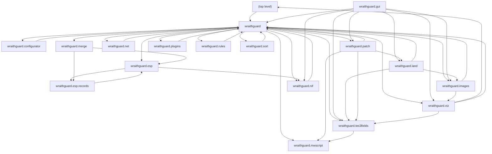
```mermaid
flowchart TD
  n__top_level_["(top level)"]
  n_wraithguard["wraithguard"]
  n_wraithguard_configurator["wraithguard.configurator"]
  n_wraithguard_esp["wraithguard.esp"]
  n_wraithguard_esp_records["wraithguard.esp.records"]
  n_wraithguard_gui["wraithguard.gui"]
  n_wraithguard_images["wraithguard.images"]
  n_wraithguard_land["wraithguard.land"]
  n_wraithguard_merge["wraithguard.merge"]
  n_wraithguard_mwscript["wraithguard.mwscript"]
  n_wraithguard_net["wraithguard.net"]
  n_wraithguard_nif["wraithguard.nif"]
  n_wraithguard_patch["wraithguard.patch"]
  n_wraithguard_plugins["wraithguard.plugins"]
  n_wraithguard_rules["wraithguard.rules"]
  n_wraithguard_sort["wraithguard.sort"]
  n_wraithguard_tes3fields["wraithguard.tes3fields"]
  n_wraithguard_viz["wraithguard.viz"]
  n__top_level_ --> n_wraithguard
  n_wraithguard --> n_wraithguard_configurator
  n_wraithguard --> n_wraithguard_esp
  n_wraithguard --> n_wraithguard_images
  n_wraithguard --> n_wraithguard_merge
  n_wraithguard --> n_wraithguard_mwscript
  n_wraithguard --> n_wraithguard_net
  n_wraithguard --> n_wraithguard_nif
  n_wraithguard --> n_wraithguard_patch
  n_wraithguard --> n_wraithguard_plugins
  n_wraithguard --> n_wraithguard_rules
  n_wraithguard --> n_wraithguard_sort
  n_wraithguard --> n_wraithguard_tes3fields
  n_wraithguard --> n_wraithguard_viz
  n_wraithguard_configurator --> n_wraithguard
  n_wraithguard_esp --> n_wraithguard_esp_records
  n_wraithguard_esp --> n_wraithguard_nif
  n_wraithguard_esp_records --> n_wraithguard_esp
  n_wraithguard_gui --> n_wraithguard
  n_wraithguard_gui --> n_wraithguard_images
  n_wraithguard_gui --> n_wraithguard_land
  n_wraithguard_gui --> n_wraithguard_nif
  n_wraithguard_gui --> n_wraithguard_patch
  n_wraithguard_gui --> n_wraithguard_tes3fields
  n_wraithguard_gui --> n_wraithguard_viz
  n_wraithguard_images --> n_wraithguard
  n_wraithguard_images --> n_wraithguard_viz
  n_wraithguard_land --> n_wraithguard
  n_wraithguard_land --> n_wraithguard_images
  n_wraithguard_land --> n_wraithguard_tes3fields
  n_wraithguard_merge --> n_wraithguard_esp
  n_wraithguard_merge --> n_wraithguard_esp_records
  n_wraithguard_net --> n_wraithguard
  n_wraithguard_nif --> n_wraithguard
  n_wraithguard_patch --> n_wraithguard
  n_wraithguard_patch --> n_wraithguard_land
  n_wraithguard_patch --> n_wraithguard_mwscript
  n_wraithguard_patch --> n_wraithguard_tes3fields
  n_wraithguard_plugins --> n_wraithguard
  n_wraithguard_rules --> n_wraithguard
  n_wraithguard_sort --> n_wraithguard
  n_wraithguard_tes3fields --> n_wraithguard_mwscript
  n_wraithguard_viz --> n__top_level_
  n_wraithguard_viz --> n_wraithguard
  n_wraithguard_viz --> n_wraithguard_tes3fields
```

## Module Dependencies - (top level)

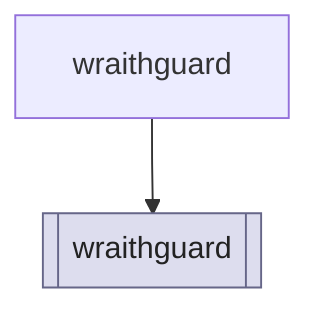
```mermaid
flowchart TD
  n_wraithguard["wraithguard"]
  n_PKG_wraithguard[["wraithguard"]]:::pkglink
  n_wraithguard --> n_PKG_wraithguard
  classDef pkglink fill:#dde,stroke:#668,color:#222
```

## Module Dependencies - wraithguard

```mermaid
flowchart TD
  n_wraithguard_configurator["configurator"]
  n_wraithguard_esp["esp"]
  n_wraithguard_gui["gui"]
  n_wraithguard_i18n["i18n"]
  n_wraithguard_images["images"]
  n_wraithguard_land["land"]
  n_wraithguard_logging_setup["logging_setup"]
  n_wraithguard_merge["merge"]
  n_wraithguard_momw["momw"]
  n_wraithguard_momw_datapaths["momw_datapaths"]
  n_wraithguard_mwscript["mwscript"]
  n_wraithguard_net["net"]
  n_wraithguard_nif["nif"]
  n_wraithguard_patch["patch"]
  n_wraithguard_plugins["plugins"]
  n_wraithguard_proc["proc"]
  n_wraithguard_rtl["rtl"]
  n_wraithguard_rules["rules"]
  n_wraithguard_sort["sort"]
  n_wraithguard_tes3fields["tes3fields"]
  n_wraithguard_tracing["tracing"]
  n_wraithguard_versions["versions"]
  n_wraithguard_viewer_launch["viewer_launch"]
  n_wraithguard_viz["viz"]
  n_PKG_wraithguard_configurator[["wraithguard.configurator"]]:::pkglink
  n_wraithguard_configurator --> n_PKG_wraithguard_configurator
  n_PKG_wraithguard_esp[["wraithguard.esp"]]:::pkglink
  n_wraithguard_esp --> n_PKG_wraithguard_esp
  n_wraithguard_gui --> n_wraithguard_tracing
  n_PKG_wraithguard_images[["wraithguard.images"]]:::pkglink
  n_wraithguard_images --> n_PKG_wraithguard_images
  n_PKG_wraithguard_merge[["wraithguard.merge"]]:::pkglink
  n_wraithguard_merge --> n_PKG_wraithguard_merge
  n_wraithguard_momw_datapaths --> n_PKG_wraithguard_configurator
  n_PKG_wraithguard_mwscript[["wraithguard.mwscript"]]:::pkglink
  n_wraithguard_mwscript --> n_PKG_wraithguard_mwscript
  n_PKG_wraithguard_net[["wraithguard.net"]]:::pkglink
  n_wraithguard_net --> n_PKG_wraithguard_net
  n_PKG_wraithguard_nif[["wraithguard.nif"]]:::pkglink
  n_wraithguard_nif --> n_PKG_wraithguard_nif
  n_PKG_wraithguard_patch[["wraithguard.patch"]]:::pkglink
  n_wraithguard_patch --> n_PKG_wraithguard_patch
  n_PKG_wraithguard_plugins[["wraithguard.plugins"]]:::pkglink
  n_wraithguard_plugins --> n_PKG_wraithguard_plugins
  n_wraithguard_rtl --> n_wraithguard_i18n
  n_PKG_wraithguard_rules[["wraithguard.rules"]]:::pkglink
  n_wraithguard_rules --> n_PKG_wraithguard_rules
  n_PKG_wraithguard_sort[["wraithguard.sort"]]:::pkglink
  n_wraithguard_sort --> n_PKG_wraithguard_sort
  n_PKG_wraithguard_tes3fields[["wraithguard.tes3fields"]]:::pkglink
  n_wraithguard_tes3fields --> n_PKG_wraithguard_tes3fields
  n_PKG_wraithguard_viz[["wraithguard.viz"]]:::pkglink
  n_wraithguard_viz --> n_PKG_wraithguard_viz
  classDef pkglink fill:#dde,stroke:#668,color:#222
```

## Module Dependencies - wraithguard.configurator

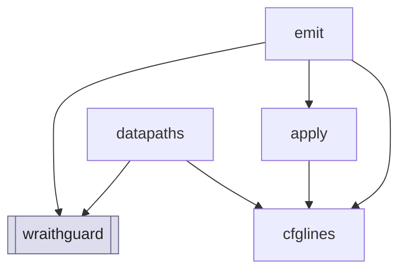
```mermaid
flowchart TD
  n_wraithguard_configurator_apply["apply"]
  n_wraithguard_configurator_cfglines["cfglines"]
  n_wraithguard_configurator_datapaths["datapaths"]
  n_wraithguard_configurator_emit["emit"]
  n_wraithguard_configurator_apply --> n_wraithguard_configurator_cfglines
  n_PKG_wraithguard[["wraithguard"]]:::pkglink
  n_wraithguard_configurator_datapaths --> n_PKG_wraithguard
  n_wraithguard_configurator_datapaths --> n_wraithguard_configurator_cfglines
  n_wraithguard_configurator_emit --> n_PKG_wraithguard
  n_wraithguard_configurator_emit --> n_wraithguard_configurator_apply
  n_wraithguard_configurator_emit --> n_wraithguard_configurator_cfglines
  classDef pkglink fill:#dde,stroke:#668,color:#222
```

## Module Dependencies - wraithguard.esp

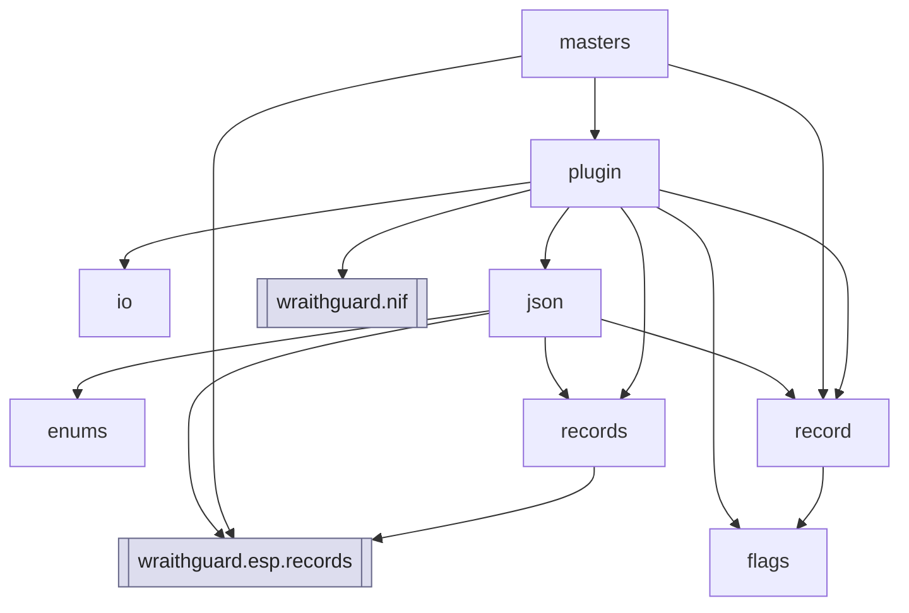
```mermaid
flowchart TD
  n_wraithguard_esp_enums["enums"]
  n_wraithguard_esp_flags["flags"]
  n_wraithguard_esp_io["io"]
  n_wraithguard_esp_json["json"]
  n_wraithguard_esp_masters["masters"]
  n_wraithguard_esp_plugin["plugin"]
  n_wraithguard_esp_record["record"]
  n_wraithguard_esp_records["records"]
  n_PKG_wraithguard_esp_records[["wraithguard.esp.records"]]:::pkglink
  n_wraithguard_esp_json --> n_PKG_wraithguard_esp_records
  n_wraithguard_esp_json --> n_wraithguard_esp_enums
  n_wraithguard_esp_json --> n_wraithguard_esp_record
  n_wraithguard_esp_json --> n_wraithguard_esp_records
  n_wraithguard_esp_masters --> n_PKG_wraithguard_esp_records
  n_wraithguard_esp_masters --> n_wraithguard_esp_plugin
  n_wraithguard_esp_masters --> n_wraithguard_esp_record
  n_PKG_wraithguard_nif[["wraithguard.nif"]]:::pkglink
  n_wraithguard_esp_plugin --> n_PKG_wraithguard_nif
  n_wraithguard_esp_plugin --> n_wraithguard_esp_flags
  n_wraithguard_esp_plugin --> n_wraithguard_esp_io
  n_wraithguard_esp_plugin --> n_wraithguard_esp_json
  n_wraithguard_esp_plugin --> n_wraithguard_esp_record
  n_wraithguard_esp_plugin --> n_wraithguard_esp_records
  n_wraithguard_esp_record --> n_wraithguard_esp_flags
  n_wraithguard_esp_records --> n_PKG_wraithguard_esp_records
  classDef pkglink fill:#dde,stroke:#668,color:#222
```

## Module Dependencies - wraithguard.esp.records

```mermaid
flowchart TD
  n_wraithguard_esp_records__ai["_ai"]
  n_wraithguard_esp_records_activator["activator"]
  n_wraithguard_esp_records_alchemy["alchemy"]
  n_wraithguard_esp_records_apparatus["apparatus"]
  n_wraithguard_esp_records_armor["armor"]
  n_wraithguard_esp_records_bipedobject["bipedobject"]
  n_wraithguard_esp_records_birthsign["birthsign"]
  n_wraithguard_esp_records_bodypart["bodypart"]
  n_wraithguard_esp_records_book["book"]
  n_wraithguard_esp_records_cell["cell"]
  n_wraithguard_esp_records_class_["class_"]
  n_wraithguard_esp_records_clothing["clothing"]
  n_wraithguard_esp_records_container["container"]
  n_wraithguard_esp_records_creature["creature"]
  n_wraithguard_esp_records_dialogue["dialogue"]
  n_wraithguard_esp_records_dialogueinfo["dialogueinfo"]
  n_wraithguard_esp_records_door["door"]
  n_wraithguard_esp_records_effect["effect"]
  n_wraithguard_esp_records_enchanting["enchanting"]
  n_wraithguard_esp_records_faction["faction"]
  n_wraithguard_esp_records_gamesetting["gamesetting"]
  n_wraithguard_esp_records_globalvariable["globalvariable"]
  n_wraithguard_esp_records_header["header"]
  n_wraithguard_esp_records_ingredient["ingredient"]
  n_wraithguard_esp_records_landscape["landscape"]
  n_wraithguard_esp_records_landscapetexture["landscapetexture"]
  n_wraithguard_esp_records_leveledcreature["leveledcreature"]
  n_wraithguard_esp_records_leveleditem["leveleditem"]
  n_wraithguard_esp_records_light["light"]
  n_wraithguard_esp_records_lockpick["lockpick"]
  n_wraithguard_esp_records_magiceffect["magiceffect"]
  n_wraithguard_esp_records_miscitem["miscitem"]
  n_wraithguard_esp_records_npc["npc"]
  n_wraithguard_esp_records_pathgrid["pathgrid"]
  n_wraithguard_esp_records_probe["probe"]
  n_wraithguard_esp_records_race["race"]
  n_wraithguard_esp_records_reference["reference"]
  n_wraithguard_esp_records_region["region"]
  n_wraithguard_esp_records_repairitem["repairitem"]
  n_wraithguard_esp_records_script["script"]
  n_wraithguard_esp_records_skill["skill"]
  n_wraithguard_esp_records_sound["sound"]
  n_wraithguard_esp_records_soundgen["soundgen"]
  n_wraithguard_esp_records_spell["spell"]
  n_wraithguard_esp_records_startscript["startscript"]
  n_wraithguard_esp_records_static_["static_"]
  n_wraithguard_esp_records_weapon["weapon"]
  n_PKG_wraithguard_esp[["wraithguard.esp"]]:::pkglink
  n_wraithguard_esp_records__ai --> n_PKG_wraithguard_esp
  n_wraithguard_esp_records_activator --> n_PKG_wraithguard_esp
  n_wraithguard_esp_records_alchemy --> n_PKG_wraithguard_esp
  n_wraithguard_esp_records_alchemy --> n_wraithguard_esp_records_effect
  n_wraithguard_esp_records_apparatus --> n_PKG_wraithguard_esp
  n_wraithguard_esp_records_armor --> n_PKG_wraithguard_esp
  n_wraithguard_esp_records_armor --> n_wraithguard_esp_records_bipedobject
  n_wraithguard_esp_records_bipedobject --> n_PKG_wraithguard_esp
  n_wraithguard_esp_records_birthsign --> n_PKG_wraithguard_esp
  n_wraithguard_esp_records_bodypart --> n_PKG_wraithguard_esp
  n_wraithguard_esp_records_book --> n_PKG_wraithguard_esp
  n_wraithguard_esp_records_cell --> n_PKG_wraithguard_esp
  n_wraithguard_esp_records_cell --> n_wraithguard_esp_records_reference
  n_wraithguard_esp_records_class_ --> n_PKG_wraithguard_esp
  n_wraithguard_esp_records_clothing --> n_PKG_wraithguard_esp
  n_wraithguard_esp_records_clothing --> n_wraithguard_esp_records_bipedobject
  n_wraithguard_esp_records_container --> n_PKG_wraithguard_esp
  n_wraithguard_esp_records_creature --> n_PKG_wraithguard_esp
  n_wraithguard_esp_records_creature --> n_wraithguard_esp_records__ai
  n_wraithguard_esp_records_dialogue --> n_PKG_wraithguard_esp
  n_wraithguard_esp_records_dialogueinfo --> n_PKG_wraithguard_esp
  n_wraithguard_esp_records_door --> n_PKG_wraithguard_esp
  n_wraithguard_esp_records_effect --> n_PKG_wraithguard_esp
  n_wraithguard_esp_records_enchanting --> n_PKG_wraithguard_esp
  n_wraithguard_esp_records_enchanting --> n_wraithguard_esp_records_effect
  n_wraithguard_esp_records_faction --> n_PKG_wraithguard_esp
  n_wraithguard_esp_records_gamesetting --> n_PKG_wraithguard_esp
  n_wraithguard_esp_records_globalvariable --> n_PKG_wraithguard_esp
  n_wraithguard_esp_records_header --> n_PKG_wraithguard_esp
  n_wraithguard_esp_records_ingredient --> n_PKG_wraithguard_esp
  n_wraithguard_esp_records_landscape --> n_PKG_wraithguard_esp
  n_wraithguard_esp_records_landscapetexture --> n_PKG_wraithguard_esp
  n_wraithguard_esp_records_leveledcreature --> n_PKG_wraithguard_esp
  n_wraithguard_esp_records_leveleditem --> n_PKG_wraithguard_esp
  n_wraithguard_esp_records_light --> n_PKG_wraithguard_esp
  n_wraithguard_esp_records_lockpick --> n_PKG_wraithguard_esp
  n_wraithguard_esp_records_magiceffect --> n_PKG_wraithguard_esp
  n_wraithguard_esp_records_miscitem --> n_PKG_wraithguard_esp
  n_wraithguard_esp_records_npc --> n_PKG_wraithguard_esp
  n_wraithguard_esp_records_npc --> n_wraithguard_esp_records__ai
  n_wraithguard_esp_records_pathgrid --> n_PKG_wraithguard_esp
  n_wraithguard_esp_records_probe --> n_PKG_wraithguard_esp
  n_wraithguard_esp_records_race --> n_PKG_wraithguard_esp
  n_wraithguard_esp_records_reference --> n_wraithguard_esp_records__ai
  n_wraithguard_esp_records_region --> n_PKG_wraithguard_esp
  n_wraithguard_esp_records_repairitem --> n_PKG_wraithguard_esp
  n_wraithguard_esp_records_script --> n_PKG_wraithguard_esp
  n_wraithguard_esp_records_skill --> n_PKG_wraithguard_esp
  n_wraithguard_esp_records_sound --> n_PKG_wraithguard_esp
  n_wraithguard_esp_records_soundgen --> n_PKG_wraithguard_esp
  n_wraithguard_esp_records_spell --> n_PKG_wraithguard_esp
  n_wraithguard_esp_records_spell --> n_wraithguard_esp_records_effect
  n_wraithguard_esp_records_startscript --> n_PKG_wraithguard_esp
  n_wraithguard_esp_records_static_ --> n_PKG_wraithguard_esp
  n_wraithguard_esp_records_weapon --> n_PKG_wraithguard_esp
  classDef pkglink fill:#dde,stroke:#668,color:#222
```

## Module Dependencies - wraithguard.gui

```mermaid
flowchart TD
  n_wraithguard_gui_cellpreview["cellpreview"]
  n_wraithguard_gui_conflict_colors["conflict_colors"]
  n_wraithguard_gui_conflicts["conflicts"]
  n_wraithguard_gui_journalview["journalview"]
  n_wraithguard_gui_patchwin["patchwin"]
  n_wraithguard_gui_pluginview["pluginview"]
  n_wraithguard_gui_removemaster["removemaster"]
  n_wraithguard_gui_rtl["rtl"]
  n_wraithguard_gui_t3["t3"]
  n_wraithguard_gui_theme["theme"]
  n_wraithguard_gui_widgets["widgets"]
  n_PKG_wraithguard[["wraithguard"]]:::pkglink
  n_wraithguard_gui_cellpreview --> n_PKG_wraithguard
  n_PKG_wraithguard_viz[["wraithguard.viz"]]:::pkglink
  n_wraithguard_gui_cellpreview --> n_PKG_wraithguard_viz
  n_wraithguard_gui_cellpreview --> n_wraithguard_gui_theme
  n_PKG_wraithguard_patch[["wraithguard.patch"]]:::pkglink
  n_wraithguard_gui_conflict_colors --> n_PKG_wraithguard_patch
  n_wraithguard_gui_conflicts --> n_PKG_wraithguard
  n_PKG_wraithguard_images[["wraithguard.images"]]:::pkglink
  n_wraithguard_gui_conflicts --> n_PKG_wraithguard_images
  n_PKG_wraithguard_land[["wraithguard.land"]]:::pkglink
  n_wraithguard_gui_conflicts --> n_PKG_wraithguard_land
  n_PKG_wraithguard_nif[["wraithguard.nif"]]:::pkglink
  n_wraithguard_gui_conflicts --> n_PKG_wraithguard_nif
  n_wraithguard_gui_conflicts --> n_PKG_wraithguard_patch
  n_PKG_wraithguard_tes3fields[["wraithguard.tes3fields"]]:::pkglink
  n_wraithguard_gui_conflicts --> n_PKG_wraithguard_tes3fields
  n_wraithguard_gui_conflicts --> n_PKG_wraithguard_viz
  n_wraithguard_gui_conflicts --> n_wraithguard_gui_conflict_colors
  n_wraithguard_gui_conflicts --> n_wraithguard_gui_rtl
  n_wraithguard_gui_conflicts --> n_wraithguard_gui_theme
  n_wraithguard_gui_conflicts --> n_wraithguard_gui_widgets
  n_wraithguard_gui_journalview --> n_PKG_wraithguard
  n_wraithguard_gui_journalview --> n_PKG_wraithguard_patch
  n_wraithguard_gui_journalview --> n_PKG_wraithguard_tes3fields
  n_wraithguard_gui_journalview --> n_wraithguard_gui_rtl
  n_wraithguard_gui_journalview --> n_wraithguard_gui_theme
  n_wraithguard_gui_patchwin --> n_PKG_wraithguard
  n_wraithguard_gui_patchwin --> n_PKG_wraithguard_patch
  n_wraithguard_gui_patchwin --> n_wraithguard_gui_rtl
  n_wraithguard_gui_patchwin --> n_wraithguard_gui_theme
  n_wraithguard_gui_patchwin --> n_wraithguard_gui_widgets
  n_wraithguard_gui_pluginview --> n_PKG_wraithguard
  n_wraithguard_gui_pluginview --> n_PKG_wraithguard_patch
  n_wraithguard_gui_pluginview --> n_wraithguard_gui_conflict_colors
  n_wraithguard_gui_pluginview --> n_wraithguard_gui_rtl
  n_wraithguard_gui_pluginview --> n_wraithguard_gui_theme
  n_wraithguard_gui_pluginview --> n_wraithguard_gui_widgets
  n_wraithguard_gui_removemaster --> n_PKG_wraithguard
  n_wraithguard_gui_removemaster --> n_wraithguard_gui_theme
  n_wraithguard_gui_removemaster --> n_wraithguard_gui_widgets
  n_wraithguard_gui_rtl --> n_PKG_wraithguard
  n_wraithguard_gui_t3 --> n_PKG_wraithguard
  n_wraithguard_gui_t3 --> n_wraithguard_gui_theme
  n_wraithguard_gui_t3 --> n_wraithguard_gui_widgets
  n_wraithguard_gui_theme --> n_PKG_wraithguard
  n_wraithguard_gui_theme --> n_wraithguard_gui_rtl
  n_wraithguard_gui_widgets --> n_PKG_wraithguard
  n_wraithguard_gui_widgets --> n_wraithguard_gui_rtl
  n_wraithguard_gui_widgets --> n_wraithguard_gui_theme
  classDef pkglink fill:#dde,stroke:#668,color:#222
```

## Module Dependencies - wraithguard.images

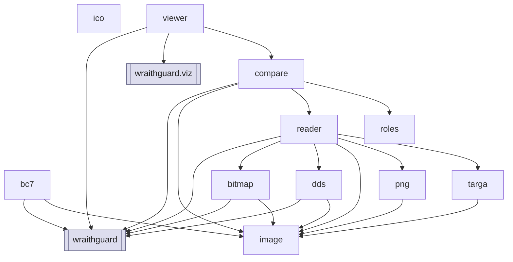
```mermaid
flowchart TD
  n_wraithguard_images_bc7["bc7"]
  n_wraithguard_images_bitmap["bitmap"]
  n_wraithguard_images_compare["compare"]
  n_wraithguard_images_dds["dds"]
  n_wraithguard_images_ico["ico"]
  n_wraithguard_images_image["image"]
  n_wraithguard_images_png["png"]
  n_wraithguard_images_reader["reader"]
  n_wraithguard_images_roles["roles"]
  n_wraithguard_images_targa["targa"]
  n_wraithguard_images_viewer["viewer"]
  n_PKG_wraithguard[["wraithguard"]]:::pkglink
  n_wraithguard_images_bc7 --> n_PKG_wraithguard
  n_wraithguard_images_bc7 --> n_wraithguard_images_image
  n_wraithguard_images_bitmap --> n_PKG_wraithguard
  n_wraithguard_images_bitmap --> n_wraithguard_images_image
  n_wraithguard_images_compare --> n_PKG_wraithguard
  n_wraithguard_images_compare --> n_wraithguard_images_image
  n_wraithguard_images_compare --> n_wraithguard_images_reader
  n_wraithguard_images_compare --> n_wraithguard_images_roles
  n_wraithguard_images_dds --> n_PKG_wraithguard
  n_wraithguard_images_dds --> n_wraithguard_images_image
  n_wraithguard_images_png --> n_wraithguard_images_image
  n_wraithguard_images_reader --> n_PKG_wraithguard
  n_wraithguard_images_reader --> n_wraithguard_images_bitmap
  n_wraithguard_images_reader --> n_wraithguard_images_dds
  n_wraithguard_images_reader --> n_wraithguard_images_image
  n_wraithguard_images_reader --> n_wraithguard_images_png
  n_wraithguard_images_reader --> n_wraithguard_images_targa
  n_wraithguard_images_targa --> n_wraithguard_images_image
  n_wraithguard_images_viewer --> n_PKG_wraithguard
  n_PKG_wraithguard_viz[["wraithguard.viz"]]:::pkglink
  n_wraithguard_images_viewer --> n_PKG_wraithguard_viz
  n_wraithguard_images_viewer --> n_wraithguard_images_compare
  classDef pkglink fill:#dde,stroke:#668,color:#222
```

## Module Dependencies - wraithguard.land

```mermaid
flowchart TD
  n_wraithguard_land_cells["cells"]
  n_wraithguard_land_cleaning["cleaning"]
  n_wraithguard_land_conflict_image["conflict_image"]
  n_wraithguard_land_curvature["curvature"]
  n_wraithguard_land_debug_colors["debug_colors"]
  n_wraithguard_land_diff["diff"]
  n_wraithguard_land_emit["emit"]
  n_wraithguard_land_heights["heights"]
  n_wraithguard_land_landmass["landmass"]
  n_wraithguard_land_merge["merge"]
  n_wraithguard_land_meta["meta"]
  n_wraithguard_land_native["native"]
  n_wraithguard_land_pipeline["pipeline"]
  n_wraithguard_land_preview["preview"]
  n_wraithguard_land_seams["seams"]
  n_wraithguard_land_service["service"]
  n_wraithguard_land_slope["slope"]
  n_wraithguard_land_textures["textures"]
  n_PKG_wraithguard_images[["wraithguard.images"]]:::pkglink
  n_wraithguard_land_conflict_image --> n_PKG_wraithguard_images
  n_PKG_wraithguard_tes3fields[["wraithguard.tes3fields"]]:::pkglink
  n_wraithguard_land_conflict_image --> n_PKG_wraithguard_tes3fields
  n_wraithguard_land_conflict_image --> n_wraithguard_land_debug_colors
  n_wraithguard_land_conflict_image --> n_wraithguard_land_diff
  n_wraithguard_land_conflict_image --> n_wraithguard_land_merge
  n_wraithguard_land_curvature --> n_PKG_wraithguard_tes3fields
  n_wraithguard_land_debug_colors --> n_PKG_wraithguard_tes3fields
  n_wraithguard_land_debug_colors --> n_wraithguard_land_diff
  n_wraithguard_land_debug_colors --> n_wraithguard_land_merge
  n_wraithguard_land_diff --> n_PKG_wraithguard_tes3fields
  n_wraithguard_land_emit --> n_PKG_wraithguard_tes3fields
  n_wraithguard_land_emit --> n_wraithguard_land_heights
  n_wraithguard_land_emit --> n_wraithguard_land_textures
  n_wraithguard_land_heights --> n_PKG_wraithguard_tes3fields
  n_wraithguard_land_landmass --> n_wraithguard_land_diff
  n_wraithguard_land_landmass --> n_wraithguard_land_meta
  n_wraithguard_land_landmass --> n_wraithguard_land_textures
  n_wraithguard_land_merge --> n_wraithguard_land_diff
  n_wraithguard_land_meta --> n_wraithguard_land_diff
  n_wraithguard_land_meta --> n_wraithguard_land_merge
  n_wraithguard_land_pipeline --> n_PKG_wraithguard_tes3fields
  n_wraithguard_land_pipeline --> n_wraithguard_land_cleaning
  n_wraithguard_land_pipeline --> n_wraithguard_land_diff
  n_wraithguard_land_pipeline --> n_wraithguard_land_landmass
  n_wraithguard_land_pipeline --> n_wraithguard_land_merge
  n_wraithguard_land_pipeline --> n_wraithguard_land_meta
  n_wraithguard_land_pipeline --> n_wraithguard_land_seams
  n_wraithguard_land_pipeline --> n_wraithguard_land_slope
  n_wraithguard_land_pipeline --> n_wraithguard_land_textures
  n_wraithguard_land_preview --> n_PKG_wraithguard_tes3fields
  n_wraithguard_land_preview --> n_wraithguard_land_diff
  n_wraithguard_land_preview --> n_wraithguard_land_merge
  n_wraithguard_land_seams --> n_PKG_wraithguard_tes3fields
  n_PKG_wraithguard[["wraithguard"]]:::pkglink
  n_wraithguard_land_service --> n_PKG_wraithguard
  n_wraithguard_land_service --> n_PKG_wraithguard_tes3fields
  n_wraithguard_land_service --> n_wraithguard_land_cells
  n_wraithguard_land_service --> n_wraithguard_land_emit
  n_wraithguard_land_service --> n_wraithguard_land_landmass
  n_wraithguard_land_service --> n_wraithguard_land_merge
  n_wraithguard_land_service --> n_wraithguard_land_meta
  n_wraithguard_land_service --> n_wraithguard_land_native
  n_wraithguard_land_service --> n_wraithguard_land_pipeline
  n_wraithguard_land_service --> n_wraithguard_land_textures
  n_wraithguard_land_slope --> n_PKG_wraithguard_tes3fields
  n_wraithguard_land_slope --> n_wraithguard_land_curvature
  n_wraithguard_land_textures --> n_wraithguard_land_diff
  classDef pkglink fill:#dde,stroke:#668,color:#222
```

## Module Dependencies - wraithguard.merge

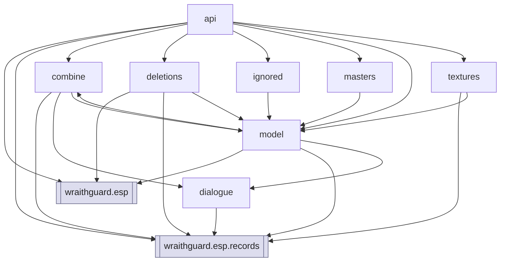
```mermaid
flowchart TD
  n_wraithguard_merge_api["api"]
  n_wraithguard_merge_combine["combine"]
  n_wraithguard_merge_deletions["deletions"]
  n_wraithguard_merge_dialogue["dialogue"]
  n_wraithguard_merge_ignored["ignored"]
  n_wraithguard_merge_masters["masters"]
  n_wraithguard_merge_model["model"]
  n_wraithguard_merge_textures["textures"]
  n_PKG_wraithguard_esp[["wraithguard.esp"]]:::pkglink
  n_wraithguard_merge_api --> n_PKG_wraithguard_esp
  n_PKG_wraithguard_esp_records[["wraithguard.esp.records"]]:::pkglink
  n_wraithguard_merge_api --> n_PKG_wraithguard_esp_records
  n_wraithguard_merge_api --> n_wraithguard_merge_combine
  n_wraithguard_merge_api --> n_wraithguard_merge_deletions
  n_wraithguard_merge_api --> n_wraithguard_merge_ignored
  n_wraithguard_merge_api --> n_wraithguard_merge_masters
  n_wraithguard_merge_api --> n_wraithguard_merge_model
  n_wraithguard_merge_api --> n_wraithguard_merge_textures
  n_wraithguard_merge_combine --> n_PKG_wraithguard_esp_records
  n_wraithguard_merge_combine --> n_wraithguard_merge_dialogue
  n_wraithguard_merge_combine --> n_wraithguard_merge_model
  n_wraithguard_merge_deletions --> n_PKG_wraithguard_esp
  n_wraithguard_merge_deletions --> n_PKG_wraithguard_esp_records
  n_wraithguard_merge_deletions --> n_wraithguard_merge_model
  n_wraithguard_merge_dialogue --> n_PKG_wraithguard_esp_records
  n_wraithguard_merge_ignored --> n_wraithguard_merge_model
  n_wraithguard_merge_masters --> n_wraithguard_merge_model
  n_wraithguard_merge_model --> n_PKG_wraithguard_esp
  n_wraithguard_merge_model --> n_PKG_wraithguard_esp_records
  n_wraithguard_merge_model --> n_wraithguard_merge_combine
  n_wraithguard_merge_model --> n_wraithguard_merge_dialogue
  n_wraithguard_merge_textures --> n_PKG_wraithguard_esp_records
  n_wraithguard_merge_textures --> n_wraithguard_merge_model
  classDef pkglink fill:#dde,stroke:#668,color:#222
```

## Module Dependencies - wraithguard.mwscript

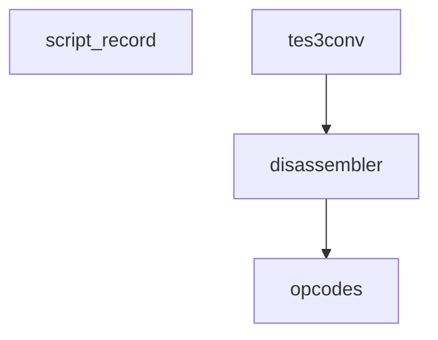
```mermaid
flowchart TD
  n_wraithguard_mwscript_disassembler["disassembler"]
  n_wraithguard_mwscript_opcodes["opcodes"]
  n_wraithguard_mwscript_script_record["script_record"]
  n_wraithguard_mwscript_tes3conv["tes3conv"]
  n_wraithguard_mwscript_disassembler --> n_wraithguard_mwscript_opcodes
  n_wraithguard_mwscript_tes3conv --> n_wraithguard_mwscript_disassembler
```

## Module Dependencies - wraithguard.net

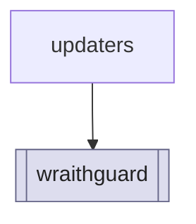
```mermaid
flowchart TD
  n_wraithguard_net_updaters["updaters"]
  n_PKG_wraithguard[["wraithguard"]]:::pkglink
  n_wraithguard_net_updaters --> n_PKG_wraithguard
  classDef pkglink fill:#dde,stroke:#668,color:#222
```

## Module Dependencies - wraithguard.nif

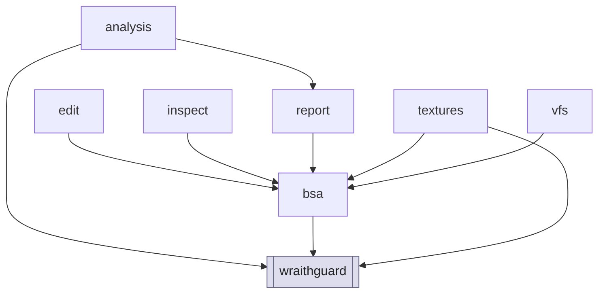
```mermaid
flowchart TD
  n_wraithguard_nif_analysis["analysis"]
  n_wraithguard_nif_bsa["bsa"]
  n_wraithguard_nif_edit["edit"]
  n_wraithguard_nif_inspect["inspect"]
  n_wraithguard_nif_report["report"]
  n_wraithguard_nif_textures["textures"]
  n_wraithguard_nif_vfs["vfs"]
  n_PKG_wraithguard[["wraithguard"]]:::pkglink
  n_wraithguard_nif_analysis --> n_PKG_wraithguard
  n_wraithguard_nif_analysis --> n_wraithguard_nif_report
  n_wraithguard_nif_bsa --> n_PKG_wraithguard
  n_wraithguard_nif_edit --> n_wraithguard_nif_bsa
  n_wraithguard_nif_inspect --> n_wraithguard_nif_bsa
  n_wraithguard_nif_report --> n_wraithguard_nif_bsa
  n_wraithguard_nif_textures --> n_PKG_wraithguard
  n_wraithguard_nif_textures --> n_wraithguard_nif_bsa
  n_wraithguard_nif_vfs --> n_wraithguard_nif_bsa
  classDef pkglink fill:#dde,stroke:#668,color:#222
```

## Module Dependencies - wraithguard.patch

```mermaid
flowchart TD
  n_wraithguard_patch_align["align"]
  n_wraithguard_patch_bulk["bulk"]
  n_wraithguard_patch_dialogue["dialogue"]
  n_wraithguard_patch_enum_data["enum_data"]
  n_wraithguard_patch_enums["enums"]
  n_wraithguard_patch_field_types["field_types"]
  n_wraithguard_patch_fieldtypes["fieldtypes"]
  n_wraithguard_patch_journal["journal"]
  n_wraithguard_patch_journal_scripts["journal_scripts"]
  n_wraithguard_patch_merge["merge"]
  n_wraithguard_patch_queue["queue"]
  n_wraithguard_patch_records["records"]
  n_wraithguard_patch_service["service"]
  n_wraithguard_patch_status["status"]
  n_wraithguard_patch_summary["summary"]
  n_wraithguard_patch_values["values"]
  n_wraithguard_patch_align --> n_wraithguard_patch_status
  n_wraithguard_patch_bulk --> n_wraithguard_patch_merge
  n_wraithguard_patch_enums --> n_wraithguard_patch_enum_data
  n_wraithguard_patch_fieldtypes --> n_wraithguard_patch_field_types
  n_wraithguard_patch_journal --> n_wraithguard_patch_records
  n_PKG_wraithguard_mwscript[["wraithguard.mwscript"]]:::pkglink
  n_wraithguard_patch_journal_scripts --> n_PKG_wraithguard_mwscript
  n_PKG_wraithguard_tes3fields[["wraithguard.tes3fields"]]:::pkglink
  n_wraithguard_patch_journal_scripts --> n_PKG_wraithguard_tes3fields
  n_wraithguard_patch_journal_scripts --> n_wraithguard_patch_journal
  n_wraithguard_patch_merge --> n_wraithguard_patch_records
  n_wraithguard_patch_queue --> n_wraithguard_patch_merge
  n_wraithguard_patch_queue --> n_wraithguard_patch_records
  n_PKG_wraithguard[["wraithguard"]]:::pkglink
  n_wraithguard_patch_service --> n_PKG_wraithguard
  n_PKG_wraithguard_land[["wraithguard.land"]]:::pkglink
  n_wraithguard_patch_service --> n_PKG_wraithguard_land
  n_wraithguard_patch_service --> n_wraithguard_patch_dialogue
  n_wraithguard_patch_service --> n_wraithguard_patch_merge
  n_wraithguard_patch_service --> n_wraithguard_patch_records
  n_wraithguard_patch_summary --> n_wraithguard_patch_status
  n_wraithguard_patch_values --> n_wraithguard_patch_records
  classDef pkglink fill:#dde,stroke:#668,color:#222
```

## Module Dependencies - wraithguard.plugins

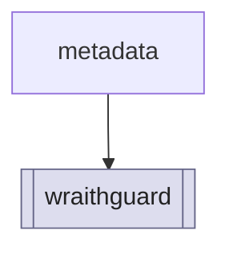
```mermaid
flowchart TD
  n_wraithguard_plugins_metadata["metadata"]
  n_PKG_wraithguard[["wraithguard"]]:::pkglink
  n_wraithguard_plugins_metadata --> n_PKG_wraithguard
  classDef pkglink fill:#dde,stroke:#668,color:#222
```

## Module Dependencies - wraithguard.rules

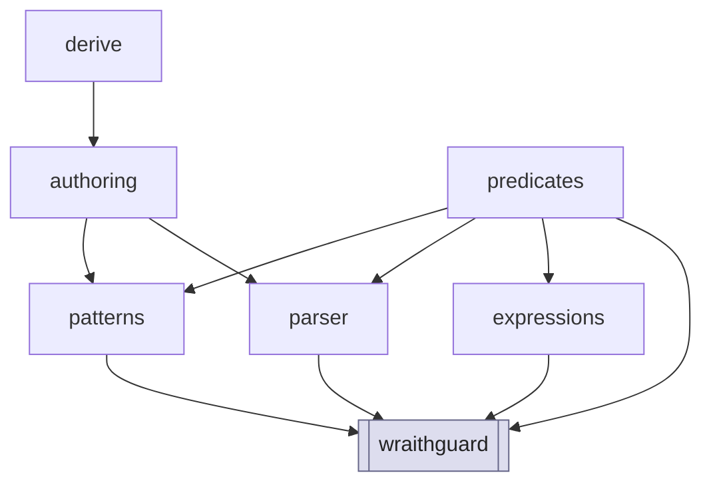
```mermaid
flowchart TD
  n_wraithguard_rules_authoring["authoring"]
  n_wraithguard_rules_derive["derive"]
  n_wraithguard_rules_expressions["expressions"]
  n_wraithguard_rules_parser["parser"]
  n_wraithguard_rules_patterns["patterns"]
  n_wraithguard_rules_predicates["predicates"]
  n_wraithguard_rules_authoring --> n_wraithguard_rules_parser
  n_wraithguard_rules_authoring --> n_wraithguard_rules_patterns
  n_wraithguard_rules_derive --> n_wraithguard_rules_authoring
  n_PKG_wraithguard[["wraithguard"]]:::pkglink
  n_wraithguard_rules_expressions --> n_PKG_wraithguard
  n_wraithguard_rules_parser --> n_PKG_wraithguard
  n_wraithguard_rules_patterns --> n_PKG_wraithguard
  n_wraithguard_rules_predicates --> n_PKG_wraithguard
  n_wraithguard_rules_predicates --> n_wraithguard_rules_expressions
  n_wraithguard_rules_predicates --> n_wraithguard_rules_parser
  n_wraithguard_rules_predicates --> n_wraithguard_rules_patterns
  classDef pkglink fill:#dde,stroke:#668,color:#222
```

## Module Dependencies - wraithguard.sort

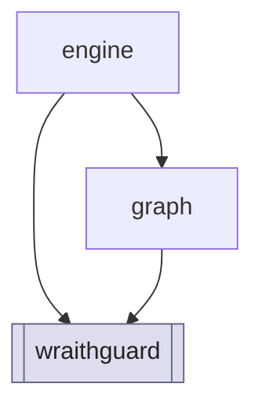
```mermaid
flowchart TD
  n_wraithguard_sort_engine["engine"]
  n_wraithguard_sort_graph["graph"]
  n_PKG_wraithguard[["wraithguard"]]:::pkglink
  n_wraithguard_sort_engine --> n_PKG_wraithguard
  n_wraithguard_sort_engine --> n_wraithguard_sort_graph
  n_wraithguard_sort_graph --> n_PKG_wraithguard
  classDef pkglink fill:#dde,stroke:#668,color:#222
```

## Module Dependencies - wraithguard.tes3fields

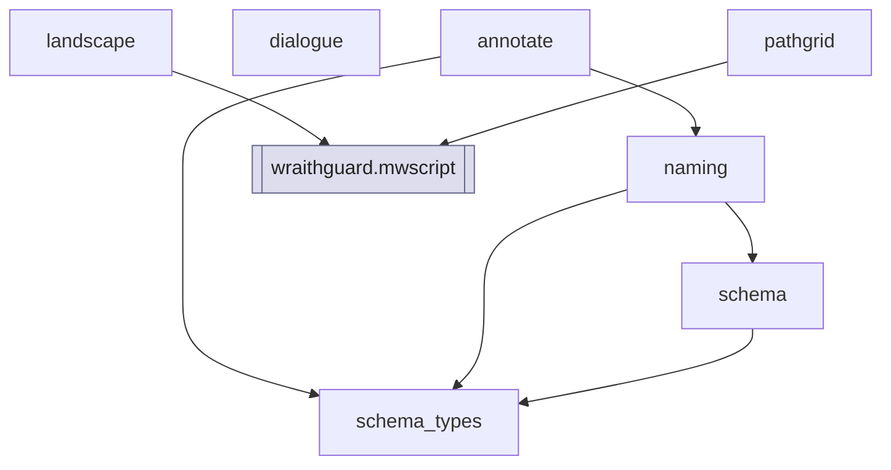
```mermaid
flowchart TD
  n_wraithguard_tes3fields_annotate["annotate"]
  n_wraithguard_tes3fields_dialogue["dialogue"]
  n_wraithguard_tes3fields_landscape["landscape"]
  n_wraithguard_tes3fields_naming["naming"]
  n_wraithguard_tes3fields_pathgrid["pathgrid"]
  n_wraithguard_tes3fields_schema["schema"]
  n_wraithguard_tes3fields_schema_types["schema_types"]
  n_wraithguard_tes3fields_annotate --> n_wraithguard_tes3fields_naming
  n_wraithguard_tes3fields_annotate --> n_wraithguard_tes3fields_schema_types
  n_PKG_wraithguard_mwscript[["wraithguard.mwscript"]]:::pkglink
  n_wraithguard_tes3fields_landscape --> n_PKG_wraithguard_mwscript
  n_wraithguard_tes3fields_naming --> n_wraithguard_tes3fields_schema
  n_wraithguard_tes3fields_naming --> n_wraithguard_tes3fields_schema_types
  n_wraithguard_tes3fields_pathgrid --> n_PKG_wraithguard_mwscript
  n_wraithguard_tes3fields_schema --> n_wraithguard_tes3fields_schema_types
  classDef pkglink fill:#dde,stroke:#668,color:#222
```

## Module Dependencies - wraithguard.viz

```mermaid
flowchart TD
  n_wraithguard_viz_cellmap["cellmap"]
  n_wraithguard_viz_cellmap_js["cellmap_js"]
  n_wraithguard_viz_conflictmap["conflictmap"]
  n_wraithguard_viz_docs["docs"]
  n_wraithguard_viz_geometry["geometry"]
  n_wraithguard_viz_heightdelta["heightdelta"]
  n_wraithguard_viz_housekeeping["housekeeping"]
  n_wraithguard_viz_html["html"]
  n_wraithguard_viz_library["library"]
  n_wraithguard_viz_palette["palette"]
  n_wraithguard_viz_pathgrid["pathgrid"]
  n_wraithguard_viz_serve["serve"]
  n_wraithguard_viz_terrain3d["terrain3d"]
  n_wraithguard_viz_cellmap --> n_wraithguard_viz_cellmap_js
  n_wraithguard_viz_cellmap --> n_wraithguard_viz_palette
  n_PKG__top_level_[["(top level)"]]:::pkglink
  n_wraithguard_viz_conflictmap --> n_PKG__top_level_
  n_PKG_wraithguard[["wraithguard"]]:::pkglink
  n_wraithguard_viz_conflictmap --> n_PKG_wraithguard
  n_wraithguard_viz_conflictmap --> n_wraithguard_viz_geometry
  n_wraithguard_viz_conflictmap --> n_wraithguard_viz_html
  n_wraithguard_viz_conflictmap --> n_wraithguard_viz_palette
  n_wraithguard_viz_docs --> n_PKG__top_level_
  n_wraithguard_viz_heightdelta --> n_PKG__top_level_
  n_wraithguard_viz_heightdelta --> n_PKG_wraithguard
  n_PKG_wraithguard_tes3fields[["wraithguard.tes3fields"]]:::pkglink
  n_wraithguard_viz_heightdelta --> n_PKG_wraithguard_tes3fields
  n_wraithguard_viz_heightdelta --> n_wraithguard_viz_html
  n_wraithguard_viz_heightdelta --> n_wraithguard_viz_palette
  n_wraithguard_viz_html --> n_PKG__top_level_
  n_wraithguard_viz_library --> n_PKG_wraithguard
  n_wraithguard_viz_pathgrid --> n_PKG__top_level_
  n_wraithguard_viz_pathgrid --> n_PKG_wraithguard
  n_wraithguard_viz_pathgrid --> n_PKG_wraithguard_tes3fields
  n_wraithguard_viz_pathgrid --> n_wraithguard_viz_html
  n_wraithguard_viz_serve --> n_PKG_wraithguard
  n_wraithguard_viz_terrain3d --> n_PKG__top_level_
  n_wraithguard_viz_terrain3d --> n_PKG_wraithguard
  n_wraithguard_viz_terrain3d --> n_PKG_wraithguard_tes3fields
  n_wraithguard_viz_terrain3d --> n_wraithguard_viz_html
  n_wraithguard_viz_terrain3d --> n_wraithguard_viz_palette
  classDef pkglink fill:#dde,stroke:#668,color:#222
```

## Class Hierarchy - wraithguard

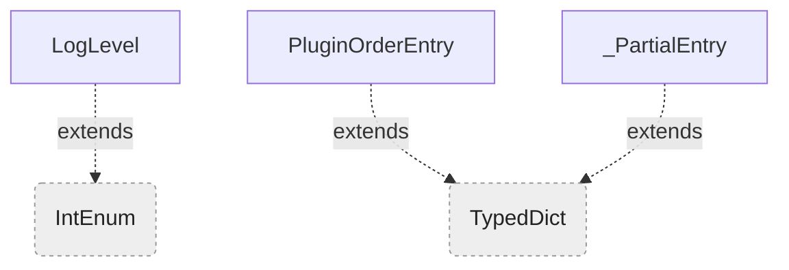
```mermaid
flowchart TD
  n_wraithguard_logging_setup_LogLevel["LogLevel"]
  n_wraithguard_momw_PluginOrderEntry["PluginOrderEntry"]
  n_wraithguard_momw__PartialEntry["_PartialEntry"]
  n_EXTBASE_IntEnum("IntEnum"):::external
  n_wraithguard_logging_setup_LogLevel -.->|extends| n_EXTBASE_IntEnum
  n_EXTBASE_TypedDict("TypedDict"):::external
  n_wraithguard_momw_PluginOrderEntry -.->|extends| n_EXTBASE_TypedDict
  n_wraithguard_momw__PartialEntry -.->|extends| n_EXTBASE_TypedDict
  classDef external fill:#eee,stroke:#999,stroke-dasharray: 3 3,color:#222
```

## Class Hierarchy - wraithguard.esp

```mermaid
flowchart TD
  n_wraithguard_esp_enums_ApparatusType["ApparatusType"]
  n_wraithguard_esp_enums_ArmorType["ArmorType"]
  n_wraithguard_esp_enums_AttributeId["AttributeId"]
  n_wraithguard_esp_enums_AttributeId2["AttributeId2"]
  n_wraithguard_esp_enums_BipedObjectType["BipedObjectType"]
  n_wraithguard_esp_enums_BodypartId["BodypartId"]
  n_wraithguard_esp_enums_BodypartType["BodypartType"]
  n_wraithguard_esp_enums_BookType["BookType"]
  n_wraithguard_esp_enums_ClothingType["ClothingType"]
  n_wraithguard_esp_enums_CreatureType["CreatureType"]
  n_wraithguard_esp_enums_DialogueType["DialogueType"]
  n_wraithguard_esp_enums_DialogueType2["DialogueType2"]
  n_wraithguard_esp_enums_EffectId["EffectId"]
  n_wraithguard_esp_enums_EffectId2["EffectId2"]
  n_wraithguard_esp_enums_EffectRange["EffectRange"]
  n_wraithguard_esp_enums_EffectSchool["EffectSchool"]
  n_wraithguard_esp_enums_EnchantType["EnchantType"]
  n_wraithguard_esp_enums_EspEnum["EspEnum"]
  n_wraithguard_esp_enums_FileType["FileType"]
  n_wraithguard_esp_enums_FilterComparison["FilterComparison"]
  n_wraithguard_esp_enums_FilterFunction["FilterFunction"]
  n_wraithguard_esp_enums_FilterType["FilterType"]
  n_wraithguard_esp_enums_GlobalType["GlobalType"]
  n_wraithguard_esp_enums_Sex["Sex"]
  n_wraithguard_esp_enums_SkillId["SkillId"]
  n_wraithguard_esp_enums_SkillId2["SkillId2"]
  n_wraithguard_esp_enums_SoundGenType["SoundGenType"]
  n_wraithguard_esp_enums_Specialization["Specialization"]
  n_wraithguard_esp_enums_SpellType["SpellType"]
  n_wraithguard_esp_enums_WeaponType["WeaponType"]
  n_wraithguard_esp_flags_AlchemyFlags["AlchemyFlags"]
  n_wraithguard_esp_flags_BodypartFlags["BodypartFlags"]
  n_wraithguard_esp_flags_CellFlags["CellFlags"]
  n_wraithguard_esp_flags_ClassFlags["ClassFlags"]
  n_wraithguard_esp_flags_ContainerFlags["ContainerFlags"]
  n_wraithguard_esp_flags_CreatureFlags["CreatureFlags"]
  n_wraithguard_esp_flags_EnchantingFlags["EnchantingFlags"]
  n_wraithguard_esp_flags_FactionFlags["FactionFlags"]
  n_wraithguard_esp_flags_LandscapeFlags["LandscapeFlags"]
  n_wraithguard_esp_flags_LeveledCreatureFlags["LeveledCreatureFlags"]
  n_wraithguard_esp_flags_LeveledItemFlags["LeveledItemFlags"]
  n_wraithguard_esp_flags_LightFlags["LightFlags"]
  n_wraithguard_esp_flags_MagicEffectFlags["MagicEffectFlags"]
  n_wraithguard_esp_flags_MiscItemFlags["MiscItemFlags"]
  n_wraithguard_esp_flags_NpcFlags["NpcFlags"]
  n_wraithguard_esp_flags_ObjectFlags["ObjectFlags"]
  n_wraithguard_esp_flags_RaceFlags["RaceFlags"]
  n_wraithguard_esp_flags_ServiceFlags["ServiceFlags"]
  n_wraithguard_esp_flags_SpellFlags["SpellFlags"]
  n_wraithguard_esp_flags_WeaponFlags["WeaponFlags"]
  n_wraithguard_esp_io_EspError["EspError"]
  n_wraithguard_esp_json_EspJsonError["EspJsonError"]
  n_wraithguard_esp_masters_RemoveMasterReport["RemoveMasterReport"]
  n_wraithguard_esp_masters_RenameMasterReport["RenameMasterReport"]
  n_wraithguard_esp_record_Record["Record"]
  n_wraithguard_esp_record_UnknownRecord["UnknownRecord"]
  n_EXTBASE_enum_IntEnum("enum.IntEnum"):::external
  n_wraithguard_esp_enums_EspEnum -.->|extends| n_EXTBASE_enum_IntEnum
  n_wraithguard_esp_enums_ApparatusType -->|extends| n_wraithguard_esp_enums_EspEnum
  n_wraithguard_esp_enums_ArmorType -->|extends| n_wraithguard_esp_enums_EspEnum
  n_wraithguard_esp_enums_AttributeId -->|extends| n_wraithguard_esp_enums_EspEnum
  n_wraithguard_esp_enums_AttributeId2 -->|extends| n_wraithguard_esp_enums_EspEnum
  n_wraithguard_esp_enums_BipedObjectType -->|extends| n_wraithguard_esp_enums_EspEnum
  n_wraithguard_esp_enums_BodypartId -->|extends| n_wraithguard_esp_enums_EspEnum
  n_wraithguard_esp_enums_BodypartType -->|extends| n_wraithguard_esp_enums_EspEnum
  n_wraithguard_esp_enums_BookType -->|extends| n_wraithguard_esp_enums_EspEnum
  n_wraithguard_esp_enums_ClothingType -->|extends| n_wraithguard_esp_enums_EspEnum
  n_wraithguard_esp_enums_CreatureType -->|extends| n_wraithguard_esp_enums_EspEnum
  n_wraithguard_esp_enums_DialogueType -->|extends| n_wraithguard_esp_enums_EspEnum
  n_wraithguard_esp_enums_DialogueType2 -->|extends| n_wraithguard_esp_enums_EspEnum
  n_wraithguard_esp_enums_EffectId -->|extends| n_wraithguard_esp_enums_EspEnum
  n_wraithguard_esp_enums_EffectId2 -->|extends| n_wraithguard_esp_enums_EspEnum
  n_wraithguard_esp_enums_EffectRange -->|extends| n_wraithguard_esp_enums_EspEnum
  n_wraithguard_esp_enums_EffectSchool -->|extends| n_wraithguard_esp_enums_EspEnum
  n_wraithguard_esp_enums_EnchantType -->|extends| n_wraithguard_esp_enums_EspEnum
  n_wraithguard_esp_enums_FileType -->|extends| n_wraithguard_esp_enums_EspEnum
  n_wraithguard_esp_enums_FilterComparison -->|extends| n_wraithguard_esp_enums_EspEnum
  n_wraithguard_esp_enums_FilterFunction -->|extends| n_wraithguard_esp_enums_EspEnum
  n_wraithguard_esp_enums_FilterType -->|extends| n_wraithguard_esp_enums_EspEnum
  n_wraithguard_esp_enums_GlobalType -->|extends| n_wraithguard_esp_enums_EspEnum
  n_wraithguard_esp_enums_Sex -->|extends| n_wraithguard_esp_enums_EspEnum
  n_wraithguard_esp_enums_SkillId -->|extends| n_wraithguard_esp_enums_EspEnum
  n_wraithguard_esp_enums_SkillId2 -->|extends| n_wraithguard_esp_enums_EspEnum
  n_wraithguard_esp_enums_SoundGenType -->|extends| n_wraithguard_esp_enums_EspEnum
  n_wraithguard_esp_enums_Specialization -->|extends| n_wraithguard_esp_enums_EspEnum
  n_wraithguard_esp_enums_SpellType -->|extends| n_wraithguard_esp_enums_EspEnum
  n_wraithguard_esp_enums_WeaponType -->|extends| n_wraithguard_esp_enums_EspEnum
  n_EXTBASE_enum_IntFlag("enum.IntFlag"):::external
  n_wraithguard_esp_flags_AlchemyFlags -.->|extends| n_EXTBASE_enum_IntFlag
  n_wraithguard_esp_flags_BodypartFlags -.->|extends| n_EXTBASE_enum_IntFlag
  n_wraithguard_esp_flags_CellFlags -.->|extends| n_EXTBASE_enum_IntFlag
  n_wraithguard_esp_flags_ClassFlags -.->|extends| n_EXTBASE_enum_IntFlag
  n_wraithguard_esp_flags_ContainerFlags -.->|extends| n_EXTBASE_enum_IntFlag
  n_wraithguard_esp_flags_CreatureFlags -.->|extends| n_EXTBASE_enum_IntFlag
  n_wraithguard_esp_flags_EnchantingFlags -.->|extends| n_EXTBASE_enum_IntFlag
  n_wraithguard_esp_flags_FactionFlags -.->|extends| n_EXTBASE_enum_IntFlag
  n_wraithguard_esp_flags_LandscapeFlags -.->|extends| n_EXTBASE_enum_IntFlag
  n_wraithguard_esp_flags_LeveledCreatureFlags -.->|extends| n_EXTBASE_enum_IntFlag
  n_wraithguard_esp_flags_LeveledItemFlags -.->|extends| n_EXTBASE_enum_IntFlag
  n_wraithguard_esp_flags_LightFlags -.->|extends| n_EXTBASE_enum_IntFlag
  n_wraithguard_esp_flags_MagicEffectFlags -.->|extends| n_EXTBASE_enum_IntFlag
  n_wraithguard_esp_flags_MiscItemFlags -.->|extends| n_EXTBASE_enum_IntFlag
  n_wraithguard_esp_flags_NpcFlags -.->|extends| n_EXTBASE_enum_IntFlag
  n_wraithguard_esp_flags_ObjectFlags -.->|extends| n_EXTBASE_enum_IntFlag
  n_wraithguard_esp_flags_RaceFlags -.->|extends| n_EXTBASE_enum_IntFlag
  n_wraithguard_esp_flags_ServiceFlags -.->|extends| n_EXTBASE_enum_IntFlag
  n_wraithguard_esp_flags_SpellFlags -.->|extends| n_EXTBASE_enum_IntFlag
  n_wraithguard_esp_flags_WeaponFlags -.->|extends| n_EXTBASE_enum_IntFlag
  n_EXTBASE_Exception("Exception"):::external
  n_wraithguard_esp_io_EspError -.->|extends| n_EXTBASE_Exception
  n_EXTBASE_ValueError("ValueError"):::external
  n_wraithguard_esp_json_EspJsonError -.->|extends| n_EXTBASE_ValueError
  n_EXTBASE_ABC("ABC"):::external
  n_wraithguard_esp_record_Record -.->|extends| n_EXTBASE_ABC
  n_EXTBASE_Record("Record"):::external
  n_wraithguard_esp_record_UnknownRecord -.->|extends| n_EXTBASE_Record
  classDef external fill:#eee,stroke:#999,stroke-dasharray: 3 3,color:#222
```

## Class Hierarchy - wraithguard.esp.records

```mermaid
flowchart TD
  n_wraithguard_esp_records__ai_AiActivatePackage["AiActivatePackage"]
  n_wraithguard_esp_records__ai_AiData["AiData"]
  n_wraithguard_esp_records__ai_AiEscortPackage["AiEscortPackage"]
  n_wraithguard_esp_records__ai_AiFollowPackage["AiFollowPackage"]
  n_wraithguard_esp_records__ai_AiTravelPackage["AiTravelPackage"]
  n_wraithguard_esp_records__ai_AiWanderPackage["AiWanderPackage"]
  n_wraithguard_esp_records__ai_TravelDestination["TravelDestination"]
  n_wraithguard_esp_records__ai__TargetPackage["_TargetPackage"]
  n_wraithguard_esp_records_activator_Activator["Activator"]
  n_wraithguard_esp_records_alchemy_Alchemy["Alchemy"]
  n_wraithguard_esp_records_alchemy_AlchemyData["AlchemyData"]
  n_wraithguard_esp_records_apparatus_Apparatus["Apparatus"]
  n_wraithguard_esp_records_apparatus_ApparatusData["ApparatusData"]
  n_wraithguard_esp_records_armor_Armor["Armor"]
  n_wraithguard_esp_records_armor_ArmorData["ArmorData"]
  n_wraithguard_esp_records_bipedobject_BipedObject["BipedObject"]
  n_wraithguard_esp_records_birthsign_Birthsign["Birthsign"]
  n_wraithguard_esp_records_bodypart_Bodypart["Bodypart"]
  n_wraithguard_esp_records_bodypart_BodypartData["BodypartData"]
  n_wraithguard_esp_records_book_Book["Book"]
  n_wraithguard_esp_records_book_BookData["BookData"]
  n_wraithguard_esp_records_cell_AtmosphereData["AtmosphereData"]
  n_wraithguard_esp_records_cell_Cell["Cell"]
  n_wraithguard_esp_records_cell_CellData["CellData"]
  n_wraithguard_esp_records_class__Class["Class"]
  n_wraithguard_esp_records_class__ClassData["ClassData"]
  n_wraithguard_esp_records_clothing_Clothing["Clothing"]
  n_wraithguard_esp_records_clothing_ClothingData["ClothingData"]
  n_wraithguard_esp_records_container_Container["Container"]
  n_wraithguard_esp_records_creature_Creature["Creature"]
  n_wraithguard_esp_records_creature_CreatureData["CreatureData"]
  n_wraithguard_esp_records_dialogue_Dialogue["Dialogue"]
  n_wraithguard_esp_records_dialogueinfo_DialogueData["DialogueData"]
  n_wraithguard_esp_records_dialogueinfo_DialogueInfo["DialogueInfo"]
  n_wraithguard_esp_records_dialogueinfo_Filter["Filter"]
  n_wraithguard_esp_records_door_Door["Door"]
  n_wraithguard_esp_records_effect_Effect["Effect"]
  n_wraithguard_esp_records_enchanting_Enchanting["Enchanting"]
  n_wraithguard_esp_records_enchanting_EnchantingData["EnchantingData"]
  n_wraithguard_esp_records_faction_Faction["Faction"]
  n_wraithguard_esp_records_faction_FactionData["FactionData"]
  n_wraithguard_esp_records_faction_FactionReaction["FactionReaction"]
  n_wraithguard_esp_records_faction_FactionRequirement["FactionRequirement"]
  n_wraithguard_esp_records_gamesetting_GameSetting["GameSetting"]
  n_wraithguard_esp_records_globalvariable_GlobalVariable["GlobalVariable"]
  n_wraithguard_esp_records_header_Header["Header"]
  n_wraithguard_esp_records_ingredient_Ingredient["Ingredient"]
  n_wraithguard_esp_records_ingredient_IngredientData["IngredientData"]
  n_wraithguard_esp_records_landscape_Landscape["Landscape"]
  n_wraithguard_esp_records_landscapetexture_LandscapeTexture["LandscapeTexture"]
  n_wraithguard_esp_records_leveledcreature_LeveledCreature["LeveledCreature"]
  n_wraithguard_esp_records_leveleditem_LeveledItem["LeveledItem"]
  n_wraithguard_esp_records_light_Light["Light"]
  n_wraithguard_esp_records_light_LightData["LightData"]
  n_wraithguard_esp_records_lockpick_Lockpick["Lockpick"]
  n_wraithguard_esp_records_lockpick_LockpickData["LockpickData"]
  n_wraithguard_esp_records_magiceffect_MagicEffect["MagicEffect"]
  n_wraithguard_esp_records_magiceffect_MagicEffectData["MagicEffectData"]
  n_wraithguard_esp_records_miscitem_MiscItem["MiscItem"]
  n_wraithguard_esp_records_miscitem_MiscItemData["MiscItemData"]
  n_wraithguard_esp_records_npc_Npc["Npc"]
  n_wraithguard_esp_records_npc_NpcData["NpcData"]
  n_wraithguard_esp_records_npc_NpcStats["NpcStats"]
  n_wraithguard_esp_records_pathgrid_PathGrid["PathGrid"]
  n_wraithguard_esp_records_pathgrid_PathGridData["PathGridData"]
  n_wraithguard_esp_records_pathgrid_PathGridPoint["PathGridPoint"]
  n_wraithguard_esp_records_probe_Probe["Probe"]
  n_wraithguard_esp_records_probe_ProbeData["ProbeData"]
  n_wraithguard_esp_records_race_Race["Race"]
  n_wraithguard_esp_records_race_RaceData["RaceData"]
  n_wraithguard_esp_records_reference_Reference["Reference"]
  n_wraithguard_esp_records_region_Region["Region"]
  n_wraithguard_esp_records_region_WeatherChances["WeatherChances"]
  n_wraithguard_esp_records_repairitem_RepairItem["RepairItem"]
  n_wraithguard_esp_records_repairitem_RepairItemData["RepairItemData"]
  n_wraithguard_esp_records_script_Script["Script"]
  n_wraithguard_esp_records_script_ScriptHeader["ScriptHeader"]
  n_wraithguard_esp_records_skill_Skill["Skill"]
  n_wraithguard_esp_records_skill_SkillData["SkillData"]
  n_wraithguard_esp_records_sound_Sound["Sound"]
  n_wraithguard_esp_records_sound_SoundData["SoundData"]
  n_wraithguard_esp_records_soundgen_SoundGen["SoundGen"]
  n_wraithguard_esp_records_spell_Spell["Spell"]
  n_wraithguard_esp_records_spell_SpellData["SpellData"]
  n_wraithguard_esp_records_startscript_StartScript["StartScript"]
  n_wraithguard_esp_records_static__Static["Static"]
  n_wraithguard_esp_records_weapon_Weapon["Weapon"]
  n_wraithguard_esp_records_weapon_WeaponData["WeaponData"]
  n_wraithguard_esp_records__ai_AiEscortPackage -->|extends| n_wraithguard_esp_records__ai__TargetPackage
  n_wraithguard_esp_records__ai_AiFollowPackage -->|extends| n_wraithguard_esp_records__ai__TargetPackage
  n_EXTBASE_Record("Record"):::external
  n_wraithguard_esp_records_activator_Activator -.->|extends| n_EXTBASE_Record
  n_wraithguard_esp_records_alchemy_Alchemy -.->|extends| n_EXTBASE_Record
  n_wraithguard_esp_records_apparatus_Apparatus -.->|extends| n_EXTBASE_Record
  n_wraithguard_esp_records_armor_Armor -.->|extends| n_EXTBASE_Record
  n_wraithguard_esp_records_birthsign_Birthsign -.->|extends| n_EXTBASE_Record
  n_wraithguard_esp_records_bodypart_Bodypart -.->|extends| n_EXTBASE_Record
  n_wraithguard_esp_records_book_Book -.->|extends| n_EXTBASE_Record
  n_wraithguard_esp_records_cell_Cell -.->|extends| n_EXTBASE_Record
  n_wraithguard_esp_records_class__Class -.->|extends| n_EXTBASE_Record
  n_wraithguard_esp_records_clothing_Clothing -.->|extends| n_EXTBASE_Record
  n_wraithguard_esp_records_container_Container -.->|extends| n_EXTBASE_Record
  n_wraithguard_esp_records_creature_Creature -.->|extends| n_EXTBASE_Record
  n_wraithguard_esp_records_dialogue_Dialogue -.->|extends| n_EXTBASE_Record
  n_wraithguard_esp_records_dialogueinfo_DialogueInfo -.->|extends| n_EXTBASE_Record
  n_wraithguard_esp_records_door_Door -.->|extends| n_EXTBASE_Record
  n_wraithguard_esp_records_enchanting_Enchanting -.->|extends| n_EXTBASE_Record
  n_wraithguard_esp_records_faction_Faction -.->|extends| n_EXTBASE_Record
  n_wraithguard_esp_records_gamesetting_GameSetting -.->|extends| n_EXTBASE_Record
  n_wraithguard_esp_records_globalvariable_GlobalVariable -.->|extends| n_EXTBASE_Record
  n_wraithguard_esp_records_header_Header -.->|extends| n_EXTBASE_Record
  n_wraithguard_esp_records_ingredient_Ingredient -.->|extends| n_EXTBASE_Record
  n_wraithguard_esp_records_landscape_Landscape -.->|extends| n_EXTBASE_Record
  n_wraithguard_esp_records_landscapetexture_LandscapeTexture -.->|extends| n_EXTBASE_Record
  n_wraithguard_esp_records_leveledcreature_LeveledCreature -.->|extends| n_EXTBASE_Record
  n_wraithguard_esp_records_leveleditem_LeveledItem -.->|extends| n_EXTBASE_Record
  n_wraithguard_esp_records_light_Light -.->|extends| n_EXTBASE_Record
  n_wraithguard_esp_records_lockpick_Lockpick -.->|extends| n_EXTBASE_Record
  n_wraithguard_esp_records_magiceffect_MagicEffect -.->|extends| n_EXTBASE_Record
  n_wraithguard_esp_records_miscitem_MiscItem -.->|extends| n_EXTBASE_Record
  n_wraithguard_esp_records_npc_Npc -.->|extends| n_EXTBASE_Record
  n_wraithguard_esp_records_pathgrid_PathGrid -.->|extends| n_EXTBASE_Record
  n_wraithguard_esp_records_probe_Probe -.->|extends| n_EXTBASE_Record
  n_wraithguard_esp_records_race_Race -.->|extends| n_EXTBASE_Record
  n_wraithguard_esp_records_region_Region -.->|extends| n_EXTBASE_Record
  n_wraithguard_esp_records_repairitem_RepairItem -.->|extends| n_EXTBASE_Record
  n_wraithguard_esp_records_script_Script -.->|extends| n_EXTBASE_Record
  n_wraithguard_esp_records_skill_Skill -.->|extends| n_EXTBASE_Record
  n_wraithguard_esp_records_sound_Sound -.->|extends| n_EXTBASE_Record
  n_wraithguard_esp_records_soundgen_SoundGen -.->|extends| n_EXTBASE_Record
  n_wraithguard_esp_records_spell_Spell -.->|extends| n_EXTBASE_Record
  n_wraithguard_esp_records_startscript_StartScript -.->|extends| n_EXTBASE_Record
  n_wraithguard_esp_records_static__Static -.->|extends| n_EXTBASE_Record
  n_wraithguard_esp_records_weapon_Weapon -.->|extends| n_EXTBASE_Record
  classDef external fill:#eee,stroke:#999,stroke-dasharray: 3 3,color:#222
```

## Class Hierarchy - wraithguard.gui

```mermaid
flowchart TD
  n_wraithguard_gui_cellpreview_CellPreviewMixin["CellPreviewMixin"]
  n_wraithguard_gui_conflicts_ConflictWindowsMixin["ConflictWindowsMixin"]
  n_wraithguard_gui_journalview_JournalViewMixin["JournalViewMixin"]
  n_wraithguard_gui_patchwin_PatchBuilderMixin["PatchBuilderMixin"]
  n_wraithguard_gui_pluginview_PluginViewMixin["PluginViewMixin"]
  n_wraithguard_gui_removemaster_RemoveMasterMixin["RemoveMasterMixin"]
  n_wraithguard_gui_t3_Tes3cmdMixin["Tes3cmdMixin"]
  n_wraithguard_gui_widgets_DragReorderListbox["DragReorderListbox"]
  n_wraithguard_gui_widgets_PathField["PathField"]
  n_wraithguard_gui_widgets_QueueWriter["QueueWriter"]
  n_wraithguard_gui_widgets_RadioButton["RadioButton"]
  n_wraithguard_gui_widgets_ToggleSwitch["ToggleSwitch"]
  n_wraithguard_gui_widgets_Tooltip["Tooltip"]
  n_EXTBASE_tk_Canvas("tk.Canvas"):::external
  n_wraithguard_gui_widgets_ToggleSwitch -.->|extends| n_EXTBASE_tk_Canvas
  n_wraithguard_gui_widgets_RadioButton -.->|extends| n_EXTBASE_tk_Canvas
  n_EXTBASE_io_TextIOBase("io.TextIOBase"):::external
  n_wraithguard_gui_widgets_QueueWriter -.->|extends| n_EXTBASE_io_TextIOBase
  n_EXTBASE_tk_Listbox("tk.Listbox"):::external
  n_wraithguard_gui_widgets_DragReorderListbox -.->|extends| n_EXTBASE_tk_Listbox
  classDef external fill:#eee,stroke:#999,stroke-dasharray: 3 3,color:#222
```

## Class Hierarchy - wraithguard.images

```mermaid
flowchart TD
  n_wraithguard_images_bitmap_BitmapError["BitmapError"]
  n_wraithguard_images_compare_Comparison["Comparison"]
  n_wraithguard_images_compare_Verdict["Verdict"]
  n_wraithguard_images_dds_CompressedTexture["CompressedTexture"]
  n_wraithguard_images_dds_DdsError["DdsError"]
  n_wraithguard_images_image_Image["Image"]
  n_wraithguard_images_image_ImageError["ImageError"]
  n_wraithguard_images_reader_ImageFormat["ImageFormat"]
  n_wraithguard_images_roles_TextureRole["TextureRole"]
  n_wraithguard_images_targa_TargaError["TargaError"]
  n_wraithguard_images_bitmap_BitmapError -->|extends| n_wraithguard_images_image_ImageError
  n_EXTBASE_Enum("Enum"):::external
  n_wraithguard_images_compare_Verdict -.->|extends| n_EXTBASE_Enum
  n_wraithguard_images_dds_DdsError -->|extends| n_wraithguard_images_image_ImageError
  n_EXTBASE_Exception("Exception"):::external
  n_wraithguard_images_image_ImageError -.->|extends| n_EXTBASE_Exception
  n_wraithguard_images_reader_ImageFormat -.->|extends| n_EXTBASE_Enum
  n_wraithguard_images_roles_TextureRole -.->|extends| n_EXTBASE_Enum
  n_wraithguard_images_targa_TargaError -->|extends| n_wraithguard_images_image_ImageError
  classDef external fill:#eee,stroke:#999,stroke-dasharray: 3 3,color:#222
```

## Class Hierarchy - wraithguard.land

```mermaid
flowchart TD
  n_wraithguard_land_cells_MergedCellRecord["MergedCellRecord"]
  n_wraithguard_land_cleaning_CellDigest["CellDigest"]
  n_wraithguard_land_cleaning_CleaningReport["CleaningReport"]
  n_wraithguard_land_diff_LandData["LandData"]
  n_wraithguard_land_diff_LandscapeDiff["LandscapeDiff"]
  n_wraithguard_land_diff_LandscapeLayers["LandscapeLayers"]
  n_wraithguard_land_emit_EmitError["EmitError"]
  n_wraithguard_land_heights_HeightEncodeError["HeightEncodeError"]
  n_wraithguard_land_landmass_CellContention["CellContention"]
  n_wraithguard_land_landmass_Landmass["Landmass"]
  n_wraithguard_land_landmass_PluginRecords["PluginRecords"]
  n_wraithguard_land_merge_ConflictParams["ConflictParams"]
  n_wraithguard_land_merge_ConflictStrategy["ConflictStrategy"]
  n_wraithguard_land_merge_MergeReport["MergeReport"]
  n_wraithguard_land_merge_Severity["Severity"]
  n_wraithguard_land_meta_MergeSettings["MergeSettings"]
  n_wraithguard_land_meta_MetaError["MetaError"]
  n_wraithguard_land_meta_PluginMeta["PluginMeta"]
  n_wraithguard_land_native_NativeReadError["NativeReadError"]
  n_wraithguard_land_pipeline_MergeOutcome["MergeOutcome"]
  n_wraithguard_land_pipeline_MergedCell["MergedCell"]
  n_wraithguard_land_seams_SeamReport["SeamReport"]
  n_wraithguard_land_seams_Tear["Tear"]
  n_wraithguard_land_service_MergeResult["MergeResult"]
  n_wraithguard_land_service_MergeServiceError["MergeServiceError"]
  n_wraithguard_land_slope_SlopeReport["SlopeReport"]
  n_wraithguard_land_textures_KnownTexture["KnownTexture"]
  n_wraithguard_land_textures_KnownTextures["KnownTextures"]
  n_wraithguard_land_textures_TranslationResult["TranslationResult"]
  n_EXTBASE_IntFlag("IntFlag"):::external
  n_wraithguard_land_diff_LandData -.->|extends| n_EXTBASE_IntFlag
  n_EXTBASE_Exception("Exception"):::external
  n_wraithguard_land_emit_EmitError -.->|extends| n_EXTBASE_Exception
  n_wraithguard_land_heights_HeightEncodeError -.->|extends| n_EXTBASE_Exception
  n_EXTBASE_Enum("Enum"):::external
  n_wraithguard_land_merge_ConflictStrategy -.->|extends| n_EXTBASE_Enum
  n_wraithguard_land_merge_Severity -.->|extends| n_EXTBASE_Enum
  n_wraithguard_land_meta_MetaError -.->|extends| n_EXTBASE_Exception
  n_wraithguard_land_native_NativeReadError -.->|extends| n_EXTBASE_Exception
  n_wraithguard_land_service_MergeServiceError -.->|extends| n_EXTBASE_Exception
  classDef external fill:#eee,stroke:#999,stroke-dasharray: 3 3,color:#222
```

## Class Hierarchy - wraithguard.merge

```mermaid
flowchart TD
  n_wraithguard_merge_api_MergeOptions["MergeOptions"]
  n_wraithguard_merge_dialogue_DialogueGroup["DialogueGroup"]
  n_wraithguard_merge_dialogue_InfoIndex["InfoIndex"]
  n_wraithguard_merge_model_Cells["Cells"]
  n_wraithguard_merge_model_Exterior["Exterior"]
  n_wraithguard_merge_model_Interior["Interior"]
  n_wraithguard_merge_model_PluginData["PluginData"]
```

## Class Hierarchy - wraithguard.mwscript

```mermaid
flowchart TD
  n_wraithguard_mwscript_disassembler_Instruction["Instruction"]
  n_wraithguard_mwscript_disassembler_Listing["Listing"]
  n_wraithguard_mwscript_disassembler_RawBytes["RawBytes"]
  n_wraithguard_mwscript_script_record_ScriptRecord["ScriptRecord"]
  n_wraithguard_mwscript_tes3conv_BytecodeDecodeError["BytecodeDecodeError"]
  n_EXTBASE_Exception("Exception"):::external
  n_wraithguard_mwscript_tes3conv_BytecodeDecodeError -.->|extends| n_EXTBASE_Exception
  classDef external fill:#eee,stroke:#999,stroke-dasharray: 3 3,color:#222
```

## Class Hierarchy - wraithguard.nif

```mermaid
flowchart TD
  n_wraithguard_nif_analysis_MeshAnalyser["MeshAnalyser"]
  n_wraithguard_nif_analysis_MeshFinding["MeshFinding"]
  n_wraithguard_nif_bsa_BsaArchive["BsaArchive"]
  n_wraithguard_nif_bsa_BsaError["BsaError"]
  n_wraithguard_nif_edit_NifEditError["NifEditError"]
  n_wraithguard_nif_report_Difference["Difference"]
  n_wraithguard_nif_report_NifParseError["NifParseError"]
  n_wraithguard_nif_report_Shape["Shape"]
  n_wraithguard_nif_report_Structure["Structure"]
  n_wraithguard_nif_textures_Resolved["Resolved"]
  n_wraithguard_nif_textures_TextureResolver["TextureResolver"]
  n_EXTBASE_Exception("Exception"):::external
  n_wraithguard_nif_bsa_BsaError -.->|extends| n_EXTBASE_Exception
  n_EXTBASE_ValueError("ValueError"):::external
  n_wraithguard_nif_edit_NifEditError -.->|extends| n_EXTBASE_ValueError
  n_wraithguard_nif_report_NifParseError -.->|extends| n_EXTBASE_Exception
  classDef external fill:#eee,stroke:#999,stroke-dasharray: 3 3,color:#222
```

## Class Hierarchy - wraithguard.patch

```mermaid
flowchart TD
  n_wraithguard_patch_align_Row["Row"]
  n_wraithguard_patch_bulk_BulkFieldDecision["BulkFieldDecision"]
  n_wraithguard_patch_bulk_BulkRecord["BulkRecord"]
  n_wraithguard_patch_dialogue_Placed["Placed"]
  n_wraithguard_patch_dialogue_Response["Response"]
  n_wraithguard_patch_journal_Resolved["Resolved"]
  n_wraithguard_patch_journal_Stage["Stage"]
  n_wraithguard_patch_journal_scripts_Attachment["Attachment"]
  n_wraithguard_patch_journal_scripts_Effect["Effect"]
  n_wraithguard_patch_journal_scripts_JournalCall["JournalCall"]
  n_wraithguard_patch_merge_FieldChoice["FieldChoice"]
  n_wraithguard_patch_merge_FieldValue["FieldValue"]
  n_wraithguard_patch_merge_Merge["Merge"]
  n_wraithguard_patch_queue_PatchQueue["PatchQueue"]
  n_wraithguard_patch_records_PatchError["PatchError"]
  n_wraithguard_patch_records_Selection["Selection"]
  n_wraithguard_patch_service_PatchResult["PatchResult"]
  n_wraithguard_patch_service_PatchServiceError["PatchServiceError"]
  n_wraithguard_patch_status_ConflictAll["ConflictAll"]
  n_wraithguard_patch_status_ConflictThis["ConflictThis"]
  n_wraithguard_patch_status__Absent["_Absent"]
  n_wraithguard_patch_summary_Branch["Branch"]
  n_wraithguard_patch_summary_FieldStatus["FieldStatus"]
  n_wraithguard_patch_summary_PluginTally["PluginTally"]
  n_wraithguard_patch_summary_Survey["Survey"]
  n_EXTBASE_Exception("Exception"):::external
  n_wraithguard_patch_records_PatchError -.->|extends| n_EXTBASE_Exception
  n_wraithguard_patch_service_PatchServiceError -.->|extends| n_EXTBASE_Exception
  n_EXTBASE_enum_IntEnum("enum.IntEnum"):::external
  n_wraithguard_patch_status_ConflictAll -.->|extends| n_EXTBASE_enum_IntEnum
  n_EXTBASE_enum_Enum("enum.Enum"):::external
  n_wraithguard_patch_status_ConflictThis -.->|extends| n_EXTBASE_enum_Enum
  classDef external fill:#eee,stroke:#999,stroke-dasharray: 3 3,color:#222
```

## Class Hierarchy - wraithguard.plugins

```mermaid
flowchart TD
  n_wraithguard_plugins_metadata_PluginFileIndex["PluginFileIndex"]
```

## Class Hierarchy - wraithguard.rules

```mermaid
flowchart TD
  n_wraithguard_rules_authoring_Desc["Desc"]
  n_wraithguard_rules_authoring_Expr["Expr"]
  n_wraithguard_rules_authoring_Group["Group"]
  n_wraithguard_rules_authoring_Plugin["Plugin"]
  n_wraithguard_rules_authoring_Problem["Problem"]
  n_wraithguard_rules_authoring_Rule["Rule"]
  n_wraithguard_rules_authoring_Size["Size"]
  n_wraithguard_rules_authoring_Ver["Ver"]
  n_wraithguard_rules_derive_Proposal["Proposal"]
  n_wraithguard_rules_authoring_Plugin -->|extends| n_wraithguard_rules_authoring_Expr
  n_wraithguard_rules_authoring_Desc -->|extends| n_wraithguard_rules_authoring_Expr
  n_wraithguard_rules_authoring_Size -->|extends| n_wraithguard_rules_authoring_Expr
  n_wraithguard_rules_authoring_Ver -->|extends| n_wraithguard_rules_authoring_Expr
  n_wraithguard_rules_authoring_Group -->|extends| n_wraithguard_rules_authoring_Expr
```

## Class Hierarchy - wraithguard.tes3fields

```mermaid
flowchart TD
  n_wraithguard_tes3fields_landscape_LandscapeDecodeError["LandscapeDecodeError"]
  n_wraithguard_tes3fields_pathgrid_PathGridDecodeError["PathGridDecodeError"]
  n_wraithguard_tes3fields_schema_types_Member["Member"]
  n_wraithguard_tes3fields_schema_types_Record["Record"]
  n_wraithguard_tes3fields_schema_types_Subrecord["Subrecord"]
  n_EXTBASE_Exception("Exception"):::external
  n_wraithguard_tes3fields_landscape_LandscapeDecodeError -.->|extends| n_EXTBASE_Exception
  n_wraithguard_tes3fields_pathgrid_PathGridDecodeError -.->|extends| n_EXTBASE_Exception
  classDef external fill:#eee,stroke:#999,stroke-dasharray: 3 3,color:#222
```

## Class Hierarchy - wraithguard.viz

```mermaid
flowchart TD
  n_wraithguard_viz_docs__Renderer["_Renderer"]
  n_wraithguard_viz_geometry_Cell["Cell"]
  n_wraithguard_viz_geometry_CellConflicts["CellConflicts"]
  n_wraithguard_viz_heightdelta_HeightDeltaError["HeightDeltaError"]
  n_wraithguard_viz_library_ViewerError["ViewerError"]
  n_wraithguard_viz_serve_Handler["Handler"]
  n_wraithguard_viz_serve_Payload["Payload"]
  n_wraithguard_viz_serve_PublishSession["PublishSession"]
  n_wraithguard_viz_serve_ViewerServer["ViewerServer"]
  n_wraithguard_viz_terrain3d_Terrain3DError["Terrain3DError"]
  n_EXTBASE_NamedTuple("NamedTuple"):::external
  n_wraithguard_viz_geometry_Cell -.->|extends| n_EXTBASE_NamedTuple
  n_wraithguard_viz_geometry_CellConflicts -.->|extends| n_EXTBASE_NamedTuple
  n_EXTBASE_Exception("Exception"):::external
  n_wraithguard_viz_heightdelta_HeightDeltaError -.->|extends| n_EXTBASE_Exception
  n_wraithguard_viz_library_ViewerError -.->|extends| n_EXTBASE_Exception
  n_EXTBASE_BaseHTTPRequestHandler("BaseHTTPRequestHandler"):::external
  n_wraithguard_viz_serve_Handler -.->|extends| n_EXTBASE_BaseHTTPRequestHandler
  n_wraithguard_viz_terrain3d_Terrain3DError -.->|extends| n_EXTBASE_Exception
  classDef external fill:#eee,stroke:#999,stroke-dasharray: 3 3,color:#222
```

## Call Graph - wraithguard/configurator/apply.py

```mermaid
flowchart TD
  n_configurator_remove_matches["configurator_remove_matches"]
  n_customization_string_list["customization_string_list"]
  n_preview_configurator_result["preview_configurator_result"]
  n_simulate_configurator_apply["simulate_configurator_apply"]
  n_simulate_configurator_apply___check_templates["_check_templates"]
  n_EXT_cfg_line_value("cfg_line_value"):::external
  n_configurator_remove_matches -.-> n_EXT_cfg_line_value
  n_preview_configurator_result --> n_configurator_remove_matches
  n_preview_configurator_result --> n_customization_string_list
  n_EXT_normalize_data_path("normalize_data_path"):::external
  n_preview_configurator_result -.-> n_EXT_normalize_data_path
  n_preview_configurator_result --> n_simulate_configurator_apply
  n_simulate_configurator_apply --> n_configurator_remove_matches
  n_simulate_configurator_apply --> n_customization_string_list
  n_simulate_configurator_apply --> n_simulate_configurator_apply___check_templates
  classDef external fill:#eee,stroke:#999,stroke-dasharray: 3 3,color:#222
```

## Call Graph - wraithguard/configurator/cfglines.py

```mermaid
flowchart TD
  n__unquote_cfg_value["_unquote_cfg_value"]
  n_cfg_line_value["cfg_line_value"]
  n_curated_covers["curated_covers"]
  n_detect_data_quoting["detect_data_quoting"]
  n_escape_cfg_value["escape_cfg_value"]
  n_extract_data_path_value["extract_data_path_value"]
  n_find_anchor_index["find_anchor_index"]
  n_format_data_line["format_data_line"]
  n_is_base_data_path["is_base_data_path"]
  n_normalize_data_path["normalize_data_path"]
  n_orphan_cfg_entries["orphan_cfg_entries"]
  n_toml_value["toml_value"]
  n_unescape_cfg_value["unescape_cfg_value"]
  n__unquote_cfg_value --> n_unescape_cfg_value
  n_extract_data_path_value --> n__unquote_cfg_value
  n_format_data_line --> n__unquote_cfg_value
  n_format_data_line --> n_escape_cfg_value
  n_is_base_data_path --> n_normalize_data_path
  n_normalize_data_path --> n__unquote_cfg_value
  n_orphan_cfg_entries --> n_curated_covers
  n_orphan_cfg_entries --> n_extract_data_path_value
  n_orphan_cfg_entries --> n_is_base_data_path
  n_orphan_cfg_entries --> n_normalize_data_path
```

## Call Graph - wraithguard/configurator/datapaths.py

```mermaid
flowchart TD
  n_infer_data_path_anchors["infer_data_path_anchors"]
  n_insert_data_paths["insert_data_paths"]
  n_EXT_extract_data_path_value("extract_data_path_value"):::external
  n_infer_data_path_anchors -.-> n_EXT_extract_data_path_value
  n_EXT_list_plugins_in_dir("list_plugins_in_dir"):::external
  n_infer_data_path_anchors -.-> n_EXT_list_plugins_in_dir
  n_EXT_detect_data_quoting("detect_data_quoting"):::external
  n_insert_data_paths -.-> n_EXT_detect_data_quoting
  n_insert_data_paths -.-> n_EXT_extract_data_path_value
  n_EXT_find_anchor_index("find_anchor_index"):::external
  n_insert_data_paths -.-> n_EXT_find_anchor_index
  n_EXT_format_data_line("format_data_line"):::external
  n_insert_data_paths -.-> n_EXT_format_data_line
  n_EXT_normalize_data_path("normalize_data_path"):::external
  n_insert_data_paths -.-> n_EXT_normalize_data_path
  classDef external fill:#eee,stroke:#999,stroke-dasharray: 3 3,color:#222
```

## Call Graph - wraithguard/configurator/emit.py

```mermaid
flowchart TD
  n__anchor_is_unique["_anchor_is_unique"]
  n__pick_anchor["_pick_anchor"]
  n__pick_data_anchor["_pick_data_anchor"]
  n__replace_notes["_replace_notes"]
  n__subset_runs["_subset_runs"]
  n__widen_anchor["_widen_anchor"]
  n_generate_customizations_toml["generate_customizations_toml"]
  n_generate_customizations_toml___anchor_val["_anchor_val"]
  n__pick_anchor --> n__widen_anchor
  n__pick_data_anchor --> n__widen_anchor
  n_EXT_anchor_val("anchor_val"):::external
  n__pick_data_anchor -.-> n_EXT_anchor_val
  n__widen_anchor --> n__anchor_is_unique
  n_generate_customizations_toml --> n__pick_anchor
  n_generate_customizations_toml --> n__pick_data_anchor
  n_EXT__remove_matches("_remove_matches"):::external
  n_generate_customizations_toml -.-> n_EXT__remove_matches
  n_generate_customizations_toml --> n__replace_notes
  n_generate_customizations_toml --> n__subset_runs
  n_EXT_extract_data_path_value("extract_data_path_value"):::external
  n_generate_customizations_toml -.-> n_EXT_extract_data_path_value
  n_EXT_normalize_data_path("normalize_data_path"):::external
  n_generate_customizations_toml -.-> n_EXT_normalize_data_path
  n_EXT_toml_value("toml_value"):::external
  n_generate_customizations_toml -.-> n_EXT_toml_value
  n_generate_customizations_toml___anchor_val -.-> n_EXT_extract_data_path_value
  classDef external fill:#eee,stroke:#999,stroke-dasharray: 3 3,color:#222
```

## Call Graph - wraithguard/esp/enums.py (EspEnum)

```mermaid
flowchart TD
  subgraph n_cls_EspEnum["EspEnum"]
    n_EspEnum__missing_["EspEnum._missing_"]
    n_EspEnum_default["EspEnum.default"]
  end
```

## Call Graph - wraithguard/esp/json.py (module-level, part 1/2)

```mermaid
flowchart TD
  n__ai_package_from_json["_ai_package_from_json"]
  n__ai_package_to_json["_ai_package_to_json"]
  n__b64zstd["_b64zstd"]
  n__by_name["_by_name"]
  n__bytes_from_json["_bytes_from_json"]
  n__compress["_compress"]
  n__decompress["_decompress"]
  n__enum_member["_enum_member"]
  n__enum_name["_enum_name"]
  n__flags_from_str["_flags_from_str"]
  n__flags_to_str["_flags_to_str"]
  n__from_json_value["_from_json_value"]
  n__gmst_tag["_gmst_tag"]
  n__pack_vec["_pack_vec"]
  n__struct_from_json["_struct_from_json"]
  n__struct_to_json["_struct_to_json"]
  n__to_json_value["_to_json_value"]
  n__unb64zstd["_unb64zstd"]
  n__unpack_vec["_unpack_vec"]
  n__wire_name["_wire_name"]
  n__ai_package_from_json --> n__struct_from_json
  n_EXT_cls("cls"):::external
  n__ai_package_from_json -.-> n_EXT_cls
  n__ai_package_to_json --> n__to_json_value
  n__ai_package_to_json --> n__wire_name
  n__b64zstd --> n__compress
  n__bytes_from_json --> n__unb64zstd
  n_OTHER__zstd_available[["_zstd_available"]]:::pkglink
  n__compress -.-> n_OTHER__zstd_available
  n_EXT_EspJsonError("EspJsonError"):::external
  n__decompress -.-> n_EXT_EspJsonError
  n__decompress -.-> n_OTHER__zstd_available
  n__enum_name --> n__wire_name
  n__flags_from_str -.-> n_EXT_cls
  n__from_json_value --> n__bytes_from_json
  n__from_json_value --> n__enum_member
  n__from_json_value --> n__flags_from_str
  n__from_json_value --> n__from_json_value
  n__from_json_value --> n__struct_from_json
  n_EXT_get_args("get_args"):::external
  n__from_json_value -.-> n_EXT_get_args
  n_EXT_get_origin("get_origin"):::external
  n__from_json_value -.-> n_EXT_get_origin
  n__gmst_tag -.-> n_EXT_EspJsonError
  n__struct_from_json --> n__ai_package_from_json
  n__struct_from_json --> n__enum_member
  n__struct_from_json --> n__from_json_value
  n__struct_from_json --> n__unb64zstd
  n__struct_from_json --> n__unpack_vec
  n__struct_from_json --> n__wire_name
  n__struct_from_json -.-> n_EXT_cls
  n__struct_to_json --> n__ai_package_to_json
  n__struct_to_json --> n__b64zstd
  n__struct_to_json --> n__enum_name
  n__struct_to_json --> n__gmst_tag
  n__struct_to_json --> n__pack_vec
  n__struct_to_json --> n__to_json_value
  n__struct_to_json --> n__wire_name
  n__to_json_value -.-> n_EXT_EspJsonError
  n__to_json_value --> n__enum_name
  n__to_json_value --> n__flags_to_str
  n__to_json_value --> n__struct_to_json
  n__to_json_value --> n__to_json_value
  n__unb64zstd --> n__decompress
  classDef external fill:#eee,stroke:#999,stroke-dasharray: 3 3,color:#222
  classDef pkglink fill:#dde,stroke:#668,color:#222
```

## Call Graph - wraithguard/esp/json.py (module-level, part 2/2)

```mermaid
flowchart TD
  n__zstd_available["_zstd_available"]
  n_plugin_from_json["plugin_from_json"]
  n_plugin_to_json["plugin_to_json"]
  n_record_from_json["record_from_json"]
  n_record_to_json["record_to_json"]
  n_plugin_from_json --> n_record_from_json
  n_plugin_to_json --> n_record_to_json
  n_EXT_EspJsonError("EspJsonError"):::external
  n_record_from_json -.-> n_EXT_EspJsonError
  n_OTHER__by_name[["_by_name"]]:::pkglink
  n_record_from_json -.-> n_OTHER__by_name
  n_OTHER__struct_from_json[["_struct_from_json"]]:::pkglink
  n_record_from_json -.-> n_OTHER__struct_from_json
  n_OTHER__struct_to_json[["_struct_to_json"]]:::pkglink
  n_record_to_json -.-> n_OTHER__struct_to_json
  classDef external fill:#eee,stroke:#999,stroke-dasharray: 3 3,color:#222
  classDef pkglink fill:#dde,stroke:#668,color:#222
```

## Call Graph - wraithguard/esp/masters.py

```mermaid
flowchart TD
  n__cell_label["_cell_label"]
  n__master_position["_master_position"]
  n_remove_master["remove_master"]
  n_remove_master_from_bytes["remove_master_from_bytes"]
  n_rename_master["rename_master"]
  n_rename_master_in_bytes["rename_master_in_bytes"]
  n_EXT_RemoveMasterReport("RemoveMasterReport"):::external
  n_remove_master -.-> n_EXT_RemoveMasterReport
  n_remove_master --> n__cell_label
  n_remove_master --> n__master_position
  n_EXT_read_plugin("read_plugin"):::external
  n_remove_master_from_bytes -.-> n_EXT_read_plugin
  n_remove_master_from_bytes --> n_remove_master
  n_EXT_write_plugin("write_plugin"):::external
  n_remove_master_from_bytes -.-> n_EXT_write_plugin
  n_EXT_RenameMasterReport("RenameMasterReport"):::external
  n_rename_master -.-> n_EXT_RenameMasterReport
  n_rename_master --> n__master_position
  n_rename_master_in_bytes -.-> n_EXT_read_plugin
  n_rename_master_in_bytes --> n_rename_master
  n_rename_master_in_bytes -.-> n_EXT_write_plugin
  classDef external fill:#eee,stroke:#999,stroke-dasharray: 3 3,color:#222
```

## Call Graph - wraithguard/esp/plugin.py

```mermaid
flowchart TD
  n__from_items["_from_items"]
  n__native["_native"]
  n__read["_read"]
  n__to_item["_to_item"]
  n_read_header["read_header"]
  n_read_plugin["read_plugin"]
  n_read_plugin_filtered["read_plugin_filtered"]
  n_write_plugin["write_plugin"]
  n_EXT_EspError("EspError"):::external
  n__from_items -.-> n_EXT_EspError
  n_EXT_ObjectFlags("ObjectFlags"):::external
  n__from_items -.-> n_EXT_ObjectFlags
  n_EXT_UnknownRecord("UnknownRecord"):::external
  n__from_items -.-> n_EXT_UnknownRecord
  n_EXT_record_from_json("record_from_json"):::external
  n__from_items -.-> n_EXT_record_from_json
  n__read -.-> n_EXT_EspError
  n__read --> n__from_items
  n__read --> n__native
  n_EXT_record_to_json("record_to_json"):::external
  n__to_item -.-> n_EXT_record_to_json
  n_read_header -.-> n_EXT_EspError
  n_read_header --> n__read
  n_read_plugin --> n__read
  n_read_plugin_filtered --> n__read
  n_write_plugin -.-> n_EXT_EspError
  n_write_plugin --> n__native
  n_write_plugin --> n__to_item
  classDef external fill:#eee,stroke:#999,stroke-dasharray: 3 3,color:#222
```

## Call Graph - wraithguard/esp/record.py (UnknownRecord)

```mermaid
flowchart TD
  subgraph n_cls_UnknownRecord["UnknownRecord"]
    n_UnknownRecord___init__["UnknownRecord.__init__"]
    n_UnknownRecord___repr__["UnknownRecord.__repr__"]
    n_UnknownRecord_wire_tag["UnknownRecord.wire_tag"]
  end
```

## Call Graph - wraithguard/esp/records/cell.py

```mermaid
flowchart TD
  n__pack["_pack"]
  n__unpack["_unpack"]
```

## Call Graph - wraithguard/esp/records/creature.py

```mermaid
flowchart TD
  n__pack_flags["_pack_flags"]
  n__unpack_flags["_unpack_flags"]
  n_EXT_CreatureFlags("CreatureFlags"):::external
  n__unpack_flags -.-> n_EXT_CreatureFlags
  classDef external fill:#eee,stroke:#999,stroke-dasharray: 3 3,color:#222
```

## Call Graph - wraithguard/esp/records/globalvariable.py

```mermaid
flowchart TD
  n__decode["_decode"]
  n__to_int["_to_int"]
  n__decode --> n__to_int
```

## Call Graph - wraithguard/esp/records/ingredient.py

```mermaid
flowchart TD
  n__four_attributes["_four_attributes"]
  n__four_effects["_four_effects"]
  n__four_skills["_four_skills"]
```

## Call Graph - wraithguard/esp/records/npc.py

```mermaid
flowchart TD
  n__pack_flags["_pack_flags"]
  n__unpack_flags["_unpack_flags"]
  n_EXT_NpcFlags("NpcFlags"):::external
  n__unpack_flags -.-> n_EXT_NpcFlags
  classDef external fill:#eee,stroke:#999,stroke-dasharray: 3 3,color:#222
```

## Call Graph - wraithguard/esp/records/reference.py (Reference)

```mermaid
flowchart TD
  subgraph n_cls_Reference["Reference"]
    n_Reference__make_transforms_finite["Reference._make_transforms_finite"]
    n_Reference_persistent["Reference.persistent"]
  end
```

## Call Graph - wraithguard/gui/__init__.py

```mermaid
flowchart TD
  n__ci_pattern["_ci_pattern"]
  n_app_base_dir["app_base_dir"]
  n_case_insensitive_filetypes["case_insensitive_filetypes"]
  n_dnd_ready["dnd_ready"]
  n_doc_path["doc_path"]
  n_open_in_browser["open_in_browser"]
  n_register_drop_target["register_drop_target"]
  n_trace_first_fire["trace_first_fire"]
  n_EXT_Path("Path"):::external
  n_app_base_dir -.-> n_EXT_Path
  n_case_insensitive_filetypes --> n__ci_pattern
  n_dnd_ready --> n_trace_first_fire
  n_doc_path -.-> n_EXT_Path
  n_doc_path --> n_app_base_dir
  n_EXT_trace("trace"):::external
  n_doc_path -.-> n_EXT_trace
  n_open_in_browser -.-> n_EXT_trace
  n_register_drop_target --> n_dnd_ready
  n_register_drop_target --> n_trace_first_fire
  n_trace_first_fire -.-> n_EXT_trace
  classDef external fill:#eee,stroke:#999,stroke-dasharray: 3 3,color:#222
```

## Call Graph - wraithguard/gui/cellpreview.py (CellPreviewMixin)

```mermaid
flowchart TD
  subgraph n_cls_CellPreviewMixin["CellPreviewMixin"]
    n_CellPreviewMixin__on_open_cell_request["CellPreviewMixin._on_open_cell_request"]
    n_CellPreviewMixin__open_cell_viewer["CellPreviewMixin._open_cell_viewer"]
    n_CellPreviewMixin__schedule_ui["CellPreviewMixin._schedule_ui"]
    n_CellPreviewMixin__viewer_shell_binary["CellPreviewMixin._viewer_shell_binary"]
    n_CellPreviewMixin__write_viewer_setup["CellPreviewMixin._write_viewer_setup"]
    n_CellPreviewMixin_on_cell_preview["CellPreviewMixin.on_cell_preview"]
  end
  n_CellPreviewMixin__on_open_cell_request --> n_CellPreviewMixin__schedule_ui
  n_EXT_Payload("Payload"):::external
  n_CellPreviewMixin__on_open_cell_request -.-> n_EXT_Payload
  n_CellPreviewMixin__open_cell_viewer --> n_CellPreviewMixin__viewer_shell_binary
  n_CellPreviewMixin__open_cell_viewer --> n_CellPreviewMixin__write_viewer_setup
  n_EXT_app_base_dir("app_base_dir"):::external
  n_CellPreviewMixin__open_cell_viewer -.-> n_EXT_app_base_dir
  n_EXT_viewer_popen_kwargs("viewer_popen_kwargs"):::external
  n_CellPreviewMixin__open_cell_viewer -.-> n_EXT_viewer_popen_kwargs
  n_EXT_viewer_binary("viewer_binary"):::external
  n_CellPreviewMixin__viewer_shell_binary -.-> n_EXT_viewer_binary
  n_EXT_Path("Path"):::external
  n_CellPreviewMixin__write_viewer_setup -.-> n_EXT_Path
  n_CellPreviewMixin__write_viewer_setup -.-> n_EXT_app_base_dir
  n_CellPreviewMixin_on_cell_preview --> n_CellPreviewMixin__open_cell_viewer
  classDef external fill:#eee,stroke:#999,stroke-dasharray: 3 3,color:#222
```

## Call Graph - wraithguard/gui/conflict_colors.py

```mermaid
flowchart TD
  n_all_bg_by_tag["all_bg_by_tag"]
  n_all_colors["all_colors"]
  n_all_text["all_text"]
  n_all_text_by_tag["all_text_by_tag"]
  n_readable_on["readable_on"]
  n_this_text["this_text"]
  n_all_bg_by_tag --> n_all_colors
  n_all_text_by_tag --> n_all_text
```

## Call Graph - wraithguard/gui/conflicts.py (ConflictWindowsMixin, part 1/5)

```mermaid
flowchart TD
  subgraph n_cls_ConflictWindowsMixin["ConflictWindowsMixin"]
    n_ConflictWindowsMixin__add_dialogue_button["ConflictWindowsMixin._add_dialogue_button"]
    n_ConflictWindowsMixin__add_field_view_buttons["ConflictWindowsMixin._add_field_view_buttons"]
    n_ConflictWindowsMixin__add_format_reference_button["ConflictWindowsMixin._add_format_reference_button"]
    n_ConflictWindowsMixin__add_patch_buttons["ConflictWindowsMixin._add_patch_buttons"]
    n_ConflictWindowsMixin__add_record_to_patch["ConflictWindowsMixin._add_record_to_patch"]
    n_ConflictWindowsMixin__apply_conflict_sort_indicators["ConflictWindowsMixin._apply_conflict_sort_indicators"]
    n_ConflictWindowsMixin__apply_exclusions["ConflictWindowsMixin._apply_exclusions"]
    n_ConflictWindowsMixin__ask_defined_value["ConflictWindowsMixin._ask_defined_value"]
    n_ConflictWindowsMixin__ask_patch_winner["ConflictWindowsMixin._ask_patch_winner"]
    n_ConflictWindowsMixin__attach_hamburger_grip["ConflictWindowsMixin._attach_hamburger_grip"]
    n_ConflictWindowsMixin__auto_survey_conflicts["ConflictWindowsMixin._auto_survey_conflicts"]
    n_ConflictWindowsMixin__compare_merge_strategies["ConflictWindowsMixin._compare_merge_strategies"]
    n_ConflictWindowsMixin__conf_search_find["ConflictWindowsMixin._conf_search_find"]
    n_ConflictWindowsMixin__conflict_map_done["ConflictWindowsMixin._conflict_map_done"]
    n_ConflictWindowsMixin__conflict_map_worker["ConflictWindowsMixin._conflict_map_worker"]
    n_ConflictWindowsMixin__conflicts_finished["ConflictWindowsMixin._conflicts_finished"]
    n_ConflictWindowsMixin__conflicts_worker["ConflictWindowsMixin._conflicts_worker"]
    n_ConflictWindowsMixin__define_field_value["ConflictWindowsMixin._define_field_value"]
    n_ConflictWindowsMixin__disassemble_bytecode_field["ConflictWindowsMixin._disassemble_bytecode_field"]
    n_ConflictWindowsMixin__dump_conflict_json["ConflictWindowsMixin._dump_conflict_json"]
  end
  n_OTHER_ConflictWindowsMixin__show_dialogue_view[["ConflictWindowsMixin._show_dialogue_view"]]:::pkglink
  n_ConflictWindowsMixin__add_dialogue_button -.-> n_OTHER_ConflictWindowsMixin__show_dialogue_view
  n_EXT_add_tooltip("add_tooltip"):::external
  n_ConflictWindowsMixin__add_dialogue_button -.-> n_EXT_add_tooltip
  n_ConflictWindowsMixin__add_field_view_buttons --> n_ConflictWindowsMixin__compare_merge_strategies
  n_OTHER_ConflictWindowsMixin__field_has_string[["ConflictWindowsMixin._field_has_string"]]:::pkglink
  n_ConflictWindowsMixin__add_field_view_buttons -.-> n_OTHER_ConflictWindowsMixin__field_has_string
  n_OTHER_ConflictWindowsMixin__show_terrain_3d[["ConflictWindowsMixin._show_terrain_3d"]]:::pkglink
  n_ConflictWindowsMixin__add_field_view_buttons -.-> n_OTHER_ConflictWindowsMixin__show_terrain_3d
  n_OTHER_ConflictWindowsMixin__view_field_image[["ConflictWindowsMixin._view_field_image"]]:::pkglink
  n_ConflictWindowsMixin__add_field_view_buttons -.-> n_OTHER_ConflictWindowsMixin__view_field_image
  n_OTHER_ConflictWindowsMixin__view_field_mesh[["ConflictWindowsMixin._view_field_mesh"]]:::pkglink
  n_ConflictWindowsMixin__add_field_view_buttons -.-> n_OTHER_ConflictWindowsMixin__view_field_mesh
  n_OTHER_ConflictWindowsMixin__visualise_field[["ConflictWindowsMixin._visualise_field"]]:::pkglink
  n_ConflictWindowsMixin__add_field_view_buttons -.-> n_OTHER_ConflictWindowsMixin__visualise_field
  n_ConflictWindowsMixin__add_field_view_buttons -.-> n_EXT_add_tooltip
  n_OTHER_ConflictWindowsMixin__show_format_reference[["ConflictWindowsMixin._show_format_reference"]]:::pkglink
  n_ConflictWindowsMixin__add_format_reference_button -.-> n_OTHER_ConflictWindowsMixin__show_format_reference
  n_ConflictWindowsMixin__add_format_reference_button -.-> n_EXT_add_tooltip
  n_EXT_layout_text("layout_text"):::external
  n_ConflictWindowsMixin__add_format_reference_button -.-> n_EXT_layout_text
  n_OTHER_ConflictWindowsMixin__patch_field[["ConflictWindowsMixin._patch_field"]]:::pkglink
  n_ConflictWindowsMixin__add_patch_buttons -.-> n_OTHER_ConflictWindowsMixin__patch_field
  n_OTHER_ConflictWindowsMixin__patch_whole_record[["ConflictWindowsMixin._patch_whole_record"]]:::pkglink
  n_ConflictWindowsMixin__add_patch_buttons -.-> n_OTHER_ConflictWindowsMixin__patch_whole_record
  n_ConflictWindowsMixin__add_patch_buttons -.-> n_EXT_add_tooltip
  n_ConflictWindowsMixin__add_record_to_patch -.-> n_OTHER_ConflictWindowsMixin__patch_whole_record
  n_OTHER_ConflictWindowsMixin__value_seed[["ConflictWindowsMixin._value_seed"]]:::pkglink
  n_ConflictWindowsMixin__ask_defined_value -.-> n_OTHER_ConflictWindowsMixin__value_seed
  n_EXT_apply_titlebar_theme("apply_titlebar_theme"):::external
  n_ConflictWindowsMixin__ask_defined_value -.-> n_EXT_apply_titlebar_theme
  n_EXT_flag_options("flag_options"):::external
  n_ConflictWindowsMixin__ask_defined_value -.-> n_EXT_flag_options
  n_EXT_flags_name("flags_name"):::external
  n_ConflictWindowsMixin__ask_defined_value -.-> n_EXT_flags_name
  n_EXT_int_bounds("int_bounds"):::external
  n_ConflictWindowsMixin__ask_defined_value -.-> n_EXT_int_bounds
  n_EXT_split_flags("split_flags"):::external
  n_ConflictWindowsMixin__ask_defined_value -.-> n_EXT_split_flags
  n_EXT_RadioButton("RadioButton"):::external
  n_ConflictWindowsMixin__ask_patch_winner -.-> n_EXT_RadioButton
  n_ConflictWindowsMixin__ask_patch_winner -.-> n_EXT_apply_titlebar_theme
  n_OTHER_ConflictWindowsMixin__survey_conflicts[["ConflictWindowsMixin._survey_conflicts"]]:::pkglink
  n_ConflictWindowsMixin__auto_survey_conflicts -.-> n_OTHER_ConflictWindowsMixin__survey_conflicts
  n_OTHER_ConflictWindowsMixin__open_html_view[["ConflictWindowsMixin._open_html_view"]]:::pkglink
  n_ConflictWindowsMixin__compare_merge_strategies -.-> n_OTHER_ConflictWindowsMixin__open_html_view
  n_OTHER__as_float[["_as_float"]]:::pkglink
  n_ConflictWindowsMixin__compare_merge_strategies -.-> n_OTHER__as_float
  n_EXT_build_terrain_3d("build_terrain_3d"):::external
  n_ConflictWindowsMixin__compare_merge_strategies -.-> n_EXT_build_terrain_3d
  n_EXT_decode_vertex_heights("decode_vertex_heights"):::external
  n_ConflictWindowsMixin__compare_merge_strategies -.-> n_EXT_decode_vertex_heights
  n_EXT_merge_preview("merge_preview"):::external
  n_ConflictWindowsMixin__compare_merge_strategies -.-> n_EXT_merge_preview
  n_EXT_strategy_display_name("strategy_display_name"):::external
  n_ConflictWindowsMixin__compare_merge_strategies -.-> n_EXT_strategy_display_name
  n_ConflictWindowsMixin__conflict_map_done -.-> n_OTHER_ConflictWindowsMixin__open_html_view
  n_ConflictWindowsMixin__conflict_map_worker --> n_ConflictWindowsMixin__conflict_map_done
  n_OTHER_ConflictWindowsMixin__schedule_ui[["ConflictWindowsMixin._schedule_ui"]]:::pkglink
  n_ConflictWindowsMixin__conflict_map_worker -.-> n_OTHER_ConflictWindowsMixin__schedule_ui
  n_EXT_build_conflict_map("build_conflict_map"):::external
  n_ConflictWindowsMixin__conflict_map_worker -.-> n_EXT_build_conflict_map
  n_OTHER_ConflictWindowsMixin__show_conflict_window[["ConflictWindowsMixin._show_conflict_window"]]:::pkglink
  n_ConflictWindowsMixin__conflicts_finished -.-> n_OTHER_ConflictWindowsMixin__show_conflict_window
  n_OTHER_ConflictWindowsMixin__get_session[["ConflictWindowsMixin._get_session"]]:::pkglink
  n_ConflictWindowsMixin__conflicts_worker -.-> n_OTHER_ConflictWindowsMixin__get_session
  n_ConflictWindowsMixin__conflicts_worker -.-> n_OTHER_ConflictWindowsMixin__schedule_ui
  n_EXT_Path("Path"):::external
  n_ConflictWindowsMixin__conflicts_worker -.-> n_EXT_Path
  n_EXT_PluginFileIndex("PluginFileIndex"):::external
  n_ConflictWindowsMixin__conflicts_worker -.-> n_EXT_PluginFileIndex
  n_EXT_QueueWriter("QueueWriter"):::external
  n_ConflictWindowsMixin__conflicts_worker -.-> n_EXT_QueueWriter
  n_EXT_redirect_stderr("redirect_stderr"):::external
  n_ConflictWindowsMixin__conflicts_worker -.-> n_EXT_redirect_stderr
  n_EXT_redirect_stdout("redirect_stdout"):::external
  n_ConflictWindowsMixin__conflicts_worker -.-> n_EXT_redirect_stdout
  n_OTHER_ConflictWindowsMixin__patch_field_value[["ConflictWindowsMixin._patch_field_value"]]:::pkglink
  n_ConflictWindowsMixin__define_field_value -.-> n_OTHER_ConflictWindowsMixin__patch_field_value
  classDef external fill:#eee,stroke:#999,stroke-dasharray: 3 3,color:#222
  classDef pkglink fill:#dde,stroke:#668,color:#222
```

## Call Graph - wraithguard/gui/conflicts.py (ConflictWindowsMixin, part 2/5)

```mermaid
flowchart TD
  subgraph n_cls_ConflictWindowsMixin["ConflictWindowsMixin"]
    n_ConflictWindowsMixin__edit_mesh_viewer["ConflictWindowsMixin._edit_mesh_viewer"]
    n_ConflictWindowsMixin__export_texture_viewer["ConflictWindowsMixin._export_texture_viewer"]
    n_ConflictWindowsMixin__field_has_string["ConflictWindowsMixin._field_has_string"]
    n_ConflictWindowsMixin__get_session["ConflictWindowsMixin._get_session"]
    n_ConflictWindowsMixin__is_custom["ConflictWindowsMixin._is_custom"]
    n_ConflictWindowsMixin__merge_field_into_patch["ConflictWindowsMixin._merge_field_into_patch"]
    n_ConflictWindowsMixin__mesh_detail["ConflictWindowsMixin._mesh_detail"]
    n_ConflictWindowsMixin__on_conflict_select["ConflictWindowsMixin._on_conflict_select"]
    n_ConflictWindowsMixin__open_html_view["ConflictWindowsMixin._open_html_view"]
    n_ConflictWindowsMixin__open_mesh_viewer["ConflictWindowsMixin._open_mesh_viewer"]
    n_ConflictWindowsMixin__open_texture_viewer["ConflictWindowsMixin._open_texture_viewer"]
    n_ConflictWindowsMixin__paned["ConflictWindowsMixin._paned"]
    n_ConflictWindowsMixin__patch_field["ConflictWindowsMixin._patch_field"]
    n_ConflictWindowsMixin__patch_field_value["ConflictWindowsMixin._patch_field_value"]
    n_ConflictWindowsMixin__patch_whole_record["ConflictWindowsMixin._patch_whole_record"]
    n_ConflictWindowsMixin__plan_scan_dirs["ConflictWindowsMixin._plan_scan_dirs"]
    n_ConflictWindowsMixin__populate_field_diff["ConflictWindowsMixin._populate_field_diff"]
    n_ConflictWindowsMixin__read_vfs_bytes["ConflictWindowsMixin._read_vfs_bytes"]
    n_ConflictWindowsMixin__recolour_conflict_tree["ConflictWindowsMixin._recolour_conflict_tree"]
    n_ConflictWindowsMixin__refill_conflict_tree["ConflictWindowsMixin._refill_conflict_tree"]
  end
  n_OTHER_ConflictWindowsMixin__selected_mesh_conflict[["ConflictWindowsMixin._selected_mesh_conflict"]]:::pkglink
  n_ConflictWindowsMixin__edit_mesh_viewer -.-> n_OTHER_ConflictWindowsMixin__selected_mesh_conflict
  n_OTHER_ConflictWindowsMixin__show_meshes[["ConflictWindowsMixin._show_meshes"]]:::pkglink
  n_ConflictWindowsMixin__edit_mesh_viewer -.-> n_OTHER_ConflictWindowsMixin__show_meshes
  n_EXT_Path("Path"):::external
  n_ConflictWindowsMixin__edit_mesh_viewer -.-> n_EXT_Path
  n_EXT_read_mesh_bytes("read_mesh_bytes"):::external
  n_ConflictWindowsMixin__edit_mesh_viewer -.-> n_EXT_read_mesh_bytes
  n_OTHER_ConflictWindowsMixin__selected_texture_conflict[["ConflictWindowsMixin._selected_texture_conflict"]]:::pkglink
  n_ConflictWindowsMixin__export_texture_viewer -.-> n_OTHER_ConflictWindowsMixin__selected_texture_conflict
  n_OTHER_ConflictWindowsMixin__texture_compare_payload[["ConflictWindowsMixin._texture_compare_payload"]]:::pkglink
  n_ConflictWindowsMixin__export_texture_viewer -.-> n_OTHER_ConflictWindowsMixin__texture_compare_payload
  n_ConflictWindowsMixin__export_texture_viewer -.-> n_EXT_Path
  n_EXT_build_compare_page("build_compare_page"):::external
  n_ConflictWindowsMixin__export_texture_viewer -.-> n_EXT_build_compare_page
  n_EXT_case_insensitive_filetypes("case_insensitive_filetypes"):::external
  n_ConflictWindowsMixin__export_texture_viewer -.-> n_EXT_case_insensitive_filetypes
  n_ConflictWindowsMixin__merge_field_into_patch --> n_ConflictWindowsMixin__patch_field
  n_EXT_MeshAnalyser("MeshAnalyser"):::external
  n_ConflictWindowsMixin__mesh_detail -.-> n_EXT_MeshAnalyser
  n_ConflictWindowsMixin__on_conflict_select --> n_ConflictWindowsMixin__populate_field_diff
  n_EXT_app_base_dir("app_base_dir"):::external
  n_ConflictWindowsMixin__open_html_view -.-> n_EXT_app_base_dir
  n_EXT_open_in_browser("open_in_browser"):::external
  n_ConflictWindowsMixin__open_html_view -.-> n_EXT_open_in_browser
  n_EXT_opener("opener"):::external
  n_ConflictWindowsMixin__open_html_view -.-> n_EXT_opener
  n_ConflictWindowsMixin__open_mesh_viewer -.-> n_OTHER_ConflictWindowsMixin__selected_mesh_conflict
  n_ConflictWindowsMixin__open_mesh_viewer -.-> n_OTHER_ConflictWindowsMixin__show_meshes
  n_ConflictWindowsMixin__open_mesh_viewer -.-> n_EXT_Path
  n_ConflictWindowsMixin__open_mesh_viewer -.-> n_EXT_read_mesh_bytes
  n_ConflictWindowsMixin__open_texture_viewer -.-> n_OTHER_ConflictWindowsMixin__selected_texture_conflict
  n_OTHER_ConflictWindowsMixin__serve_image_view[["ConflictWindowsMixin._serve_image_view"]]:::pkglink
  n_ConflictWindowsMixin__open_texture_viewer -.-> n_OTHER_ConflictWindowsMixin__serve_image_view
  n_ConflictWindowsMixin__open_texture_viewer -.-> n_OTHER_ConflictWindowsMixin__texture_compare_payload
  n_OTHER_ConflictWindowsMixin__ask_patch_winner[["ConflictWindowsMixin._ask_patch_winner"]]:::pkglink
  n_ConflictWindowsMixin__patch_field -.-> n_OTHER_ConflictWindowsMixin__ask_patch_winner
  n_OTHER_ConflictWindowsMixin_queue_field[["ConflictWindowsMixin.queue_field"]]:::pkglink
  n_ConflictWindowsMixin__patch_field -.-> n_OTHER_ConflictWindowsMixin_queue_field
  n_OTHER_ConflictWindowsMixin_show_patch_builder[["ConflictWindowsMixin.show_patch_builder"]]:::pkglink
  n_ConflictWindowsMixin__patch_field -.-> n_OTHER_ConflictWindowsMixin_show_patch_builder
  n_EXT_FieldChoice("FieldChoice"):::external
  n_ConflictWindowsMixin__patch_field -.-> n_EXT_FieldChoice
  n_OTHER_ConflictWindowsMixin__ask_defined_value[["ConflictWindowsMixin._ask_defined_value"]]:::pkglink
  n_ConflictWindowsMixin__patch_field_value -.-> n_OTHER_ConflictWindowsMixin__ask_defined_value
  n_ConflictWindowsMixin__patch_field_value -.-> n_OTHER_ConflictWindowsMixin_queue_field
  n_OTHER_ConflictWindowsMixin_read_fields_now[["ConflictWindowsMixin.read_fields_now"]]:::pkglink
  n_ConflictWindowsMixin__patch_field_value -.-> n_OTHER_ConflictWindowsMixin_read_fields_now
  n_ConflictWindowsMixin__patch_field_value -.-> n_OTHER_ConflictWindowsMixin_show_patch_builder
  n_EXT_FieldValue("FieldValue"):::external
  n_ConflictWindowsMixin__patch_field_value -.-> n_EXT_FieldValue
  n_EXT_field_kind("field_kind"):::external
  n_ConflictWindowsMixin__patch_field_value -.-> n_EXT_field_kind
  n_EXT_value_options("value_options"):::external
  n_ConflictWindowsMixin__patch_field_value -.-> n_EXT_value_options
  n_ConflictWindowsMixin__patch_whole_record -.-> n_OTHER_ConflictWindowsMixin__ask_patch_winner
  n_OTHER_ConflictWindowsMixin_queue_whole_record[["ConflictWindowsMixin.queue_whole_record"]]:::pkglink
  n_ConflictWindowsMixin__patch_whole_record -.-> n_OTHER_ConflictWindowsMixin_queue_whole_record
  n_ConflictWindowsMixin__patch_whole_record -.-> n_OTHER_ConflictWindowsMixin_show_patch_builder
  n_EXT_Selection("Selection"):::external
  n_ConflictWindowsMixin__patch_whole_record -.-> n_EXT_Selection
  n_EXT_archives_in("archives_in"):::external
  n_ConflictWindowsMixin__read_vfs_bytes -.-> n_EXT_archives_in
  n_EXT_loose_index("loose_index"):::external
  n_ConflictWindowsMixin__read_vfs_bytes -.-> n_EXT_loose_index
  n_EXT_normalise("normalise"):::external
  n_ConflictWindowsMixin__read_vfs_bytes -.-> n_EXT_normalise
  n_OTHER_ConflictWindowsMixin__recolour_conflict_tree__paint[["paint"]]:::pkglink
  n_ConflictWindowsMixin__recolour_conflict_tree -.-> n_OTHER_ConflictWindowsMixin__recolour_conflict_tree__paint
  n_EXT_row_tag_updates("row_tag_updates"):::external
  n_ConflictWindowsMixin__recolour_conflict_tree -.-> n_EXT_row_tag_updates
  n_OTHER_ConflictWindowsMixin__apply_conflict_sort_indicators[["ConflictWindowsMixin._apply_conflict_sort_indicators"]]:::pkglink
  n_ConflictWindowsMixin__refill_conflict_tree -.-> n_OTHER_ConflictWindowsMixin__apply_conflict_sort_indicators
  n_ConflictWindowsMixin__refill_conflict_tree --> n_ConflictWindowsMixin__recolour_conflict_tree
  n_EXT_search_rows("search_rows"):::external
  n_ConflictWindowsMixin__refill_conflict_tree -.-> n_EXT_search_rows
  n_EXT_sort_conflicts("sort_conflicts"):::external
  n_ConflictWindowsMixin__refill_conflict_tree -.-> n_EXT_sort_conflicts
  classDef external fill:#eee,stroke:#999,stroke-dasharray: 3 3,color:#222
  classDef pkglink fill:#dde,stroke:#668,color:#222
```

## Call Graph - wraithguard/gui/conflicts.py (ConflictWindowsMixin, part 3/5)

```mermaid
flowchart TD
  subgraph n_cls_ConflictWindowsMixin["ConflictWindowsMixin"]
    n_ConflictWindowsMixin__refill_res_tree["ConflictWindowsMixin._refill_res_tree"]
    n_ConflictWindowsMixin__register_mesh_editor["ConflictWindowsMixin._register_mesh_editor"]
    n_ConflictWindowsMixin__res_search_find["ConflictWindowsMixin._res_search_find"]
    n_ConflictWindowsMixin__resolve_theme["ConflictWindowsMixin._resolve_theme"]
    n_ConflictWindowsMixin__resource_finished["ConflictWindowsMixin._resource_finished"]
    n_ConflictWindowsMixin__resource_worker["ConflictWindowsMixin._resource_worker"]
    n_ConflictWindowsMixin__save_conflicts_csv["ConflictWindowsMixin._save_conflicts_csv"]
    n_ConflictWindowsMixin__save_resource_csv["ConflictWindowsMixin._save_resource_csv"]
    n_ConflictWindowsMixin__schedule_ui["ConflictWindowsMixin._schedule_ui"]
    n_ConflictWindowsMixin__selected_mesh_conflict["ConflictWindowsMixin._selected_mesh_conflict"]
    n_ConflictWindowsMixin__selected_texture_conflict["ConflictWindowsMixin._selected_texture_conflict"]
    n_ConflictWindowsMixin__serve_image_view["ConflictWindowsMixin._serve_image_view"]
    n_ConflictWindowsMixin__session_lock["ConflictWindowsMixin._session_lock"]
    n_ConflictWindowsMixin__set_tes3conv["ConflictWindowsMixin._set_tes3conv"]
    n_ConflictWindowsMixin__show_conflict_map_direct["ConflictWindowsMixin._show_conflict_map_direct"]
    n_ConflictWindowsMixin__show_conflict_window["ConflictWindowsMixin._show_conflict_window"]
    n_ConflictWindowsMixin__show_dialogue_view["ConflictWindowsMixin._show_dialogue_view"]
    n_ConflictWindowsMixin__show_field_detail["ConflictWindowsMixin._show_field_detail"]
    n_ConflictWindowsMixin__show_field_value["ConflictWindowsMixin._show_field_value"]
    n_ConflictWindowsMixin__show_format_reference["ConflictWindowsMixin._show_format_reference"]
  end
  n_EXT_Path("Path"):::external
  n_ConflictWindowsMixin__register_mesh_editor -.-> n_EXT_Path
  n_OTHER_ConflictWindowsMixin__show_resource_window[["ConflictWindowsMixin._show_resource_window"]]:::pkglink
  n_ConflictWindowsMixin__resource_finished -.-> n_OTHER_ConflictWindowsMixin__show_resource_window
  n_ConflictWindowsMixin__resource_worker --> n_ConflictWindowsMixin__schedule_ui
  n_EXT_QueueWriter("QueueWriter"):::external
  n_ConflictWindowsMixin__resource_worker -.-> n_EXT_QueueWriter
  n_EXT_redirect_stderr("redirect_stderr"):::external
  n_ConflictWindowsMixin__resource_worker -.-> n_EXT_redirect_stderr
  n_EXT_redirect_stdout("redirect_stdout"):::external
  n_ConflictWindowsMixin__resource_worker -.-> n_EXT_redirect_stdout
  n_EXT_case_insensitive_filetypes("case_insensitive_filetypes"):::external
  n_ConflictWindowsMixin__save_conflicts_csv -.-> n_EXT_case_insensitive_filetypes
  n_ConflictWindowsMixin__save_resource_csv -.-> n_EXT_case_insensitive_filetypes
  n_OTHER_ConflictWindowsMixin__open_html_view[["ConflictWindowsMixin._open_html_view"]]:::pkglink
  n_ConflictWindowsMixin__serve_image_view -.-> n_OTHER_ConflictWindowsMixin__open_html_view
  n_OTHER_ConflictWindowsMixin__three_js_url[["ConflictWindowsMixin._three_js_url"]]:::pkglink
  n_ConflictWindowsMixin__serve_image_view -.-> n_OTHER_ConflictWindowsMixin__three_js_url
  n_OTHER_ConflictWindowsMixin__viewer_server[["ConflictWindowsMixin._viewer_server"]]:::pkglink
  n_ConflictWindowsMixin__serve_image_view -.-> n_OTHER_ConflictWindowsMixin__viewer_server
  n_EXT_Payload("Payload"):::external
  n_ConflictWindowsMixin__serve_image_view -.-> n_EXT_Payload
  n_EXT_build_compare_page("build_compare_page"):::external
  n_ConflictWindowsMixin__serve_image_view -.-> n_EXT_build_compare_page
  n_EXT_open_in_browser("open_in_browser"):::external
  n_ConflictWindowsMixin__serve_image_view -.-> n_EXT_open_in_browser
  n_EXT_opener("opener"):::external
  n_ConflictWindowsMixin__serve_image_view -.-> n_EXT_opener
  n_OTHER_ConflictWindowsMixin__conf_search_find[["ConflictWindowsMixin._conf_search_find"]]:::pkglink
  n_ConflictWindowsMixin__show_conflict_window -.-> n_OTHER_ConflictWindowsMixin__conf_search_find
  n_OTHER_ConflictWindowsMixin__on_conflict_select[["ConflictWindowsMixin._on_conflict_select"]]:::pkglink
  n_ConflictWindowsMixin__show_conflict_window -.-> n_OTHER_ConflictWindowsMixin__on_conflict_select
  n_OTHER_ConflictWindowsMixin__refill_conflict_tree[["ConflictWindowsMixin._refill_conflict_tree"]]:::pkglink
  n_ConflictWindowsMixin__show_conflict_window -.-> n_OTHER_ConflictWindowsMixin__refill_conflict_tree
  n_ConflictWindowsMixin__show_conflict_window --> n_ConflictWindowsMixin__schedule_ui
  n_ConflictWindowsMixin__show_conflict_window --> n_ConflictWindowsMixin__show_field_detail
  n_OTHER_ConflictWindowsMixin__toggle_singles[["ConflictWindowsMixin._toggle_singles"]]:::pkglink
  n_ConflictWindowsMixin__show_conflict_window -.-> n_OTHER_ConflictWindowsMixin__toggle_singles
  n_OTHER_ConflictWindowsMixin_refresh_patch_views[["ConflictWindowsMixin.refresh_patch_views"]]:::pkglink
  n_ConflictWindowsMixin__show_conflict_window -.-> n_OTHER_ConflictWindowsMixin_refresh_patch_views
  n_EXT_add_tooltip("add_tooltip"):::external
  n_ConflictWindowsMixin__show_conflict_window -.-> n_EXT_add_tooltip
  n_EXT_all_bg_by_tag("all_bg_by_tag"):::external
  n_ConflictWindowsMixin__show_conflict_window -.-> n_EXT_all_bg_by_tag
  n_EXT_all_text_by_tag("all_text_by_tag"):::external
  n_ConflictWindowsMixin__show_conflict_window -.-> n_EXT_all_text_by_tag
  n_EXT_apply_titlebar_theme("apply_titlebar_theme"):::external
  n_ConflictWindowsMixin__show_conflict_window -.-> n_EXT_apply_titlebar_theme
  n_EXT_group_separator("group_separator"):::external
  n_ConflictWindowsMixin__show_conflict_window -.-> n_EXT_group_separator
  n_EXT_make_scrollable_x("make_scrollable_x"):::external
  n_ConflictWindowsMixin__show_conflict_window -.-> n_EXT_make_scrollable_x
  n_ConflictWindowsMixin__show_dialogue_view --> n_ConflictWindowsMixin__resolve_theme
  n_EXT__json_syntax_colors("_json_syntax_colors"):::external
  n_ConflictWindowsMixin__show_dialogue_view -.-> n_EXT__json_syntax_colors
  n_ConflictWindowsMixin__show_dialogue_view -.-> n_EXT_apply_titlebar_theme
  n_EXT_describe_record("describe_record"):::external
  n_ConflictWindowsMixin__show_dialogue_view -.-> n_EXT_describe_record
  n_EXT_script_tokens("script_tokens"):::external
  n_ConflictWindowsMixin__show_dialogue_view -.-> n_EXT_script_tokens
  n_ConflictWindowsMixin__show_field_detail --> n_ConflictWindowsMixin__show_field_value
  n_OTHER_ConflictWindowsMixin__add_dialogue_button[["ConflictWindowsMixin._add_dialogue_button"]]:::pkglink
  n_ConflictWindowsMixin__show_field_value -.-> n_OTHER_ConflictWindowsMixin__add_dialogue_button
  n_OTHER_ConflictWindowsMixin__add_field_view_buttons[["ConflictWindowsMixin._add_field_view_buttons"]]:::pkglink
  n_ConflictWindowsMixin__show_field_value -.-> n_OTHER_ConflictWindowsMixin__add_field_view_buttons
  n_OTHER_ConflictWindowsMixin__add_format_reference_button[["ConflictWindowsMixin._add_format_reference_button"]]:::pkglink
  n_ConflictWindowsMixin__show_field_value -.-> n_OTHER_ConflictWindowsMixin__add_format_reference_button
  n_OTHER_ConflictWindowsMixin__add_patch_buttons[["ConflictWindowsMixin._add_patch_buttons"]]:::pkglink
  n_ConflictWindowsMixin__show_field_value -.-> n_OTHER_ConflictWindowsMixin__add_patch_buttons
  n_OTHER_ConflictWindowsMixin__disassemble_bytecode_field[["ConflictWindowsMixin._disassemble_bytecode_field"]]:::pkglink
  n_ConflictWindowsMixin__show_field_value -.-> n_OTHER_ConflictWindowsMixin__disassemble_bytecode_field
  n_OTHER_ConflictWindowsMixin__is_custom[["ConflictWindowsMixin._is_custom"]]:::pkglink
  n_ConflictWindowsMixin__show_field_value -.-> n_OTHER_ConflictWindowsMixin__is_custom
  n_ConflictWindowsMixin__show_field_value --> n_ConflictWindowsMixin__resolve_theme
  n_ConflictWindowsMixin__show_field_value -.-> n_EXT__json_syntax_colors
  n_ConflictWindowsMixin__show_field_value -.-> n_EXT_apply_titlebar_theme
  n_EXT_describe_field("describe_field"):::external
  n_ConflictWindowsMixin__show_field_value -.-> n_EXT_describe_field
  n_EXT_field_note("field_note"):::external
  n_ConflictWindowsMixin__show_field_value -.-> n_EXT_field_note
  n_EXT_highlight_json_with_html("highlight_json_with_html"):::external
  n_ConflictWindowsMixin__show_field_value -.-> n_EXT_highlight_json_with_html
  n_EXT_highlight_plain_text_with_html("highlight_plain_text_with_html"):::external
  n_ConflictWindowsMixin__show_field_value -.-> n_EXT_highlight_plain_text_with_html
  n_EXT_style_json_syntax_tags("style_json_syntax_tags"):::external
  n_ConflictWindowsMixin__show_field_value -.-> n_EXT_style_json_syntax_tags
  n_EXT_text_for_field("text_for_field"):::external
  n_ConflictWindowsMixin__show_field_value -.-> n_EXT_text_for_field
  n_EXT_variables_text_for_field("variables_text_for_field"):::external
  n_ConflictWindowsMixin__show_field_value -.-> n_EXT_variables_text_for_field
  n_ConflictWindowsMixin__show_format_reference -.-> n_EXT_apply_titlebar_theme
  n_EXT_layout_text("layout_text"):::external
  n_ConflictWindowsMixin__show_format_reference -.-> n_EXT_layout_text
  classDef external fill:#eee,stroke:#999,stroke-dasharray: 3 3,color:#222
  classDef pkglink fill:#dde,stroke:#668,color:#222
```

## Call Graph - wraithguard/gui/conflicts.py (ConflictWindowsMixin, part 4/5)

```mermaid
flowchart TD
  subgraph n_cls_ConflictWindowsMixin["ConflictWindowsMixin"]
    n_ConflictWindowsMixin__show_meshes["ConflictWindowsMixin._show_meshes"]
    n_ConflictWindowsMixin__show_plugin_summary["ConflictWindowsMixin._show_plugin_summary"]
    n_ConflictWindowsMixin__show_resource_window["ConflictWindowsMixin._show_resource_window"]
    n_ConflictWindowsMixin__show_terrain_3d["ConflictWindowsMixin._show_terrain_3d"]
    n_ConflictWindowsMixin__singles_done["ConflictWindowsMixin._singles_done"]
    n_ConflictWindowsMixin__singles_worker["ConflictWindowsMixin._singles_worker"]
    n_ConflictWindowsMixin__sort_conflict_tree["ConflictWindowsMixin._sort_conflict_tree"]
    n_ConflictWindowsMixin__survey_conflicts["ConflictWindowsMixin._survey_conflicts"]
    n_ConflictWindowsMixin__survey_done["ConflictWindowsMixin._survey_done"]
    n_ConflictWindowsMixin__survey_progress["ConflictWindowsMixin._survey_progress"]
    n_ConflictWindowsMixin__survey_worker["ConflictWindowsMixin._survey_worker"]
    n_ConflictWindowsMixin__texture_compare_payload["ConflictWindowsMixin._texture_compare_payload"]
    n_ConflictWindowsMixin__texture_maps["ConflictWindowsMixin._texture_maps"]
    n_ConflictWindowsMixin__texture_provider_dirs["ConflictWindowsMixin._texture_provider_dirs"]
    n_ConflictWindowsMixin__texture_sides["ConflictWindowsMixin._texture_sides"]
    n_ConflictWindowsMixin__three_js_url["ConflictWindowsMixin._three_js_url"]
    n_ConflictWindowsMixin__toggle_singles["ConflictWindowsMixin._toggle_singles"]
    n_ConflictWindowsMixin__value_seed["ConflictWindowsMixin._value_seed"]
    n_ConflictWindowsMixin__view_field_image["ConflictWindowsMixin._view_field_image"]
    n_ConflictWindowsMixin__view_field_mesh["ConflictWindowsMixin._view_field_mesh"]
  end
  n_OTHER_ConflictWindowsMixin__register_mesh_editor[["ConflictWindowsMixin._register_mesh_editor"]]:::pkglink
  n_ConflictWindowsMixin__show_meshes -.-> n_OTHER_ConflictWindowsMixin__register_mesh_editor
  n_OTHER_ConflictWindowsMixin__viewer_server[["ConflictWindowsMixin._viewer_server"]]:::pkglink
  n_ConflictWindowsMixin__show_meshes -.-> n_OTHER_ConflictWindowsMixin__viewer_server
  n_EXT_inspect_mesh("inspect_mesh"):::external
  n_ConflictWindowsMixin__show_meshes -.-> n_EXT_inspect_mesh
  n_EXT_opener("opener"):::external
  n_ConflictWindowsMixin__show_meshes -.-> n_EXT_opener
  n_OTHER_ConflictWindowsMixin__is_custom[["ConflictWindowsMixin._is_custom"]]:::pkglink
  n_ConflictWindowsMixin__show_plugin_summary -.-> n_OTHER_ConflictWindowsMixin__is_custom
  n_EXT_apply_titlebar_theme("apply_titlebar_theme"):::external
  n_ConflictWindowsMixin__show_plugin_summary -.-> n_EXT_apply_titlebar_theme
  n_OTHER_ConflictWindowsMixin__attach_hamburger_grip[["ConflictWindowsMixin._attach_hamburger_grip"]]:::pkglink
  n_ConflictWindowsMixin__show_resource_window -.-> n_OTHER_ConflictWindowsMixin__attach_hamburger_grip
  n_OTHER_ConflictWindowsMixin__paned[["ConflictWindowsMixin._paned"]]:::pkglink
  n_ConflictWindowsMixin__show_resource_window -.-> n_OTHER_ConflictWindowsMixin__paned
  n_OTHER_ConflictWindowsMixin__refill_res_tree[["ConflictWindowsMixin._refill_res_tree"]]:::pkglink
  n_ConflictWindowsMixin__show_resource_window -.-> n_OTHER_ConflictWindowsMixin__refill_res_tree
  n_OTHER_ConflictWindowsMixin__res_search_find[["ConflictWindowsMixin._res_search_find"]]:::pkglink
  n_ConflictWindowsMixin__show_resource_window -.-> n_OTHER_ConflictWindowsMixin__res_search_find
  n_EXT_add_tooltip("add_tooltip"):::external
  n_ConflictWindowsMixin__show_resource_window -.-> n_EXT_add_tooltip
  n_ConflictWindowsMixin__show_resource_window -.-> n_EXT_apply_titlebar_theme
  n_EXT_make_scrollable_x("make_scrollable_x"):::external
  n_ConflictWindowsMixin__show_resource_window -.-> n_EXT_make_scrollable_x
  n_OTHER_ConflictWindowsMixin__open_html_view[["ConflictWindowsMixin._open_html_view"]]:::pkglink
  n_ConflictWindowsMixin__show_terrain_3d -.-> n_OTHER_ConflictWindowsMixin__open_html_view
  n_OTHER__as_float[["_as_float"]]:::pkglink
  n_ConflictWindowsMixin__show_terrain_3d -.-> n_OTHER__as_float
  n_EXT_build_terrain_3d("build_terrain_3d"):::external
  n_ConflictWindowsMixin__show_terrain_3d -.-> n_EXT_build_terrain_3d
  n_OTHER_ConflictWindowsMixin__refill_conflict_tree[["ConflictWindowsMixin._refill_conflict_tree"]]:::pkglink
  n_ConflictWindowsMixin__singles_done -.-> n_OTHER_ConflictWindowsMixin__refill_conflict_tree
  n_OTHER_ConflictWindowsMixin__schedule_ui[["ConflictWindowsMixin._schedule_ui"]]:::pkglink
  n_ConflictWindowsMixin__singles_worker -.-> n_OTHER_ConflictWindowsMixin__schedule_ui
  n_EXT_PluginFileIndex("PluginFileIndex"):::external
  n_ConflictWindowsMixin__singles_worker -.-> n_EXT_PluginFileIndex
  n_EXT_QueueWriter("QueueWriter"):::external
  n_ConflictWindowsMixin__singles_worker -.-> n_EXT_QueueWriter
  n_EXT_fn("fn"):::external
  n_ConflictWindowsMixin__singles_worker -.-> n_EXT_fn
  n_EXT_redirect_stderr("redirect_stderr"):::external
  n_ConflictWindowsMixin__singles_worker -.-> n_EXT_redirect_stderr
  n_EXT_redirect_stdout("redirect_stdout"):::external
  n_ConflictWindowsMixin__singles_worker -.-> n_EXT_redirect_stdout
  n_ConflictWindowsMixin__sort_conflict_tree -.-> n_OTHER_ConflictWindowsMixin__refill_conflict_tree
  n_OTHER_ConflictWindowsMixin__recolour_conflict_tree[["ConflictWindowsMixin._recolour_conflict_tree"]]:::pkglink
  n_ConflictWindowsMixin__survey_done -.-> n_OTHER_ConflictWindowsMixin__recolour_conflict_tree
  n_ConflictWindowsMixin__survey_done --> n_ConflictWindowsMixin__show_plugin_summary
  n_EXT_colour_tree("colour_tree"):::external
  n_ConflictWindowsMixin__survey_done -.-> n_EXT_colour_tree
  n_ConflictWindowsMixin__survey_progress -.-> n_OTHER_ConflictWindowsMixin__schedule_ui
  n_ConflictWindowsMixin__survey_worker -.-> n_OTHER_ConflictWindowsMixin__schedule_ui
  n_OTHER_ConflictWindowsMixin__session_lock[["ConflictWindowsMixin._session_lock"]]:::pkglink
  n_ConflictWindowsMixin__survey_worker -.-> n_OTHER_ConflictWindowsMixin__session_lock
  n_EXT_survey("survey"):::external
  n_ConflictWindowsMixin__survey_worker -.-> n_EXT_survey
  n_ConflictWindowsMixin__texture_compare_payload --> n_ConflictWindowsMixin__texture_maps
  n_ConflictWindowsMixin__texture_compare_payload --> n_ConflictWindowsMixin__texture_provider_dirs
  n_ConflictWindowsMixin__texture_compare_payload --> n_ConflictWindowsMixin__texture_sides
  n_EXT_browser_image("browser_image"):::external
  n_ConflictWindowsMixin__texture_compare_payload -.-> n_EXT_browser_image
  n_EXT_compare_bytes("compare_bytes"):::external
  n_ConflictWindowsMixin__texture_compare_payload -.-> n_EXT_compare_bytes
  n_EXT_difference_image("difference_image"):::external
  n_ConflictWindowsMixin__texture_compare_payload -.-> n_EXT_difference_image
  n_EXT_encode_png("encode_png"):::external
  n_ConflictWindowsMixin__texture_compare_payload -.-> n_EXT_encode_png
  n_EXT_read_image("read_image"):::external
  n_ConflictWindowsMixin__texture_compare_payload -.-> n_EXT_read_image
  n_OTHER_ConflictWindowsMixin__plan_scan_dirs[["ConflictWindowsMixin._plan_scan_dirs"]]:::pkglink
  n_ConflictWindowsMixin__texture_maps -.-> n_OTHER_ConflictWindowsMixin__plan_scan_dirs
  n_EXT_Path("Path"):::external
  n_ConflictWindowsMixin__texture_maps -.-> n_EXT_Path
  n_EXT_TextureResolver("TextureResolver"):::external
  n_ConflictWindowsMixin__texture_maps -.-> n_EXT_TextureResolver
  n_ConflictWindowsMixin__texture_maps -.-> n_EXT_browser_image
  n_ConflictWindowsMixin__texture_provider_dirs -.-> n_EXT_Path
  n_ConflictWindowsMixin__texture_sides --> n_ConflictWindowsMixin__texture_provider_dirs
  n_EXT_Payload("Payload"):::external
  n_ConflictWindowsMixin__three_js_url -.-> n_EXT_Payload
  n_EXT_three_source("three_source"):::external
  n_ConflictWindowsMixin__three_js_url -.-> n_EXT_three_source
  n_ConflictWindowsMixin__toggle_singles -.-> n_OTHER_ConflictWindowsMixin__refill_conflict_tree
  n_ConflictWindowsMixin__view_field_image -.-> n_OTHER_ConflictWindowsMixin__plan_scan_dirs
  n_OTHER_ConflictWindowsMixin__read_vfs_bytes[["ConflictWindowsMixin._read_vfs_bytes"]]:::pkglink
  n_ConflictWindowsMixin__view_field_image -.-> n_OTHER_ConflictWindowsMixin__read_vfs_bytes
  n_OTHER_ConflictWindowsMixin__serve_image_view[["ConflictWindowsMixin._serve_image_view"]]:::pkglink
  n_ConflictWindowsMixin__view_field_image -.-> n_OTHER_ConflictWindowsMixin__serve_image_view
  n_ConflictWindowsMixin__view_field_image -.-> n_EXT_Path
  n_ConflictWindowsMixin__view_field_image -.-> n_EXT_browser_image
  n_ConflictWindowsMixin__view_field_image -.-> n_EXT_compare_bytes
  n_ConflictWindowsMixin__view_field_image -.-> n_EXT_difference_image
  n_ConflictWindowsMixin__view_field_image -.-> n_EXT_encode_png
  n_ConflictWindowsMixin__view_field_image -.-> n_EXT_read_image
  n_ConflictWindowsMixin__view_field_mesh -.-> n_OTHER_ConflictWindowsMixin__plan_scan_dirs
  n_ConflictWindowsMixin__view_field_mesh -.-> n_OTHER_ConflictWindowsMixin__read_vfs_bytes
  n_ConflictWindowsMixin__view_field_mesh --> n_ConflictWindowsMixin__show_meshes
  n_ConflictWindowsMixin__view_field_mesh -.-> n_EXT_Path
  classDef external fill:#eee,stroke:#999,stroke-dasharray: 3 3,color:#222
  classDef pkglink fill:#dde,stroke:#668,color:#222
```

## Call Graph - wraithguard/gui/conflicts.py (ConflictWindowsMixin, part 5/5)

```mermaid
flowchart TD
  subgraph n_cls_ConflictWindowsMixin["ConflictWindowsMixin"]
    n_ConflictWindowsMixin__viewer_server["ConflictWindowsMixin._viewer_server"]
    n_ConflictWindowsMixin__visualise_field["ConflictWindowsMixin._visualise_field"]
    n_ConflictWindowsMixin_on_check_conflicts["ConflictWindowsMixin.on_check_conflicts"]
    n_ConflictWindowsMixin_on_resource_conflicts["ConflictWindowsMixin.on_resource_conflicts"]
    n_ConflictWindowsMixin_queue_field["ConflictWindowsMixin.queue_field"]
    n_ConflictWindowsMixin_queue_whole_record["ConflictWindowsMixin.queue_whole_record"]
    n_ConflictWindowsMixin_read_fields_now["ConflictWindowsMixin.read_fields_now"]
    n_ConflictWindowsMixin_refresh_patch_views["ConflictWindowsMixin.refresh_patch_views"]
    n_ConflictWindowsMixin_show_journal_view["ConflictWindowsMixin.show_journal_view"]
    n_ConflictWindowsMixin_show_patch_builder["ConflictWindowsMixin.show_patch_builder"]
    n_ConflictWindowsMixin_show_plugin_view["ConflictWindowsMixin.show_plugin_view"]
  end
  n_EXT_ViewerServer("ViewerServer"):::external
  n_ConflictWindowsMixin__viewer_server -.-> n_EXT_ViewerServer
  n_OTHER_ConflictWindowsMixin__open_html_view[["ConflictWindowsMixin._open_html_view"]]:::pkglink
  n_ConflictWindowsMixin__visualise_field -.-> n_OTHER_ConflictWindowsMixin__open_html_view
  n_OTHER_ConflictWindowsMixin__show_terrain_3d[["ConflictWindowsMixin._show_terrain_3d"]]:::pkglink
  n_ConflictWindowsMixin__visualise_field -.-> n_OTHER_ConflictWindowsMixin__show_terrain_3d
  n_OTHER_ConflictWindowsMixin__visualise_field__value[["value"]]:::pkglink
  n_ConflictWindowsMixin__visualise_field -.-> n_OTHER_ConflictWindowsMixin__visualise_field__value
  n_OTHER__as_float[["_as_float"]]:::pkglink
  n_ConflictWindowsMixin__visualise_field -.-> n_OTHER__as_float
  n_EXT_build_height_delta("build_height_delta"):::external
  n_ConflictWindowsMixin__visualise_field -.-> n_EXT_build_height_delta
  n_EXT_build_pathgrid_graph("build_pathgrid_graph"):::external
  n_ConflictWindowsMixin__visualise_field -.-> n_EXT_build_pathgrid_graph
  n_OTHER_ConflictWindowsMixin__apply_exclusions[["ConflictWindowsMixin._apply_exclusions"]]:::pkglink
  n_ConflictWindowsMixin_on_check_conflicts -.-> n_OTHER_ConflictWindowsMixin__apply_exclusions
  n_OTHER_ConflictWindowsMixin__plan_scan_dirs[["ConflictWindowsMixin._plan_scan_dirs"]]:::pkglink
  n_ConflictWindowsMixin_on_check_conflicts -.-> n_OTHER_ConflictWindowsMixin__plan_scan_dirs
  n_ConflictWindowsMixin_on_resource_conflicts -.-> n_OTHER_ConflictWindowsMixin__plan_scan_dirs
  n_OTHER_ConflictWindowsMixin__session_lock[["ConflictWindowsMixin._session_lock"]]:::pkglink
  n_ConflictWindowsMixin_read_fields_now -.-> n_OTHER_ConflictWindowsMixin__session_lock
  classDef external fill:#eee,stroke:#999,stroke-dasharray: 3 3,color:#222
  classDef pkglink fill:#dde,stroke:#668,color:#222
```

## Call Graph - wraithguard/gui/conflicts.py

```mermaid
flowchart TD
  n_ConflictWindowsMixin__ask_defined_value___bool_text["_bool_text"]
  n_ConflictWindowsMixin__ask_defined_value___box_text["_box_text"]
  n_ConflictWindowsMixin__ask_defined_value___flags_text["_flags_text"]
  n_ConflictWindowsMixin__ask_defined_value__accept["accept"]
  n_ConflictWindowsMixin__ask_patch_winner__accept["accept"]
  n_ConflictWindowsMixin__recolour_conflict_tree__paint["paint"]
  n_ConflictWindowsMixin__register_mesh_editor__apply_handler["apply_handler"]
  n_ConflictWindowsMixin__serve_image_view__sink["sink"]
  n_ConflictWindowsMixin__show_field_value___apply_wrap["_apply_wrap"]
  n_ConflictWindowsMixin__show_resource_window__on_sel["on_sel"]
  n_ConflictWindowsMixin__visualise_field__value["value"]
  n__as_float["_as_float"]
  n_EXT_join_flags("join_flags"):::external
  n_ConflictWindowsMixin__ask_defined_value___flags_text -.-> n_EXT_join_flags
  n_EXT_parse_field_value("parse_field_value"):::external
  n_ConflictWindowsMixin__ask_defined_value__accept -.-> n_EXT_parse_field_value
  n_EXT_parse_typed_value("parse_typed_value"):::external
  n_ConflictWindowsMixin__ask_defined_value__accept -.-> n_EXT_parse_typed_value
  n_EXT_raw_source("raw_source"):::external
  n_ConflictWindowsMixin__ask_defined_value__accept -.-> n_EXT_raw_source
  n_ConflictWindowsMixin__recolour_conflict_tree__paint --> n_ConflictWindowsMixin__recolour_conflict_tree__paint
  n_EXT_Payload("Payload"):::external
  n_ConflictWindowsMixin__register_mesh_editor__apply_handler -.-> n_EXT_Payload
  n_EXT_apply_edits("apply_edits"):::external
  n_ConflictWindowsMixin__register_mesh_editor__apply_handler -.-> n_EXT_apply_edits
  n_ConflictWindowsMixin__serve_image_view__sink -.-> n_EXT_Payload
  n_OTHER_ConflictWindowsMixin__mesh_detail[["ConflictWindowsMixin._mesh_detail"]]:::pkglink
  n_ConflictWindowsMixin__show_resource_window__on_sel -.-> n_OTHER_ConflictWindowsMixin__mesh_detail
  classDef external fill:#eee,stroke:#999,stroke-dasharray: 3 3,color:#222
  classDef pkglink fill:#dde,stroke:#668,color:#222
```

## Call Graph - wraithguard/gui/journalview.py (JournalViewMixin, part 1/2)

```mermaid
flowchart TD
  subgraph n_cls_JournalViewMixin["JournalViewMixin"]
    n_JournalViewMixin__add_call_condition_row["JournalViewMixin._add_call_condition_row"]
    n_JournalViewMixin__add_detail_row["JournalViewMixin._add_detail_row"]
    n_JournalViewMixin__add_effect_rows["JournalViewMixin._add_effect_rows"]
    n_JournalViewMixin__apply_exclusions["JournalViewMixin._apply_exclusions"]
    n_JournalViewMixin__clear_journal_detail["JournalViewMixin._clear_journal_detail"]
    n_JournalViewMixin__copy_to_clipboard["JournalViewMixin._copy_to_clipboard"]
    n_JournalViewMixin__effect_label["JournalViewMixin._effect_label"]
    n_JournalViewMixin__ensure_conflict_session["JournalViewMixin._ensure_conflict_session"]
    n_JournalViewMixin__fill_call_detail["JournalViewMixin._fill_call_detail"]
    n_JournalViewMixin__fill_journal_detail["JournalViewMixin._fill_journal_detail"]
    n_JournalViewMixin__fill_journal_tree["JournalViewMixin._fill_journal_tree"]
    n_JournalViewMixin__journal_failed["JournalViewMixin._journal_failed"]
    n_JournalViewMixin__journal_worker["JournalViewMixin._journal_worker"]
    n_JournalViewMixin__jump_to_stage_node["JournalViewMixin._jump_to_stage_node"]
    n_JournalViewMixin__node_for_call_owner["JournalViewMixin._node_for_call_owner"]
    n_JournalViewMixin__node_for_stage["JournalViewMixin._node_for_stage"]
    n_JournalViewMixin__on_journal_node["JournalViewMixin._on_journal_node"]
    n_JournalViewMixin__schedule_ui["JournalViewMixin._schedule_ui"]
    n_JournalViewMixin__show_journal_copy_menu["JournalViewMixin._show_journal_copy_menu"]
    n_JournalViewMixin__source_label["JournalViewMixin._source_label"]
  end
  n_JournalViewMixin__add_call_condition_row --> n_JournalViewMixin__add_detail_row
  n_JournalViewMixin__add_effect_rows --> n_JournalViewMixin__add_detail_row
  n_JournalViewMixin__add_effect_rows --> n_JournalViewMixin__effect_label
  n_JournalViewMixin__fill_call_detail --> n_JournalViewMixin__add_detail_row
  n_JournalViewMixin__fill_call_detail --> n_JournalViewMixin__add_effect_rows
  n_JournalViewMixin__fill_call_detail --> n_JournalViewMixin__node_for_stage
  n_OTHER_JournalViewMixin__stage_label[["JournalViewMixin._stage_label"]]:::pkglink
  n_JournalViewMixin__fill_call_detail -.-> n_OTHER_JournalViewMixin__stage_label
  n_EXT_condition_lines("condition_lines"):::external
  n_JournalViewMixin__fill_call_detail -.-> n_EXT_condition_lines
  n_JournalViewMixin__fill_journal_detail --> n_JournalViewMixin__add_call_condition_row
  n_JournalViewMixin__fill_journal_detail --> n_JournalViewMixin__add_detail_row
  n_JournalViewMixin__fill_journal_detail --> n_JournalViewMixin__add_effect_rows
  n_JournalViewMixin__fill_journal_detail --> n_JournalViewMixin__node_for_call_owner
  n_JournalViewMixin__fill_journal_detail --> n_JournalViewMixin__node_for_stage
  n_JournalViewMixin__fill_journal_detail --> n_JournalViewMixin__source_label
  n_JournalViewMixin__fill_journal_detail -.-> n_OTHER_JournalViewMixin__stage_label
  n_EXT_attach("attach"):::external
  n_JournalViewMixin__fill_journal_detail -.-> n_EXT_attach
  n_EXT_calls_from_stages("calls_from_stages"):::external
  n_JournalViewMixin__fill_journal_detail -.-> n_EXT_calls_from_stages
  n_JournalViewMixin__fill_journal_detail -.-> n_EXT_condition_lines
  n_EXT_effects_from_stages("effects_from_stages"):::external
  n_JournalViewMixin__fill_journal_detail -.-> n_EXT_effects_from_stages
  n_JournalViewMixin__fill_journal_tree --> n_JournalViewMixin__source_label
  n_JournalViewMixin__journal_worker --> n_JournalViewMixin__schedule_ui
  n_JournalViewMixin__journal_worker -.-> n_EXT_attach
  n_EXT_calls_from_dialogue("calls_from_dialogue"):::external
  n_JournalViewMixin__journal_worker -.-> n_EXT_calls_from_dialogue
  n_EXT_calls_from_scripts("calls_from_scripts"):::external
  n_JournalViewMixin__journal_worker -.-> n_EXT_calls_from_scripts
  n_JournalViewMixin__journal_worker -.-> n_EXT_calls_from_stages
  n_EXT_effects_from_dialogue("effects_from_dialogue"):::external
  n_JournalViewMixin__journal_worker -.-> n_EXT_effects_from_dialogue
  n_EXT_effects_from_scripts("effects_from_scripts"):::external
  n_JournalViewMixin__journal_worker -.-> n_EXT_effects_from_scripts
  n_JournalViewMixin__journal_worker -.-> n_EXT_effects_from_stages
  n_EXT_resolve_journals("resolve_journals"):::external
  n_JournalViewMixin__journal_worker -.-> n_EXT_resolve_journals
  n_JournalViewMixin__jump_to_stage_node --> n_JournalViewMixin__on_journal_node
  n_JournalViewMixin__on_journal_node --> n_JournalViewMixin__clear_journal_detail
  n_JournalViewMixin__on_journal_node --> n_JournalViewMixin__fill_call_detail
  n_JournalViewMixin__on_journal_node --> n_JournalViewMixin__fill_journal_detail
  n_JournalViewMixin__show_journal_copy_menu --> n_JournalViewMixin__copy_to_clipboard
  classDef external fill:#eee,stroke:#999,stroke-dasharray: 3 3,color:#222
  classDef pkglink fill:#dde,stroke:#668,color:#222
```

## Call Graph - wraithguard/gui/journalview.py (JournalViewMixin, part 2/2)

```mermaid
flowchart TD
  subgraph n_cls_JournalViewMixin["JournalViewMixin"]
    n_JournalViewMixin__stage_label["JournalViewMixin._stage_label"]
    n_JournalViewMixin_show_journal_view["JournalViewMixin.show_journal_view"]
  end
  n_OTHER_JournalViewMixin__apply_exclusions[["JournalViewMixin._apply_exclusions"]]:::pkglink
  n_JournalViewMixin_show_journal_view -.-> n_OTHER_JournalViewMixin__apply_exclusions
  n_OTHER_JournalViewMixin__ensure_conflict_session[["JournalViewMixin._ensure_conflict_session"]]:::pkglink
  n_JournalViewMixin_show_journal_view -.-> n_OTHER_JournalViewMixin__ensure_conflict_session
  n_OTHER_JournalViewMixin__on_journal_node[["JournalViewMixin._on_journal_node"]]:::pkglink
  n_JournalViewMixin_show_journal_view -.-> n_OTHER_JournalViewMixin__on_journal_node
  n_EXT_apply_titlebar_theme("apply_titlebar_theme"):::external
  n_JournalViewMixin_show_journal_view -.-> n_EXT_apply_titlebar_theme
  classDef external fill:#eee,stroke:#999,stroke-dasharray: 3 3,color:#222
  classDef pkglink fill:#dde,stroke:#668,color:#222
```

## Call Graph - wraithguard/gui/journalview.py

```mermaid
flowchart TD
  n_JournalViewMixin__add_detail_row___on_double_click["_on_double_click"]
  n_JournalViewMixin__add_detail_row___on_right_click["_on_right_click"]
  n_JournalViewMixin_show_journal_view___on_body_configure["_on_body_configure"]
  n_JournalViewMixin_show_journal_view___on_canvas_configure["_on_canvas_configure"]
  n_JournalViewMixin_show_journal_view___on_mousewheel["_on_mousewheel"]
  n_JournalViewMixin_show_journal_view___on_wheel_down["_on_wheel_down"]
  n_JournalViewMixin_show_journal_view___on_wheel_up["_on_wheel_up"]
  n_OTHER_JournalViewMixin__jump_to_stage_node[["JournalViewMixin._jump_to_stage_node"]]:::pkglink
  n_JournalViewMixin__add_detail_row___on_double_click -.-> n_OTHER_JournalViewMixin__jump_to_stage_node
  n_OTHER_JournalViewMixin__show_journal_copy_menu[["JournalViewMixin._show_journal_copy_menu"]]:::pkglink
  n_JournalViewMixin__add_detail_row___on_right_click -.-> n_OTHER_JournalViewMixin__show_journal_copy_menu
  classDef pkglink fill:#dde,stroke:#668,color:#222
```

## Call Graph - wraithguard/gui/patchwin.py (PatchBuilderMixin)

```mermaid
flowchart TD
  subgraph n_cls_PatchBuilderMixin["PatchBuilderMixin"]
    n_PatchBuilderMixin__apply_exclusions["PatchBuilderMixin._apply_exclusions"]
    n_PatchBuilderMixin__ask_patch_path["PatchBuilderMixin._ask_patch_path"]
    n_PatchBuilderMixin__clear_patch["PatchBuilderMixin._clear_patch"]
    n_PatchBuilderMixin__ensure_conflict_session["PatchBuilderMixin._ensure_conflict_session"]
    n_PatchBuilderMixin__merge_base["PatchBuilderMixin._merge_base"]
    n_PatchBuilderMixin__merges_as_objects["PatchBuilderMixin._merges_as_objects"]
    n_PatchBuilderMixin__plugin_sizes["PatchBuilderMixin._plugin_sizes"]
    n_PatchBuilderMixin__remove_patch_entry["PatchBuilderMixin._remove_patch_entry"]
    n_PatchBuilderMixin_patch_count["PatchBuilderMixin.patch_count"]
    n_PatchBuilderMixin_patch_merges["PatchBuilderMixin.patch_merges"]
    n_PatchBuilderMixin_patch_queue["PatchBuilderMixin.patch_queue"]
    n_PatchBuilderMixin_patch_selections["PatchBuilderMixin.patch_selections"]
    n_PatchBuilderMixin_queue_field["PatchBuilderMixin.queue_field"]
    n_PatchBuilderMixin_queue_whole_record["PatchBuilderMixin.queue_whole_record"]
    n_PatchBuilderMixin_refresh_patch_views["PatchBuilderMixin.refresh_patch_views"]
    n_PatchBuilderMixin_show_patch_builder["PatchBuilderMixin.show_patch_builder"]
    n_PatchBuilderMixin_write_patch["PatchBuilderMixin.write_patch"]
  end
  n_EXT_Path("Path"):::external
  n_PatchBuilderMixin__ask_patch_path -.-> n_EXT_Path
  n_EXT_case_insensitive_filetypes("case_insensitive_filetypes"):::external
  n_PatchBuilderMixin__ask_patch_path -.-> n_EXT_case_insensitive_filetypes
  n_PatchBuilderMixin__clear_patch --> n_PatchBuilderMixin_patch_count
  n_PatchBuilderMixin__clear_patch --> n_PatchBuilderMixin_patch_queue
  n_PatchBuilderMixin__clear_patch --> n_PatchBuilderMixin_refresh_patch_views
  n_EXT_base_from_conflicts("base_from_conflicts"):::external
  n_PatchBuilderMixin__merge_base -.-> n_EXT_base_from_conflicts
  n_PatchBuilderMixin__merges_as_objects --> n_PatchBuilderMixin_patch_queue
  n_PatchBuilderMixin__plugin_sizes -.-> n_EXT_Path
  n_PatchBuilderMixin__remove_patch_entry --> n_PatchBuilderMixin_patch_queue
  n_PatchBuilderMixin__remove_patch_entry --> n_PatchBuilderMixin_refresh_patch_views
  n_PatchBuilderMixin_patch_count --> n_PatchBuilderMixin_patch_queue
  n_PatchBuilderMixin_patch_merges --> n_PatchBuilderMixin_patch_queue
  n_EXT_PatchQueue("PatchQueue"):::external
  n_PatchBuilderMixin_patch_queue -.-> n_EXT_PatchQueue
  n_PatchBuilderMixin_patch_selections --> n_PatchBuilderMixin_patch_queue
  n_PatchBuilderMixin_queue_field --> n_PatchBuilderMixin_patch_queue
  n_PatchBuilderMixin_queue_field --> n_PatchBuilderMixin_refresh_patch_views
  n_PatchBuilderMixin_queue_whole_record --> n_PatchBuilderMixin_patch_queue
  n_PatchBuilderMixin_queue_whole_record --> n_PatchBuilderMixin_refresh_patch_views
  n_PatchBuilderMixin_refresh_patch_views --> n_PatchBuilderMixin__merge_base
  n_PatchBuilderMixin_refresh_patch_views --> n_PatchBuilderMixin_patch_count
  n_PatchBuilderMixin_refresh_patch_views --> n_PatchBuilderMixin_patch_merges
  n_PatchBuilderMixin_refresh_patch_views --> n_PatchBuilderMixin_patch_selections
  n_PatchBuilderMixin_show_patch_builder --> n_PatchBuilderMixin_refresh_patch_views
  n_EXT_add_tooltip("add_tooltip"):::external
  n_PatchBuilderMixin_show_patch_builder -.-> n_EXT_add_tooltip
  n_EXT_apply_titlebar_theme("apply_titlebar_theme"):::external
  n_PatchBuilderMixin_show_patch_builder -.-> n_EXT_apply_titlebar_theme
  n_PatchBuilderMixin_write_patch --> n_PatchBuilderMixin__apply_exclusions
  n_PatchBuilderMixin_write_patch --> n_PatchBuilderMixin__ask_patch_path
  n_PatchBuilderMixin_write_patch --> n_PatchBuilderMixin__ensure_conflict_session
  n_PatchBuilderMixin_write_patch --> n_PatchBuilderMixin__merges_as_objects
  n_PatchBuilderMixin_write_patch --> n_PatchBuilderMixin__plugin_sizes
  n_PatchBuilderMixin_write_patch --> n_PatchBuilderMixin_patch_count
  n_PatchBuilderMixin_write_patch --> n_PatchBuilderMixin_patch_queue
  n_PatchBuilderMixin_write_patch --> n_PatchBuilderMixin_patch_selections
  n_PatchBuilderMixin_write_patch --> n_PatchBuilderMixin_refresh_patch_views
  n_EXT_build_record_patch("build_record_patch"):::external
  n_PatchBuilderMixin_write_patch -.-> n_EXT_build_record_patch
  classDef external fill:#eee,stroke:#999,stroke-dasharray: 3 3,color:#222
```

## Call Graph - wraithguard/gui/pluginview.py (PluginViewMixin, part 1/3)

```mermaid
flowchart TD
  subgraph n_cls_PluginViewMixin["PluginViewMixin"]
    n_PluginViewMixin__all_field_paths["PluginViewMixin._all_field_paths"]
    n_PluginViewMixin__ask_bulk_fields["PluginViewMixin._ask_bulk_fields"]
    n_PluginViewMixin__bulk_merge_selected_plugin["PluginViewMixin._bulk_merge_selected_plugin"]
    n_PluginViewMixin__bulk_read_done["PluginViewMixin._bulk_read_done"]
    n_PluginViewMixin__bulk_read_worker["PluginViewMixin._bulk_read_worker"]
    n_PluginViewMixin__clear_conflict_highlight["PluginViewMixin._clear_conflict_highlight"]
    n_PluginViewMixin__colour_group_from_index["PluginViewMixin._colour_group_from_index"]
    n_PluginViewMixin__colour_plugins_batch["PluginViewMixin._colour_plugins_batch"]
    n_PluginViewMixin__colour_tree_from_index["PluginViewMixin._colour_tree_from_index"]
    n_PluginViewMixin__conflict_adjacency["PluginViewMixin._conflict_adjacency"]
    n_PluginViewMixin__ensure_conflict_session["PluginViewMixin._ensure_conflict_session"]
    n_PluginViewMixin__expand_entries["PluginViewMixin._expand_entries"]
    n_PluginViewMixin__field_previews["PluginViewMixin._field_previews"]
    n_PluginViewMixin__fill_plugin_detail["PluginViewMixin._fill_plugin_detail"]
    n_PluginViewMixin__fill_plugin_nav["PluginViewMixin._fill_plugin_nav"]
    n_PluginViewMixin__fmt_val["PluginViewMixin._fmt_val"]
    n_PluginViewMixin__highlight_conflicts["PluginViewMixin._highlight_conflicts"]
    n_PluginViewMixin__insert_batch["PluginViewMixin._insert_batch"]
    n_PluginViewMixin__is_custom["PluginViewMixin._is_custom"]
    n_PluginViewMixin__judge_group["PluginViewMixin._judge_group"]
  end
  n_OTHER_PluginViewMixin__ask_bulk_fields__refresh[["refresh"]]:::pkglink
  n_PluginViewMixin__ask_bulk_fields -.-> n_OTHER_PluginViewMixin__ask_bulk_fields__refresh
  n_EXT_apply_titlebar_theme("apply_titlebar_theme"):::external
  n_PluginViewMixin__ask_bulk_fields -.-> n_EXT_apply_titlebar_theme
  n_PluginViewMixin__bulk_merge_selected_plugin --> n_PluginViewMixin__ensure_conflict_session
  n_OTHER_PluginViewMixin__selected_plugin[["PluginViewMixin._selected_plugin"]]:::pkglink
  n_PluginViewMixin__bulk_merge_selected_plugin -.-> n_OTHER_PluginViewMixin__selected_plugin
  n_PluginViewMixin__bulk_read_done --> n_PluginViewMixin__all_field_paths
  n_PluginViewMixin__bulk_read_done --> n_PluginViewMixin__ask_bulk_fields
  n_PluginViewMixin__bulk_read_done --> n_PluginViewMixin__field_previews
  n_EXT_bulk_field_choices("bulk_field_choices"):::external
  n_PluginViewMixin__bulk_read_done -.-> n_EXT_bulk_field_choices
  n_EXT_BulkRecord("BulkRecord"):::external
  n_PluginViewMixin__bulk_read_worker -.-> n_EXT_BulkRecord
  n_OTHER_PluginViewMixin__schedule_ui[["PluginViewMixin._schedule_ui"]]:::pkglink
  n_PluginViewMixin__bulk_read_worker -.-> n_OTHER_PluginViewMixin__schedule_ui
  n_OTHER_PluginViewMixin__session_lock[["PluginViewMixin._session_lock"]]:::pkglink
  n_PluginViewMixin__bulk_read_worker -.-> n_OTHER_PluginViewMixin__session_lock
  n_OTHER_PluginViewMixin__roll_up[["PluginViewMixin._roll_up"]]:::pkglink
  n_PluginViewMixin__colour_group_from_index -.-> n_OTHER_PluginViewMixin__roll_up
  n_OTHER_this_tag[["this_tag"]]:::pkglink
  n_PluginViewMixin__colour_group_from_index -.-> n_OTHER_this_tag
  n_PluginViewMixin__colour_plugins_batch --> n_PluginViewMixin__colour_plugins_batch
  n_PluginViewMixin__colour_plugins_batch -.-> n_OTHER_this_tag
  n_EXT_worst_this("worst_this"):::external
  n_PluginViewMixin__colour_plugins_batch -.-> n_EXT_worst_this
  n_PluginViewMixin__colour_tree_from_index --> n_PluginViewMixin__colour_plugins_batch
  n_PluginViewMixin__colour_tree_from_index --> n_PluginViewMixin__highlight_conflicts
  n_OTHER_PluginViewMixin__link_all[["PluginViewMixin._link_all"]]:::pkglink
  n_PluginViewMixin__conflict_adjacency -.-> n_OTHER_PluginViewMixin__link_all
  n_OTHER__entry_text[["_entry_text"]]:::pkglink
  n_PluginViewMixin__expand_entries -.-> n_OTHER__entry_text
  n_EXT_align("align"):::external
  n_PluginViewMixin__expand_entries -.-> n_EXT_align
  n_EXT_alignable("alignable"):::external
  n_PluginViewMixin__expand_entries -.-> n_EXT_alignable
  n_PluginViewMixin__field_previews --> n_PluginViewMixin__fmt_val
  n_PluginViewMixin__fill_plugin_detail --> n_PluginViewMixin__ensure_conflict_session
  n_PluginViewMixin__fill_plugin_detail --> n_PluginViewMixin__expand_entries
  n_PluginViewMixin__fill_plugin_detail --> n_PluginViewMixin__fmt_val
  n_PluginViewMixin__fill_plugin_detail --> n_PluginViewMixin__is_custom
  n_OTHER_PluginViewMixin__paint[["PluginViewMixin._paint"]]:::pkglink
  n_PluginViewMixin__fill_plugin_detail -.-> n_OTHER_PluginViewMixin__paint
  n_OTHER_PluginViewMixin_read_fields_now[["PluginViewMixin.read_fields_now"]]:::pkglink
  n_PluginViewMixin__fill_plugin_detail -.-> n_OTHER_PluginViewMixin_read_fields_now
  n_EXT_field_statuses("field_statuses"):::external
  n_PluginViewMixin__fill_plugin_detail -.-> n_EXT_field_statuses
  n_EXT_record_plugin_statuses("record_plugin_statuses"):::external
  n_PluginViewMixin__fill_plugin_detail -.-> n_EXT_record_plugin_statuses
  n_EXT_record_status("record_status"):::external
  n_PluginViewMixin__fill_plugin_detail -.-> n_EXT_record_status
  n_PluginViewMixin__fill_plugin_nav --> n_PluginViewMixin__is_custom
  n_EXT_group_by_plugin("group_by_plugin"):::external
  n_PluginViewMixin__fill_plugin_nav -.-> n_EXT_group_by_plugin
  n_PluginViewMixin__highlight_conflicts --> n_PluginViewMixin__clear_conflict_highlight
  n_PluginViewMixin__highlight_conflicts --> n_PluginViewMixin__conflict_adjacency
  n_PluginViewMixin__insert_batch --> n_PluginViewMixin__insert_batch
  n_PluginViewMixin__insert_batch --> n_PluginViewMixin__judge_group
  n_PluginViewMixin__judge_group --> n_PluginViewMixin__colour_group_from_index
  classDef external fill:#eee,stroke:#999,stroke-dasharray: 3 3,color:#222
  classDef pkglink fill:#dde,stroke:#668,color:#222
```

## Call Graph - wraithguard/gui/pluginview.py (PluginViewMixin, part 2/3)

```mermaid
flowchart TD
  subgraph n_cls_PluginViewMixin["PluginViewMixin"]
    n_PluginViewMixin__judge_worker["PluginViewMixin._judge_worker"]
    n_PluginViewMixin__link_all["PluginViewMixin._link_all"]
    n_PluginViewMixin__on_highlight_mode_changed["PluginViewMixin._on_highlight_mode_changed"]
    n_PluginViewMixin__on_plugin_detail_double["PluginViewMixin._on_plugin_detail_double"]
    n_PluginViewMixin__on_plugin_node["PluginViewMixin._on_plugin_node"]
    n_PluginViewMixin__on_plugin_open["PluginViewMixin._on_plugin_open"]
    n_PluginViewMixin__open_group["PluginViewMixin._open_group"]
    n_PluginViewMixin__open_plugin["PluginViewMixin._open_plugin"]
    n_PluginViewMixin__paint["PluginViewMixin._paint"]
    n_PluginViewMixin__patch_field["PluginViewMixin._patch_field"]
    n_PluginViewMixin__patch_field_value["PluginViewMixin._patch_field_value"]
    n_PluginViewMixin__patch_whole_record["PluginViewMixin._patch_whole_record"]
    n_PluginViewMixin__pv_add_record_to_patch["PluginViewMixin._pv_add_record_to_patch"]
    n_PluginViewMixin__pv_define_value["PluginViewMixin._pv_define_value"]
    n_PluginViewMixin__pv_merge_field["PluginViewMixin._pv_merge_field"]
    n_PluginViewMixin__roll_up["PluginViewMixin._roll_up"]
    n_PluginViewMixin__schedule_ui["PluginViewMixin._schedule_ui"]
    n_PluginViewMixin__selected_detail_field["PluginViewMixin._selected_detail_field"]
    n_PluginViewMixin__selected_plugin["PluginViewMixin._selected_plugin"]
    n_PluginViewMixin__selected_record_conflict["PluginViewMixin._selected_record_conflict"]
  end
  n_PluginViewMixin__judge_worker --> n_PluginViewMixin__schedule_ui
  n_OTHER_PluginViewMixin__session_lock[["PluginViewMixin._session_lock"]]:::pkglink
  n_PluginViewMixin__judge_worker -.-> n_OTHER_PluginViewMixin__session_lock
  n_EXT_field_statuses("field_statuses"):::external
  n_PluginViewMixin__judge_worker -.-> n_EXT_field_statuses
  n_EXT_record_plugin_statuses("record_plugin_statuses"):::external
  n_PluginViewMixin__judge_worker -.-> n_EXT_record_plugin_statuses
  n_OTHER_PluginViewMixin__highlight_conflicts[["PluginViewMixin._highlight_conflicts"]]:::pkglink
  n_PluginViewMixin__on_highlight_mode_changed -.-> n_OTHER_PluginViewMixin__highlight_conflicts
  n_OTHER_PluginViewMixin__show_field_value[["PluginViewMixin._show_field_value"]]:::pkglink
  n_PluginViewMixin__on_plugin_detail_double -.-> n_OTHER_PluginViewMixin__show_field_value
  n_OTHER_PluginViewMixin__fill_plugin_detail[["PluginViewMixin._fill_plugin_detail"]]:::pkglink
  n_PluginViewMixin__on_plugin_node -.-> n_OTHER_PluginViewMixin__fill_plugin_detail
  n_PluginViewMixin__on_plugin_node -.-> n_OTHER_PluginViewMixin__highlight_conflicts
  n_PluginViewMixin__on_plugin_open --> n_PluginViewMixin__open_group
  n_PluginViewMixin__on_plugin_open --> n_PluginViewMixin__open_plugin
  n_OTHER_PluginViewMixin__insert_batch[["PluginViewMixin._insert_batch"]]:::pkglink
  n_PluginViewMixin__open_group -.-> n_OTHER_PluginViewMixin__insert_batch
  n_PluginViewMixin__paint --> n_PluginViewMixin__roll_up
  n_OTHER_this_tag[["this_tag"]]:::pkglink
  n_PluginViewMixin__paint -.-> n_OTHER_this_tag
  n_PluginViewMixin__pv_add_record_to_patch --> n_PluginViewMixin__patch_whole_record
  n_PluginViewMixin__pv_add_record_to_patch --> n_PluginViewMixin__selected_record_conflict
  n_PluginViewMixin__pv_define_value --> n_PluginViewMixin__patch_field_value
  n_PluginViewMixin__pv_define_value --> n_PluginViewMixin__selected_detail_field
  n_PluginViewMixin__pv_define_value --> n_PluginViewMixin__selected_record_conflict
  n_PluginViewMixin__pv_merge_field --> n_PluginViewMixin__patch_field
  n_PluginViewMixin__pv_merge_field --> n_PluginViewMixin__selected_detail_field
  n_PluginViewMixin__pv_merge_field --> n_PluginViewMixin__selected_record_conflict
  n_OTHER__tagged[["_tagged"]]:::pkglink
  n_PluginViewMixin__roll_up -.-> n_OTHER__tagged
  n_PluginViewMixin__roll_up -.-> n_OTHER_this_tag
  n_EXT_worst_this("worst_this"):::external
  n_PluginViewMixin__roll_up -.-> n_EXT_worst_this
  classDef external fill:#eee,stroke:#999,stroke-dasharray: 3 3,color:#222
  classDef pkglink fill:#dde,stroke:#668,color:#222
```

## Call Graph - wraithguard/gui/pluginview.py (PluginViewMixin, part 3/3)

```mermaid
flowchart TD
  subgraph n_cls_PluginViewMixin["PluginViewMixin"]
    n_PluginViewMixin__session_lock["PluginViewMixin._session_lock"]
    n_PluginViewMixin__show_field_value["PluginViewMixin._show_field_value"]
    n_PluginViewMixin__start_background_colouring["PluginViewMixin._start_background_colouring"]
    n_PluginViewMixin_queue_field["PluginViewMixin.queue_field"]
    n_PluginViewMixin_read_fields_now["PluginViewMixin.read_fields_now"]
    n_PluginViewMixin_show_patch_builder["PluginViewMixin.show_patch_builder"]
    n_PluginViewMixin_show_plugin_view["PluginViewMixin.show_plugin_view"]
  end
  n_EXT_survey("survey"):::external
  n_PluginViewMixin__start_background_colouring -.-> n_EXT_survey
  n_OTHER_PluginViewMixin__colour_tree_from_index[["PluginViewMixin._colour_tree_from_index"]]:::pkglink
  n_PluginViewMixin_show_plugin_view -.-> n_OTHER_PluginViewMixin__colour_tree_from_index
  n_OTHER_PluginViewMixin__fill_plugin_nav[["PluginViewMixin._fill_plugin_nav"]]:::pkglink
  n_PluginViewMixin_show_plugin_view -.-> n_OTHER_PluginViewMixin__fill_plugin_nav
  n_OTHER_PluginViewMixin__on_plugin_detail_double[["PluginViewMixin._on_plugin_detail_double"]]:::pkglink
  n_PluginViewMixin_show_plugin_view -.-> n_OTHER_PluginViewMixin__on_plugin_detail_double
  n_OTHER_PluginViewMixin__on_plugin_node[["PluginViewMixin._on_plugin_node"]]:::pkglink
  n_PluginViewMixin_show_plugin_view -.-> n_OTHER_PluginViewMixin__on_plugin_node
  n_OTHER_PluginViewMixin__on_plugin_open[["PluginViewMixin._on_plugin_open"]]:::pkglink
  n_PluginViewMixin_show_plugin_view -.-> n_OTHER_PluginViewMixin__on_plugin_open
  n_PluginViewMixin_show_plugin_view --> n_PluginViewMixin__start_background_colouring
  n_EXT_add_tooltip("add_tooltip"):::external
  n_PluginViewMixin_show_plugin_view -.-> n_EXT_add_tooltip
  n_EXT_all_colors("all_colors"):::external
  n_PluginViewMixin_show_plugin_view -.-> n_EXT_all_colors
  n_EXT_apply_titlebar_theme("apply_titlebar_theme"):::external
  n_PluginViewMixin_show_plugin_view -.-> n_EXT_apply_titlebar_theme
  n_EXT_group_separator("group_separator"):::external
  n_PluginViewMixin_show_plugin_view -.-> n_EXT_group_separator
  n_OTHER_this_tag[["this_tag"]]:::pkglink
  n_PluginViewMixin_show_plugin_view -.-> n_OTHER_this_tag
  n_EXT_this_text("this_text"):::external
  n_PluginViewMixin_show_plugin_view -.-> n_EXT_this_text
  classDef external fill:#eee,stroke:#999,stroke-dasharray: 3 3,color:#222
  classDef pkglink fill:#dde,stroke:#668,color:#222
```

## Call Graph - wraithguard/gui/pluginview.py

```mermaid
flowchart TD
  n_PluginViewMixin__ask_bulk_fields__apply_choices["apply_choices"]
  n_PluginViewMixin__ask_bulk_fields__chosen_paths["chosen_paths"]
  n_PluginViewMixin__ask_bulk_fields__refresh["refresh"]
  n_PluginViewMixin__ask_bulk_fields__select_all["select_all"]
  n__entry_text["_entry_text"]
  n__tagged["_tagged"]
  n_this_tag["this_tag"]
  n_PluginViewMixin__ask_bulk_fields__apply_choices --> n_PluginViewMixin__ask_bulk_fields__chosen_paths
  n_OTHER_PluginViewMixin_queue_field[["PluginViewMixin.queue_field"]]:::pkglink
  n_PluginViewMixin__ask_bulk_fields__apply_choices -.-> n_OTHER_PluginViewMixin_queue_field
  n_OTHER_PluginViewMixin_show_patch_builder[["PluginViewMixin.show_patch_builder"]]:::pkglink
  n_PluginViewMixin__ask_bulk_fields__apply_choices -.-> n_OTHER_PluginViewMixin_show_patch_builder
  n_EXT_bulk_field_choices("bulk_field_choices"):::external
  n_PluginViewMixin__ask_bulk_fields__apply_choices -.-> n_EXT_bulk_field_choices
  n_PluginViewMixin__ask_bulk_fields__refresh --> n_PluginViewMixin__ask_bulk_fields__chosen_paths
  n_PluginViewMixin__ask_bulk_fields__refresh -.-> n_EXT_bulk_field_choices
  n_PluginViewMixin__ask_bulk_fields__select_all --> n_PluginViewMixin__ask_bulk_fields__refresh
  n_EXT_label_for("label_for"):::external
  n__entry_text -.-> n_EXT_label_for
  n__tagged --> n_this_tag
  classDef external fill:#eee,stroke:#999,stroke-dasharray: 3 3,color:#222
  classDef pkglink fill:#dde,stroke:#668,color:#222
```

## Call Graph - wraithguard/gui/removemaster.py (RemoveMasterMixin)

```mermaid
flowchart TD
  subgraph n_cls_RemoveMasterMixin["RemoveMasterMixin"]
    n_RemoveMasterMixin__rmw_apply["RemoveMasterMixin._rmw_apply"]
    n_RemoveMasterMixin__rmw_browse["RemoveMasterMixin._rmw_browse"]
    n_RemoveMasterMixin__rmw_finished["RemoveMasterMixin._rmw_finished"]
    n_RemoveMasterMixin__rmw_preview["RemoveMasterMixin._rmw_preview"]
    n_RemoveMasterMixin__rmw_print_report["RemoveMasterMixin._rmw_print_report"]
    n_RemoveMasterMixin__rmw_rename["RemoveMasterMixin._rmw_rename"]
    n_RemoveMasterMixin__rmw_rename_worker["RemoveMasterMixin._rmw_rename_worker"]
    n_RemoveMasterMixin__rmw_selection["RemoveMasterMixin._rmw_selection"]
    n_RemoveMasterMixin__rmw_worker["RemoveMasterMixin._rmw_worker"]
    n_RemoveMasterMixin__schedule_ui["RemoveMasterMixin._schedule_ui"]
    n_RemoveMasterMixin_on_remove_master_window["RemoveMasterMixin.on_remove_master_window"]
  end
  n_EXT_Path("Path"):::external
  n_RemoveMasterMixin__rmw_apply -.-> n_EXT_Path
  n_RemoveMasterMixin__rmw_apply --> n_RemoveMasterMixin__rmw_selection
  n_RemoveMasterMixin__rmw_browse -.-> n_EXT_Path
  n_EXT_case_insensitive_filetypes("case_insensitive_filetypes"):::external
  n_RemoveMasterMixin__rmw_browse -.-> n_EXT_case_insensitive_filetypes
  n_EXT_read_header("read_header"):::external
  n_RemoveMasterMixin__rmw_browse -.-> n_EXT_read_header
  n_RemoveMasterMixin__rmw_preview -.-> n_EXT_Path
  n_EXT_QueueWriter("QueueWriter"):::external
  n_RemoveMasterMixin__rmw_preview -.-> n_EXT_QueueWriter
  n_RemoveMasterMixin__rmw_preview --> n_RemoveMasterMixin__rmw_print_report
  n_RemoveMasterMixin__rmw_preview --> n_RemoveMasterMixin__rmw_selection
  n_EXT_redirect_stdout("redirect_stdout"):::external
  n_RemoveMasterMixin__rmw_preview -.-> n_EXT_redirect_stdout
  n_EXT_remove_master_from_bytes("remove_master_from_bytes"):::external
  n_RemoveMasterMixin__rmw_preview -.-> n_EXT_remove_master_from_bytes
  n_RemoveMasterMixin__rmw_rename -.-> n_EXT_Path
  n_RemoveMasterMixin__rmw_rename --> n_RemoveMasterMixin__rmw_selection
  n_RemoveMasterMixin__rmw_rename -.-> n_EXT_case_insensitive_filetypes
  n_RemoveMasterMixin__rmw_rename_worker -.-> n_EXT_Path
  n_RemoveMasterMixin__rmw_rename_worker -.-> n_EXT_QueueWriter
  n_RemoveMasterMixin__rmw_rename_worker --> n_RemoveMasterMixin__schedule_ui
  n_EXT_redirect_stderr("redirect_stderr"):::external
  n_RemoveMasterMixin__rmw_rename_worker -.-> n_EXT_redirect_stderr
  n_RemoveMasterMixin__rmw_rename_worker -.-> n_EXT_redirect_stdout
  n_EXT_rename_master_in_bytes("rename_master_in_bytes"):::external
  n_RemoveMasterMixin__rmw_rename_worker -.-> n_EXT_rename_master_in_bytes
  n_RemoveMasterMixin__rmw_worker -.-> n_EXT_Path
  n_RemoveMasterMixin__rmw_worker -.-> n_EXT_QueueWriter
  n_RemoveMasterMixin__rmw_worker --> n_RemoveMasterMixin__rmw_print_report
  n_RemoveMasterMixin__rmw_worker --> n_RemoveMasterMixin__schedule_ui
  n_RemoveMasterMixin__rmw_worker -.-> n_EXT_redirect_stderr
  n_RemoveMasterMixin__rmw_worker -.-> n_EXT_redirect_stdout
  n_RemoveMasterMixin__rmw_worker -.-> n_EXT_remove_master_from_bytes
  n_EXT_add_tooltip("add_tooltip"):::external
  n_RemoveMasterMixin_on_remove_master_window -.-> n_EXT_add_tooltip
  n_EXT_apply_titlebar_theme("apply_titlebar_theme"):::external
  n_RemoveMasterMixin_on_remove_master_window -.-> n_EXT_apply_titlebar_theme
  classDef external fill:#eee,stroke:#999,stroke-dasharray: 3 3,color:#222
```

## Call Graph - wraithguard/gui/rtl.py

```mermaid
flowchart TD
  n_apply_rtl_defaults["apply_rtl_defaults"]
  n_apply_rtl_to_treeview["apply_rtl_to_treeview"]
  n_mirror_text_widget["mirror_text_widget"]
  n_mirror_text_widget___reapply["_reapply"]
  n_EXT_active_is_rtl("active_is_rtl"):::external
  n_apply_rtl_defaults -.-> n_EXT_active_is_rtl
  n_EXT_trace("trace"):::external
  n_apply_rtl_defaults -.-> n_EXT_trace
  n_apply_rtl_to_treeview -.-> n_EXT_active_is_rtl
  n_EXT_cast("cast"):::external
  n_apply_rtl_to_treeview -.-> n_EXT_cast
  n_EXT_flip_anchor("flip_anchor"):::external
  n_apply_rtl_to_treeview -.-> n_EXT_flip_anchor
  n_apply_rtl_to_treeview -.-> n_EXT_trace
  n_mirror_text_widget -.-> n_EXT_active_is_rtl
  n_mirror_text_widget --> n_mirror_text_widget___reapply
  classDef external fill:#eee,stroke:#999,stroke-dasharray: 3 3,color:#222
```

## Call Graph - wraithguard/gui/t3.py (Tes3cmdMixin)

```mermaid
flowchart TD
  subgraph n_cls_Tes3cmdMixin["Tes3cmdMixin"]
    n_Tes3cmdMixin__cfg_dir["Tes3cmdMixin._cfg_dir"]
    n_Tes3cmdMixin__plan_scan_dirs["Tes3cmdMixin._plan_scan_dirs"]
    n_Tes3cmdMixin__schedule_ui["Tes3cmdMixin._schedule_ui"]
    n_Tes3cmdMixin__set_tes3conv["Tes3cmdMixin._set_tes3conv"]
    n_Tes3cmdMixin__t3_add_files["Tes3cmdMixin._t3_add_files"]
    n_Tes3cmdMixin__t3_add_from_plan["Tes3cmdMixin._t3_add_from_plan"]
    n_Tes3cmdMixin__t3_add_list_mods["Tes3cmdMixin._t3_add_list_mods"]
    n_Tes3cmdMixin__t3_add_needs_cleaning["Tes3cmdMixin._t3_add_needs_cleaning"]
    n_Tes3cmdMixin__t3_finished["Tes3cmdMixin._t3_finished"]
    n_Tes3cmdMixin__t3_remove_selected["Tes3cmdMixin._t3_remove_selected"]
    n_Tes3cmdMixin__t3_run["Tes3cmdMixin._t3_run"]
    n_Tes3cmdMixin__t3_set_files["Tes3cmdMixin._t3_set_files"]
    n_Tes3cmdMixin__t3_staging_dir["Tes3cmdMixin._t3_staging_dir"]
    n_Tes3cmdMixin__t3_sync_worker["Tes3cmdMixin._t3_sync_worker"]
    n_Tes3cmdMixin__t3_worker["Tes3cmdMixin._t3_worker"]
    n_Tes3cmdMixin__tes3conv_json_dir["Tes3cmdMixin._tes3conv_json_dir"]
    n_Tes3cmdMixin_on_tes3cmd_window["Tes3cmdMixin.on_tes3cmd_window"]
  end
  n_Tes3cmdMixin__t3_add_files --> n_Tes3cmdMixin__t3_set_files
  n_EXT_case_insensitive_filetypes("case_insensitive_filetypes"):::external
  n_Tes3cmdMixin__t3_add_files -.-> n_EXT_case_insensitive_filetypes
  n_EXT_PluginFileIndex("PluginFileIndex"):::external
  n_Tes3cmdMixin__t3_add_from_plan -.-> n_EXT_PluginFileIndex
  n_Tes3cmdMixin__t3_add_from_plan --> n_Tes3cmdMixin__plan_scan_dirs
  n_Tes3cmdMixin__t3_add_from_plan --> n_Tes3cmdMixin__t3_set_files
  n_Tes3cmdMixin__t3_add_list_mods -.-> n_EXT_PluginFileIndex
  n_Tes3cmdMixin__t3_add_list_mods --> n_Tes3cmdMixin__plan_scan_dirs
  n_Tes3cmdMixin__t3_add_list_mods --> n_Tes3cmdMixin__t3_set_files
  n_EXT_Path("Path"):::external
  n_Tes3cmdMixin__t3_add_needs_cleaning -.-> n_EXT_Path
  n_Tes3cmdMixin__t3_add_needs_cleaning -.-> n_EXT_PluginFileIndex
  n_Tes3cmdMixin__t3_add_needs_cleaning --> n_Tes3cmdMixin__plan_scan_dirs
  n_Tes3cmdMixin__t3_add_needs_cleaning --> n_Tes3cmdMixin__t3_set_files
  n_EXT_needs_cleaning_set("needs_cleaning_set"):::external
  n_Tes3cmdMixin__t3_add_needs_cleaning -.-> n_EXT_needs_cleaning_set
  n_EXT_parse_plugin_order_yml("parse_plugin_order_yml"):::external
  n_Tes3cmdMixin__t3_add_needs_cleaning -.-> n_EXT_parse_plugin_order_yml
  n_Tes3cmdMixin__t3_remove_selected --> n_Tes3cmdMixin__t3_set_files
  n_EXT_trace("trace"):::external
  n_Tes3cmdMixin__t3_remove_selected -.-> n_EXT_trace
  n_EXT_trace_first_fire("trace_first_fire"):::external
  n_Tes3cmdMixin__t3_remove_selected -.-> n_EXT_trace_first_fire
  n_Tes3cmdMixin__t3_run -.-> n_EXT_Path
  n_Tes3cmdMixin__t3_run --> n_Tes3cmdMixin__cfg_dir
  n_Tes3cmdMixin__t3_set_files -.-> n_EXT_Path
  n_EXT_app_base_dir("app_base_dir"):::external
  n_Tes3cmdMixin__t3_staging_dir -.-> n_EXT_app_base_dir
  n_Tes3cmdMixin__t3_sync_worker -.-> n_EXT_Path
  n_Tes3cmdMixin__t3_sync_worker -.-> n_EXT_PluginFileIndex
  n_EXT_QueueWriter("QueueWriter"):::external
  n_Tes3cmdMixin__t3_sync_worker -.-> n_EXT_QueueWriter
  n_Tes3cmdMixin__t3_sync_worker --> n_Tes3cmdMixin__plan_scan_dirs
  n_Tes3cmdMixin__t3_sync_worker --> n_Tes3cmdMixin__schedule_ui
  n_EXT_redirect_stderr("redirect_stderr"):::external
  n_Tes3cmdMixin__t3_sync_worker -.-> n_EXT_redirect_stderr
  n_EXT_redirect_stdout("redirect_stdout"):::external
  n_Tes3cmdMixin__t3_sync_worker -.-> n_EXT_redirect_stdout
  n_Tes3cmdMixin__t3_worker -.-> n_EXT_Path
  n_Tes3cmdMixin__t3_worker -.-> n_EXT_PluginFileIndex
  n_Tes3cmdMixin__t3_worker -.-> n_EXT_QueueWriter
  n_Tes3cmdMixin__t3_worker --> n_Tes3cmdMixin__plan_scan_dirs
  n_Tes3cmdMixin__t3_worker --> n_Tes3cmdMixin__schedule_ui
  n_Tes3cmdMixin__t3_worker --> n_Tes3cmdMixin__t3_staging_dir
  n_OTHER_Tes3cmdMixin__t3_worker___run_t3[["_run_t3"]]:::pkglink
  n_Tes3cmdMixin__t3_worker -.-> n_OTHER_Tes3cmdMixin__t3_worker___run_t3
  n_Tes3cmdMixin__t3_worker -.-> n_EXT_redirect_stderr
  n_Tes3cmdMixin__t3_worker -.-> n_EXT_redirect_stdout
  n_Tes3cmdMixin__tes3conv_json_dir -.-> n_EXT_app_base_dir
  n_EXT_RadioButton("RadioButton"):::external
  n_Tes3cmdMixin_on_tes3cmd_window -.-> n_EXT_RadioButton
  n_Tes3cmdMixin_on_tes3cmd_window --> n_Tes3cmdMixin__cfg_dir
  n_Tes3cmdMixin_on_tes3cmd_window --> n_Tes3cmdMixin__t3_set_files
  n_EXT_add_tooltip("add_tooltip"):::external
  n_Tes3cmdMixin_on_tes3cmd_window -.-> n_EXT_add_tooltip
  n_EXT_apply_titlebar_theme("apply_titlebar_theme"):::external
  n_Tes3cmdMixin_on_tes3cmd_window -.-> n_EXT_apply_titlebar_theme
  n_EXT_attach_typeahead("attach_typeahead"):::external
  n_Tes3cmdMixin_on_tes3cmd_window -.-> n_EXT_attach_typeahead
  n_EXT_style_plain_widget("style_plain_widget"):::external
  n_Tes3cmdMixin_on_tes3cmd_window -.-> n_EXT_style_plain_widget
  classDef external fill:#eee,stroke:#999,stroke-dasharray: 3 3,color:#222
  classDef pkglink fill:#dde,stroke:#668,color:#222
```

## Call Graph - wraithguard/gui/t3.py

```mermaid
flowchart TD
  n_Tes3cmdMixin__t3_worker___run_t3["_run_t3"]
  n_Tes3cmdMixin_on_tes3cmd_window___browse["_browse"]
  n_EXT_case_insensitive_filetypes("case_insensitive_filetypes"):::external
  n_Tes3cmdMixin_on_tes3cmd_window___browse -.-> n_EXT_case_insensitive_filetypes
  classDef external fill:#eee,stroke:#999,stroke-dasharray: 3 3,color:#222
```

## Call Graph - wraithguard/gui/theme.py (module-level, part 1/2)

```mermaid
flowchart TD
  n__apply_popdown_colors["_apply_popdown_colors"]
  n__configure_each["_configure_each"]
  n__contrast_fg["_contrast_fg"]
  n__contrast_fg___lin["_lin"]
  n__is_light_color["_is_light_color"]
  n__json_syntax_colors["_json_syntax_colors"]
  n__mix_hex["_mix_hex"]
  n__normalize_hex["_normalize_hex"]
  n__parse_flat_kv_text["_parse_flat_kv_text"]
  n__restyle_combobox_popdown["_restyle_combobox_popdown"]
  n__restyle_plain_live["_restyle_plain_live"]
  n__restyle_syntax_tags["_restyle_syntax_tags"]
  n__select_color_capable_theme["_select_color_capable_theme"]
  n__shade["_shade"]
  n__tag_embedded_html["_tag_embedded_html"]
  n__theme_from_base16["_theme_from_base16"]
  n__theme_from_native["_theme_from_native"]
  n_apply_dark_theme["apply_dark_theme"]
  n_apply_titlebar_theme["apply_titlebar_theme"]
  n_chrome_from_theme["chrome_from_theme"]
  n__contrast_fg --> n__contrast_fg___lin
  n__restyle_combobox_popdown --> n__apply_popdown_colors
  n__restyle_plain_live --> n__configure_each
  n__restyle_plain_live --> n__restyle_combobox_popdown
  n__restyle_plain_live --> n__restyle_syntax_tags
  n__restyle_plain_live --> n_apply_titlebar_theme
  n_EXT_cast("cast"):::external
  n__restyle_plain_live -.-> n_EXT_cast
  n_OTHER_style_plain_widget[["style_plain_widget"]]:::pkglink
  n__restyle_plain_live -.-> n_OTHER_style_plain_widget
  n__restyle_syntax_tags --> n__json_syntax_colors
  n_OTHER_style_json_syntax_tags[["style_json_syntax_tags"]]:::pkglink
  n__restyle_syntax_tags -.-> n_OTHER_style_json_syntax_tags
  n_EXT_trace("trace"):::external
  n__select_color_capable_theme -.-> n_EXT_trace
  n_EXT_idx("idx"):::external
  n__tag_embedded_html -.-> n_EXT_idx
  n__theme_from_base16 --> n__normalize_hex
  n__theme_from_native --> n__normalize_hex
  n_apply_dark_theme --> n__contrast_fg
  n_apply_dark_theme --> n__select_color_capable_theme
  n_apply_dark_theme --> n__shade
  n_EXT_apply_rtl_defaults("apply_rtl_defaults"):::external
  n_apply_dark_theme -.-> n_EXT_apply_rtl_defaults
  n_apply_dark_theme --> n_apply_titlebar_theme
  n_apply_titlebar_theme --> n__is_light_color
  n_chrome_from_theme --> n__is_light_color
  n_chrome_from_theme --> n__mix_hex
  n_chrome_from_theme --> n__normalize_hex
  classDef external fill:#eee,stroke:#999,stroke-dasharray: 3 3,color:#222
  classDef pkglink fill:#dde,stroke:#668,color:#222
```

## Call Graph - wraithguard/gui/theme.py (module-level, part 2/2)

```mermaid
flowchart TD
  n_highlight_json_with_html["highlight_json_with_html"]
  n_highlight_json_with_html__idx["idx"]
  n_highlight_plain_text_with_html["highlight_plain_text_with_html"]
  n_highlight_plain_text_with_html__idx["idx"]
  n_parse_theme_file["parse_theme_file"]
  n_restyle_widget_tree["restyle_widget_tree"]
  n_set_active_chrome["set_active_chrome"]
  n_style_json_syntax_tags["style_json_syntax_tags"]
  n_style_plain_widget["style_plain_widget"]
  n_OTHER__tag_embedded_html[["_tag_embedded_html"]]:::pkglink
  n_highlight_json_with_html -.-> n_OTHER__tag_embedded_html
  n_highlight_json_with_html --> n_highlight_json_with_html__idx
  n_highlight_plain_text_with_html -.-> n_OTHER__tag_embedded_html
  n_highlight_plain_text_with_html --> n_highlight_plain_text_with_html__idx
  n_EXT_Path("Path"):::external
  n_parse_theme_file -.-> n_EXT_Path
  n_OTHER__parse_flat_kv_text[["_parse_flat_kv_text"]]:::pkglink
  n_parse_theme_file -.-> n_OTHER__parse_flat_kv_text
  n_OTHER__theme_from_base16[["_theme_from_base16"]]:::pkglink
  n_parse_theme_file -.-> n_OTHER__theme_from_base16
  n_OTHER__theme_from_native[["_theme_from_native"]]:::pkglink
  n_parse_theme_file -.-> n_OTHER__theme_from_native
  n_OTHER__restyle_plain_live[["_restyle_plain_live"]]:::pkglink
  n_restyle_widget_tree -.-> n_OTHER__restyle_plain_live
  n_restyle_widget_tree --> n_restyle_widget_tree
  n_OTHER_chrome_from_theme[["chrome_from_theme"]]:::pkglink
  n_set_active_chrome -.-> n_OTHER_chrome_from_theme
  classDef external fill:#eee,stroke:#999,stroke-dasharray: 3 3,color:#222
  classDef pkglink fill:#dde,stroke:#668,color:#222
```

## Call Graph - wraithguard/gui/widgets.py (DragReorderListbox)

```mermaid
flowchart TD
  subgraph n_cls_DragReorderListbox["DragReorderListbox"]
    n_DragReorderListbox___init__["DragReorderListbox.__init__"]
    n_DragReorderListbox__on_motion["DragReorderListbox._on_motion"]
    n_DragReorderListbox__on_press["DragReorderListbox._on_press"]
    n_DragReorderListbox__on_release["DragReorderListbox._on_release"]
    n_DragReorderListbox__shift["DragReorderListbox._shift"]
  end
  n_EXT_DragReorderListbox_bind("DragReorderListbox.bind"):::external
  n_DragReorderListbox___init__ -.-> n_EXT_DragReorderListbox_bind
  n_DragReorderListbox__on_motion --> n_DragReorderListbox__shift
  n_EXT_DragReorderListbox_nearest("DragReorderListbox.nearest"):::external
  n_DragReorderListbox__on_motion -.-> n_EXT_DragReorderListbox_nearest
  n_EXT_DragReorderListbox_size("DragReorderListbox.size"):::external
  n_DragReorderListbox__on_motion -.-> n_EXT_DragReorderListbox_size
  n_EXT_DragReorderListbox_curselection("DragReorderListbox.curselection"):::external
  n_DragReorderListbox__on_press -.-> n_EXT_DragReorderListbox_curselection
  n_DragReorderListbox__on_press -.-> n_EXT_DragReorderListbox_nearest
  n_DragReorderListbox__on_press -.-> n_EXT_DragReorderListbox_size
  n_EXT_DragReorderListbox_activate("DragReorderListbox.activate"):::external
  n_DragReorderListbox__on_release -.-> n_EXT_DragReorderListbox_activate
  n_EXT_DragReorderListbox_event_generate("DragReorderListbox.event_generate"):::external
  n_DragReorderListbox__on_release -.-> n_EXT_DragReorderListbox_event_generate
  n_EXT_DragReorderListbox_on_reorder("DragReorderListbox.on_reorder"):::external
  n_DragReorderListbox__on_release -.-> n_EXT_DragReorderListbox_on_reorder
  n_EXT_DragReorderListbox_selection_clear("DragReorderListbox.selection_clear"):::external
  n_DragReorderListbox__on_release -.-> n_EXT_DragReorderListbox_selection_clear
  n_EXT_DragReorderListbox_selection_set("DragReorderListbox.selection_set"):::external
  n_DragReorderListbox__on_release -.-> n_EXT_DragReorderListbox_selection_set
  n_DragReorderListbox__on_release -.-> n_EXT_DragReorderListbox_size
  n_EXT_trace("trace"):::external
  n_DragReorderListbox__on_release -.-> n_EXT_trace
  n_EXT_trace_first_fire("trace_first_fire"):::external
  n_DragReorderListbox__on_release -.-> n_EXT_trace_first_fire
  n_EXT_DragReorderListbox_delete("DragReorderListbox.delete"):::external
  n_DragReorderListbox__shift -.-> n_EXT_DragReorderListbox_delete
  n_EXT_DragReorderListbox_get("DragReorderListbox.get"):::external
  n_DragReorderListbox__shift -.-> n_EXT_DragReorderListbox_get
  n_EXT_DragReorderListbox_insert("DragReorderListbox.insert"):::external
  n_DragReorderListbox__shift -.-> n_EXT_DragReorderListbox_insert
  n_EXT_DragReorderListbox_see("DragReorderListbox.see"):::external
  n_DragReorderListbox__shift -.-> n_EXT_DragReorderListbox_see
  n_DragReorderListbox__shift -.-> n_EXT_DragReorderListbox_selection_clear
  n_DragReorderListbox__shift -.-> n_EXT_DragReorderListbox_selection_set
  n_DragReorderListbox__shift -.-> n_EXT_DragReorderListbox_size
  classDef external fill:#eee,stroke:#999,stroke-dasharray: 3 3,color:#222
```

## Call Graph - wraithguard/gui/widgets.py (PathField)

```mermaid
flowchart TD
  subgraph n_cls_PathField["PathField"]
    n_PathField___init__["PathField.__init__"]
    n_PathField_set_enabled["PathField.set_enabled"]
  end
  n_OTHER_add_tooltip[["add_tooltip"]]:::pkglink
  n_PathField___init__ -.-> n_OTHER_add_tooltip
  n_EXT_case_insensitive_filetypes("case_insensitive_filetypes"):::external
  n_PathField___init__ -.-> n_EXT_case_insensitive_filetypes
  n_EXT_cast("cast"):::external
  n_PathField___init__ -.-> n_EXT_cast
  n_EXT_register_drop_target("register_drop_target"):::external
  n_PathField___init__ -.-> n_EXT_register_drop_target
  classDef external fill:#eee,stroke:#999,stroke-dasharray: 3 3,color:#222
  classDef pkglink fill:#dde,stroke:#668,color:#222
```

## Call Graph - wraithguard/gui/widgets.py (QueueWriter)

```mermaid
flowchart TD
  subgraph n_cls_QueueWriter["QueueWriter"]
    n_QueueWriter___init__["QueueWriter.__init__"]
    n_QueueWriter_as_stream["QueueWriter.as_stream"]
    n_QueueWriter_flush["QueueWriter.flush"]
    n_QueueWriter_write["QueueWriter.write"]
  end
  n_EXT_cast("cast"):::external
  n_QueueWriter_as_stream -.-> n_EXT_cast
  classDef external fill:#eee,stroke:#999,stroke-dasharray: 3 3,color:#222
```

## Call Graph - wraithguard/gui/widgets.py (RadioButton)

```mermaid
flowchart TD
  subgraph n_cls_RadioButton["RadioButton"]
    n_RadioButton___init__["RadioButton.__init__"]
    n_RadioButton__on_click["RadioButton._on_click"]
    n_RadioButton__redraw["RadioButton._redraw"]
    n_RadioButton_refresh_theme["RadioButton.refresh_theme"]
    n_RadioButton_selected["RadioButton.selected"]
    n_RadioButton_set_state["RadioButton.set_state"]
    n_RadioButton_value["RadioButton.value"]
  end
  n_RadioButton___init__ --> n_RadioButton__redraw
  n_EXT_RadioButton_bind("RadioButton.bind"):::external
  n_RadioButton___init__ -.-> n_EXT_RadioButton_bind
  n_EXT_RadioButton__command("RadioButton._command"):::external
  n_RadioButton__on_click -.-> n_EXT_RadioButton__command
  n_EXT_RadioButton_create_oval("RadioButton.create_oval"):::external
  n_RadioButton__redraw -.-> n_EXT_RadioButton_create_oval
  n_EXT_RadioButton_create_text("RadioButton.create_text"):::external
  n_RadioButton__redraw -.-> n_EXT_RadioButton_create_text
  n_EXT_RadioButton_delete("RadioButton.delete"):::external
  n_RadioButton__redraw -.-> n_EXT_RadioButton_delete
  n_RadioButton__redraw --> n_RadioButton_selected
  n_RadioButton_refresh_theme --> n_RadioButton__redraw
  n_EXT_RadioButton_configure("RadioButton.configure"):::external
  n_RadioButton_refresh_theme -.-> n_EXT_RadioButton_configure
  n_RadioButton_set_state --> n_RadioButton__redraw
  n_RadioButton_set_state -.-> n_EXT_RadioButton_configure
  classDef external fill:#eee,stroke:#999,stroke-dasharray: 3 3,color:#222
```

## Call Graph - wraithguard/gui/widgets.py (ToggleSwitch)

```mermaid
flowchart TD
  subgraph n_cls_ToggleSwitch["ToggleSwitch"]
    n_ToggleSwitch___init__["ToggleSwitch.__init__"]
    n_ToggleSwitch__on_click["ToggleSwitch._on_click"]
    n_ToggleSwitch__redraw["ToggleSwitch._redraw"]
    n_ToggleSwitch_get["ToggleSwitch.get"]
    n_ToggleSwitch_refresh_theme["ToggleSwitch.refresh_theme"]
    n_ToggleSwitch_set_state["ToggleSwitch.set_state"]
  end
  n_ToggleSwitch___init__ --> n_ToggleSwitch__redraw
  n_EXT_ToggleSwitch_bind("ToggleSwitch.bind"):::external
  n_ToggleSwitch___init__ -.-> n_EXT_ToggleSwitch_bind
  n_EXT_ToggleSwitch__command("ToggleSwitch._command"):::external
  n_ToggleSwitch__on_click -.-> n_EXT_ToggleSwitch__command
  n_EXT_ToggleSwitch_create_oval("ToggleSwitch.create_oval"):::external
  n_ToggleSwitch__redraw -.-> n_EXT_ToggleSwitch_create_oval
  n_EXT_ToggleSwitch_create_rectangle("ToggleSwitch.create_rectangle"):::external
  n_ToggleSwitch__redraw -.-> n_EXT_ToggleSwitch_create_rectangle
  n_EXT_ToggleSwitch_create_text("ToggleSwitch.create_text"):::external
  n_ToggleSwitch__redraw -.-> n_EXT_ToggleSwitch_create_text
  n_EXT_ToggleSwitch_delete("ToggleSwitch.delete"):::external
  n_ToggleSwitch__redraw -.-> n_EXT_ToggleSwitch_delete
  n_ToggleSwitch_refresh_theme --> n_ToggleSwitch__redraw
  n_EXT_ToggleSwitch_configure("ToggleSwitch.configure"):::external
  n_ToggleSwitch_refresh_theme -.-> n_EXT_ToggleSwitch_configure
  n_ToggleSwitch_set_state --> n_ToggleSwitch__redraw
  n_ToggleSwitch_set_state -.-> n_EXT_ToggleSwitch_configure
  classDef external fill:#eee,stroke:#999,stroke-dasharray: 3 3,color:#222
```

## Call Graph - wraithguard/gui/widgets.py (Tooltip)

```mermaid
flowchart TD
  subgraph n_cls_Tooltip["Tooltip"]
    n_Tooltip___init__["Tooltip.__init__"]
    n_Tooltip__hide["Tooltip._hide"]
    n_Tooltip__schedule["Tooltip._schedule"]
    n_Tooltip__show["Tooltip._show"]
    n_Tooltip__unschedule["Tooltip._unschedule"]
  end
  n_Tooltip__hide --> n_Tooltip__unschedule
  n_Tooltip__schedule --> n_Tooltip__unschedule
```

## Call Graph - wraithguard/gui/widgets.py

```mermaid
flowchart TD
  n_PathField___init____browse["browse"]
  n_PathField___init____on_drop["on_drop"]
  n_add_tooltip["add_tooltip"]
  n_attach_typeahead["attach_typeahead"]
  n_attach_typeahead___clear["_clear"]
  n_attach_typeahead___feedback["_feedback"]
  n_attach_typeahead___jump["_jump"]
  n_attach_typeahead___on_key["_on_key"]
  n_attach_typeahead___schedule_reset["_schedule_reset"]
  n_group_separator["group_separator"]
  n_make_scrollable_x["make_scrollable_x"]
  n_make_scrollable_x___bind_wheel["_bind_wheel"]
  n_make_scrollable_x___resize["_resize"]
  n_make_scrollable_x___unbind_wheel["_unbind_wheel"]
  n_make_scrollable_x___wheel["_wheel"]
  n_make_scrollable_y["make_scrollable_y"]
  n_make_scrollable_y___bind_wheel["_bind_wheel"]
  n_make_scrollable_y___unbind_wheel["_unbind_wheel"]
  n_make_scrollable_y___wheel["_wheel"]
  n_EXT_on_drop_extra("on_drop_extra"):::external
  n_PathField___init____on_drop -.-> n_EXT_on_drop_extra
  n_EXT_Tooltip("Tooltip"):::external
  n_add_tooltip -.-> n_EXT_Tooltip
  n_attach_typeahead___clear --> n_attach_typeahead___feedback
  n_EXT_feedback("feedback"):::external
  n_attach_typeahead___feedback -.-> n_EXT_feedback
  n_attach_typeahead___on_key --> n_attach_typeahead___clear
  n_attach_typeahead___on_key --> n_attach_typeahead___feedback
  n_attach_typeahead___on_key --> n_attach_typeahead___jump
  n_attach_typeahead___on_key --> n_attach_typeahead___schedule_reset
  n_EXT_strip_fn("strip_fn"):::external
  n_attach_typeahead___on_key -.-> n_EXT_strip_fn
  classDef external fill:#eee,stroke:#999,stroke-dasharray: 3 3,color:#222
```

## Call Graph - wraithguard/i18n.py

```mermaid
flowchart TD
  n__detect_language["_detect_language"]
  n_available_languages["available_languages"]
  n_get_language["get_language"]
  n_gettext["gettext"]
  n_ngettext["ngettext"]
  n_set_language["set_language"]
  n_set_language --> n__detect_language
```

## Call Graph - wraithguard/images/bc7.py

```mermaid
flowchart TD
  n_decode_block["decode_block"]
  n_decode_surface["decode_surface"]
  n_EXT_ImageError("ImageError"):::external
  n_decode_block -.-> n_EXT_ImageError
  n_decode_block --> n_decode_surface
  n_decode_surface -.-> n_EXT_ImageError
  classDef external fill:#eee,stroke:#999,stroke-dasharray: 3 3,color:#222
```

## Call Graph - wraithguard/images/bitmap.py

```mermaid
flowchart TD
  n__channel["_channel"]
  n__expand_row["_expand_row"]
  n__read_masks["_read_masks"]
  n__read_palette["_read_palette"]
  n__row_bytes["_row_bytes"]
  n_read_bmp["read_bmp"]
  n_EXT_BitmapError("BitmapError"):::external
  n__expand_row -.-> n_EXT_BitmapError
  n__expand_row --> n__channel
  n__read_palette -.-> n_EXT_BitmapError
  n_read_bmp -.-> n_EXT_BitmapError
  n_EXT_Image("Image"):::external
  n_read_bmp -.-> n_EXT_Image
  n_read_bmp --> n__expand_row
  n_read_bmp --> n__read_masks
  n_read_bmp --> n__read_palette
  n_read_bmp --> n__row_bytes
  classDef external fill:#eee,stroke:#999,stroke-dasharray: 3 3,color:#222
```

## Call Graph - wraithguard/images/compare.py (Comparison)

```mermaid
flowchart TD
  subgraph n_cls_Comparison["Comparison"]
    n_Comparison_differs["Comparison.differs"]
    n_Comparison_worth_showing["Comparison.worth_showing"]
  end
```

## Call Graph - wraithguard/images/compare.py

```mermaid
flowchart TD
  n__measure["_measure"]
  n_compare_bytes["compare_bytes"]
  n_compare_images["compare_images"]
  n_difference_image["difference_image"]
  n_digest["digest"]
  n_EXT_Comparison("Comparison"):::external
  n_compare_bytes -.-> n_EXT_Comparison
  n_EXT_classify("classify"):::external
  n_compare_bytes -.-> n_EXT_classify
  n_EXT_comparable("comparable"):::external
  n_compare_bytes -.-> n_EXT_comparable
  n_compare_bytes --> n_compare_images
  n_EXT_read_image("read_image"):::external
  n_compare_bytes -.-> n_EXT_read_image
  n_compare_images -.-> n_EXT_Comparison
  n_compare_images --> n__measure
  n_compare_images -.-> n_EXT_comparable
  n_EXT_Image("Image"):::external
  n_difference_image -.-> n_EXT_Image
  n_EXT_ImageError("ImageError"):::external
  n_difference_image -.-> n_EXT_ImageError
  classDef external fill:#eee,stroke:#999,stroke-dasharray: 3 3,color:#222
```

## Call Graph - wraithguard/images/dds.py

```mermaid
flowchart TD
  n__choose_level["_choose_level"]
  n__decode_compressed["_decode_compressed"]
  n__level_bytes["_level_bytes"]
  n__resolve_dx10["_resolve_dx10"]
  n__unit_bytes["_unit_bytes"]
  n_dds_passthrough["dds_passthrough"]
  n_read_dds["read_dds"]
  n_EXT_DdsError("DdsError"):::external
  n__decode_compressed -.-> n_EXT_DdsError
  n__resolve_dx10 -.-> n_EXT_DdsError
  n_EXT_CompressedTexture("CompressedTexture"):::external
  n_dds_passthrough -.-> n_EXT_CompressedTexture
  n_dds_passthrough --> n__level_bytes
  n_dds_passthrough --> n__resolve_dx10
  n_read_dds -.-> n_EXT_DdsError
  n_EXT_Image("Image"):::external
  n_read_dds -.-> n_EXT_Image
  n_read_dds --> n__choose_level
  n_read_dds --> n__decode_compressed
  n_read_dds --> n__level_bytes
  n_read_dds --> n__resolve_dx10
  n_read_dds --> n__unit_bytes
  classDef external fill:#eee,stroke:#999,stroke-dasharray: 3 3,color:#222
```

## Call Graph - wraithguard/images/image.py (Image)

```mermaid
flowchart TD
  subgraph n_cls_Image["Image"]
    n_Image___post_init__["Image.__post_init__"]
    n_Image_pixel["Image.pixel"]
  end
  n_EXT_ImageError("ImageError"):::external
  n_Image___post_init__ -.-> n_EXT_ImageError
  classDef external fill:#eee,stroke:#999,stroke-dasharray: 3 3,color:#222
```

## Call Graph - wraithguard/images/png.py

```mermaid
flowchart TD
  n__chunk["_chunk"]
  n_encode_png["encode_png"]
  n_encode_png --> n__chunk
```

## Call Graph - wraithguard/images/reader.py (ImageFormat)

```mermaid
flowchart TD
  subgraph n_cls_ImageFormat["ImageFormat"]
    n_ImageFormat_browser_native["ImageFormat.browser_native"]
    n_ImageFormat_decodable["ImageFormat.decodable"]
  end
```

## Call Graph - wraithguard/images/reader.py

```mermaid
flowchart TD
  n__looks_like_tga["_looks_like_tga"]
  n_browser_image["browser_image"]
  n_detect["detect"]
  n_read_image["read_image"]
  n_browser_image --> n_detect
  n_EXT_encode_png("encode_png"):::external
  n_browser_image -.-> n_EXT_encode_png
  n_browser_image --> n_read_image
  n_detect --> n__looks_like_tga
  n_EXT_ImageError("ImageError"):::external
  n_read_image -.-> n_EXT_ImageError
  n_read_image --> n_detect
  n_EXT_read_bmp("read_bmp"):::external
  n_read_image -.-> n_EXT_read_bmp
  n_EXT_read_dds("read_dds"):::external
  n_read_image -.-> n_EXT_read_dds
  n_EXT_read_tga("read_tga"):::external
  n_read_image -.-> n_EXT_read_tga
  classDef external fill:#eee,stroke:#999,stroke-dasharray: 3 3,color:#222
```

## Call Graph - wraithguard/images/roles.py (TextureRole)

```mermaid
flowchart TD
  subgraph n_cls_TextureRole["TextureRole"]
    n_TextureRole_carries_height["TextureRole.carries_height"]
    n_TextureRole_is_color["TextureRole.is_color"]
    n_TextureRole_is_mask["TextureRole.is_mask"]
    n_TextureRole_is_normal_map["TextureRole.is_normal_map"]
  end
```

## Call Graph - wraithguard/images/roles.py

```mermaid
flowchart TD
  n_classify["classify"]
  n_comparable["comparable"]
  n_role_from_name["role_from_name"]
  n_role_from_osg["role_from_osg"]
  n_role_from_slot["role_from_slot"]
  n_classify --> n_role_from_name
  n_classify --> n_role_from_osg
  n_classify --> n_role_from_slot
```

## Call Graph - wraithguard/images/viewer.py

```mermaid
flowchart TD
  n__data_url["_data_url"]
  n__inline_library["_inline_library"]
  n__library_block["_library_block"]
  n__publish_maps["_publish_maps"]
  n__size["_size"]
  n__verdict_line["_verdict_line"]
  n__why_no_difference["_why_no_difference"]
  n_build_compare_page["build_compare_page"]
  n_EXT_three_source("three_source"):::external
  n__inline_library -.-> n_EXT_three_source
  n_EXT_publish("publish"):::external
  n__publish_maps -.-> n_EXT_publish
  n_build_compare_page --> n__inline_library
  n_build_compare_page --> n__library_block
  n_build_compare_page --> n__publish_maps
  n_build_compare_page --> n__size
  n_build_compare_page --> n__verdict_line
  n_build_compare_page --> n__why_no_difference
  n_build_compare_page -.-> n_EXT_publish
  classDef external fill:#eee,stroke:#999,stroke-dasharray: 3 3,color:#222
```

## Call Graph - wraithguard/land/cells.py

```mermaid
flowchart TD
  n__grid_of["_grid_of"]
  n__union_flags["_union_flags"]
  n__without_references["_without_references"]
  n_cells_for["cells_for"]
  n_merge_cell_into["merge_cell_into"]
  n_merge_cells["merge_cells"]
  n_merge_cell_into --> n__union_flags
  n_EXT_MergedCellRecord("MergedCellRecord"):::external
  n_merge_cells -.-> n_EXT_MergedCellRecord
  n_merge_cells --> n__grid_of
  n_merge_cells --> n__without_references
  n_merge_cells --> n_merge_cell_into
  classDef external fill:#eee,stroke:#999,stroke-dasharray: 3 3,color:#222
```

## Call Graph - wraithguard/land/cleaning.py

```mermaid
flowchart TD
  n_clean_landmass["clean_landmass"]
  n_differs["differs"]
  n_differs_any["differs_any"]
  n_digest["digest"]
  n_is_mod["is_mod"]
  n_EXT_CleaningReport("CleaningReport"):::external
  n_clean_landmass -.-> n_EXT_CleaningReport
  n_clean_landmass --> n_differs_any
  n_clean_landmass --> n_is_mod
  n_differs_any --> n_differs
  n_EXT_array("array"):::external
  n_digest -.-> n_EXT_array
  classDef external fill:#eee,stroke:#999,stroke-dasharray: 3 3,color:#222
```

## Call Graph - wraithguard/land/conflict_image.py

```mermaid
flowchart TD
  n__blit["_blit"]
  n_cell_conflict_image["cell_conflict_image"]
  n_landmass_conflict_image["landmass_conflict_image"]
  n_EXT_ConflictParams("ConflictParams"):::external
  n_cell_conflict_image -.-> n_EXT_ConflictParams
  n_EXT_Image("Image"):::external
  n_cell_conflict_image -.-> n_EXT_Image
  n_cell_conflict_image --> n__blit
  n_EXT_average_delta("average_delta"):::external
  n_cell_conflict_image -.-> n_EXT_average_delta
  n_EXT_encode_png("encode_png"):::external
  n_cell_conflict_image -.-> n_EXT_encode_png
  n_landmass_conflict_image -.-> n_EXT_Image
  n_landmass_conflict_image --> n__blit
  n_landmass_conflict_image -.-> n_EXT_encode_png
  classDef external fill:#eee,stroke:#999,stroke-dasharray: 3 3,color:#222
```

## Call Graph - wraithguard/land/curvature.py

```mermaid
flowchart TD
  n__normal_at["_normal_at"]
  n_curvature_at["curvature_at"]
  n_curvature_map["curvature_map"]
  n_is_land_grid["is_land_grid"]
  n_structure_introduced["structure_introduced"]
  n_curvature_at --> n__normal_at
  n_curvature_map --> n_curvature_at
  n_structure_introduced --> n_curvature_at
```

## Call Graph - wraithguard/land/debug_colors.py

```mermaid
flowchart TD
  n__severity_at["_severity_at"]
  n_blank_colors["blank_colors"]
  n_paint_conflicts["paint_conflicts"]
  n_EXT_average_delta("average_delta"):::external
  n__severity_at -.-> n_EXT_average_delta
  n_EXT_ConflictParams("ConflictParams"):::external
  n_paint_conflicts -.-> n_EXT_ConflictParams
  n_paint_conflicts --> n__severity_at
  classDef external fill:#eee,stroke:#999,stroke-dasharray: 3 3,color:#222
```

## Call Graph - wraithguard/land/diff.py (LandscapeDiff)

```mermaid
flowchart TD
  subgraph n_cls_LandscapeDiff["LandscapeDiff"]
    n_LandscapeDiff_is_modified["LandscapeDiff.is_modified"]
    n_LandscapeDiff_modified_data["LandscapeDiff.modified_data"]
    n_LandscapeDiff_num_differences["LandscapeDiff.num_differences"]
  end
```

## Call Graph - wraithguard/land/diff.py

```mermaid
flowchart TD
  n_diff_against_reference["diff_against_reference"]
  n_is_deleted["is_deleted"]
  n_parse_landscape_flags["parse_landscape_flags"]
  n_EXT_LandscapeDiff("LandscapeDiff"):::external
  n_diff_against_reference -.-> n_EXT_LandscapeDiff
  classDef external fill:#eee,stroke:#999,stroke-dasharray: 3 3,color:#222
```

## Call Graph - wraithguard/land/emit.py

```mermaid
flowchart TD
  n__compress["_compress"]
  n_attach_texture_indices["attach_texture_indices"]
  n_build_header["build_header"]
  n_build_landscape_record["build_landscape_record"]
  n_build_plugin["build_plugin"]
  n_build_texture_records["build_texture_records"]
  n_encode_field["encode_field"]
  n_pack_texture_indices["pack_texture_indices"]
  n_pack_vertex_colors["pack_vertex_colors"]
  n_pack_world_map["pack_world_map"]
  n_sink_underwater_land["sink_underwater_land"]
  n_world_map_from_heights["world_map_from_heights"]
  n_EXT_EmitError("EmitError"):::external
  n__compress -.-> n_EXT_EmitError
  n_attach_texture_indices --> n_encode_field
  n_attach_texture_indices --> n_pack_texture_indices
  n_build_header -.-> n_EXT_EmitError
  n_build_landscape_record -.-> n_EXT_EmitError
  n_build_landscape_record --> n_encode_field
  n_EXT_encode_vertex_heights("encode_vertex_heights"):::external
  n_build_landscape_record -.-> n_EXT_encode_vertex_heights
  n_build_landscape_record --> n_pack_texture_indices
  n_build_landscape_record --> n_pack_vertex_colors
  n_EXT_pack_vertex_normals("pack_vertex_normals"):::external
  n_build_landscape_record -.-> n_EXT_pack_vertex_normals
  n_build_landscape_record --> n_pack_world_map
  n_build_landscape_record --> n_sink_underwater_land
  n_EXT_vertex_normals_from_heights("vertex_normals_from_heights"):::external
  n_build_landscape_record -.-> n_EXT_vertex_normals_from_heights
  n_build_landscape_record --> n_world_map_from_heights
  n_build_plugin --> n_build_header
  n_encode_field --> n__compress
  n_pack_texture_indices -.-> n_EXT_EmitError
  n_pack_vertex_colors -.-> n_EXT_EmitError
  n_pack_world_map -.-> n_EXT_EmitError
  classDef external fill:#eee,stroke:#999,stroke-dasharray: 3 3,color:#222
```

## Call Graph - wraithguard/land/heights.py

```mermaid
flowchart TD
  n__check_grid["_check_grid"]
  n__finite_height["_finite_height"]
  n__to_signed_byte["_to_signed_byte"]
  n_decode_heights_from_deltas["decode_heights_from_deltas"]
  n_encode_vertex_heights["encode_vertex_heights"]
  n_encode_vertex_heights___fit["_fit"]
  n_pack_vertex_normals["pack_vertex_normals"]
  n_round_trips["round_trips"]
  n_vertex_normals_from_heights["vertex_normals_from_heights"]
  n_EXT_HeightEncodeError("HeightEncodeError"):::external
  n__check_grid -.-> n_EXT_HeightEncodeError
  n_decode_heights_from_deltas -.-> n_EXT_HeightEncodeError
  n_encode_vertex_heights --> n__check_grid
  n_encode_vertex_heights --> n__finite_height
  n_encode_vertex_heights --> n_encode_vertex_heights___fit
  n_pack_vertex_normals -.-> n_EXT_HeightEncodeError
  n_round_trips --> n_decode_heights_from_deltas
  n_round_trips --> n_encode_vertex_heights
  n_vertex_normals_from_heights --> n__check_grid
  classDef external fill:#eee,stroke:#999,stroke-dasharray: 3 3,color:#222
```

## Call Graph - wraithguard/land/landmass.py (CellContention)

```mermaid
flowchart TD
  subgraph n_cls_CellContention["CellContention"]
    n_CellContention_height_overlap["CellContention.height_overlap"]
    n_CellContention_is_contested["CellContention.is_contested"]
    n_CellContention_is_new_land["CellContention.is_new_land"]
    n_CellContention_plugins["CellContention.plugins"]
  end
```

## Call Graph - wraithguard/land/landmass.py (Landmass)

```mermaid
flowchart TD
  subgraph n_cls_Landmass["Landmass"]
    n_Landmass___len__["Landmass.__len__"]
    n_Landmass_get["Landmass.get"]
  end
```

## Call Graph - wraithguard/land/landmass.py

```mermaid
flowchart TD
  n__decode_cell["_decode_cell"]
  n__landscape_records["_landscape_records"]
  n__mask_layers["_mask_layers"]
  n_build_reference["build_reference"]
  n_merge_master_layers["merge_master_layers"]
  n_plugin_differences["plugin_differences"]
  n_survey["survey"]
  n_EXT_translate_indices("translate_indices"):::external
  n__decode_cell -.-> n_EXT_translate_indices
  n_EXT_is_deleted("is_deleted"):::external
  n__landscape_records -.-> n_EXT_is_deleted
  n_EXT_LandData("LandData"):::external
  n__mask_layers -.-> n_EXT_LandData
  n_EXT_KnownTextures("KnownTextures"):::external
  n_build_reference -.-> n_EXT_KnownTextures
  n_EXT_Landmass("Landmass"):::external
  n_build_reference -.-> n_EXT_Landmass
  n_build_reference --> n__decode_cell
  n_build_reference --> n__landscape_records
  n_build_reference --> n__mask_layers
  n_build_reference --> n_merge_master_layers
  n_plugin_differences --> n__decode_cell
  n_plugin_differences --> n__landscape_records
  n_EXT_diff_against_reference("diff_against_reference"):::external
  n_plugin_differences -.-> n_EXT_diff_against_reference
  n_EXT_CellContention("CellContention"):::external
  n_survey -.-> n_EXT_CellContention
  n_survey --> n_plugin_differences
  classDef external fill:#eee,stroke:#999,stroke-dasharray: 3 3,color:#222
```

## Call Graph - wraithguard/land/merge.py

```mermaid
flowchart TD
  n__resolve_for["_resolve_for"]
  n_average_delta["average_delta"]
  n_merge_layer["merge_layer"]
  n_weighted_delta["weighted_delta"]
  n_EXT_ConflictParams("ConflictParams"):::external
  n_merge_layer -.-> n_EXT_ConflictParams
  n_EXT_MergeReport("MergeReport"):::external
  n_merge_layer -.-> n_EXT_MergeReport
  n_merge_layer --> n__resolve_for
  n_weighted_delta --> n_average_delta
  classDef external fill:#eee,stroke:#999,stroke-dasharray: 3 3,color:#222
```

## Call Graph - wraithguard/land/meta.py (PluginMeta)

```mermaid
flowchart TD
  subgraph n_cls_PluginMeta["PluginMeta"]
    n_PluginMeta_allowed_layers["PluginMeta.allowed_layers"]
    n_PluginMeta_is_previous_merge["PluginMeta.is_previous_merge"]
    n_PluginMeta_settings_for["PluginMeta.settings_for"]
    n_PluginMeta_strategy_for["PluginMeta.strategy_for"]
  end
  n_PluginMeta_allowed_layers --> n_PluginMeta_settings_for
  n_EXT_MergeSettings("MergeSettings"):::external
  n_PluginMeta_settings_for -.-> n_EXT_MergeSettings
  n_PluginMeta_strategy_for --> n_PluginMeta_settings_for
  classDef external fill:#eee,stroke:#999,stroke-dasharray: 3 3,color:#222
```

## Call Graph - wraithguard/land/meta.py

```mermaid
flowchart TD
  n__load_toml["_load_toml"]
  n__strategy_name["_strategy_name"]
  n__template_header["_template_header"]
  n_load_meta["load_meta"]
  n_meta_path_for["meta_path_for"]
  n_parse_meta["parse_meta"]
  n_render_meta["render_meta"]
  n_strategy_from_name["strategy_from_name"]
  n_write_merged_marker["write_merged_marker"]
  n_write_meta["write_meta"]
  n_write_patch_template["write_patch_template"]
  n_write_settings["write_settings"]
  n_EXT_MetaError("MetaError"):::external
  n__load_toml -.-> n_EXT_MetaError
  n_EXT_PluginMeta("PluginMeta"):::external
  n_load_meta -.-> n_EXT_PluginMeta
  n_load_meta --> n__load_toml
  n_load_meta --> n_meta_path_for
  n_load_meta --> n_parse_meta
  n_EXT_MergeSettings("MergeSettings"):::external
  n_parse_meta -.-> n_EXT_MergeSettings
  n_parse_meta -.-> n_EXT_MetaError
  n_parse_meta -.-> n_EXT_PluginMeta
  n_render_meta --> n__strategy_name
  n_write_merged_marker -.-> n_EXT_MergeSettings
  n_write_merged_marker -.-> n_EXT_MetaError
  n_write_merged_marker -.-> n_EXT_PluginMeta
  n_write_merged_marker --> n_meta_path_for
  n_write_merged_marker --> n_write_meta
  n_write_meta -.-> n_EXT_MetaError
  n_write_meta --> n_meta_path_for
  n_write_meta --> n_render_meta
  n_write_patch_template -.-> n_EXT_MergeSettings
  n_write_patch_template -.-> n_EXT_PluginMeta
  n_write_patch_template --> n_write_settings
  n_write_settings --> n__template_header
  n_write_settings --> n_write_meta
  classDef external fill:#eee,stroke:#999,stroke-dasharray: 3 3,color:#222
```

## Call Graph - wraithguard/land/native.py

```mermaid
flowchart TD
  n__iter_records["_iter_records"]
  n__iter_subrecords["_iter_subrecords"]
  n__landscape["_landscape"]
  n__text["_text"]
  n__texture["_texture"]
  n_format_landscape_flags["format_landscape_flags"]
  n_has_landscape["has_landscape"]
  n_landscape_in_sidecar["landscape_in_sidecar"]
  n_landscape_records_from_sidecar["landscape_records_from_sidecar"]
  n_read_landscape_records["read_landscape_records"]
  n__landscape --> n__iter_subrecords
  n__landscape --> n_format_landscape_flags
  n__texture --> n__iter_subrecords
  n__texture --> n__text
  n_has_landscape --> n_landscape_in_sidecar
  n_EXT_NativeReadError("NativeReadError"):::external
  n_read_landscape_records -.-> n_EXT_NativeReadError
  n_read_landscape_records --> n__iter_records
  n_read_landscape_records --> n__landscape
  n_read_landscape_records --> n__texture
  classDef external fill:#eee,stroke:#999,stroke-dasharray: 3 3,color:#222
```

## Call Graph - wraithguard/land/pipeline.py

```mermaid
flowchart TD
  n__check_borders["_check_borders"]
  n__digest_cell["_digest_cell"]
  n__digest_reference["_digest_reference"]
  n__fold["_fold"]
  n__fold_change["_fold_change"]
  n__to_array["_to_array"]
  n_add_reference_neighbours["add_reference_neighbours"]
  n_finish["finish"]
  n_inherit_reference_layers["inherit_reference_layers"]
  n_merge_landmass["merge_landmass"]
  n_resolve_normals["resolve_normals"]
  n_EXT_array("array"):::external
  n__check_borders -.-> n_EXT_array
  n_EXT_find_tears("find_tears"):::external
  n__check_borders -.-> n_EXT_find_tears
  n_EXT_CellDigest("CellDigest"):::external
  n__digest_cell -.-> n_EXT_CellDigest
  n_EXT_digest("digest"):::external
  n__digest_cell -.-> n_EXT_digest
  n__digest_reference -.-> n_EXT_CellDigest
  n__digest_reference -.-> n_EXT_digest
  n_EXT_merge_layer("merge_layer"):::external
  n__fold -.-> n_EXT_merge_layer
  n__fold_change --> n__fold
  n__fold_change -.-> n_EXT_digest
  n__to_array -.-> n_EXT_array
  n_EXT_MergedCell("MergedCell"):::external
  n_add_reference_neighbours -.-> n_EXT_MergedCell
  n_add_reference_neighbours -.-> n_EXT_array
  n_add_reference_neighbours --> n_inherit_reference_layers
  n_EXT_CleaningReport("CleaningReport"):::external
  n_finish -.-> n_EXT_CleaningReport
  n_finish --> n__check_borders
  n_finish --> n__digest_cell
  n_finish --> n__digest_reference
  n_finish --> n_add_reference_neighbours
  n_finish -.-> n_EXT_array
  n_EXT_clean_landmass("clean_landmass"):::external
  n_finish -.-> n_EXT_clean_landmass
  n_EXT_limit_slopes("limit_slopes"):::external
  n_finish -.-> n_EXT_limit_slopes
  n_EXT_repair_seams("repair_seams"):::external
  n_finish -.-> n_EXT_repair_seams
  n_finish --> n_resolve_normals
  n_inherit_reference_layers -.-> n_EXT_array
  n_EXT_MergeOutcome("MergeOutcome"):::external
  n_merge_landmass -.-> n_EXT_MergeOutcome
  n_merge_landmass -.-> n_EXT_MergedCell
  n_merge_landmass --> n__fold_change
  n_merge_landmass --> n__to_array
  n_merge_landmass --> n_inherit_reference_layers
  n_EXT_plugin_differences("plugin_differences"):::external
  n_merge_landmass -.-> n_EXT_plugin_differences
  classDef external fill:#eee,stroke:#999,stroke-dasharray: 3 3,color:#222
```

## Call Graph - wraithguard/land/preview.py

```mermaid
flowchart TD
  n__flatten["_flatten"]
  n_merge_preview["merge_preview"]
  n_EXT_RelativeGrid("RelativeGrid"):::external
  n_merge_preview -.-> n_EXT_RelativeGrid
  n_merge_preview --> n__flatten
  n_EXT_merge_layer("merge_layer"):::external
  n_merge_preview -.-> n_EXT_merge_layer
  classDef external fill:#eee,stroke:#999,stroke-dasharray: 3 3,color:#222
```

## Call Graph - wraithguard/land/seams.py

```mermaid
flowchart TD
  n__anchor_value["_anchor_value"]
  n__border_pairs["_border_pairs"]
  n__boundary_values["_boundary_values"]
  n__compare_border["_compare_border"]
  n__index["_index"]
  n__shared_cells["_shared_cells"]
  n_feather_corrections["feather_corrections"]
  n_find_tears["find_tears"]
  n_is_pinned["is_pinned"]
  n_mask_normals_to_moved_heights["mask_normals_to_moved_heights"]
  n_mean["mean"]
  n_repair_corners["repair_corners"]
  n_repair_edges["repair_edges"]
  n_repair_seams["repair_seams"]
  n__anchor_value --> n__index
  n_EXT_deque("deque"):::external
  n__border_pairs -.-> n_EXT_deque
  n__boundary_values --> n__index
  n__compare_border --> n__index
  n_EXT_Tear("Tear"):::external
  n_find_tears -.-> n_EXT_Tear
  n_find_tears --> n__border_pairs
  n_find_tears --> n__compare_border
  n_is_pinned --> n__shared_cells
  n_repair_corners --> n__anchor_value
  n_repair_corners --> n__index
  n_repair_corners --> n_mean
  n_repair_edges --> n__border_pairs
  n_repair_edges --> n__index
  n_repair_edges --> n_is_pinned
  n_repair_edges --> n_mean
  n_EXT_SeamReport("SeamReport"):::external
  n_repair_seams -.-> n_EXT_SeamReport
  n_repair_seams --> n__boundary_values
  n_repair_seams --> n_feather_corrections
  n_repair_seams --> n_repair_corners
  n_repair_seams --> n_repair_edges
  classDef external fill:#eee,stroke:#999,stroke-dasharray: 3 3,color:#222
```

## Call Graph - wraithguard/land/service.py

```mermaid
flowchart TD
  n__build_records["_build_records"]
  n__contributors["_contributors"]
  n__describe_meta["_describe_meta"]
  n__finish_textures["_finish_textures"]
  n__records_natively["_records_natively"]
  n__records_via["_records_via"]
  n__split_order["_split_order"]
  n__write["_write"]
  n_build_merged_lands["build_merged_lands"]
  n_build_merged_lands___read_one["_read_one"]
  n_build_merged_lands__say["say"]
  n_resolve_plugin["resolve_plugin"]
  n_EXT_build_landscape_record("build_landscape_record"):::external
  n__build_records -.-> n_EXT_build_landscape_record
  n_EXT_say("say"):::external
  n__build_records -.-> n_EXT_say
  n_EXT_strategy_display_name("strategy_display_name"):::external
  n__describe_meta -.-> n_EXT_strategy_display_name
  n_EXT_attach_texture_indices("attach_texture_indices"):::external
  n__finish_textures -.-> n_EXT_attach_texture_indices
  n_EXT_build_texture_records("build_texture_records"):::external
  n__finish_textures -.-> n_EXT_build_texture_records
  n_EXT_compact_textures("compact_textures"):::external
  n__finish_textures -.-> n_EXT_compact_textures
  n__finish_textures -.-> n_EXT_say
  n_EXT_read_landscape_records("read_landscape_records"):::external
  n__records_natively -.-> n_EXT_read_landscape_records
  n_EXT_has_landscape("has_landscape"):::external
  n__records_via -.-> n_EXT_has_landscape
  n_EXT_landscape_records_from_sidecar("landscape_records_from_sidecar"):::external
  n__records_via -.-> n_EXT_landscape_records_from_sidecar
  n_EXT_no_window_kwargs("no_window_kwargs"):::external
  n__records_via -.-> n_EXT_no_window_kwargs
  n__records_via -.-> n_EXT_read_landscape_records
  n_EXT_MergeServiceError("MergeServiceError"):::external
  n__write -.-> n_EXT_MergeServiceError
  n_EXT_Path("Path"):::external
  n__write -.-> n_EXT_Path
  n_EXT_build_plugin("build_plugin"):::external
  n__write -.-> n_EXT_build_plugin
  n__write -.-> n_EXT_no_window_kwargs
  n_EXT_plugin_from_json("plugin_from_json"):::external
  n__write -.-> n_EXT_plugin_from_json
  n__write --> n_resolve_plugin
  n_EXT_write_plugin("write_plugin"):::external
  n__write -.-> n_EXT_write_plugin
  n_EXT_KnownTextures("KnownTextures"):::external
  n_build_merged_lands -.-> n_EXT_KnownTextures
  n_EXT_MergeResult("MergeResult"):::external
  n_build_merged_lands -.-> n_EXT_MergeResult
  n_build_merged_lands -.-> n_EXT_MergeServiceError
  n_build_merged_lands -.-> n_EXT_Path
  n_EXT_PluginRecords("PluginRecords"):::external
  n_build_merged_lands -.-> n_EXT_PluginRecords
  n_EXT_ThreadPoolExecutor("ThreadPoolExecutor"):::external
  n_build_merged_lands -.-> n_EXT_ThreadPoolExecutor
  n_build_merged_lands --> n__build_records
  n_build_merged_lands --> n__contributors
  n_build_merged_lands --> n__describe_meta
  n_build_merged_lands --> n__finish_textures
  n_build_merged_lands --> n__records_natively
  n_build_merged_lands --> n__records_via
  n_build_merged_lands --> n__split_order
  n_build_merged_lands --> n__write
  n_build_merged_lands --> n_build_merged_lands___read_one
  n_build_merged_lands --> n_build_merged_lands__say
  n_EXT_build_reference("build_reference"):::external
  n_build_merged_lands -.-> n_EXT_build_reference
  n_EXT_cells_for("cells_for"):::external
  n_build_merged_lands -.-> n_EXT_cells_for
  n_EXT_finish("finish"):::external
  n_build_merged_lands -.-> n_EXT_finish
  n_EXT_load_meta("load_meta"):::external
  n_build_merged_lands -.-> n_EXT_load_meta
  n_EXT_merge_cells("merge_cells"):::external
  n_build_merged_lands -.-> n_EXT_merge_cells
  n_EXT_merge_landmass("merge_landmass"):::external
  n_build_merged_lands -.-> n_EXT_merge_landmass
  n_build_merged_lands --> n_resolve_plugin
  n_EXT_write_merged_marker("write_merged_marker"):::external
  n_build_merged_lands -.-> n_EXT_write_merged_marker
  n_build_merged_lands___read_one --> n__records_natively
  n_build_merged_lands___read_one --> n__records_via
  n_EXT_report("report"):::external
  n_build_merged_lands__say -.-> n_EXT_report
  classDef external fill:#eee,stroke:#999,stroke-dasharray: 3 3,color:#222
```

## Call Graph - wraithguard/land/slope.py

```mermaid
flowchart TD
  n__is_movable["_is_movable"]
  n__pairs["_pairs"]
  n__shift["_shift"]
  n__split["_split"]
  n__structure_map["_structure_map"]
  n__twins["_twins"]
  n_count_unencodable["count_unencodable"]
  n_limit_slopes["limit_slopes"]
  n__is_movable --> n__twins
  n__shift --> n__is_movable
  n__shift --> n__twins
  n_EXT_curvature_at("curvature_at"):::external
  n__structure_map -.-> n_EXT_curvature_at
  n_EXT_SlopeReport("SlopeReport"):::external
  n_limit_slopes -.-> n_EXT_SlopeReport
  n_EXT_array("array"):::external
  n_limit_slopes -.-> n_EXT_array
  n_limit_slopes --> n_count_unencodable
  classDef external fill:#eee,stroke:#999,stroke-dasharray: 3 3,color:#222
```

## Call Graph - wraithguard/land/textures.py (KnownTextures)

```mermaid
flowchart TD
  subgraph n_cls_KnownTextures["KnownTextures"]
    n_KnownTextures___init__["KnownTextures.__init__"]
    n_KnownTextures___len__["KnownTextures.__len__"]
    n_KnownTextures_get["KnownTextures.get"]
    n_KnownTextures_observe["KnownTextures.observe"]
    n_KnownTextures_sorted["KnownTextures.sorted"]
    n_KnownTextures_translation["KnownTextures.translation"]
  end
  n_EXT_KnownTexture("KnownTexture"):::external
  n_KnownTextures_observe -.-> n_EXT_KnownTexture
  n_KnownTextures_observe --> n_KnownTextures_translation
  n_EXT_is_deleted("is_deleted"):::external
  n_KnownTextures_observe -.-> n_EXT_is_deleted
  n_OTHER_vtex_of[["vtex_of"]]:::pkglink
  n_KnownTextures_translation -.-> n_OTHER_vtex_of
  classDef external fill:#eee,stroke:#999,stroke-dasharray: 3 3,color:#222
  classDef pkglink fill:#dde,stroke:#668,color:#222
```

## Call Graph - wraithguard/land/textures.py

```mermaid
flowchart TD
  n_compact_textures["compact_textures"]
  n_fallback_texture_index["fallback_texture_index"]
  n_ltex_of["ltex_of"]
  n_translate_indices["translate_indices"]
  n_vtex_of["vtex_of"]
  n_EXT_KnownTexture("KnownTexture"):::external
  n_compact_textures -.-> n_EXT_KnownTexture
  n_compact_textures --> n_fallback_texture_index
  n_compact_textures --> n_vtex_of
  n_EXT_TranslationResult("TranslationResult"):::external
  n_translate_indices -.-> n_EXT_TranslationResult
  classDef external fill:#eee,stroke:#999,stroke-dasharray: 3 3,color:#222
```

## Call Graph - wraithguard/logging_setup.py

```mermaid
flowchart TD
  n_add_log_handler["add_log_handler"]
  n_get_logger["get_logger"]
  n_setup_logging["setup_logging"]
  n_EXT_Path("Path"):::external
  n_setup_logging -.-> n_EXT_Path
  classDef external fill:#eee,stroke:#999,stroke-dasharray: 3 3,color:#222
```

## Call Graph - wraithguard/merge/api.py

```mermaid
flowchart TD
  n__load["_load"]
  n__load_partial["_load_partial"]
  n__merge_masters["_merge_masters"]
  n__reference_transform["_reference_transform"]
  n__transforms_equal["_transforms_equal"]
  n_apply_moved_references["apply_moved_references"]
  n_merge_load_order["merge_load_order"]
  n_merge_plugins["merge_plugins"]
  n_remove_duplicate_references["remove_duplicate_references"]
  n_EXT_read_plugin("read_plugin"):::external
  n__load -.-> n_EXT_read_plugin
  n_EXT_read_plugin_filtered("read_plugin_filtered"):::external
  n__load_partial -.-> n_EXT_read_plugin_filtered
  n_EXT_Header("Header"):::external
  n__merge_masters -.-> n_EXT_Header
  n_EXT_PluginData("PluginData"):::external
  n__merge_masters -.-> n_EXT_PluginData
  n__merge_masters --> n__load
  n__merge_masters --> n__load_partial
  n_EXT_merge_plugin_into("merge_plugin_into"):::external
  n__merge_masters -.-> n_EXT_merge_plugin_into
  n_EXT_set_all_ignored("set_all_ignored"):::external
  n__merge_masters -.-> n_EXT_set_all_ignored
  n_EXT_is_ignored("is_ignored"):::external
  n_apply_moved_references -.-> n_EXT_is_ignored
  n_merge_load_order -.-> n_EXT_PluginData
  n_merge_load_order --> n__load
  n_EXT_build_master_remap("build_master_remap"):::external
  n_merge_load_order -.-> n_EXT_build_master_remap
  n_EXT_collect_masters("collect_masters"):::external
  n_merge_load_order -.-> n_EXT_collect_masters
  n_merge_load_order -.-> n_EXT_merge_plugin_into
  n_EXT_remap_load_order_masters("remap_load_order_masters"):::external
  n_merge_load_order -.-> n_EXT_remap_load_order_masters
  n_EXT_remap_textures("remap_textures"):::external
  n_merge_load_order -.-> n_EXT_remap_textures
  n_EXT_remove_ignored("remove_ignored"):::external
  n_merge_load_order -.-> n_EXT_remove_ignored
  n_merge_plugins --> n__load
  n_merge_plugins --> n__merge_masters
  n_EXT_ensure_master_present("ensure_master_present"):::external
  n_merge_plugins -.-> n_EXT_ensure_master_present
  n_merge_plugins -.-> n_EXT_merge_plugin_into
  n_EXT_remap_masters("remap_masters"):::external
  n_merge_plugins -.-> n_EXT_remap_masters
  n_merge_plugins -.-> n_EXT_remap_textures
  n_merge_plugins -.-> n_EXT_remove_ignored
  n_remove_duplicate_references --> n__reference_transform
  n_remove_duplicate_references --> n__transforms_equal
  n_EXT_defaultdict("defaultdict"):::external
  n_remove_duplicate_references -.-> n_EXT_defaultdict
  classDef external fill:#eee,stroke:#999,stroke-dasharray: 3 3,color:#222
```

## Call Graph - wraithguard/merge/combine.py

```mermaid
flowchart TD
  n__merge_cell_slot["_merge_cell_slot"]
  n_merge_cell_into["merge_cell_into"]
  n_merge_dialogue_group_into["merge_dialogue_group_into"]
  n_merge_exterior_into["merge_exterior_into"]
  n_merge_interior_into["merge_interior_into"]
  n_merge_plugin_into["merge_plugin_into"]
  n__merge_cell_slot --> n_merge_cell_into
  n_merge_exterior_into --> n__merge_cell_slot
  n_merge_interior_into --> n__merge_cell_slot
  n_merge_plugin_into --> n_merge_dialogue_group_into
  n_merge_plugin_into --> n_merge_exterior_into
  n_merge_plugin_into --> n_merge_interior_into
```

## Call Graph - wraithguard/merge/deletions.py

```mermaid
flowchart TD
  n__clean_ai_packages["_clean_ai_packages"]
  n__clean_biped["_clean_biped"]
  n__clean_pair_list["_clean_pair_list"]
  n__clean_str["_clean_str"]
  n__clean_str_list["_clean_str_list"]
  n__clean_travel["_clean_travel"]
  n__hits["_hits"]
  n__remove_deleted_cells["_remove_deleted_cells"]
  n__remove_deleted_dialogue["_remove_deleted_dialogue"]
  n_clean_cell["clean_cell"]
  n_clean_object["clean_object"]
  n_remove_deleted["remove_deleted"]
  n__clean_ai_packages --> n__hits
  n__clean_biped --> n__hits
  n__clean_pair_list --> n__hits
  n__clean_str --> n__hits
  n__clean_str_list --> n__hits
  n__clean_travel --> n__hits
  n_EXT_is_deleted("is_deleted"):::external
  n__remove_deleted_cells -.-> n_EXT_is_deleted
  n__remove_deleted_dialogue -.-> n_EXT_is_deleted
  n_clean_cell --> n__hits
  n_clean_object --> n__clean_ai_packages
  n_clean_object --> n__clean_biped
  n_clean_object --> n__clean_pair_list
  n_clean_object --> n__clean_str
  n_clean_object --> n__clean_str_list
  n_clean_object --> n__clean_travel
  n_remove_deleted --> n__remove_deleted_cells
  n_remove_deleted --> n__remove_deleted_dialogue
  n_remove_deleted --> n_clean_cell
  n_remove_deleted --> n_clean_object
  n_EXT_defaultdict("defaultdict"):::external
  n_remove_deleted -.-> n_EXT_defaultdict
  n_EXT_editor_id("editor_id"):::external
  n_remove_deleted -.-> n_EXT_editor_id
  n_remove_deleted -.-> n_EXT_is_deleted
  classDef external fill:#eee,stroke:#999,stroke-dasharray: 3 3,color:#222
```

## Call Graph - wraithguard/merge/dialogue.py (DialogueGroup)

```mermaid
flowchart TD
  subgraph n_cls_DialogueGroup["DialogueGroup"]
    n_DialogueGroup_insert_info["DialogueGroup.insert_info"]
    n_DialogueGroup_merge_infos["DialogueGroup.merge_infos"]
    n_DialogueGroup_repair_links["DialogueGroup.repair_links"]
  end
  n_DialogueGroup_merge_infos --> n_DialogueGroup_insert_info
  n_EXT_InfoIndex("InfoIndex"):::external
  n_DialogueGroup_merge_infos -.-> n_EXT_InfoIndex
  classDef external fill:#eee,stroke:#999,stroke-dasharray: 3 3,color:#222
```

## Call Graph - wraithguard/merge/dialogue.py (InfoIndex)

```mermaid
flowchart TD
  subgraph n_cls_InfoIndex["InfoIndex"]
    n_InfoIndex___init__["InfoIndex.__init__"]
    n_InfoIndex_contains["InfoIndex.contains"]
    n_InfoIndex_find["InfoIndex.find"]
    n_InfoIndex_insert["InfoIndex.insert"]
    n_InfoIndex_reset["InfoIndex.reset"]
  end
  n_InfoIndex___init__ --> n_InfoIndex_reset
```

## Call Graph - wraithguard/merge/ignored.py

```mermaid
flowchart TD
  n__strip_ignored_exterior["_strip_ignored_exterior"]
  n__strip_ignored_interior["_strip_ignored_interior"]
  n_remove_ignored["remove_ignored"]
  n_set_all_ignored["set_all_ignored"]
  n_EXT_is_ignored("is_ignored"):::external
  n__strip_ignored_exterior -.-> n_EXT_is_ignored
  n__strip_ignored_interior -.-> n_EXT_is_ignored
  n_remove_ignored --> n__strip_ignored_exterior
  n_remove_ignored --> n__strip_ignored_interior
  n_remove_ignored -.-> n_EXT_is_ignored
  n_EXT_set_ignored("set_ignored"):::external
  n_set_all_ignored -.-> n_EXT_set_ignored
  classDef external fill:#eee,stroke:#999,stroke-dasharray: 3 3,color:#222
```

## Call Graph - wraithguard/merge/masters.py

```mermaid
flowchart TD
  n_apply_index_remap["apply_index_remap"]
  n_build_master_remap["build_master_remap"]
  n_collect_masters["collect_masters"]
  n_ensure_master_present["ensure_master_present"]
  n_get_index_remap["get_index_remap"]
  n_next_reference_index["next_reference_index"]
  n_remap_load_order_masters["remap_load_order_masters"]
  n_remap_masters["remap_masters"]
  n_remap_masters --> n_apply_index_remap
  n_remap_masters --> n_get_index_remap
  n_remap_masters --> n_next_reference_index
```

## Call Graph - wraithguard/merge/model.py (Cells)

```mermaid
flowchart TD
  subgraph n_cls_Cells["Cells"]
    n_Cells_count_objects["Cells.count_objects"]
    n_Cells_get_exterior_mut["Cells.get_exterior_mut"]
    n_Cells_get_interior_mut["Cells.get_interior_mut"]
    n_Cells_get_or_create_exterior["Cells.get_or_create_exterior"]
    n_Cells_get_or_create_interior["Cells.get_or_create_interior"]
    n_Cells_iter_cells["Cells.iter_cells"]
  end
  n_EXT_Exterior("Exterior"):::external
  n_Cells_get_or_create_exterior -.-> n_EXT_Exterior
  n_EXT_Interior("Interior"):::external
  n_Cells_get_or_create_interior -.-> n_EXT_Interior
  classDef external fill:#eee,stroke:#999,stroke-dasharray: 3 3,color:#222
```

## Call Graph - wraithguard/merge/model.py (PluginData)

```mermaid
flowchart TD
  subgraph n_cls_PluginData["PluginData"]
    n_PluginData__cell_records["PluginData._cell_records"]
    n_PluginData__collect_pathgrid["PluginData._collect_pathgrid"]
    n_PluginData__dialogue_records["PluginData._dialogue_records"]
    n_PluginData_collect_objects["PluginData.collect_objects"]
    n_PluginData_count_objects["PluginData.count_objects"]
    n_PluginData_from_records["PluginData.from_records"]
    n_PluginData_into_records["PluginData.into_records"]
  end
  n_OTHER_PluginData__dialogue_records__priority[["priority"]]:::pkglink
  n_PluginData__dialogue_records -.-> n_OTHER_PluginData__dialogue_records__priority
  n_EXT_DialogueGroup("DialogueGroup"):::external
  n_PluginData_collect_objects -.-> n_EXT_DialogueGroup
  n_EXT_InfoIndex("InfoIndex"):::external
  n_PluginData_collect_objects -.-> n_EXT_InfoIndex
  n_PluginData_collect_objects --> n_PluginData__collect_pathgrid
  n_OTHER__dedup_references[["_dedup_references"]]:::pkglink
  n_PluginData_collect_objects -.-> n_OTHER__dedup_references
  n_OTHER_exterior_coords[["exterior_coords"]]:::pkglink
  n_PluginData_collect_objects -.-> n_OTHER_exterior_coords
  n_EXT_merge_cell_into("merge_cell_into"):::external
  n_PluginData_collect_objects -.-> n_EXT_merge_cell_into
  n_OTHER_object_key[["object_key"]]:::pkglink
  n_PluginData_collect_objects -.-> n_OTHER_object_key
  n_PluginData_from_records --> n_PluginData_collect_objects
  n_EXT_cls("cls"):::external
  n_PluginData_from_records -.-> n_EXT_cls
  n_PluginData_into_records --> n_PluginData__cell_records
  n_PluginData_into_records --> n_PluginData__dialogue_records
  classDef external fill:#eee,stroke:#999,stroke-dasharray: 3 3,color:#222
  classDef pkglink fill:#dde,stroke:#668,color:#222
```

## Call Graph - wraithguard/merge/model.py

```mermaid
flowchart TD
  n_PluginData__dialogue_records__priority["priority"]
  n__dedup_references["_dedup_references"]
  n_editor_id["editor_id"]
  n_exterior_coords["exterior_coords"]
  n_is_deleted["is_deleted"]
  n_is_ignored["is_ignored"]
  n_object_key["object_key"]
  n_set_ignored["set_ignored"]
  n_object_key --> n_editor_id
```

## Call Graph - wraithguard/merge/textures.py

```mermaid
flowchart TD
  n_apply_index_remap["apply_index_remap"]
  n_get_index_remap["get_index_remap"]
  n_next_texture_index["next_texture_index"]
  n_remap_textures["remap_textures"]
  n_get_index_remap --> n_next_texture_index
  n_remap_textures --> n_apply_index_remap
  n_remap_textures --> n_get_index_remap
```

## Call Graph - wraithguard/momw.py

```mermaid
flowchart TD
  n__promote["_promote"]
  n_base_order_matches_yml["base_order_matches_yml"]
  n_curated_for_list["curated_for_list"]
  n_needs_cleaning_set["needs_cleaning_set"]
  n_parse_plugin_order_yml["parse_plugin_order_yml"]
  n_parse_plugin_order_yml__apply_kv["apply_kv"]
  n_EXT_PluginOrderEntry("PluginOrderEntry"):::external
  n__promote -.-> n_EXT_PluginOrderEntry
  n_parse_plugin_order_yml -.-> n_EXT_PluginOrderEntry
  n_EXT__PartialEntry("_PartialEntry"):::external
  n_parse_plugin_order_yml -.-> n_EXT__PartialEntry
  n_parse_plugin_order_yml --> n__promote
  n_parse_plugin_order_yml --> n_parse_plugin_order_yml__apply_kv
  classDef external fill:#eee,stroke:#999,stroke-dasharray: 3 3,color:#222
```

## Call Graph - wraithguard/momw_datapaths.py

```mermaid
flowchart TD
  n__compact["_compact"]
  n__index_tails["_index_tails"]
  n__match_index["_match_index"]
  n_managed_cfg_data_path_norms["managed_cfg_data_path_norms"]
  n_parse_data_paths_cache["parse_data_paths_cache"]
  n_reconcile_data_paths["reconcile_data_paths"]
  n_relative_tail["relative_tail"]
  n__index_tails --> n__compact
  n__match_index --> n__compact
  n_managed_cfg_data_path_norms --> n__index_tails
  n_managed_cfg_data_path_norms --> n__match_index
  n_EXT_normalize_data_path("normalize_data_path"):::external
  n_managed_cfg_data_path_norms -.-> n_EXT_normalize_data_path
  n_reconcile_data_paths --> n__index_tails
  n_reconcile_data_paths --> n__match_index
  classDef external fill:#eee,stroke:#999,stroke-dasharray: 3 3,color:#222
```

## Call Graph - wraithguard/mwscript/disassembler.py (Listing)

```mermaid
flowchart TD
  subgraph n_cls_Listing["Listing"]
    n_Listing_decoded_ratio["Listing.decoded_ratio"]
    n_Listing_instructions["Listing.instructions"]
  end
```

## Call Graph - wraithguard/mwscript/disassembler.py (RawBytes)

```mermaid
flowchart TD
  subgraph n_cls_RawBytes["RawBytes"]
    n_RawBytes_size["RawBytes.size"]
    n_RawBytes_text["RawBytes.text"]
  end
```

## Call Graph - wraithguard/mwscript/disassembler.py

```mermaid
flowchart TD
  n__plausible_float["_plausible_float"]
  n__plausible_identifier["_plausible_identifier"]
  n__read_operands["_read_operands"]
  n_disassemble["disassemble"]
  n_disassemble__flush["flush"]
  n_format_listing["format_listing"]
  n__read_operands --> n__plausible_float
  n__read_operands --> n__plausible_identifier
  n_EXT_Instruction("Instruction"):::external
  n_disassemble -.-> n_EXT_Instruction
  n_EXT_Listing("Listing"):::external
  n_disassemble -.-> n_EXT_Listing
  n_disassemble --> n__read_operands
  n_disassemble --> n_disassemble__flush
  n_EXT_RawBytes("RawBytes"):::external
  n_disassemble__flush -.-> n_EXT_RawBytes
  classDef external fill:#eee,stroke:#999,stroke-dasharray: 3 3,color:#222
```

## Call Graph - wraithguard/mwscript/script_record.py

```mermaid
flowchart TD
  n__decode_name["_decode_name"]
  n__iter_records["_iter_records"]
  n__iter_subrecords["_iter_subrecords"]
  n_read_script_records["read_script_records"]
  n_EXT_Path("Path"):::external
  n_read_script_records -.-> n_EXT_Path
  n_EXT_ScriptRecord("ScriptRecord"):::external
  n_read_script_records -.-> n_EXT_ScriptRecord
  n_read_script_records --> n__decode_name
  n_read_script_records --> n__iter_records
  n_read_script_records --> n__iter_subrecords
  classDef external fill:#eee,stroke:#999,stroke-dasharray: 3 3,color:#222
```

## Call Graph - wraithguard/mwscript/tes3conv.py

```mermaid
flowchart TD
  n__decompress_zstd["_decompress_zstd"]
  n__decompress_zstd__decompress["decompress"]
  n_decode_bytecode_field["decode_bytecode_field"]
  n_decode_variables_field["decode_variables_field"]
  n_listing_for_bytecode_field["listing_for_bytecode_field"]
  n_variables_text_for_field["variables_text_for_field"]
  n_EXT_BytecodeDecodeError("BytecodeDecodeError"):::external
  n__decompress_zstd -.-> n_EXT_BytecodeDecodeError
  n__decompress_zstd --> n__decompress_zstd__decompress
  n_decode_bytecode_field -.-> n_EXT_BytecodeDecodeError
  n_decode_bytecode_field --> n__decompress_zstd
  n_decode_variables_field --> n_decode_bytecode_field
  n_listing_for_bytecode_field --> n_decode_bytecode_field
  n_EXT_disassemble("disassemble"):::external
  n_listing_for_bytecode_field -.-> n_EXT_disassemble
  n_EXT_format_listing("format_listing"):::external
  n_listing_for_bytecode_field -.-> n_EXT_format_listing
  n_variables_text_for_field --> n_decode_variables_field
  classDef external fill:#eee,stroke:#999,stroke-dasharray: 3 3,color:#222
```

## Call Graph - wraithguard/net/updaters.py

```mermaid
flowchart TD
  n__data_path_tails_from_api["_data_path_tails_from_api"]
  n__verify_context["_verify_context"]
  n_fetch_list_data_paths["fetch_list_data_paths"]
  n_fetch_url_bytes["fetch_url_bytes"]
  n_parse_cache_paths["parse_cache_paths"]
  n_rule_file_ages["rule_file_ages"]
  n_update_plugin_order_yml["update_plugin_order_yml"]
  n_update_rule_files["update_rule_files"]
  n_EXT_relative_tail("relative_tail"):::external
  n__data_path_tails_from_api -.-> n_EXT_relative_tail
  n_EXT_Path("Path"):::external
  n_fetch_list_data_paths -.-> n_EXT_Path
  n_fetch_list_data_paths --> n__data_path_tails_from_api
  n_fetch_list_data_paths --> n_fetch_url_bytes
  n_fetch_list_data_paths --> n_parse_cache_paths
  n_fetch_url_bytes --> n__verify_context
  n_rule_file_ages -.-> n_EXT_Path
  n_update_plugin_order_yml -.-> n_EXT_Path
  n_update_plugin_order_yml --> n_fetch_url_bytes
  n_EXT_parse_plugin_order_yml("parse_plugin_order_yml"):::external
  n_update_plugin_order_yml -.-> n_EXT_parse_plugin_order_yml
  n_update_rule_files -.-> n_EXT_Path
  n_update_rule_files --> n_fetch_url_bytes
  classDef external fill:#eee,stroke:#999,stroke-dasharray: 3 3,color:#222
```

## Call Graph - wraithguard/nif/analysis.py (MeshAnalyser)

```mermaid
flowchart TD
  subgraph n_cls_MeshAnalyser["MeshAnalyser"]
    n_MeshAnalyser___init__["MeshAnalyser.__init__"]
    n_MeshAnalyser_compare_providers["MeshAnalyser.compare_providers"]
    n_MeshAnalyser_digest_of["MeshAnalyser.digest_of"]
    n_MeshAnalyser_structure["MeshAnalyser.structure"]
  end
  n_MeshAnalyser_compare_providers --> n_MeshAnalyser_structure
  n_EXT_MeshFinding("MeshFinding"):::external
  n_MeshAnalyser_compare_providers -.-> n_EXT_MeshFinding
  n_EXT_compare("compare"):::external
  n_MeshAnalyser_compare_providers -.-> n_EXT_compare
  n_OTHER_file_digest[["file_digest"]]:::pkglink
  n_MeshAnalyser_digest_of -.-> n_OTHER_file_digest
  n_MeshAnalyser_structure --> n_MeshAnalyser_digest_of
  n_EXT_summarise("summarise"):::external
  n_MeshAnalyser_structure -.-> n_EXT_summarise
  classDef external fill:#eee,stroke:#999,stroke-dasharray: 3 3,color:#222
  classDef pkglink fill:#dde,stroke:#668,color:#222
```

## Call Graph - wraithguard/nif/analysis.py (MeshFinding)

```mermaid
flowchart TD
  subgraph n_cls_MeshFinding["MeshFinding"]
    n_MeshFinding_reliable["MeshFinding.reliable"]
    n_MeshFinding_worth_reporting["MeshFinding.worth_reporting"]
  end
```

## Call Graph - wraithguard/nif/bsa.py (BsaArchive)

```mermaid
flowchart TD
  subgraph n_cls_BsaArchive["BsaArchive"]
    n_BsaArchive___contains__["BsaArchive.__contains__"]
    n_BsaArchive___init__["BsaArchive.__init__"]
    n_BsaArchive___len__["BsaArchive.__len__"]
    n_BsaArchive_names["BsaArchive.names"]
    n_BsaArchive_read["BsaArchive.read"]
  end
  n_EXT_BsaError("BsaError"):::external
  n_BsaArchive___init__ -.-> n_EXT_BsaError
  n_BsaArchive_read -.-> n_EXT_BsaError
  classDef external fill:#eee,stroke:#999,stroke-dasharray: 3 3,color:#222
```

## Call Graph - wraithguard/nif/report.py (Structure)

```mermaid
flowchart TD
  subgraph n_cls_Structure["Structure"]
    n_Structure_partial["Structure.partial"]
    n_Structure_total_triangles["Structure.total_triangles"]
    n_Structure_total_vertices["Structure.total_vertices"]
  end
```

## Call Graph - wraithguard/nif/report.py

```mermaid
flowchart TD
  n_compare["compare"]
  n_normalise_texture["normalise_texture"]
  n_summarise["summarise"]
  n_texture_key["texture_key"]
  n_EXT_Difference("Difference"):::external
  n_compare -.-> n_EXT_Difference
  n_compare --> n_texture_key
  n_EXT_NifParseError("NifParseError"):::external
  n_summarise -.-> n_EXT_NifParseError
  n_EXT_Shape("Shape"):::external
  n_summarise -.-> n_EXT_Shape
  n_EXT_Structure("Structure"):::external
  n_summarise -.-> n_EXT_Structure
  n_texture_key --> n_normalise_texture
  classDef external fill:#eee,stroke:#999,stroke-dasharray: 3 3,color:#222
```

## Call Graph - wraithguard/nif/textures.py (Resolved)

```mermaid
flowchart TD
  subgraph n_cls_Resolved["Resolved"]
    n_Resolved_contested["Resolved.contested"]
    n_Resolved_found["Resolved.found"]
    n_Resolved_from_archive["Resolved.from_archive"]
  end
```

## Call Graph - wraithguard/nif/textures.py (TextureResolver)

```mermaid
flowchart TD
  subgraph n_cls_TextureResolver["TextureResolver"]
    n_TextureResolver___init__["TextureResolver.__init__"]
    n_TextureResolver__build["TextureResolver._build"]
    n_TextureResolver__find_archives["TextureResolver._find_archives"]
    n_TextureResolver__open_archives["TextureResolver._open_archives"]
    n_TextureResolver_read["TextureResolver.read"]
    n_TextureResolver_resolve["TextureResolver.resolve"]
    n_TextureResolver_siblings["TextureResolver.siblings"]
  end
  n_TextureResolver___init__ --> n_TextureResolver__build
  n_TextureResolver___init__ --> n_TextureResolver__open_archives
  n_OTHER__texture_root[["_texture_root"]]:::pkglink
  n_TextureResolver__build -.-> n_OTHER__texture_root
  n_EXT_BsaArchive("BsaArchive"):::external
  n_TextureResolver__open_archives -.-> n_EXT_BsaArchive
  n_TextureResolver__open_archives --> n_TextureResolver__find_archives
  n_EXT_Resolved("Resolved"):::external
  n_TextureResolver_resolve -.-> n_EXT_Resolved
  n_TextureResolver_siblings --> n_TextureResolver_resolve
  classDef external fill:#eee,stroke:#999,stroke-dasharray: 3 3,color:#222
  classDef pkglink fill:#dde,stroke:#668,color:#222
```

## Call Graph - wraithguard/nif/vfs.py

```mermaid
flowchart TD
  n__opened["_opened"]
  n_archives_in["archives_in"]
  n_forget_archives["forget_archives"]
  n_loose_index["loose_index"]
  n_read_mesh_bytes["read_mesh_bytes"]
  n_EXT_BsaArchive("BsaArchive"):::external
  n__opened -.-> n_EXT_BsaArchive
  n_EXT_normalise("normalise"):::external
  n_loose_index -.-> n_EXT_normalise
  n_read_mesh_bytes --> n_archives_in
  n_read_mesh_bytes --> n_loose_index
  n_read_mesh_bytes -.-> n_EXT_normalise
  classDef external fill:#eee,stroke:#999,stroke-dasharray: 3 3,color:#222
```

## Call Graph - wraithguard/patch/align.py

```mermaid
flowchart TD
  n__merged_order["_merged_order"]
  n__stable["_stable"]
  n_align["align"]
  n_alignable["alignable"]
  n_alignable_fields["alignable_fields"]
  n_identity["identity"]
  n_label_for["label_for"]
  n_EXT_Row("Row"):::external
  n_align -.-> n_EXT_Row
  n_align --> n__merged_order
  n_align --> n__stable
  n_EXT_conflict_all("conflict_all"):::external
  n_align -.-> n_EXT_conflict_all
  n_EXT_conflict_this("conflict_this"):::external
  n_align -.-> n_EXT_conflict_this
  n_align --> n_identity
  n_align --> n_label_for
  n_alignable_fields --> n_alignable
  n_identity --> n__stable
  n_label_for --> n_identity
  classDef external fill:#eee,stroke:#999,stroke-dasharray: 3 3,color:#222
```

## Call Graph - wraithguard/patch/dialogue.py

```mermaid
flowchart TD
  n__slot_for["_slot_for"]
  n_moved["moved"]
  n_orphans["orphans"]
  n_positions["positions"]
  n_responses_by_topic["responses_by_topic"]
  n_shifts["shifts"]
  n_topic_order["topic_order"]
  n_moved --> n_positions
  n_EXT_Response("Response"):::external
  n_responses_by_topic -.-> n_EXT_Response
  n_shifts --> n_moved
  n_shifts --> n_responses_by_topic
  n_shifts --> n_topic_order
  n_EXT_Placed("Placed"):::external
  n_topic_order -.-> n_EXT_Placed
  n_topic_order --> n__slot_for
  classDef external fill:#eee,stroke:#999,stroke-dasharray: 3 3,color:#222
```

## Call Graph - wraithguard/patch/enums.py

```mermaid
flowchart TD
  n_enum_options["enum_options"]
  n_value_options["value_options"]
  n_value_options --> n_enum_options
```

## Call Graph - wraithguard/patch/fieldtypes.py

```mermaid
flowchart TD
  n_field_kind["field_kind"]
  n_flag_options["flag_options"]
  n_flags_name["flags_name"]
  n_int_bounds["int_bounds"]
  n_join_flags["join_flags"]
  n_split_flags["split_flags"]
```

## Call Graph - wraithguard/patch/journal.py

```mermaid
flowchart TD
  n_resolve_journals["resolve_journals"]
  n_resolve_quest["resolve_quest"]
  n_stages_by_quest["stages_by_quest"]
  n_resolve_journals --> n_resolve_quest
  n_resolve_journals --> n_stages_by_quest
  n_EXT_Resolved("Resolved"):::external
  n_resolve_quest -.-> n_EXT_Resolved
  n_EXT_Stage("Stage"):::external
  n_stages_by_quest -.-> n_EXT_Stage
  n_EXT_topic_kind("topic_kind"):::external
  n_stages_by_quest -.-> n_EXT_topic_kind
  classDef external fill:#eee,stroke:#999,stroke-dasharray: 3 3,color:#222
```

## Call Graph - wraithguard/patch/journal_scripts.py

```mermaid
flowchart TD
  n__calls_in_bytecode["_calls_in_bytecode"]
  n__canonical["_canonical"]
  n__condition_stack_at_each_token["_condition_stack_at_each_token"]
  n__is_bare_id["_is_bare_id"]
  n__matching_paren["_matching_paren"]
  n__parse_statement_line["_parse_statement_line"]
  n__scan_calls["_scan_calls"]
  n__statement_lines["_statement_lines"]
  n__winning_dialogue_infos["_winning_dialogue_infos"]
  n__winning_scripts["_winning_scripts"]
  n_attach["attach"]
  n_calls_from_dialogue["calls_from_dialogue"]
  n_calls_from_scripts["calls_from_scripts"]
  n_calls_from_stages["calls_from_stages"]
  n_calls_in_text["calls_in_text"]
  n_calls_in_text_with_context["calls_in_text_with_context"]
  n_effects_from_dialogue["effects_from_dialogue"]
  n_effects_from_scripts["effects_from_scripts"]
  n_effects_from_stages["effects_from_stages"]
  n_statements_in_text_with_context["statements_in_text_with_context"]
  n__calls_in_bytecode --> n__canonical
  n_EXT_decode_bytecode_field("decode_bytecode_field"):::external
  n__calls_in_bytecode -.-> n_EXT_decode_bytecode_field
  n_EXT_disassemble("disassemble"):::external
  n__calls_in_bytecode -.-> n_EXT_disassemble
  n__condition_stack_at_each_token --> n__matching_paren
  n__scan_calls --> n__canonical
  n__scan_calls --> n__is_bare_id
  n_EXT_Attachment("Attachment"):::external
  n_attach -.-> n_EXT_Attachment
  n_EXT_JournalCall("JournalCall"):::external
  n_calls_from_dialogue -.-> n_EXT_JournalCall
  n_calls_from_dialogue --> n__winning_dialogue_infos
  n_calls_from_dialogue --> n_calls_in_text_with_context
  n_calls_from_scripts -.-> n_EXT_JournalCall
  n_calls_from_scripts --> n__calls_in_bytecode
  n_calls_from_scripts --> n__winning_scripts
  n_calls_from_scripts --> n_calls_in_text_with_context
  n_calls_from_stages -.-> n_EXT_JournalCall
  n_calls_from_stages --> n_calls_in_text_with_context
  n_calls_in_text --> n__scan_calls
  n_EXT_script_tokens("script_tokens"):::external
  n_calls_in_text -.-> n_EXT_script_tokens
  n_calls_in_text_with_context --> n__condition_stack_at_each_token
  n_calls_in_text_with_context --> n__scan_calls
  n_calls_in_text_with_context -.-> n_EXT_script_tokens
  n_EXT_Effect("Effect"):::external
  n_effects_from_dialogue -.-> n_EXT_Effect
  n_effects_from_dialogue --> n__winning_dialogue_infos
  n_effects_from_dialogue --> n_statements_in_text_with_context
  n_effects_from_scripts -.-> n_EXT_Effect
  n_effects_from_scripts --> n__winning_scripts
  n_effects_from_scripts --> n_statements_in_text_with_context
  n_effects_from_stages -.-> n_EXT_Effect
  n_effects_from_stages --> n_statements_in_text_with_context
  n_statements_in_text_with_context --> n__condition_stack_at_each_token
  n_statements_in_text_with_context --> n__parse_statement_line
  n_statements_in_text_with_context --> n__statement_lines
  n_statements_in_text_with_context -.-> n_EXT_script_tokens
  classDef external fill:#eee,stroke:#999,stroke-dasharray: 3 3,color:#222
```

## Call Graph - wraithguard/patch/merge.py

```mermaid
flowchart TD
  n__find["_find"]
  n_describe["describe"]
  n_merge_record["merge_record"]
  n_merge_record__mapping_for["mapping_for"]
  n_set_at["set_at"]
  n_value_at["value_at"]
  n_EXT_PatchError("PatchError"):::external
  n__find -.-> n_EXT_PatchError
  n_EXT_record_key("record_key"):::external
  n__find -.-> n_EXT_record_key
  n_merge_record -.-> n_EXT_PatchError
  n_merge_record --> n__find
  n_merge_record --> n_merge_record__mapping_for
  n_EXT_remap_reference_list("remap_reference_list"):::external
  n_merge_record -.-> n_EXT_remap_reference_list
  n_merge_record --> n_set_at
  n_merge_record --> n_value_at
  n_EXT_index_map("index_map"):::external
  n_merge_record__mapping_for -.-> n_EXT_index_map
  n_EXT_master_names("master_names"):::external
  n_merge_record__mapping_for -.-> n_EXT_master_names
  n_set_at -.-> n_EXT_PatchError
  classDef external fill:#eee,stroke:#999,stroke-dasharray: 3 3,color:#222
```

## Call Graph - wraithguard/patch/queue.py (PatchQueue)

```mermaid
flowchart TD
  subgraph n_cls_PatchQueue["PatchQueue"]
    n_PatchQueue___init__["PatchQueue.__init__"]
    n_PatchQueue___len__["PatchQueue.__len__"]
    n_PatchQueue__drop_whole["PatchQueue._drop_whole"]
    n_PatchQueue_add_field["PatchQueue.add_field"]
    n_PatchQueue_add_whole["PatchQueue.add_whole"]
    n_PatchQueue_clear["PatchQueue.clear"]
    n_PatchQueue_fields["PatchQueue.fields"]
    n_PatchQueue_merges["PatchQueue.merges"]
    n_PatchQueue_remove_field["PatchQueue.remove_field"]
    n_PatchQueue_remove_record["PatchQueue.remove_record"]
    n_PatchQueue_selections["PatchQueue.selections"]
  end
  n_PatchQueue_add_field --> n_PatchQueue__drop_whole
  n_PatchQueue_add_whole --> n_PatchQueue__drop_whole
  n_EXT_Merge("Merge"):::external
  n_PatchQueue_merges -.-> n_EXT_Merge
  n_EXT_base_for("base_for"):::external
  n_PatchQueue_merges -.-> n_EXT_base_for
  n_PatchQueue_remove_record --> n_PatchQueue__drop_whole
  classDef external fill:#eee,stroke:#999,stroke-dasharray: 3 3,color:#222
```

## Call Graph - wraithguard/patch/records.py

```mermaid
flowchart TD
  n__neighbour_note["_neighbour_note"]
  n__topics_by_response["_topics_by_response"]
  n_carry_forward["carry_forward"]
  n_carry_forward__old_index_map["old_index_map"]
  n_collect["collect"]
  n_defining_plugins["defining_plugins"]
  n_dialogue_position_risk["dialogue_position_risk"]
  n_index_map["index_map"]
  n_index_map__position_of["position_of"]
  n_master_names["master_names"]
  n_needs_remapping["needs_remapping"]
  n_owning_dialogue["owning_dialogue"]
  n_position_anchors["position_anchors"]
  n_record_key["record_key"]
  n_remap_reference_list["remap_reference_list"]
  n_remap_references["remap_references"]
  n_required_masters["required_masters"]
  n_topic_kind["topic_kind"]
  n__topics_by_response --> n_record_key
  n__topics_by_response --> n_topic_kind
  n_carry_forward --> n_carry_forward__old_index_map
  n_carry_forward --> n_master_names
  n_carry_forward --> n_needs_remapping
  n_carry_forward --> n_record_key
  n_carry_forward --> n_remap_references
  n_EXT_PatchError("PatchError"):::external
  n_carry_forward__old_index_map -.-> n_EXT_PatchError
  n_collect -.-> n_EXT_PatchError
  n_collect --> n_index_map
  n_collect --> n_master_names
  n_collect --> n_needs_remapping
  n_collect --> n_owning_dialogue
  n_collect --> n_record_key
  n_collect --> n_remap_references
  n_defining_plugins --> n_record_key
  n_dialogue_position_risk --> n__neighbour_note
  n_dialogue_position_risk --> n__topics_by_response
  n_dialogue_position_risk --> n_defining_plugins
  n_dialogue_position_risk --> n_record_key
  n_index_map --> n_index_map__position_of
  n_index_map__position_of -.-> n_EXT_PatchError
  n_owning_dialogue --> n_record_key
  n_position_anchors --> n_defining_plugins
  n_position_anchors --> n_record_key
  n_remap_reference_list -.-> n_EXT_PatchError
  n_remap_references --> n_remap_reference_list
  n_required_masters --> n_master_names
  classDef external fill:#eee,stroke:#999,stroke-dasharray: 3 3,color:#222
```

## Call Graph - wraithguard/patch/service.py

```mermaid
flowchart TD
  n__masters_for["_masters_for"]
  n__write["_write"]
  n_build_record_patch["build_record_patch"]
  n_build_record_patch__say["say"]
  n_EXT_Selection("Selection"):::external
  n__masters_for -.-> n_EXT_Selection
  n_EXT_master_names("master_names"):::external
  n__masters_for -.-> n_EXT_master_names
  n_EXT_required_masters("required_masters"):::external
  n__masters_for -.-> n_EXT_required_masters
  n_EXT_PatchServiceError("PatchServiceError"):::external
  n__write -.-> n_EXT_PatchServiceError
  n_EXT_Path("Path"):::external
  n__write -.-> n_EXT_Path
  n_EXT_no_window_kwargs("no_window_kwargs"):::external
  n__write -.-> n_EXT_no_window_kwargs
  n_EXT_plugin_from_json("plugin_from_json"):::external
  n__write -.-> n_EXT_plugin_from_json
  n_EXT_write_plugin("write_plugin"):::external
  n__write -.-> n_EXT_write_plugin
  n_EXT_PatchResult("PatchResult"):::external
  n_build_record_patch -.-> n_EXT_PatchResult
  n_build_record_patch -.-> n_EXT_PatchServiceError
  n_build_record_patch --> n__masters_for
  n_build_record_patch --> n__write
  n_EXT_build_plugin("build_plugin"):::external
  n_build_record_patch -.-> n_EXT_build_plugin
  n_build_record_patch --> n_build_record_patch__say
  n_EXT_carry_forward("carry_forward"):::external
  n_build_record_patch -.-> n_EXT_carry_forward
  n_EXT_collect("collect"):::external
  n_build_record_patch -.-> n_EXT_collect
  n_EXT_describe("describe"):::external
  n_build_record_patch -.-> n_EXT_describe
  n_EXT_dialogue_position_risk("dialogue_position_risk"):::external
  n_build_record_patch -.-> n_EXT_dialogue_position_risk
  n_EXT_dialogue_shifts("dialogue_shifts"):::external
  n_build_record_patch -.-> n_EXT_dialogue_shifts
  n_EXT_merge_record("merge_record"):::external
  n_build_record_patch -.-> n_EXT_merge_record
  n_EXT_position_anchors("position_anchors"):::external
  n_build_record_patch -.-> n_EXT_position_anchors
  n_EXT_report("report"):::external
  n_build_record_patch__say -.-> n_EXT_report
  classDef external fill:#eee,stroke:#999,stroke-dasharray: 3 3,color:#222
```

## Call Graph - wraithguard/patch/status.py

```mermaid
flowchart TD
  n__nothing_is_lost["_nothing_is_lost"]
  n__present["_present"]
  n_conflict_all["conflict_all"]
  n_conflict_this["conflict_this"]
  n_worst_all["worst_all"]
  n_worst_this["worst_this"]
  n_conflict_all --> n__nothing_is_lost
  n_conflict_all --> n__present
  n_conflict_this --> n__nothing_is_lost
  n_conflict_this --> n__present
```

## Call Graph - wraithguard/patch/summary.py (PluginTally)

```mermaid
flowchart TD
  subgraph n_cls_PluginTally["PluginTally"]
    n_PluginTally_losing["PluginTally.losing"]
    n_PluginTally_redundant["PluginTally.redundant"]
  end
```

## Call Graph - wraithguard/patch/summary.py

```mermaid
flowchart TD
  n__column["_column"]
  n_field_statuses["field_statuses"]
  n_group_by_plugin["group_by_plugin"]
  n_record_plugin_statuses["record_plugin_statuses"]
  n_record_status["record_status"]
  n_row_tag_updates["row_tag_updates"]
  n_search_rows["search_rows"]
  n_sort_conflicts["sort_conflicts"]
  n_survey["survey"]
  n_tally["tally"]
  n_EXT_FieldStatus("FieldStatus"):::external
  n_field_statuses -.-> n_EXT_FieldStatus
  n_field_statuses --> n__column
  n_EXT_conflict_all("conflict_all"):::external
  n_field_statuses -.-> n_EXT_conflict_all
  n_EXT_conflict_this("conflict_this"):::external
  n_field_statuses -.-> n_EXT_conflict_this
  n_EXT_Branch("Branch"):::external
  n_group_by_plugin -.-> n_EXT_Branch
  n_EXT_worst_this("worst_this"):::external
  n_record_plugin_statuses -.-> n_EXT_worst_this
  n_EXT_worst_all("worst_all"):::external
  n_record_status -.-> n_EXT_worst_all
  n_EXT_Survey("Survey"):::external
  n_survey -.-> n_EXT_Survey
  n_survey --> n_field_statuses
  n_survey --> n_record_plugin_statuses
  n_survey --> n_record_status
  n_survey --> n_tally
  n_EXT_values_for("values_for"):::external
  n_survey -.-> n_EXT_values_for
  n_EXT_PluginTally("PluginTally"):::external
  n_tally -.-> n_EXT_PluginTally
  classDef external fill:#eee,stroke:#999,stroke-dasharray: 3 3,color:#222
```

## Call Graph - wraithguard/patch/values.py

```mermaid
flowchart TD
  n_parse_field_value["parse_field_value"]
  n_parse_typed_value["parse_typed_value"]
  n_EXT_PatchError("PatchError"):::external
  n_parse_field_value -.-> n_EXT_PatchError
  n_parse_typed_value -.-> n_EXT_PatchError
  classDef external fill:#eee,stroke:#999,stroke-dasharray: 3 3,color:#222
```

## Call Graph - wraithguard/plugins/metadata.py (PluginFileIndex)

```mermaid
flowchart TD
  subgraph n_cls_PluginFileIndex["PluginFileIndex"]
    n_PluginFileIndex___init__["PluginFileIndex.__init__"]
    n_PluginFileIndex__build["PluginFileIndex._build"]
    n_PluginFileIndex_find["PluginFileIndex.find"]
    n_PluginFileIndex_usable["PluginFileIndex.usable"]
  end
  n_EXT_Path("Path"):::external
  n_PluginFileIndex__build -.-> n_EXT_Path
  n_PluginFileIndex_find --> n_PluginFileIndex__build
  n_PluginFileIndex_usable --> n_PluginFileIndex__build
  classDef external fill:#eee,stroke:#999,stroke-dasharray: 3 3,color:#222
```

## Call Graph - wraithguard/plugins/metadata.py

```mermaid
flowchart TD
  n__read_description_scan["_read_description_scan"]
  n__read_plugin_header["_read_plugin_header"]
  n_list_plugins_in_dir["list_plugins_in_dir"]
  n_plugin_version["plugin_version"]
  n_read_plugin_description["read_plugin_description"]
  n_EXT_Path("Path"):::external
  n__read_description_scan -.-> n_EXT_Path
  n__read_plugin_header -.-> n_EXT_Path
  n_EXT_read_header("read_header"):::external
  n__read_plugin_header -.-> n_EXT_read_header
  n_list_plugins_in_dir -.-> n_EXT_Path
  n_EXT_format_version("format_version"):::external
  n_plugin_version -.-> n_EXT_format_version
  n_plugin_version --> n_read_plugin_description
  n_read_plugin_description --> n__read_description_scan
  n_read_plugin_description --> n__read_plugin_header
  classDef external fill:#eee,stroke:#999,stroke-dasharray: 3 3,color:#222
```

## Call Graph - wraithguard/rtl.py

```mermaid
flowchart TD
  n__base_tag["_base_tag"]
  n__resolved["_resolved"]
  n_active_is_rtl["active_is_rtl"]
  n_end_anchor["end_anchor"]
  n_end_side["end_side"]
  n_flip_anchor["flip_anchor"]
  n_flip_side["flip_side"]
  n_flip_sticky["flip_sticky"]
  n_is_rtl["is_rtl"]
  n_start_anchor["start_anchor"]
  n_start_side["start_side"]
  n_text_justify["text_justify"]
  n__resolved --> n_active_is_rtl
  n_EXT_get_language("get_language"):::external
  n_active_is_rtl -.-> n_EXT_get_language
  n_active_is_rtl --> n_is_rtl
  n_end_anchor --> n__resolved
  n_end_side --> n__resolved
  n_flip_anchor --> n__resolved
  n_flip_side --> n__resolved
  n_flip_sticky --> n__resolved
  n_is_rtl --> n__base_tag
  n_start_anchor --> n__resolved
  n_start_side --> n__resolved
  n_text_justify --> n__resolved
  classDef external fill:#eee,stroke:#999,stroke-dasharray: 3 3,color:#222
```

## Call Graph - wraithguard/rules/authoring.py (Desc)

```mermaid
flowchart TD
  subgraph n_cls_Desc["Desc"]
    n_Desc_plugins["Desc.plugins"]
    n_Desc_render["Desc.render"]
  end
```

## Call Graph - wraithguard/rules/authoring.py (Expr)

```mermaid
flowchart TD
  subgraph n_cls_Expr["Expr"]
    n_Expr_plugins["Expr.plugins"]
    n_Expr_render["Expr.render"]
    n_Expr_walk["Expr.walk"]
  end
```

## Call Graph - wraithguard/rules/authoring.py (Group)

```mermaid
flowchart TD
  subgraph n_cls_Group["Group"]
    n_Group_plugins["Group.plugins"]
    n_Group_render["Group.render"]
    n_Group_walk["Group.walk"]
  end
```

## Call Graph - wraithguard/rules/authoring.py (Plugin)

```mermaid
flowchart TD
  subgraph n_cls_Plugin["Plugin"]
    n_Plugin_plugins["Plugin.plugins"]
    n_Plugin_render["Plugin.render"]
  end
```

## Call Graph - wraithguard/rules/authoring.py (Size)

```mermaid
flowchart TD
  subgraph n_cls_Size["Size"]
    n_Size_plugins["Size.plugins"]
    n_Size_render["Size.render"]
  end
```

## Call Graph - wraithguard/rules/authoring.py (Ver)

```mermaid
flowchart TD
  subgraph n_cls_Ver["Ver"]
    n_Ver_plugins["Ver.plugins"]
    n_Ver_render["Ver.render"]
  end
```

## Call Graph - wraithguard/rules/authoring.py

```mermaid
flowchart TD
  n__check_conventions["_check_conventions"]
  n__check_expression["_check_expression"]
  n__check_shape["_check_shape"]
  n__looks_like_plugin["_looks_like_plugin"]
  n__message_lines["_message_lines"]
  n__name_problem["_name_problem"]
  n__wants_block["_wants_block"]
  n_all_of["all_of"]
  n_any_of["any_of"]
  n_errors["errors"]
  n_format_ref["format_ref"]
  n_not_["not_"]
  n_render_rule["render_rule"]
  n_validate["validate"]
  n_EXT_Problem("Problem"):::external
  n__check_conventions -.-> n_EXT_Problem
  n__check_conventions --> n_format_ref
  n__check_expression -.-> n_EXT_Problem
  n__check_expression --> n__name_problem
  n__check_shape -.-> n_EXT_Problem
  n__message_lines --> n_format_ref
  n__name_problem -.-> n_EXT_Problem
  n__name_problem --> n__looks_like_plugin
  n_EXT_Group("Group"):::external
  n_all_of -.-> n_EXT_Group
  n_any_of -.-> n_EXT_Group
  n_not_ -.-> n_EXT_Group
  n_render_rule --> n__message_lines
  n_render_rule --> n__wants_block
  n_validate -.-> n_EXT_Problem
  n_validate --> n__check_conventions
  n_validate --> n__check_expression
  n_validate --> n__check_shape
  n_validate --> n__message_lines
  n_validate --> n__name_problem
  n_validate --> n__wants_block
  classDef external fill:#eee,stroke:#999,stroke-dasharray: 3 3,color:#222
```

## Call Graph - wraithguard/rules/derive.py

```mermaid
flowchart TD
  n__active_only["_active_only"]
  n__conflict_pairs["_conflict_pairs"]
  n__is_base_game["_is_base_game"]
  n_needs_citation["needs_citation"]
  n_order_candidates_from_conflicts["order_candidates_from_conflicts"]
  n_order_from_masters["order_from_masters"]
  n_patch_candidates["patch_candidates"]
  n_propose_all["propose_all"]
  n_requires_from_masters["requires_from_masters"]
  n_EXT_Counter("Counter"):::external
  n__conflict_pairs -.-> n_EXT_Counter
  n_EXT_Plugin("Plugin"):::external
  n_order_candidates_from_conflicts -.-> n_EXT_Plugin
  n_EXT_Proposal("Proposal"):::external
  n_order_candidates_from_conflicts -.-> n_EXT_Proposal
  n_EXT_Rule("Rule"):::external
  n_order_candidates_from_conflicts -.-> n_EXT_Rule
  n_order_candidates_from_conflicts --> n__conflict_pairs
  n_order_from_masters -.-> n_EXT_Proposal
  n_order_from_masters -.-> n_EXT_Rule
  n_order_from_masters --> n__active_only
  n_order_from_masters --> n__is_base_game
  n_patch_candidates -.-> n_EXT_Plugin
  n_patch_candidates -.-> n_EXT_Proposal
  n_patch_candidates -.-> n_EXT_Rule
  n_patch_candidates --> n__active_only
  n_patch_candidates --> n__is_base_game
  n_EXT_all_of("all_of"):::external
  n_patch_candidates -.-> n_EXT_all_of
  n_propose_all --> n_order_candidates_from_conflicts
  n_propose_all --> n_order_from_masters
  n_propose_all --> n_patch_candidates
  n_propose_all --> n_requires_from_masters
  n_requires_from_masters -.-> n_EXT_Plugin
  n_requires_from_masters -.-> n_EXT_Proposal
  n_requires_from_masters -.-> n_EXT_Rule
  n_requires_from_masters --> n__is_base_game
  n_requires_from_masters -.-> n_EXT_all_of
  classDef external fill:#eee,stroke:#999,stroke-dasharray: 3 3,color:#222
```

## Call Graph - wraithguard/rules/expressions.py

```mermaid
flowchart TD
  n_describe_node["describe_node"]
  n_load_rules_raw_text["load_rules_raw_text"]
  n_parse_mlox_lisp["parse_mlox_lisp"]
  n_tokenize_mlox_logic["tokenize_mlox_logic"]
  n_describe_node --> n_describe_node
  n_EXT_Path("Path"):::external
  n_load_rules_raw_text -.-> n_EXT_Path
  n_parse_mlox_lisp --> n_parse_mlox_lisp
  classDef external fill:#eee,stroke:#999,stroke-dasharray: 3 3,color:#222
```

## Call Graph - wraithguard/rules/parser.py

```mermaid
flowchart TD
  n_load_rule_blocks["load_rule_blocks"]
  n_parse_mlox_file["parse_mlox_file"]
  n_strip_comment["strip_comment"]
  n_EXT_Path("Path"):::external
  n_load_rule_blocks -.-> n_EXT_Path
  n_load_rule_blocks --> n_parse_mlox_file
  n_parse_mlox_file --> n_strip_comment
  classDef external fill:#eee,stroke:#999,stroke-dasharray: 3 3,color:#222
```

## Call Graph - wraithguard/rules/patterns.py

```mermaid
flowchart TD
  n_mlox_pattern_to_regex["mlox_pattern_to_regex"]
  n_pattern_has_meta["pattern_has_meta"]
```

## Call Graph - wraithguard/rules/predicates.py

```mermaid
flowchart TD
  n__eval_desc["_eval_desc"]
  n__eval_func_token["_eval_func_token"]
  n__eval_size["_eval_size"]
  n__eval_ver["_eval_ver"]
  n__func_token_matches["_func_token_matches"]
  n_check_predicates["check_predicates"]
  n_check_predicates__annotate["annotate"]
  n_check_predicates__annotate_all["annotate_all"]
  n_evaluate_node["evaluate_node"]
  n_get_triggered_plugins["get_triggered_plugins"]
  n_EXT__read_plugin_description("_read_plugin_description"):::external
  n__eval_desc -.-> n_EXT__read_plugin_description
  n_EXT_mlox_pattern_to_regex("mlox_pattern_to_regex"):::external
  n__eval_desc -.-> n_EXT_mlox_pattern_to_regex
  n__eval_func_token --> n__eval_desc
  n__eval_func_token --> n__eval_size
  n__eval_func_token --> n__eval_ver
  n__eval_size -.-> n_EXT_mlox_pattern_to_regex
  n_EXT__format_version("_format_version"):::external
  n__eval_ver -.-> n_EXT__format_version
  n_EXT__plugin_version("_plugin_version"):::external
  n__eval_ver -.-> n_EXT__plugin_version
  n__eval_ver -.-> n_EXT_mlox_pattern_to_regex
  n__func_token_matches -.-> n_EXT_mlox_pattern_to_regex
  n_EXT_PluginFileIndex("PluginFileIndex"):::external
  n_check_predicates -.-> n_EXT_PluginFileIndex
  n_check_predicates --> n_check_predicates__annotate_all
  n_EXT_describe_node("describe_node"):::external
  n_check_predicates -.-> n_EXT_describe_node
  n_check_predicates --> n_evaluate_node
  n_check_predicates --> n_get_triggered_plugins
  n_EXT_parse_mlox_lisp("parse_mlox_lisp"):::external
  n_check_predicates -.-> n_EXT_parse_mlox_lisp
  n_EXT_strip_comment("strip_comment"):::external
  n_check_predicates -.-> n_EXT_strip_comment
  n_EXT_tokenize_mlox_logic("tokenize_mlox_logic"):::external
  n_check_predicates -.-> n_EXT_tokenize_mlox_logic
  n_check_predicates__annotate_all --> n_check_predicates__annotate
  n_evaluate_node --> n__eval_func_token
  n_evaluate_node --> n_evaluate_node
  n_evaluate_node -.-> n_EXT_mlox_pattern_to_regex
  n_get_triggered_plugins --> n__func_token_matches
  n_get_triggered_plugins --> n_get_triggered_plugins
  n_get_triggered_plugins -.-> n_EXT_mlox_pattern_to_regex
  classDef external fill:#eee,stroke:#999,stroke-dasharray: 3 3,color:#222
```

## Call Graph - wraithguard/sort/engine.py

```mermaid
flowchart TD
  n__anchor_positions["_anchor_positions"]
  n__anchor_positions___derives_from["_derives_from"]
  n__anchor_positions___final_pos["_final_pos"]
  n__anchor_positions___no_signal_pos["_no_signal_pos"]
  n__build_edges["_build_edges"]
  n__build_edges__add_edge["add_edge"]
  n__kahn_place["_kahn_place"]
  n__kahn_place__rank["rank"]
  n_build_and_sort["build_and_sort"]
  n__anchor_positions --> n__anchor_positions___final_pos
  n_EXT_expand_pattern("expand_pattern"):::external
  n__anchor_positions -.-> n_EXT_expand_pattern
  n_EXT_trace_sort("trace_sort"):::external
  n__anchor_positions -.-> n_EXT_trace_sort
  n__anchor_positions___final_pos --> n__anchor_positions___derives_from
  n__anchor_positions___final_pos --> n__anchor_positions___final_pos
  n__anchor_positions___final_pos --> n__anchor_positions___no_signal_pos
  n_EXT__is_master_file("_is_master_file"):::external
  n__anchor_positions___final_pos -.-> n_EXT__is_master_file
  n__build_edges --> n__build_edges__add_edge
  n__build_edges -.-> n_EXT_expand_pattern
  n_EXT_pairwise("pairwise"):::external
  n__build_edges -.-> n_EXT_pairwise
  n__build_edges -.-> n_EXT_trace_sort
  n__build_edges__add_edge -.-> n_EXT_trace_sort
  n_EXT_would_create_cycle("would_create_cycle"):::external
  n__build_edges__add_edge -.-> n_EXT_would_create_cycle
  n__kahn_place --> n__kahn_place__rank
  n__kahn_place -.-> n_EXT_trace_sort
  n__kahn_place__rank -.-> n_EXT__is_master_file
  n_build_and_sort --> n__anchor_positions
  n_build_and_sort --> n__build_edges
  n_build_and_sort --> n__kahn_place
  n_build_and_sort -.-> n_EXT_trace_sort
  classDef external fill:#eee,stroke:#999,stroke-dasharray: 3 3,color:#222
```

## Call Graph - wraithguard/sort/graph.py

```mermaid
flowchart TD
  n_expand_pattern["expand_pattern"]
  n_is_master_file["is_master_file"]
  n_would_create_cycle["would_create_cycle"]
  n_EXT_mlox_pattern_to_regex("mlox_pattern_to_regex"):::external
  n_expand_pattern -.-> n_EXT_mlox_pattern_to_regex
  n_EXT_pattern_has_meta("pattern_has_meta"):::external
  n_expand_pattern -.-> n_EXT_pattern_has_meta
  classDef external fill:#eee,stroke:#999,stroke-dasharray: 3 3,color:#222
```

## Call Graph - wraithguard/tes3fields/__init__.py

```mermaid
flowchart TD
  n__connections["_connections"]
  n__heights["_heights"]
  n_describe_field["describe_field"]
  n_text_for_field["text_for_field"]
  n_EXT_render_connections("render_connections"):::external
  n__connections -.-> n_EXT_render_connections
  n_EXT_render_vertex_heights("render_vertex_heights"):::external
  n__heights -.-> n_EXT_render_vertex_heights
  n_EXT_render("render"):::external
  n_text_for_field -.-> n_EXT_render
  classDef external fill:#eee,stroke:#999,stroke-dasharray: 3 3,color:#222
```

## Call Graph - wraithguard/tes3fields/annotate.py

```mermaid
flowchart TD
  n__member_lines["_member_lines"]
  n_field_note["field_note"]
  n_layout_text["layout_text"]
  n_tag_for_key["tag_for_key"]
  n_EXT_subrecord_for("subrecord_for"):::external
  n_field_note -.-> n_EXT_subrecord_for
  n_field_note --> n_tag_for_key
  n_layout_text --> n__member_lines
  n_EXT_record_for("record_for"):::external
  n_layout_text -.-> n_EXT_record_for
  classDef external fill:#eee,stroke:#999,stroke-dasharray: 3 3,color:#222
```

## Call Graph - wraithguard/tes3fields/dialogue.py

```mermaid
flowchart TD
  n__context_line["_context_line"]
  n__filter_value["_filter_value"]
  n__number["_number"]
  n__prettify_function["_prettify_function"]
  n_condition_lines["condition_lines"]
  n_describe_dialogue["describe_dialogue"]
  n_describe_filter["describe_filter"]
  n_describe_info["describe_info"]
  n_describe_record["describe_record"]
  n_is_dialogue_record["is_dialogue_record"]
  n_script_tokens["script_tokens"]
  n_condition_lines --> n_describe_filter
  n_describe_filter --> n__filter_value
  n_describe_filter --> n__number
  n_describe_filter --> n__prettify_function
  n_describe_info --> n__context_line
  n_describe_info --> n_condition_lines
  n_describe_record --> n_describe_dialogue
  n_describe_record --> n_describe_info
```

## Call Graph - wraithguard/tes3fields/landscape.py

```mermaid
flowchart TD
  n__grid_lines["_grid_lines"]
  n__payload["_payload"]
  n_decode_texture_indices["decode_texture_indices"]
  n_decode_vertex_colors["decode_vertex_colors"]
  n_decode_vertex_heights["decode_vertex_heights"]
  n_decode_vertex_normals["decode_vertex_normals"]
  n_decode_world_map["decode_world_map"]
  n_render_texture_indices["render_texture_indices"]
  n_render_vertex_colors["render_vertex_colors"]
  n_render_vertex_heights["render_vertex_heights"]
  n_render_vertex_normals["render_vertex_normals"]
  n_render_world_map["render_world_map"]
  n_EXT_LandscapeDecodeError("LandscapeDecodeError"):::external
  n__payload -.-> n_EXT_LandscapeDecodeError
  n_EXT_decode_bytecode_field("decode_bytecode_field"):::external
  n__payload -.-> n_EXT_decode_bytecode_field
  n_decode_texture_indices --> n__payload
  n_decode_vertex_colors --> n__payload
  n_decode_vertex_heights --> n__payload
  n_decode_vertex_normals --> n__payload
  n_decode_world_map --> n__payload
  n_render_texture_indices --> n__grid_lines
  n_render_texture_indices --> n_decode_texture_indices
  n_render_vertex_colors --> n__grid_lines
  n_render_vertex_colors --> n_decode_vertex_colors
  n_render_vertex_heights --> n__grid_lines
  n_render_vertex_heights --> n_decode_vertex_heights
  n_render_vertex_normals --> n__grid_lines
  n_render_vertex_normals --> n_decode_vertex_normals
  n_render_world_map --> n__grid_lines
  n_render_world_map --> n_decode_world_map
  classDef external fill:#eee,stroke:#999,stroke-dasharray: 3 3,color:#222
```

## Call Graph - wraithguard/tes3fields/naming.py

```mermaid
flowchart TD
  n_record_for["record_for"]
  n_subrecord_for["subrecord_for"]
  n_subrecord_for --> n_record_for
```

## Call Graph - wraithguard/tes3fields/pathgrid.py

```mermaid
flowchart TD
  n__point_fields["_point_fields"]
  n_decode_connections["decode_connections"]
  n_render_connections["render_connections"]
  n_EXT_PathGridDecodeError("PathGridDecodeError"):::external
  n_decode_connections -.-> n_EXT_PathGridDecodeError
  n_EXT_decode_bytecode_field("decode_bytecode_field"):::external
  n_decode_connections -.-> n_EXT_decode_bytecode_field
  n_render_connections --> n__point_fields
  n_render_connections --> n_decode_connections
  classDef external fill:#eee,stroke:#999,stroke-dasharray: 3 3,color:#222
```

## Call Graph - wraithguard/tes3fields/schema_types.py (Member)

```mermaid
flowchart TD
  subgraph n_cls_Member["Member"]
    n_Member_count["Member.count"]
    n_Member_describe["Member.describe"]
  end
```

## Call Graph - wraithguard/tes3fields/schema_types.py (Subrecord)

```mermaid
flowchart TD
  subgraph n_cls_Subrecord["Subrecord"]
    n_Subrecord_describe["Subrecord.describe"]
    n_Subrecord_element_size["Subrecord.element_size"]
    n_Subrecord_fixed_size["Subrecord.fixed_size"]
    n_Subrecord_repeatable["Subrecord.repeatable"]
    n_Subrecord_required["Subrecord.required"]
  end
```

## Call Graph - wraithguard/tracing.py

```mermaid
flowchart TD
  n__close["_close"]
  n_set_trace_file["set_trace_file"]
  n_sort_trace_begin["sort_trace_begin"]
  n_sort_trace_path["sort_trace_path"]
  n_trace["trace"]
  n_trace_path["trace_path"]
  n_trace_sort["trace_sort"]
  n_EXT_Path("Path"):::external
  n_set_trace_file -.-> n_EXT_Path
  n_set_trace_file --> n__close
  n_set_trace_file --> n_trace
  n_sort_trace_begin -.-> n_EXT_Path
  n_sort_trace_begin --> n__close
  n_sort_trace_begin --> n_trace
  n_trace -.-> n_EXT_Path
  classDef external fill:#eee,stroke:#999,stroke-dasharray: 3 3,color:#222
```

## Call Graph - wraithguard/viewer_launch.py

```mermaid
flowchart TD
  n__app_roots["_app_roots"]
  n_bundled_webview2["bundled_webview2"]
  n_viewer_binary["viewer_binary"]
  n_viewer_env["viewer_env"]
  n_viewer_popen_kwargs["viewer_popen_kwargs"]
  n_EXT_Path("Path"):::external
  n__app_roots -.-> n_EXT_Path
  n_bundled_webview2 --> n__app_roots
  n_viewer_binary -.-> n_EXT_Path
  n_viewer_binary --> n__app_roots
  n_viewer_env --> n_bundled_webview2
  n_viewer_popen_kwargs -.-> n_EXT_Path
  n_viewer_popen_kwargs --> n_viewer_env
  classDef external fill:#eee,stroke:#999,stroke-dasharray: 3 3,color:#222
```

## Call Graph - wraithguard/viz/cellmap.py

```mermaid
flowchart TD
  n__anchor["_anchor"]
  n__escape["_escape"]
  n__exterior_rows["_exterior_rows"]
  n__focus_options["_focus_options"]
  n__in_bounds["_in_bounds"]
  n__interior_rows["_interior_rows"]
  n__legend["_legend"]
  n__modattr["_modattr"]
  n__svg_grid["_svg_grid"]
  n_generate_cell_map_html["generate_cell_map_html"]
  n__exterior_rows --> n__anchor
  n__exterior_rows --> n__escape
  n__exterior_rows --> n__modattr
  n__focus_options --> n__escape
  n__interior_rows --> n__escape
  n__interior_rows --> n__modattr
  n_EXT_coverage_legend_stops("coverage_legend_stops"):::external
  n__legend -.-> n_EXT_coverage_legend_stops
  n__modattr --> n__escape
  n__svg_grid --> n__anchor
  n__svg_grid --> n__escape
  n__svg_grid --> n__modattr
  n_EXT_coverage_heat("coverage_heat"):::external
  n__svg_grid -.-> n_EXT_coverage_heat
  n_generate_cell_map_html --> n__escape
  n_generate_cell_map_html --> n__exterior_rows
  n_generate_cell_map_html --> n__focus_options
  n_generate_cell_map_html --> n__in_bounds
  n_generate_cell_map_html --> n__interior_rows
  n_generate_cell_map_html --> n__legend
  n_generate_cell_map_html --> n__svg_grid
  classDef external fill:#eee,stroke:#999,stroke-dasharray: 3 3,color:#222
```

## Call Graph - wraithguard/viz/conflictmap.py

```mermaid
flowchart TD
  n__focus_options["_focus_options"]
  n__modattr["_modattr"]
  n__svg_grid["_svg_grid"]
  n__type_meaning["_type_meaning"]
  n__type_table["_type_table"]
  n__worst_table["_worst_table"]
  n_build_conflict_map["build_conflict_map"]
  n_cells_with_conflicts["cells_with_conflicts"]
  n__svg_grid --> n__modattr
  n_EXT_bounds("bounds"):::external
  n__svg_grid -.-> n_EXT_bounds
  n_EXT_severity_banded("severity_banded"):::external
  n__svg_grid -.-> n_EXT_severity_banded
  n__type_table --> n__type_meaning
  n__worst_table --> n__modattr
  n_build_conflict_map --> n__focus_options
  n_build_conflict_map --> n__svg_grid
  n_build_conflict_map --> n__type_table
  n_build_conflict_map --> n__worst_table
  n_EXT_group_by_cell("group_by_cell"):::external
  n_build_conflict_map -.-> n_EXT_group_by_cell
  n_EXT_severity_band_table("severity_band_table"):::external
  n_build_conflict_map -.-> n_EXT_severity_band_table
  n_EXT_severity_legend_rows("severity_legend_rows"):::external
  n_build_conflict_map -.-> n_EXT_severity_legend_rows
  n_EXT_parse_grid("parse_grid"):::external
  n_cells_with_conflicts -.-> n_EXT_parse_grid
  classDef external fill:#eee,stroke:#999,stroke-dasharray: 3 3,color:#222
```

## Call Graph - wraithguard/viz/docs.py (_Renderer)

```mermaid
flowchart TD
  subgraph n_cls__Renderer["_Renderer"]
    n__Renderer___init__["_Renderer.__init__"]
    n__Renderer__blocks["_Renderer._blocks"]
    n__Renderer__code_block["_Renderer._code_block"]
    n__Renderer__continues_list["_Renderer._continues_list"]
    n__Renderer__heading["_Renderer._heading"]
    n__Renderer__is_table_start["_Renderer._is_table_start"]
    n__Renderer__list["_Renderer._list"]
    n__Renderer__paragraph["_Renderer._paragraph"]
    n__Renderer__quote["_Renderer._quote"]
    n__Renderer__table["_Renderer._table"]
    n__Renderer_render["_Renderer.render"]
  end
  n__Renderer__blocks --> n__Renderer__code_block
  n__Renderer__blocks --> n__Renderer__heading
  n__Renderer__blocks --> n__Renderer__is_table_start
  n__Renderer__blocks --> n__Renderer__list
  n__Renderer__blocks --> n__Renderer__paragraph
  n__Renderer__blocks --> n__Renderer__quote
  n__Renderer__blocks --> n__Renderer__table
  n_OTHER__slug[["_slug"]]:::pkglink
  n__Renderer__heading -.-> n_OTHER__slug
  n_OTHER_inline[["inline"]]:::pkglink
  n__Renderer__heading -.-> n_OTHER_inline
  n__Renderer__list --> n__Renderer__continues_list
  n__Renderer__list --> n__Renderer__list
  n_OTHER__item[["_item"]]:::pkglink
  n__Renderer__list -.-> n_OTHER__item
  n__Renderer__paragraph --> n__Renderer__is_table_start
  n__Renderer__paragraph -.-> n_OTHER_inline
  n_EXT__Renderer("_Renderer"):::external
  n__Renderer__quote -.-> n_EXT__Renderer
  n_OTHER__split_row[["_split_row"]]:::pkglink
  n__Renderer__table -.-> n_OTHER__split_row
  n__Renderer__table -.-> n_OTHER_inline
  n__Renderer_render --> n__Renderer__blocks
  classDef external fill:#eee,stroke:#999,stroke-dasharray: 3 3,color:#222
  classDef pkglink fill:#dde,stroke:#668,color:#222
```

## Call Graph - wraithguard/viz/docs.py

```mermaid
flowchart TD
  n__contents["_contents"]
  n__item["_item"]
  n__safe_href["_safe_href"]
  n__slug["_slug"]
  n__split_row["_split_row"]
  n_docs_page["docs_page"]
  n_inline["inline"]
  n_render_markdown["render_markdown"]
  n__item --> n_inline
  n_docs_page --> n__contents
  n_docs_page --> n_render_markdown
  n_inline --> n__safe_href
  n_inline --> n_inline
  n_EXT__Renderer("_Renderer"):::external
  n_render_markdown -.-> n_EXT__Renderer
  classDef external fill:#eee,stroke:#999,stroke-dasharray: 3 3,color:#222
```

## Call Graph - wraithguard/viz/geometry.py

```mermaid
flowchart TD
  n_bounds["bounds"]
  n_group_by_cell["group_by_cell"]
  n_is_interior["is_interior"]
  n_parse_grid["parse_grid"]
  n_EXT_CellConflicts("CellConflicts"):::external
  n_group_by_cell -.-> n_EXT_CellConflicts
  n_group_by_cell --> n_parse_grid
  n_is_interior --> n_parse_grid
  n_EXT_Cell("Cell"):::external
  n_parse_grid -.-> n_EXT_Cell
  classDef external fill:#eee,stroke:#999,stroke-dasharray: 3 3,color:#222
```

## Call Graph - wraithguard/viz/heightdelta.py

```mermaid
flowchart TD
  n__subtract["_subtract"]
  n_build_height_delta["build_height_delta"]
  n_EXT_HeightDeltaError("HeightDeltaError"):::external
  n__subtract -.-> n_EXT_HeightDeltaError
  n_build_height_delta -.-> n_EXT_HeightDeltaError
  n_EXT_decode_vertex_heights("decode_vertex_heights"):::external
  n_build_height_delta -.-> n_EXT_decode_vertex_heights
  n_EXT_divergence("divergence"):::external
  n_build_height_delta -.-> n_EXT_divergence
  classDef external fill:#eee,stroke:#999,stroke-dasharray: 3 3,color:#222
```

## Call Graph - wraithguard/viz/housekeeping.py

```mermaid
flowchart TD
  n__remove["_remove"]
  n__remove_tree["_remove_tree"]
  n_describe["describe"]
  n_find_generated["find_generated"]
  n_prune_generated["prune_generated"]
  n_sidecar_folder["sidecar_folder"]
  n_EXT_Path("Path"):::external
  n_find_generated -.-> n_EXT_Path
  n_prune_generated --> n__remove
  n_prune_generated --> n__remove_tree
  n_prune_generated --> n_find_generated
  n_prune_generated --> n_sidecar_folder
  classDef external fill:#eee,stroke:#999,stroke-dasharray: 3 3,color:#222
```

## Call Graph - wraithguard/viz/html.py

```mermaid
flowchart TD
  n_card["card"]
  n_escape["escape"]
  n_legend["legend"]
  n_page["page"]
  n_script_json["script_json"]
  n_summary["summary"]
  n_table["table"]
  n_card --> n_escape
  n_legend --> n_escape
  n_page --> n_escape
  n_summary --> n_escape
  n_summary --> n_legend
  n_table --> n_escape
```

## Call Graph - wraithguard/viz/library.py

```mermaid
flowchart TD
  n__first_readable["_first_readable"]
  n_three_source["three_source"]
  n_EXT_Path("Path"):::external
  n_three_source -.-> n_EXT_Path
  n_EXT_ViewerError("ViewerError"):::external
  n_three_source -.-> n_EXT_ViewerError
  n_three_source --> n__first_readable
  classDef external fill:#eee,stroke:#999,stroke-dasharray: 3 3,color:#222
```

## Call Graph - wraithguard/viz/palette.py

```mermaid
flowchart TD
  n__clamp["_clamp"]
  n__hex["_hex"]
  n__ramp["_ramp"]
  n_coverage_band_index["coverage_band_index"]
  n_coverage_bands["coverage_bands"]
  n_coverage_heat["coverage_heat"]
  n_coverage_legend_stops["coverage_legend_stops"]
  n_divergence["divergence"]
  n_severity_band_table["severity_band_table"]
  n_severity_banded["severity_banded"]
  n_severity_legend_rows["severity_legend_rows"]
  n_terrain_tint["terrain_tint"]
  n_tint_ramp["tint_ramp"]
  n__hex --> n__clamp
  n__ramp --> n__hex
  n_EXT_pairwise("pairwise"):::external
  n__ramp -.-> n_EXT_pairwise
  n_coverage_band_index --> n_coverage_bands
  n_coverage_heat --> n__clamp
  n_coverage_heat --> n__hex
  n_coverage_heat --> n__ramp
  n_coverage_heat --> n_coverage_band_index
  n_coverage_heat --> n_coverage_bands
  n_coverage_legend_stops --> n_coverage_bands
  n_coverage_legend_stops --> n_coverage_heat
  n_divergence --> n__clamp
  n_divergence --> n__hex
  n_severity_band_table --> n_coverage_bands
  n_severity_band_table --> n_severity_banded
  n_severity_banded --> n__clamp
  n_severity_banded --> n__ramp
  n_severity_banded --> n_coverage_band_index
  n_severity_banded --> n_coverage_bands
  n_severity_legend_rows --> n_coverage_bands
  n_severity_legend_rows --> n_severity_banded
  n_terrain_tint --> n__clamp
  n_terrain_tint --> n__ramp
  n_tint_ramp --> n__clamp
  n_tint_ramp --> n__ramp
  classDef external fill:#eee,stroke:#999,stroke-dasharray: 3 3,color:#222
```

## Call Graph - wraithguard/viz/pathgrid.py

```mermaid
flowchart TD
  n__points_and_edges["_points_and_edges"]
  n__project["_project"]
  n_build_pathgrid_graph["build_pathgrid_graph"]
  n_EXT__point_fields("_point_fields"):::external
  n__points_and_edges -.-> n_EXT__point_fields
  n_EXT_decode_connections("decode_connections"):::external
  n__points_and_edges -.-> n_EXT_decode_connections
  n_build_pathgrid_graph --> n__points_and_edges
  n_build_pathgrid_graph --> n__project
  classDef external fill:#eee,stroke:#999,stroke-dasharray: 3 3,color:#222
```

## Call Graph - wraithguard/viz/serve.py (PublishSession)

```mermaid
flowchart TD
  subgraph n_cls_PublishSession["PublishSession"]
    n_PublishSession_prewarm["PublishSession.prewarm"]
    n_PublishSession_publish["PublishSession.publish"]
    n_PublishSession_register_lazy["PublishSession.register_lazy"]
    n_PublishSession_register_post["PublishSession.register_post"]
  end
```

## Call Graph - wraithguard/viz/serve.py (ViewerServer)

```mermaid
flowchart TD
  subgraph n_cls_ViewerServer["ViewerServer"]
    n_ViewerServer___init__["ViewerServer.__init__"]
    n_ViewerServer_apply_post["ViewerServer.apply_post"]
    n_ViewerServer_fetch["ViewerServer.fetch"]
    n_ViewerServer_port["ViewerServer.port"]
    n_ViewerServer_prewarm["ViewerServer.prewarm"]
    n_ViewerServer_publish["ViewerServer.publish"]
    n_ViewerServer_publish_session["ViewerServer.publish_session"]
    n_ViewerServer_register_lazy["ViewerServer.register_lazy"]
    n_ViewerServer_register_post["ViewerServer.register_post"]
    n_ViewerServer_running["ViewerServer.running"]
    n_ViewerServer_start["ViewerServer.start"]
    n_ViewerServer_stop["ViewerServer.stop"]
    n_ViewerServer_token["ViewerServer.token"]
  end
  n_EXT_handler("handler"):::external
  n_ViewerServer_apply_post -.-> n_EXT_handler
  n_EXT_producer("producer"):::external
  n_ViewerServer_fetch -.-> n_EXT_producer
  n_EXT_PublishSession("PublishSession"):::external
  n_ViewerServer_publish_session -.-> n_EXT_PublishSession
  n_EXT_ThreadingHTTPServer("ThreadingHTTPServer"):::external
  n_ViewerServer_start -.-> n_EXT_ThreadingHTTPServer
  n_OTHER__make_handler[["_make_handler"]]:::pkglink
  n_ViewerServer_start -.-> n_OTHER__make_handler
  classDef external fill:#eee,stroke:#999,stroke-dasharray: 3 3,color:#222
  classDef pkglink fill:#dde,stroke:#668,color:#222
```

## Call Graph - wraithguard/viz/serve.py

```mermaid
flowchart TD
  n_ViewerServer_prewarm___fetch_and_log["_fetch_and_log"]
  n_ViewerServer_prewarm___run["_run"]
  n__make_handler["_make_handler"]
  n__make_handler___reply_bad_request["_reply_bad_request"]
  n__make_handler__do_GET["do_GET"]
  n__make_handler__do_POST["do_POST"]
  n__make_handler__log_message["log_message"]
  n_payloads_for["payloads_for"]
  n_publish_html_file["publish_html_file"]
  n_OTHER_ViewerServer_fetch[["ViewerServer.fetch"]]:::pkglink
  n_ViewerServer_prewarm___fetch_and_log -.-> n_OTHER_ViewerServer_fetch
  n_EXT_ThreadPoolExecutor("ThreadPoolExecutor"):::external
  n_ViewerServer_prewarm___run -.-> n_EXT_ThreadPoolExecutor
  n_ViewerServer_prewarm___run --> n_ViewerServer_prewarm___fetch_and_log
  n_EXT_Handler_end_headers("Handler.end_headers"):::external
  n__make_handler___reply_bad_request -.-> n_EXT_Handler_end_headers
  n_EXT_Handler_send_header("Handler.send_header"):::external
  n__make_handler___reply_bad_request -.-> n_EXT_Handler_send_header
  n_EXT_Handler_send_response("Handler.send_response"):::external
  n__make_handler___reply_bad_request -.-> n_EXT_Handler_send_response
  n__make_handler__do_GET -.-> n_EXT_Handler_end_headers
  n_EXT_Handler_send_error("Handler.send_error"):::external
  n__make_handler__do_GET -.-> n_EXT_Handler_send_error
  n__make_handler__do_GET -.-> n_EXT_Handler_send_header
  n__make_handler__do_GET -.-> n_EXT_Handler_send_response
  n_EXT_parse_qs("parse_qs"):::external
  n__make_handler__do_GET -.-> n_EXT_parse_qs
  n_EXT_urlparse("urlparse"):::external
  n__make_handler__do_GET -.-> n_EXT_urlparse
  n_EXT_Handler__reply_bad_request("Handler._reply_bad_request"):::external
  n__make_handler__do_POST -.-> n_EXT_Handler__reply_bad_request
  n__make_handler__do_POST -.-> n_EXT_Handler_end_headers
  n__make_handler__do_POST -.-> n_EXT_Handler_send_error
  n__make_handler__do_POST -.-> n_EXT_Handler_send_header
  n__make_handler__do_POST -.-> n_EXT_Handler_send_response
  n__make_handler__do_POST -.-> n_EXT_parse_qs
  n__make_handler__do_POST -.-> n_EXT_urlparse
  n_EXT_Payload("Payload"):::external
  n_payloads_for -.-> n_EXT_Payload
  n_EXT_Path("Path"):::external
  n_publish_html_file -.-> n_EXT_Path
  n_publish_html_file -.-> n_EXT_Payload
  classDef external fill:#eee,stroke:#999,stroke-dasharray: 3 3,color:#222
  classDef pkglink fill:#dde,stroke:#668,color:#222
```

## Call Graph - wraithguard/viz/terrain3d.py

```mermaid
flowchart TD
  n__is_encoded["_is_encoded"]
  n__sample["_sample"]
  n_build_terrain_3d["build_terrain_3d"]
  n_build_terrain_3d__check["check"]
  n_build_terrain_3d__select["select"]
  n_build_terrain_3d__slider["slider"]
  n_EXT_Terrain3DError("Terrain3DError"):::external
  n_build_terrain_3d -.-> n_EXT_Terrain3DError
  n_build_terrain_3d --> n__is_encoded
  n_build_terrain_3d --> n__sample
  n_build_terrain_3d --> n_build_terrain_3d__check
  n_build_terrain_3d --> n_build_terrain_3d__select
  n_build_terrain_3d --> n_build_terrain_3d__slider
  n_EXT_cast("cast"):::external
  n_build_terrain_3d -.-> n_EXT_cast
  n_EXT_decode_vertex_heights("decode_vertex_heights"):::external
  n_build_terrain_3d -.-> n_EXT_decode_vertex_heights
  n_EXT_tint_ramp("tint_ramp"):::external
  n_build_terrain_3d -.-> n_EXT_tint_ramp
  classDef external fill:#eee,stroke:#999,stroke-dasharray: 3 3,color:#222
```
